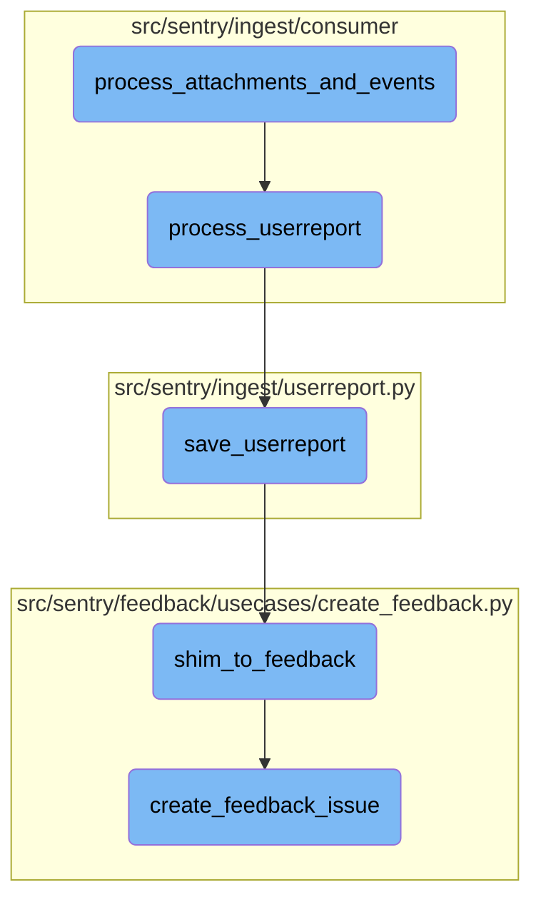

In this document, we will explain the process of handling attachments and events, particularly focusing on user reports. The process involves several steps, including processing the initial message, saving the user report, converting it to feedback, and finally creating a feedback issue.

The flow starts with processing the initial message, which could be an attachment, event, or user report. If it's a user report, the system extracts the feedback and attempts to save it. If the report is valid, it is then converted into a feedback event. Finally, a feedback issue is created from this event, ensuring it is not spam and notifying the relevant parties.

# Flow drill down



<SwmSnippet path="/src/sentry/ingest/consumer/attachment_event.py" line="62">

---

## Processing Attachments and Events

The function <SwmToken path="src/sentry/ingest/consumer/attachment_event.py" pos="62:2:2" line-data="def process_attachments_and_events(">`process_attachments_and_events`</SwmToken> handles different types of messages such as attachments, events, and user reports. It fetches the project associated with the message and processes the message based on its type. For user reports, it calls the <SwmToken path="src/sentry/ingest/consumer/processors.py" pos="312:2:2" line-data="def process_userreport(message: IngestMessage, project: Project) -&gt; bool:">`process_userreport`</SwmToken> function.

```python
def process_attachments_and_events(
    raw_message: Message[IngestMessage], reprocess_only_stuck_events: bool
) -> None:
    """
    The second pass for the `attachments` topic processes *individual* `attachments`
    which are not needed for event processing, and the `event` itself,
    as all attachment chunks those two need have been processed already.

    This will:
    - Decode the actual event payload which is in JSON format and perform some
      initial loadshedding on it.
    - Store the JSON payload in the event processing store, and pass it on to
      `preprocess_event`, which will schedule a followup task such as
      `symbolicate_event` or `process_event`.
    """
    message = raw_message.payload
    message_type = message["type"]
    project_id = message["project_id"]

    try:
        with metrics.timer("ingest_consumer.fetch_project"):
```

---

</SwmSnippet>

<SwmSnippet path="/src/sentry/ingest/consumer/processors.py" line="312">

---

## Processing User Reports

The function <SwmToken path="src/sentry/ingest/consumer/processors.py" pos="312:2:2" line-data="def process_userreport(message: IngestMessage, project: Project) -&gt; bool:">`process_userreport`</SwmToken> extracts the feedback payload from the message and attempts to save the user report by calling the <SwmToken path="src/sentry/ingest/consumer/processors.py" pos="317:1:1" line-data="        save_userreport(">`save_userreport`</SwmToken> function. If the user report is invalid or an exception occurs, it logs the error and returns False.

```python
def process_userreport(message: IngestMessage, project: Project) -> bool:
    start_time = to_datetime(message["start_time"])
    feedback = orjson.loads(message["payload"])

    try:
        save_userreport(
            project,
            feedback,
            FeedbackCreationSource.USER_REPORT_ENVELOPE,
            start_time=start_time,
        )
        return True
    except Conflict as e:
        logger.info("Invalid userreport: %s", e)
        return False
    except Exception:
        # XXX(markus): Hotfix because we have broken data in kafka
        # If you want to remove this make sure to have triaged all errors in Sentry
        logger.exception("userreport.save.crash")
        return False
```

---

</SwmSnippet>

<SwmSnippet path="/src/sentry/ingest/userreport.py" line="28">

---

## Saving User Reports

The function <SwmToken path="src/sentry/ingest/userreport.py" pos="28:2:2" line-data="def save_userreport(">`save_userreport`</SwmToken> saves the user report to the database. It checks if the project is in a denylist or if the user report should be filtered. It then processes the report, ensuring it is not a duplicate or abusive. If the report is valid, it notifies the relevant parties and calls <SwmToken path="src/sentry/feedback/usecases/create_feedback.py" pos="304:2:2" line-data="def shim_to_feedback(">`shim_to_feedback`</SwmToken> to create a new user feedback.

```python
def save_userreport(
    project,
    report,
    source,
    start_time=None,
):
    with metrics.timer("sentry.ingest.userreport.save_userreport"):
        if is_org_in_denylist(project.organization):
            return
        if should_filter_user_report(report["comments"]):
            return

        if start_time is None:
            start_time = timezone.now()

        # XXX(dcramer): enforce case insensitivity by coercing this to a lowercase string
        report["event_id"] = report["event_id"].lower()
        report["project_id"] = project.id

        event = eventstore.backend.get_event_by_id(project.id, report["event_id"])

```

---

</SwmSnippet>

<SwmSnippet path="/src/sentry/feedback/usecases/create_feedback.py" line="304">

---

## Shimming to Feedback

The function <SwmToken path="src/sentry/feedback/usecases/create_feedback.py" pos="304:2:2" line-data="def shim_to_feedback(">`shim_to_feedback`</SwmToken> converts legacy user reports into new user feedback events. It extracts relevant information from the user report and the associated event, if available, and creates a feedback event. This feedback event is then passed to <SwmToken path="src/sentry/feedback/usecases/create_feedback.py" pos="184:2:2" line-data="def create_feedback_issue(event, project_id: int, source: FeedbackCreationSource):">`create_feedback_issue`</SwmToken>.

```python
def shim_to_feedback(
    report: UserReportShimDict,
    event: Event | GroupEvent,
    project: Project,
    source: FeedbackCreationSource,
):
    """
    takes user reports from the legacy user report form/endpoint and
    user reports that come from relay envelope ingestion and
    creates a new User Feedback from it.
    User feedbacks are an event type, so we try and grab as much from the
    legacy user report and event to create the new feedback.
    """
    try:
        feedback_event: dict[str, Any] = {
            "contexts": {
                "feedback": {
                    "name": report.get("name", ""),
                    "contact_email": report["email"],
                    "message": report["comments"],
                },
```

---

</SwmSnippet>

<SwmSnippet path="/src/sentry/feedback/usecases/create_feedback.py" line="184">

---

## Creating Feedback Issues

The function <SwmToken path="src/sentry/feedback/usecases/create_feedback.py" pos="184:2:2" line-data="def create_feedback_issue(event, project_id: int, source: FeedbackCreationSource):">`create_feedback_issue`</SwmToken> creates a new feedback issue from the feedback event. It checks if the feedback should be filtered and processes the event data to ensure it is valid. It then produces the occurrence to Kafka and tracks the outcome.

```python
def create_feedback_issue(event, project_id: int, source: FeedbackCreationSource):
    metrics.incr("feedback.create_feedback_issue.entered")

    if should_filter_feedback(event, project_id, source):
        return

    project = Project.objects.get_from_cache(id=project_id)

    is_message_spam = None
    if features.has(
        "organizations:user-feedback-spam-filter-ingest", project.organization
    ) and project.get_option("sentry:feedback_ai_spam_detection"):
        try:
            is_message_spam = is_spam(event["contexts"]["feedback"]["message"])
        except Exception:
            # until we have LLM error types ironed out, just catch all exceptions
            logger.exception("Error checking if message is spam")
        metrics.incr(
            "feedback.create_feedback_issue.spam_detection",
            tags={"is_spam": is_message_spam},
            sample_rate=1.0,
```

---

</SwmSnippet>

&nbsp;

*This is an auto-generated document by Swimm AI 🌊 and has not yet been verified by a human*

<SwmMeta version="3.0.0" repo-id="Z2l0aHViJTNBJTNBc2VudHJ5LWRlbW8tMSUzQSUzQVN3aW1tLURlbW8=" repo-name="sentry-demo-1" doc-type="flows"><sup>Powered by [Swimm](/)</sup></SwmMeta>
