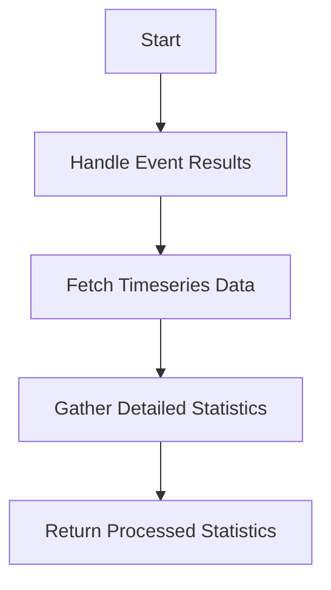

This document will cover the process of processing event statistics, which includes:

1. Handling event results
2. Fetching timeseries data for top events
3. Gathering detailed event statistics
4. Returning processed statistics.

Technical document: <SwmLink doc-title="Processing Event Statistics">[Processing Event Statistics](/.swm/processing-event-statistics.zr8nfqj9.sw.md)</SwmLink>

# [Handling Event Results](https://app.swimm.io/repos/Z2l0aHViJTNBJTNBc2VudHJ5LWRlbW8tMSUzQSUzQVN3aW1tLURlbW8=/docs/zr8nfqj9#handling-event-statistics)

The process begins with handling the results of event queries. This involves defining an inner function to fetch timeseries data for the top events. The purpose of this step is to ensure that we have a structured way to retrieve and process the most relevant event data. This is important for providing users with accurate and timely insights into their application's performance.

# [Fetching Timeseries Data for Top Events](https://app.swimm.io/repos/Z2l0aHViJTNBJTNBc2VudHJ5LWRlbW8tMSUzQSUzQVN3aW1tLURlbW8=/docs/zr8nfqj9#querying-top-events-timeseries)

Next, we fetch timeseries data for the top events. This step involves checking if top events are provided; if not, a query is executed to fetch them. The timeseries data is then constructed and processed. This step is crucial for visualizing trends and patterns over time, which helps users understand the behavior of their application events.

# [Gathering Detailed Event Statistics](https://app.swimm.io/repos/Z2l0aHViJTNBJTNBc2VudHJ5LWRlbW8tMSUzQSUzQVN3aW1tLURlbW8=/docs/zr8nfqj9#get_event_stats_data)

Once the timeseries data is fetched, we gather detailed statistics for the events. This involves handling query errors, determining the columns to query, retrieving necessary parameters, and executing the event stats query. The results are then serialized, and if multiple axes or top events are requested, they are handled accordingly. This step ensures that users receive comprehensive and detailed statistics about their events, enabling deeper analysis and troubleshooting.

# [Returning Processed Statistics](https://app.swimm.io/repos/Z2l0aHViJTNBJTNBc2VudHJ5LWRlbW8tMSUzQSUzQVN3aW1tLURlbW8=/docs/zr8nfqj9#serialize_multiple_axis)

Finally, the processed statistics are returned. This involves serializing the event results, handling metadata, and ensuring that the results are formatted correctly. The processed statistics are then returned as a dictionary containing both the raw event results and the processed statistics. This final step provides users with a complete and accurate representation of their event data, ready for further analysis or visualization.

&nbsp;

*This is an auto-generated document by Swimm AI 🌊 and has not yet been verified by a human*

<SwmMeta version="3.0.0" repo-id="Z2l0aHViJTNBJTNBc2VudHJ5LWRlbW8tMSUzQSUzQVN3aW1tLURlbW8=" repo-name="sentry-demo-1" doc-type="product-flows">Powered by [Swimm](/)</SwmMeta>
