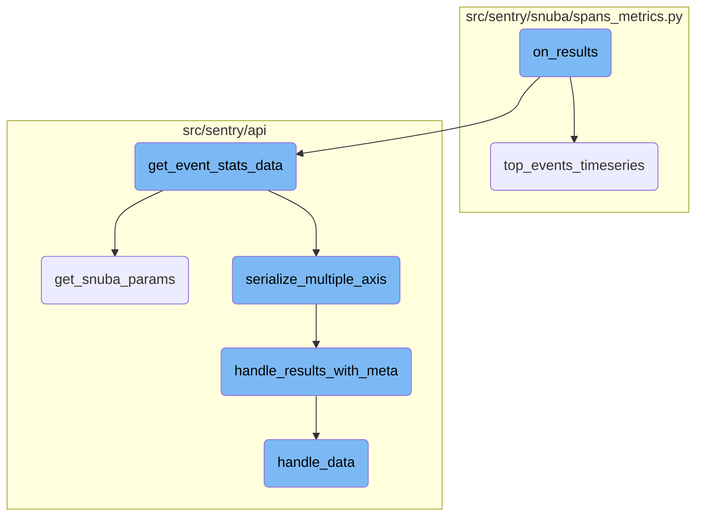
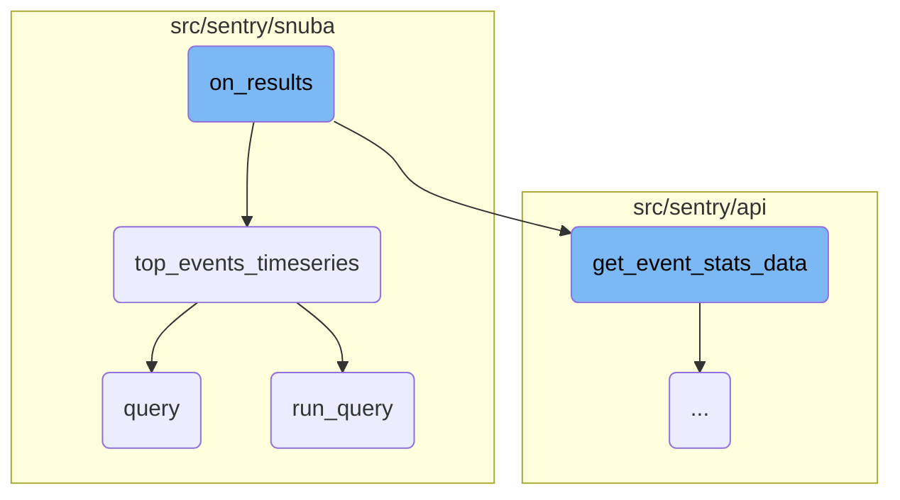

In this document, we will explain the role of the <SwmToken path="src/sentry/api/endpoints/organization_events_trends.py" pos="539:3:3" line-data="        def on_results(events_results):">`on_results`</SwmToken> function in processing event statistics. The function is responsible for handling the results of event queries and involves several steps to fetch and process timeseries data for top events.

The flow starts with the <SwmToken path="src/sentry/api/endpoints/organization_events_trends.py" pos="539:3:3" line-data="        def on_results(events_results):">`on_results`</SwmToken> function, which processes the results of event queries. It first defines an inner function to fetch timeseries data for the top events. Then, it calls another function to get detailed statistics if there are any events in the results. Finally, it returns a dictionary containing both the raw event results and the processed statistics.

Here is a high level diagram of the flow, showing only the most important functions:



# Flow drill down

First, we'll zoom into this section of the flow:



<SwmSnippet path="/src/sentry/api/endpoints/organization_events_trends.py" line="539">

---

## Handling Event Statistics

The <SwmToken path="src/sentry/api/endpoints/organization_events_trends.py" pos="539:3:3" line-data="        def on_results(events_results):">`on_results`</SwmToken> function processes the results of event queries. It first defines an inner function <SwmToken path="src/sentry/api/endpoints/organization_events_trends.py" pos="540:3:3" line-data="            def get_event_stats(">`get_event_stats`</SwmToken> that calls <SwmToken path="src/sentry/api/endpoints/organization_events_trends.py" pos="543:3:5" line-data="                return discover.top_events_timeseries(">`discover.top_events_timeseries`</SwmToken> to fetch timeseries data for the top events. Then, it calls <SwmToken path="src/sentry/api/endpoints/organization_events_trends.py" pos="558:1:3" line-data="                self.get_event_stats_data(">`self.get_event_stats_data`</SwmToken> to get detailed statistics if there are any events in the results. Finally, it returns a dictionary containing both the raw event results and the processed statistics.

```python
        def on_results(events_results):
            def get_event_stats(
                query_columns, query, snuba_params, rollup, zerofill_results, _=None
            ):
                return discover.top_events_timeseries(
                    query_columns,
                    selected_columns,
                    query,
                    snuba_params,
                    orderby,
                    rollup,
                    min(5, len(events_results["data"])),
                    organization,
                    top_events=events_results,
                    referrer="api.trends.get-event-stats",
                    zerofill_results=zerofill_results,
                )

            stats_results = (
                self.get_event_stats_data(
                    request,
```

---

</SwmSnippet>

<SwmSnippet path="/src/sentry/snuba/spans_metrics.py" line="144">

---

## Querying Top Events Timeseries

The <SwmToken path="src/sentry/snuba/spans_metrics.py" pos="144:2:2" line-data="def top_events_timeseries(">`top_events_timeseries`</SwmToken> function is a <SwmToken path="src/sentry/snuba/spans_metrics.py" pos="97:1:3" line-data="    High-level API for doing arbitrary user timeseries queries against events.">`High-level`</SwmToken> API for querying timeseries data for a limited number of top events. It first checks if <SwmToken path="src/sentry/snuba/spans_metrics.py" pos="155:1:1" line-data="    top_events=None,">`top_events`</SwmToken> is provided; if not, it calls the <SwmToken path="src/sentry/api/endpoints/organization_events_trends.py" pos="541:4:4" line-data="                query_columns, query, snuba_params, rollup, zerofill_results, _=None">`query`</SwmToken> function to fetch the top events. It then builds a <SwmToken path="src/sentry/snuba/spans_metrics.py" pos="10:1:1" line-data="    TopSpansMetricsQueryBuilder,">`TopSpansMetricsQueryBuilder`</SwmToken> to construct the timeseries query and runs it. The results are processed and returned as a dictionary of <SwmToken path="src/sentry/api/bases/organization_events.py" pos="393:28:28" line-data="            [Sequence[str], str, SnubaParams, int, bool, timedelta | None], SnubaTSResult">`SnubaTSResult`</SwmToken> objects, which include zerofilled data to handle any gaps.

```python
def top_events_timeseries(
    timeseries_columns,
    selected_columns,
    user_query,
    snuba_params,
    orderby,
    rollup,
    limit,
    organization,
    equations=None,
    referrer=None,
    top_events=None,
    allow_empty=True,
    zerofill_results=True,
    include_other=False,
    functions_acl=None,
    on_demand_metrics_enabled=False,
    on_demand_metrics_type: MetricSpecType | None = None,
    query_source: QuerySource | None = None,
):
    """
```

---

</SwmSnippet>

<SwmSnippet path="/src/sentry/snuba/spans_metrics.py" line="22">

---

### Querying Top Events

The <SwmToken path="src/sentry/snuba/spans_metrics.py" pos="22:2:2" line-data="def query(">`query`</SwmToken> function constructs and executes a query to fetch the top events based on the provided parameters. It uses a <SwmToken path="src/sentry/snuba/spans_metrics.py" pos="8:1:1" line-data="    SpansMetricsQueryBuilder,">`SpansMetricsQueryBuilder`</SwmToken> to build the query and then processes the results before returning them.

```python
def query(
    selected_columns,
    query,
    snuba_params=None,
    equations=None,
    orderby=None,
    offset=None,
    limit=50,
    referrer=None,
    auto_fields=False,
    auto_aggregations=False,
    include_equation_fields=False,
    allow_metric_aggregates=False,
    use_aggregate_conditions=False,
    conditions=None,
    functions_acl=None,
    transform_alias_to_input_format=False,
    sample=None,
    has_metrics=False,
    use_metrics_layer=False,
    skip_tag_resolution=False,
```

---

</SwmSnippet>

<SwmSnippet path="/src/sentry/snuba/metrics_layer/query.py" line="143">

---

### Running the Query

The <SwmToken path="src/sentry/snuba/metrics_layer/query.py" pos="143:2:2" line-data="def run_query(request: Request) -&gt; Mapping[str, Any]:">`run_query`</SwmToken> function is the entry point for executing a metrics query in Snuba. It calls <SwmToken path="src/sentry/snuba/metrics_layer/query.py" pos="147:3:3" line-data="    return bulk_run_query([request])[0]">`bulk_run_query`</SwmToken> to execute the query and returns the first result.

```python
def run_query(request: Request) -> Mapping[str, Any]:
    """
    Entrypoint for executing a metrics query in Snuba.
    """
    return bulk_run_query([request])[0]
```

---

</SwmSnippet>

Now, lets zoom into this section of the flow:

```mermaid
graph TD;
      subgraph src/sentry/api/bases/organization_events.py
9a7c498c62bb10bd14cfa8e6b88481cb1758fe0fe619fac236b1dfc4f2bc9964(get_event_stats_data):::mainFlowStyle --> a4f25188cdb1c709695d3a93e7176ddb7bd151b9a322e0836404ad0986b5f514(get_snuba_params)
end

subgraph src/sentry/api/bases/organization_events.py
9a7c498c62bb10bd14cfa8e6b88481cb1758fe0fe619fac236b1dfc4f2bc9964(get_event_stats_data):::mainFlowStyle --> 6bfd0761a315100cfb455cd63eee604e1d6ebf8e2957d5881bc086457f48801e(serialize_multiple_axis):::mainFlowStyle
end

subgraph src/sentry/api/bases/organization_events.py
6bfd0761a315100cfb455cd63eee604e1d6ebf8e2957d5881bc086457f48801e(serialize_multiple_axis):::mainFlowStyle --> 76555db3c36df80d8ce698d10ee1f95e79e25496e48ce2c0e3a19dce410f1dcd(handle_results_with_meta):::mainFlowStyle
end

subgraph src/sentry/api/bases/organization_events.py
76555db3c36df80d8ce698d10ee1f95e79e25496e48ce2c0e3a19dce410f1dcd(handle_results_with_meta):::mainFlowStyle --> 9335165d6fb85d88094c6bb73f9e154b223f793b29b1af6be9aa07d145132b65(handle_data):::mainFlowStyle
end


      classDef mainFlowStyle color:#000000,fill:#7CB9F4
classDef rootsStyle color:#000000,fill:#00FFF4
classDef Style1 color:#000000,fill:#00FFAA
classDef Style2 color:#000000,fill:#FFFF00
classDef Style3 color:#000000,fill:#AA7CB9

%% Swimm:
%% graph TD;
%%       subgraph <SwmPath>[src/sentry/api/bases/organization_events.py](src/sentry/api/bases/organization_events.py)</SwmPath>
%% 9a7c498c62bb10bd14cfa8e6b88481cb1758fe0fe619fac236b1dfc4f2bc9964(get_event_stats_data):::mainFlowStyle --> a4f25188cdb1c709695d3a93e7176ddb7bd151b9a322e0836404ad0986b5f514(get_snuba_params)
%% end
%% 
%% subgraph <SwmPath>[src/sentry/api/bases/organization_events.py](src/sentry/api/bases/organization_events.py)</SwmPath>
%% 9a7c498c62bb10bd14cfa8e6b88481cb1758fe0fe619fac236b1dfc4f2bc9964(get_event_stats_data):::mainFlowStyle --> 6bfd0761a315100cfb455cd63eee604e1d6ebf8e2957d5881bc086457f48801e(serialize_multiple_axis):::mainFlowStyle
%% end
%% 
%% subgraph <SwmPath>[src/sentry/api/bases/organization_events.py](src/sentry/api/bases/organization_events.py)</SwmPath>
%% 6bfd0761a315100cfb455cd63eee604e1d6ebf8e2957d5881bc086457f48801e(serialize_multiple_axis):::mainFlowStyle --> 76555db3c36df80d8ce698d10ee1f95e79e25496e48ce2c0e3a19dce410f1dcd(handle_results_with_meta):::mainFlowStyle
%% end
%% 
%% subgraph <SwmPath>[src/sentry/api/bases/organization_events.py](src/sentry/api/bases/organization_events.py)</SwmPath>
%% 76555db3c36df80d8ce698d10ee1f95e79e25496e48ce2c0e3a19dce410f1dcd(handle_results_with_meta):::mainFlowStyle --> 9335165d6fb85d88094c6bb73f9e154b223f793b29b1af6be9aa07d145132b65(handle_data):::mainFlowStyle
%% end
%% 
%% 
%%       classDef mainFlowStyle color:#000000,fill:#7CB9F4
%% classDef rootsStyle color:#000000,fill:#00FFF4
%% classDef Style1 color:#000000,fill:#00FFAA
%% classDef Style2 color:#000000,fill:#FFFF00
%% classDef Style3 color:#000000,fill:#AA7CB9
```



<SwmSnippet path="/src/sentry/api/bases/organization_events.py" line="388">

---

## <SwmToken path="src/sentry/api/bases/organization_events.py" pos="388:3:3" line-data="    def get_event_stats_data(">`get_event_stats_data`</SwmToken>

The function <SwmToken path="src/sentry/api/bases/organization_events.py" pos="388:3:3" line-data="    def get_event_stats_data(">`get_event_stats_data`</SwmToken> is responsible for gathering and processing event statistics data. It starts by handling query errors and initiating a span for stats query creation. It then determines the columns to query based on the request parameters and retrieves the Snuba parameters if not provided. The function calculates the rollup interval and checks for comparison deltas. It maps query columns to their corresponding Snuba columns and executes the event stats query. The results are serialized, and if multiple axes or top events are requested, it handles them accordingly. Finally, it returns the serialized result with metadata.

```python
    def get_event_stats_data(
        self,
        request: Request,
        organization: Organization,
        get_event_stats: Callable[
            [Sequence[str], str, SnubaParams, int, bool, timedelta | None], SnubaTSResult
        ],
        top_events: int = 0,
        query_column: str = "count()",
        snuba_params: SnubaParams | None = None,
        query: str | None = None,
        allow_partial_buckets: bool = False,
        zerofill_results: bool = True,
        comparison_delta: timedelta | None = None,
        additional_query_column: str | None = None,
        dataset: Any | None = None,
    ) -> dict[str, Any]:
        with handle_query_errors():
            with sentry_sdk.start_span(
                op="discover.endpoint", description="base.stats_query_creation"
            ):
```

---

</SwmSnippet>

<SwmSnippet path="/src/sentry/api/bases/organization_events.py" line="91">

---

### <SwmToken path="src/sentry/api/bases/organization_events.py" pos="91:3:3" line-data="    def get_snuba_params(">`get_snuba_params`</SwmToken>

The function <SwmToken path="src/sentry/api/bases/organization_events.py" pos="91:3:3" line-data="    def get_snuba_params(">`get_snuba_params`</SwmToken> returns the parameters required to make Snuba queries. It starts by checking the number of fields and equations in the request, raising an error if they exceed the maximum allowed. It then retrieves filter parameters and quantizes date parameters if needed. The function constructs a <SwmToken path="src/sentry/api/bases/organization_events.py" pos="97:5:5" line-data="    ) -&gt; SnubaParams:">`SnubaParams`</SwmToken> object with the necessary details like start and end dates, environments, projects, user, and teams. It also checks for global views and ensures that events from multiple projects can be viewed if allowed.

```python
    def get_snuba_params(
        self,
        request: Request,
        organization: Organization,
        check_global_views: bool = True,
        quantize_date_params: bool = True,
    ) -> SnubaParams:
        """Returns params to make snuba queries with"""
        with sentry_sdk.start_span(op="discover.endpoint", description="filter_params(dataclass)"):
            if (
                len(self.get_field_list(organization, request))
                + len(self.get_equation_list(organization, request))
                > MAX_FIELDS
            ):
                raise ParseError(
                    detail=f"You can view up to {MAX_FIELDS} fields at a time. Please delete some and try again."
                )

            filter_params: dict[str, Any] = self.get_filter_params(request, organization)
            if quantize_date_params:
                filter_params = self.quantize_date_params(request, filter_params)
```

---

</SwmSnippet>

<SwmSnippet path="/src/sentry/api/bases/organization_events.py" line="566">

---

### <SwmToken path="src/sentry/api/bases/organization_events.py" pos="566:3:3" line-data="    def serialize_multiple_axis(">`serialize_multiple_axis`</SwmToken>

The function <SwmToken path="src/sentry/api/bases/organization_events.py" pos="566:3:3" line-data="    def serialize_multiple_axis(">`serialize_multiple_axis`</SwmToken> serializes the event results for multiple axes. It initializes an empty result dictionary and handles metadata. For each query column, it serializes the event result and adds metadata. If the request includes top events, it sets the order in the result. The function returns the serialized result with the requested <SwmToken path="src/sentry/api/bases/organization_events.py" pos="579:9:9" line-data="        # Return with requested yAxis as the key">`yAxis`</SwmToken> as the key.

```python
    def serialize_multiple_axis(
        self,
        request: Request,
        organization: Organization,
        serializer: BaseSnubaSerializer,
        event_result: SnubaTSResult,
        snuba_params: SnubaParams,
        columns: Sequence[str],
        query_columns: Sequence[str],
        allow_partial_buckets: bool,
        zerofill_results: bool = True,
        dataset: Any | None = None,
    ) -> dict[str, Any]:
        # Return with requested yAxis as the key
        result = {}
        equations = 0
        meta = self.handle_results_with_meta(
            request,
            organization,
            snuba_params.project_ids,
            event_result.data,
```

---

</SwmSnippet>

<SwmSnippet path="/src/sentry/api/bases/organization_events.py" line="290">

---

### <SwmToken path="src/sentry/api/bases/organization_events.py" pos="290:3:3" line-data="    def handle_results_with_meta(">`handle_results_with_meta`</SwmToken>

The function <SwmToken path="src/sentry/api/bases/organization_events.py" pos="290:3:3" line-data="    def handle_results_with_meta(">`handle_results_with_meta`</SwmToken> processes the event results and adds metadata. It starts by handling the data and extracting metadata from the results. If standard metadata is requested, it includes additional fields like metrics data and dataset reasons. The function returns the processed data along with the metadata.

```python
    def handle_results_with_meta(
        self,
        request: Request,
        organization: Organization,
        project_ids: Sequence[int],
        results: dict[str, Any],
        standard_meta: bool | None = False,
        dataset: Any | None = None,
    ) -> dict[str, Any]:
        with sentry_sdk.start_span(op="discover.endpoint", description="base.handle_results"):
            data = self.handle_data(request, organization, project_ids, results.get("data"))
            meta = results.get("meta", {})
            fields_meta = meta.get("fields", {})

            if standard_meta:
                isMetricsData = meta.pop("isMetricsData", False)
                isMetricsExtractedData = meta.pop("isMetricsExtractedData", False)
                discoverSplitDecision = meta.pop("discoverSplitDecision", None)
                fields, units = self.handle_unit_meta(fields_meta)
                meta = {
                    "fields": fields,
```

---

</SwmSnippet>

<SwmSnippet path="/src/sentry/api/bases/organization_events.py" line="332">

---

### <SwmToken path="src/sentry/api/bases/organization_events.py" pos="332:3:3" line-data="    def handle_data(">`handle_data`</SwmToken>

The function <SwmToken path="src/sentry/api/bases/organization_events.py" pos="332:3:3" line-data="    def handle_data(">`handle_data`</SwmToken> processes the event results to format them correctly. It handles specific fields like <SwmToken path="src/sentry/api/bases/organization_events.py" pos="346:4:6" line-data="        if &quot;transaction.status&quot; in first_row:">`transaction.status`</SwmToken>, <SwmToken path="src/sentry/api/bases/organization_events.py" pos="354:4:4" line-data="        if &quot;issue&quot; in fields:  # Look up the short ID and return that in the results">`issue`</SwmToken>, and <SwmToken path="src/sentry/api/bases/organization_events.py" pos="357:4:4" line-data="        if &quot;device&quot; in fields and request.GET.get(&quot;readable&quot;):">`device`</SwmToken>, converting them to readable formats if necessary. The function also removes unnecessary fields like <SwmToken path="src/sentry/api/bases/organization_events.py" pos="360:19:19" line-data="        if not (&quot;project.id&quot; in first_row or &quot;projectid&quot; in first_row):">`projectid`</SwmToken> from the results. It returns the processed results.

```python
    def handle_data(
        self,
        request: Request,
        organization: Organization,
        project_ids: Sequence[int],
        results: Sequence[Any] | None,
    ) -> Sequence[Any] | None:
        if not results:
            return results

        first_row = results[0]

        # TODO(mark) move all of this result formatting into discover.query()
        # once those APIs are used across the application.
        if "transaction.status" in first_row:
            for row in results:
                if "transaction.status" in row and type(row["transaction.status"]) is int:
                    row["transaction.status"] = SPAN_STATUS_CODE_TO_NAME.get(
                        row["transaction.status"]
                    )

```

---

</SwmSnippet>

&nbsp;

*This is an auto-generated document by Swimm AI 🌊 and has not yet been verified by a human*

<SwmMeta version="3.0.0" repo-id="Z2l0aHViJTNBJTNBc2VudHJ5LWRlbW8tMSUzQSUzQVN3aW1tLURlbW8=" repo-name="sentry-demo-1" doc-type="flows"><sup>Powered by [Swimm](/)</sup></SwmMeta>
