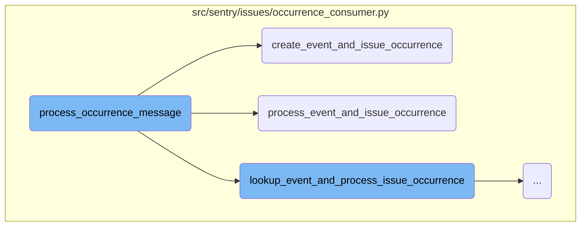
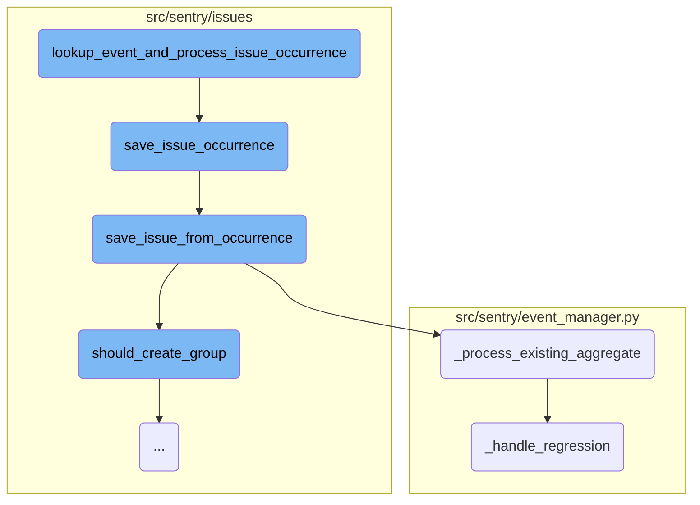

```mermaid
graph TD;
      subgraph src/sentry/issues
53b0f1a055e7d42105ff0f146acb6ee963337d2414ab6ffd49658c81c22f3925(should_create_group):::mainFlowStyle --> 46fd623efcf0e07f29eeff8dfb22b891d99366d92b989de50b3ebe258b2250c2(delete):::mainFlowStyle
end

subgraph src/sentry/issues
46fd623efcf0e07f29eeff8dfb22b891d99366d92b989de50b3ebe258b2250c2(delete):::mainFlowStyle --> 6a6c4d35daa9b5dfd9b380a4500d5f2e54056cd198f5a8081354febbd6bde7cb(get):::mainFlowStyle
end

subgraph src/sentry/issues
6a6c4d35daa9b5dfd9b380a4500d5f2e54056cd198f5a8081354febbd6bde7cb(get):::mainFlowStyle --> 5c2c7c800021b5710cca667044f2c20f2f4c5b0e41468fd7f58fef2f2118f594(_search):::mainFlowStyle
end


      classDef mainFlowStyle color:#000000,fill:#7CB9F4
classDef rootsStyle color:#000000,fill:#00FFF4
classDef Style1 color:#000000,fill:#00FFAA
classDef Style2 color:#000000,fill:#FFFF00
classDef Style3 color:#000000,fill:#AA7CB9

%% Swimm:
%% graph TD;
%%       subgraph <SwmPath>[src/sentry/issues/](src/sentry/issues/)</SwmPath>
%% 53b0f1a055e7d42105ff0f146acb6ee963337d2414ab6ffd49658c81c22f3925(should_create_group):::mainFlowStyle --> 46fd623efcf0e07f29eeff8dfb22b891d99366d92b989de50b3ebe258b2250c2(delete):::mainFlowStyle
%% end
%% 
%% subgraph <SwmPath>[src/sentry/issues/](src/sentry/issues/)</SwmPath>
%% 46fd623efcf0e07f29eeff8dfb22b891d99366d92b989de50b3ebe258b2250c2(delete):::mainFlowStyle --> 6a6c4d35daa9b5dfd9b380a4500d5f2e54056cd198f5a8081354febbd6bde7cb(get):::mainFlowStyle
%% end
%% 
%% subgraph <SwmPath>[src/sentry/issues/](src/sentry/issues/)</SwmPath>
%% 6a6c4d35daa9b5dfd9b380a4500d5f2e54056cd198f5a8081354febbd6bde7cb(get):::mainFlowStyle --> 5c2c7c800021b5710cca667044f2c20f2f4c5b0e41468fd7f58fef2f2118f594(_search):::mainFlowStyle
%% end
%% 
%% 
%%       classDef mainFlowStyle color:#000000,fill:#7CB9F4
%% classDef rootsStyle color:#000000,fill:#00FFF4
%% classDef Style1 color:#000000,fill:#00FFAA
%% classDef Style2 color:#000000,fill:#FFFF00
%% classDef Style3 color:#000000,fill:#AA7CB9
```

This document provides an overview of how occurrence groups are processed. It includes the steps involved in handling different types of messages, processing status changes, and saving issue occurrences.

The process starts by handling incoming messages and determining their type. If the message is a status change, it updates the relevant group. For occurrence messages, it extracts necessary data, sets metrics, and processes the event and issue occurrence. The flow ensures that the event ID matches and saves the occurrence data. Finally, it checks if a new group should be created or an existing one should be updated.

Here is a high level diagram of the flow, showing only the most important functions:

```mermaid
graph TD;
      subgraph src/sentry/issues
87711b6b343ee7fdc9d733a4ab2dcfb36979bf8655ee9a2f6c5542e2be8adce8(process_occurrence_group):::mainFlowStyle --> a1f3f7172f58538a2b63315819a01097f02f8348a8aed6dfd17675a988d6badd(_process_message):::mainFlowStyle
end

subgraph src/sentry/issues
a1f3f7172f58538a2b63315819a01097f02f8348a8aed6dfd17675a988d6badd(_process_message):::mainFlowStyle --> e9ea1919fcca90844c6232d023ba5a8cac831e367af20a0e26d21057445a13fd(process_status_change_message)
end

subgraph src/sentry/issues
a1f3f7172f58538a2b63315819a01097f02f8348a8aed6dfd17675a988d6badd(_process_message):::mainFlowStyle --> ed9a03c8724a2bf2ae11da747aa8adcd4b29e68e178aff549c985b06e9f02d2e(process_occurrence_message):::mainFlowStyle
end

subgraph src/sentry/issues
ed9a03c8724a2bf2ae11da747aa8adcd4b29e68e178aff549c985b06e9f02d2e(process_occurrence_message):::mainFlowStyle --> 1c6f78b2ae3e1cfc0cce7bf6eeaeb7167596ff4f1f9f6b58fd93dd9e999a24d4(create_event_and_issue_occurrence)
end

subgraph src/sentry/issues
ed9a03c8724a2bf2ae11da747aa8adcd4b29e68e178aff549c985b06e9f02d2e(process_occurrence_message):::mainFlowStyle --> 0e8f321a5b964b59138c9e0d58498beaca614106b333f11974108d74cbf72aeb(process_event_and_issue_occurrence)
end

subgraph src/sentry/issues
ed9a03c8724a2bf2ae11da747aa8adcd4b29e68e178aff549c985b06e9f02d2e(process_occurrence_message):::mainFlowStyle --> 17675cc52d83b27fd0e8cd6167ec37036bbea7b9f13c102b78dda17b84253512(lookup_event_and_process_issue_occurrence):::mainFlowStyle
end

subgraph src/sentry/issues
17675cc52d83b27fd0e8cd6167ec37036bbea7b9f13c102b78dda17b84253512(lookup_event_and_process_issue_occurrence):::mainFlowStyle --> 33077f0cb2f5fe38aabaa9c72ed4fbf8e8cf82a4b46f6acd4c52c20ca2539759(save_issue_occurrence):::mainFlowStyle
end

subgraph src/sentry/issues
33077f0cb2f5fe38aabaa9c72ed4fbf8e8cf82a4b46f6acd4c52c20ca2539759(save_issue_occurrence):::mainFlowStyle --> 73287f14b41aed47cefb33e729102b46f361055d12591635d598418e9fcd0c6e(save_issue_from_occurrence):::mainFlowStyle
end

subgraph src/sentry/event_manager.py
73287f14b41aed47cefb33e729102b46f361055d12591635d598418e9fcd0c6e(save_issue_from_occurrence):::mainFlowStyle --> 14b82102bb8aa504ed43304d04ec107038be3b4413f6591fac60bb51085ae7de(_process_existing_aggregate)
end

subgraph src/sentry/issues
73287f14b41aed47cefb33e729102b46f361055d12591635d598418e9fcd0c6e(save_issue_from_occurrence):::mainFlowStyle --> 53b0f1a055e7d42105ff0f146acb6ee963337d2414ab6ffd49658c81c22f3925(should_create_group):::mainFlowStyle
end

subgraph src/sentry/issues
53b0f1a055e7d42105ff0f146acb6ee963337d2414ab6ffd49658c81c22f3925(should_create_group):::mainFlowStyle --> 46fd623efcf0e07f29eeff8dfb22b891d99366d92b989de50b3ebe258b2250c2(delete):::mainFlowStyle
end

subgraph src/sentry/issues
46fd623efcf0e07f29eeff8dfb22b891d99366d92b989de50b3ebe258b2250c2(delete):::mainFlowStyle --> 6a6c4d35daa9b5dfd9b380a4500d5f2e54056cd198f5a8081354febbd6bde7cb(get):::mainFlowStyle
end

subgraph src/sentry/issues
6a6c4d35daa9b5dfd9b380a4500d5f2e54056cd198f5a8081354febbd6bde7cb(get):::mainFlowStyle --> 5c2c7c800021b5710cca667044f2c20f2f4c5b0e41468fd7f58fef2f2118f594(_search):::mainFlowStyle
end


      classDef mainFlowStyle color:#000000,fill:#7CB9F4
classDef rootsStyle color:#000000,fill:#00FFF4
classDef Style1 color:#000000,fill:#00FFAA
classDef Style2 color:#000000,fill:#FFFF00
classDef Style3 color:#000000,fill:#AA7CB9

%% Swimm:
%% graph TD;
%%       subgraph <SwmPath>[src/sentry/issues/](src/sentry/issues/)</SwmPath>
%% 87711b6b343ee7fdc9d733a4ab2dcfb36979bf8655ee9a2f6c5542e2be8adce8(process_occurrence_group):::mainFlowStyle --> a1f3f7172f58538a2b63315819a01097f02f8348a8aed6dfd17675a988d6badd(_process_message):::mainFlowStyle
%% end
%% 
%% subgraph <SwmPath>[src/sentry/issues/](src/sentry/issues/)</SwmPath>
%% a1f3f7172f58538a2b63315819a01097f02f8348a8aed6dfd17675a988d6badd(_process_message):::mainFlowStyle --> e9ea1919fcca90844c6232d023ba5a8cac831e367af20a0e26d21057445a13fd(process_status_change_message)
%% end
%% 
%% subgraph <SwmPath>[src/sentry/issues/](src/sentry/issues/)</SwmPath>
%% a1f3f7172f58538a2b63315819a01097f02f8348a8aed6dfd17675a988d6badd(_process_message):::mainFlowStyle --> ed9a03c8724a2bf2ae11da747aa8adcd4b29e68e178aff549c985b06e9f02d2e(process_occurrence_message):::mainFlowStyle
%% end
%% 
%% subgraph <SwmPath>[src/sentry/issues/](src/sentry/issues/)</SwmPath>
%% ed9a03c8724a2bf2ae11da747aa8adcd4b29e68e178aff549c985b06e9f02d2e(process_occurrence_message):::mainFlowStyle --> 1c6f78b2ae3e1cfc0cce7bf6eeaeb7167596ff4f1f9f6b58fd93dd9e999a24d4(create_event_and_issue_occurrence)
%% end
%% 
%% subgraph <SwmPath>[src/sentry/issues/](src/sentry/issues/)</SwmPath>
%% ed9a03c8724a2bf2ae11da747aa8adcd4b29e68e178aff549c985b06e9f02d2e(process_occurrence_message):::mainFlowStyle --> 0e8f321a5b964b59138c9e0d58498beaca614106b333f11974108d74cbf72aeb(process_event_and_issue_occurrence)
%% end
%% 
%% subgraph <SwmPath>[src/sentry/issues/](src/sentry/issues/)</SwmPath>
%% ed9a03c8724a2bf2ae11da747aa8adcd4b29e68e178aff549c985b06e9f02d2e(process_occurrence_message):::mainFlowStyle --> 17675cc52d83b27fd0e8cd6167ec37036bbea7b9f13c102b78dda17b84253512(lookup_event_and_process_issue_occurrence):::mainFlowStyle
%% end
%% 
%% subgraph <SwmPath>[src/sentry/issues/](src/sentry/issues/)</SwmPath>
%% 17675cc52d83b27fd0e8cd6167ec37036bbea7b9f13c102b78dda17b84253512(lookup_event_and_process_issue_occurrence):::mainFlowStyle --> 33077f0cb2f5fe38aabaa9c72ed4fbf8e8cf82a4b46f6acd4c52c20ca2539759(save_issue_occurrence):::mainFlowStyle
%% end
%% 
%% subgraph <SwmPath>[src/sentry/issues/](src/sentry/issues/)</SwmPath>
%% 33077f0cb2f5fe38aabaa9c72ed4fbf8e8cf82a4b46f6acd4c52c20ca2539759(save_issue_occurrence):::mainFlowStyle --> 73287f14b41aed47cefb33e729102b46f361055d12591635d598418e9fcd0c6e(save_issue_from_occurrence):::mainFlowStyle
%% end
%% 
%% subgraph <SwmPath>[src/sentry/event_manager.py](src/sentry/event_manager.py)</SwmPath>
%% 73287f14b41aed47cefb33e729102b46f361055d12591635d598418e9fcd0c6e(save_issue_from_occurrence):::mainFlowStyle --> 14b82102bb8aa504ed43304d04ec107038be3b4413f6591fac60bb51085ae7de(_process_existing_aggregate)
%% end
%% 
%% subgraph <SwmPath>[src/sentry/issues/](src/sentry/issues/)</SwmPath>
%% 73287f14b41aed47cefb33e729102b46f361055d12591635d598418e9fcd0c6e(save_issue_from_occurrence):::mainFlowStyle --> 53b0f1a055e7d42105ff0f146acb6ee963337d2414ab6ffd49658c81c22f3925(should_create_group):::mainFlowStyle
%% end
%% 
%% subgraph <SwmPath>[src/sentry/issues/](src/sentry/issues/)</SwmPath>
%% 53b0f1a055e7d42105ff0f146acb6ee963337d2414ab6ffd49658c81c22f3925(should_create_group):::mainFlowStyle --> 46fd623efcf0e07f29eeff8dfb22b891d99366d92b989de50b3ebe258b2250c2(delete):::mainFlowStyle
%% end
%% 
%% subgraph <SwmPath>[src/sentry/issues/](src/sentry/issues/)</SwmPath>
%% 46fd623efcf0e07f29eeff8dfb22b891d99366d92b989de50b3ebe258b2250c2(delete):::mainFlowStyle --> 6a6c4d35daa9b5dfd9b380a4500d5f2e54056cd198f5a8081354febbd6bde7cb(get):::mainFlowStyle
%% end
%% 
%% subgraph <SwmPath>[src/sentry/issues/](src/sentry/issues/)</SwmPath>
%% 6a6c4d35daa9b5dfd9b380a4500d5f2e54056cd198f5a8081354febbd6bde7cb(get):::mainFlowStyle --> 5c2c7c800021b5710cca667044f2c20f2f4c5b0e41468fd7f58fef2f2118f594(_search):::mainFlowStyle
%% end
%% 
%% 
%%       classDef mainFlowStyle color:#000000,fill:#7CB9F4
%% classDef rootsStyle color:#000000,fill:#00FFF4
%% classDef Style1 color:#000000,fill:#00FFAA
%% classDef Style2 color:#000000,fill:#FFFF00
%% classDef Style3 color:#000000,fill:#AA7CB9
```



# Flow drill down

First, we'll zoom into this section of the flow:

```mermaid
graph TD;
      subgraph src/sentry/issues
87711b6b343ee7fdc9d733a4ab2dcfb36979bf8655ee9a2f6c5542e2be8adce8(process_occurrence_group):::mainFlowStyle --> a1f3f7172f58538a2b63315819a01097f02f8348a8aed6dfd17675a988d6badd(_process_message):::mainFlowStyle
end

subgraph src/sentry/issues
a1f3f7172f58538a2b63315819a01097f02f8348a8aed6dfd17675a988d6badd(_process_message):::mainFlowStyle --> e9ea1919fcca90844c6232d023ba5a8cac831e367af20a0e26d21057445a13fd(process_status_change_message)
end

subgraph src/sentry/issues
a1f3f7172f58538a2b63315819a01097f02f8348a8aed6dfd17675a988d6badd(_process_message):::mainFlowStyle --> ed9a03c8724a2bf2ae11da747aa8adcd4b29e68e178aff549c985b06e9f02d2e(process_occurrence_message):::mainFlowStyle
end

subgraph src/sentry/issues
ed9a03c8724a2bf2ae11da747aa8adcd4b29e68e178aff549c985b06e9f02d2e(process_occurrence_message):::mainFlowStyle --> djwtq(...)
end


      classDef mainFlowStyle color:#000000,fill:#7CB9F4
classDef rootsStyle color:#000000,fill:#00FFF4
classDef Style1 color:#000000,fill:#00FFAA
classDef Style2 color:#000000,fill:#FFFF00
classDef Style3 color:#000000,fill:#AA7CB9

%% Swimm:
%% graph TD;
%%       subgraph <SwmPath>[src/sentry/issues/](src/sentry/issues/)</SwmPath>
%% 87711b6b343ee7fdc9d733a4ab2dcfb36979bf8655ee9a2f6c5542e2be8adce8(process_occurrence_group):::mainFlowStyle --> a1f3f7172f58538a2b63315819a01097f02f8348a8aed6dfd17675a988d6badd(_process_message):::mainFlowStyle
%% end
%% 
%% subgraph <SwmPath>[src/sentry/issues/](src/sentry/issues/)</SwmPath>
%% a1f3f7172f58538a2b63315819a01097f02f8348a8aed6dfd17675a988d6badd(_process_message):::mainFlowStyle --> e9ea1919fcca90844c6232d023ba5a8cac831e367af20a0e26d21057445a13fd(process_status_change_message)
%% end
%% 
%% subgraph <SwmPath>[src/sentry/issues/](src/sentry/issues/)</SwmPath>
%% a1f3f7172f58538a2b63315819a01097f02f8348a8aed6dfd17675a988d6badd(_process_message):::mainFlowStyle --> ed9a03c8724a2bf2ae11da747aa8adcd4b29e68e178aff549c985b06e9f02d2e(process_occurrence_message):::mainFlowStyle
%% end
%% 
%% subgraph <SwmPath>[src/sentry/issues/](src/sentry/issues/)</SwmPath>
%% ed9a03c8724a2bf2ae11da747aa8adcd4b29e68e178aff549c985b06e9f02d2e(process_occurrence_message):::mainFlowStyle --> djwtq(...)
%% end
%% 
%% 
%%       classDef mainFlowStyle color:#000000,fill:#7CB9F4
%% classDef rootsStyle color:#000000,fill:#00FFF4
%% classDef Style1 color:#000000,fill:#00FFAA
%% classDef Style2 color:#000000,fill:#FFFF00
%% classDef Style3 color:#000000,fill:#AA7CB9
```



<SwmSnippet path="/src/sentry/issues/occurrence_consumer.py" line="344">

---

## Handling status change messages

The <SwmToken path="src/sentry/issues/occurrence_consumer.py" pos="344:2:2" line-data="def _process_message(">`_process_message`</SwmToken> function is responsible for handling different types of messages. When the <SwmToken path="src/sentry/issues/occurrence_consumer.py" pos="357:7:7" line-data="            # Messages without payload_type default to an OCCURRENCE payload">`payload_type`</SwmToken> is <SwmToken path="src/sentry/issues/occurrence_consumer.py" pos="359:9:9" line-data="            if payload_type == PayloadType.STATUS_CHANGE.value:">`STATUS_CHANGE`</SwmToken>, it delegates the processing to the <SwmToken path="src/sentry/issues/occurrence_consumer.py" pos="360:5:5" line-data="                group = process_status_change_message(message, txn)">`process_status_change_message`</SwmToken> function. This function ensures that the status change is correctly processed and associated with the appropriate group.

```python
def _process_message(
    message: Mapping[str, Any]
) -> tuple[IssueOccurrence | None, GroupInfo | None] | None:
    """
    :raises InvalidEventPayloadError: when the message is invalid
    :raises EventLookupError: when the provided event_id in the message couldn't be found.
    """
    with sentry_sdk.start_transaction(
        op="_process_message",
        name="issues.occurrence_consumer",
        sampled=True,
    ) as txn:
        try:
            # Messages without payload_type default to an OCCURRENCE payload
            payload_type = message.get("payload_type", PayloadType.OCCURRENCE.value)
            if payload_type == PayloadType.STATUS_CHANGE.value:
                group = process_status_change_message(message, txn)
                if not group:
                    return None

                return None, GroupInfo(group=group, is_new=False, is_regression=False)
```

---

</SwmSnippet>

<SwmSnippet path="/src/sentry/issues/status_change_consumer.py" line="172">

---

### Processing status change messages

The <SwmToken path="src/sentry/issues/status_change_consumer.py" pos="172:2:2" line-data="def process_status_change_message(">`process_status_change_message`</SwmToken> function processes messages related to status changes. It retrieves the necessary data, such as the project and organization, and updates the status of the relevant group. This function also logs and tracks metrics for the status change process.

```python
def process_status_change_message(
    message: Mapping[str, Any], txn: Transaction | NoOpSpan | Span
) -> Group | None:
    with metrics.timer("occurrence_consumer._process_message.status_change._get_kwargs"):
        kwargs = _get_status_change_kwargs(message)
    status_change_data = kwargs["status_change"]

    metrics.incr(
        "occurrence_ingest.status_change.messages",
        sample_rate=1.0,
        tags={"new_status": status_change_data["new_status"]},
    )
    txn.set_tag("new_status", status_change_data["new_status"])

    project = Project.objects.get_from_cache(id=status_change_data["project_id"])
    organization = Organization.objects.get_from_cache(id=project.organization_id)

    txn.set_tag("organization_id", organization.id)
    txn.set_tag("organization_slug", organization.slug)
    txn.set_tag("project_id", project.id)
    txn.set_tag("project_slug", project.slug)
```

---

</SwmSnippet>

<SwmSnippet path="/src/sentry/issues/occurrence_consumer.py" line="423">

---

## Processing occurrence groups

The <SwmToken path="src/sentry/issues/occurrence_consumer.py" pos="423:2:2" line-data="def process_occurrence_group(items: list[Mapping[str, Any]]) -&gt; None:">`process_occurrence_group`</SwmToken> function processes a group of related occurrences serially. It first fetches the project and organization details, then filters and processes the items based on their payload type. If the payload type is <SwmToken path="src/sentry/issues/occurrence_consumer.py" pos="439:26:26" line-data="            item for item in items if item.get(&quot;payload_type&quot;) == PayloadType.STATUS_CHANGE.value">`STATUS_CHANGE`</SwmToken>, it ensures only the latest status change is processed.

```python
def process_occurrence_group(items: list[Mapping[str, Any]]) -> None:
    """
    Process a group of related occurrences (all part of the same group)
    completely serially.
    """

    try:
        project = Project.objects.get_from_cache(id=items[0]["project_id"])
        organization = Organization.objects.get_from_cache(id=project.organization_id)
    except Exception:
        logger.exception("Failed to fetch project or organization")
        organization = None
    if organization and features.has(
        "organizations:occurence-consumer-prune-status-changes", organization
    ):
        status_changes = [
            item for item in items if item.get("payload_type") == PayloadType.STATUS_CHANGE.value
        ]

        if status_changes:
            items = [
```

---

</SwmSnippet>

Now, lets zoom into this section of the flow:



<SwmSnippet path="/src/sentry/issues/occurrence_consumer.py" line="288">

---

## Handling Occurrence Messages

The function <SwmToken path="src/sentry/issues/occurrence_consumer.py" pos="288:2:2" line-data="def process_occurrence_message(">`process_occurrence_message`</SwmToken> is responsible for handling incoming occurrence messages. It starts by extracting necessary data from the message and setting various tags for metrics and transaction tracking. It then checks if the group type allows ingestion for the organization. Depending on the presence of <SwmToken path="src/sentry/issues/occurrence_consumer.py" pos="93:7:7" line-data="    occurrence_data: IssueOccurrenceData, event_data: dict[str, Any]">`event_data`</SwmToken> and whether spans are buffered, it either creates or processes events and issue occurrences or looks up and processes issue occurrences.

```python
def process_occurrence_message(
    message: Mapping[str, Any], txn: Transaction | NoOpSpan | Span
) -> tuple[IssueOccurrence, GroupInfo | None] | None:
    with metrics.timer("occurrence_consumer._process_message._get_kwargs"):
        kwargs = _get_kwargs(message)
    occurrence_data = kwargs["occurrence_data"]
    metric_tags = {"occurrence_type": occurrence_data["type"]}
    is_buffered_spans = kwargs.get("is_buffered_spans", False)

    metrics.incr(
        "occurrence_ingest.messages",
        sample_rate=1.0,
        tags=metric_tags,
    )
    txn.set_tag("occurrence_type", occurrence_data["type"])

    project = Project.objects.get_from_cache(id=occurrence_data["project_id"])
    organization = Organization.objects.get_from_cache(id=project.organization_id)

    txn.set_tag("organization_id", organization.id)
    txn.set_tag("organization_slug", organization.slug)
```

---

</SwmSnippet>

<SwmSnippet path="/src/sentry/issues/occurrence_consumer.py" line="92">

---

### Creating Event and Issue Occurrence

The function <SwmToken path="src/sentry/issues/occurrence_consumer.py" pos="92:2:2" line-data="def create_event_and_issue_occurrence(">`create_event_and_issue_occurrence`</SwmToken> is used when standalone span ingestion is enabled. It creates a lightweight event with minimal fields to facilitate the creation of occurrences. The function ensures that the event ID in the occurrence data matches the event ID in the event data before creating the event and saving the issue occurrence.

```python
def create_event_and_issue_occurrence(
    occurrence_data: IssueOccurrenceData, event_data: dict[str, Any]
) -> tuple[IssueOccurrence, GroupInfo | None]:
    """With standalone span ingestion, we won't be storing events in
    nodestore, so instead we create a light-weight event with a small
    set of fields that lets us create occurrences.
    """
    project_id = occurrence_data["project_id"]
    event_id = occurrence_data["event_id"]
    if occurrence_data["event_id"] != event_data["event_id"]:
        raise ValueError(
            f"event_id in occurrence({occurrence_data['event_id']}) is different from event_id in event_data({event_data['event_id']})"
        )

    event = create_event(project_id, event_id, event_data)

    with metrics.timer(
        "occurrence_consumer._process_message.save_issue_occurrence",
        tags={"method": "create_event_and_issue_occurrence"},
    ):
        return save_issue_occurrence(occurrence_data, event)
```

---

</SwmSnippet>

<SwmSnippet path="/src/sentry/issues/occurrence_consumer.py" line="116">

---

### Processing Event and Issue Occurrence

The function <SwmToken path="src/sentry/issues/occurrence_consumer.py" pos="116:2:2" line-data="def process_event_and_issue_occurrence(">`process_event_and_issue_occurrence`</SwmToken> processes an event and its associated issue occurrence. It first validates that the event ID in the occurrence data matches the event ID in the event data. It then saves the event from the occurrence data and subsequently saves the issue occurrence.

```python
def process_event_and_issue_occurrence(
    occurrence_data: IssueOccurrenceData, event_data: dict[str, Any]
) -> tuple[IssueOccurrence, GroupInfo | None]:
    if occurrence_data["event_id"] != event_data["event_id"]:
        raise ValueError(
            f"event_id in occurrence({occurrence_data['event_id']}) is different from event_id in event_data({event_data['event_id']})"
        )

    event = save_event_from_occurrence(event_data)
    with metrics.timer(
        "occurrence_consumer._process_message.save_issue_occurrence",
        tags={"method": "process_event_and_issue_occurrence"},
    ):
        return save_issue_occurrence(occurrence_data, event)
```

---

</SwmSnippet>

Now, lets zoom into this section of the flow:



<SwmSnippet path="/src/sentry/issues/occurrence_consumer.py" line="133">

---

## Event Lookup and Issue Occurrence Processing

The function <SwmToken path="src/sentry/issues/occurrence_consumer.py" pos="133:2:2" line-data="def lookup_event_and_process_issue_occurrence(">`lookup_event_and_process_issue_occurrence`</SwmToken> retrieves an event using <SwmToken path="src/sentry/issues/occurrence_consumer.py" pos="139:5:5" line-data="        event = lookup_event(project_id, event_id)">`lookup_event`</SwmToken> and processes the issue occurrence by calling <SwmToken path="src/sentry/issues/occurrence_consumer.py" pos="144:6:6" line-data="        &quot;occurrence_consumer._process_message.save_issue_occurrence&quot;,">`save_issue_occurrence`</SwmToken>.

```python
def lookup_event_and_process_issue_occurrence(
    occurrence_data: IssueOccurrenceData,
) -> tuple[IssueOccurrence, GroupInfo | None]:
    project_id = occurrence_data["project_id"]
    event_id = occurrence_data["event_id"]
    try:
        event = lookup_event(project_id, event_id)
    except Exception:
        raise EventLookupError(f"Failed to lookup event({event_id}) for project_id({project_id})")

    with metrics.timer(
        "occurrence_consumer._process_message.save_issue_occurrence",
        tags={"method": "lookup_event_and_process_issue_occurrence"},
    ):
        return save_issue_occurrence(occurrence_data, event)
```

---

</SwmSnippet>

<SwmSnippet path="/src/sentry/issues/ingest.py" line="43">

---

## Saving Issue Occurrence

The function <SwmToken path="src/sentry/issues/ingest.py" pos="43:2:2" line-data="def save_issue_occurrence(">`save_issue_occurrence`</SwmToken> converts occurrence data to an <SwmToken path="src/sentry/issues/ingest.py" pos="45:6:6" line-data=") -&gt; tuple[IssueOccurrence, GroupInfo | None]:">`IssueOccurrence`</SwmToken> and saves it. It then attempts to retrieve the release associated with the event and calls <SwmToken path="src/sentry/issues/ingest.py" pos="60:5:5" line-data="    group_info = save_issue_from_occurrence(occurrence, event, release)">`save_issue_from_occurrence`</SwmToken> to handle further processing.

```python
def save_issue_occurrence(
    occurrence_data: IssueOccurrenceData, event: Event
) -> tuple[IssueOccurrence, GroupInfo | None]:
    # Convert occurrence data to `IssueOccurrence`
    occurrence = IssueOccurrence.from_dict(occurrence_data)
    if occurrence.event_id != event.event_id:
        raise ValueError("IssueOccurrence must have the same event_id as the passed Event")
    # Note: For now we trust the project id passed along with the event. Later on we should make
    # sure that this is somehow validated.
    occurrence.save()

    try:
        release = Release.get(event.project, event.release)
    except Release.DoesNotExist:
        # The release should always exist here since event has been ingested at this point, but just
        # in case it has been deleted
        release = None
    group_info = save_issue_from_occurrence(occurrence, event, release)
    if group_info:
        environment = event.get_environment()
        _get_or_create_group_environment(environment, release, [group_info])
```

---

</SwmSnippet>

<SwmSnippet path="/src/sentry/issues/ingest.py" line="166">

---

## Creating or Updating Group from Occurrence

The function <SwmToken path="src/sentry/issues/ingest.py" pos="166:2:2" line-data="def save_issue_from_occurrence(">`save_issue_from_occurrence`</SwmToken> creates or updates a group based on the occurrence and event data. It checks if a new group should be created or if an existing group should be updated, and handles rate limiting and quota checks.

```python
def save_issue_from_occurrence(
    occurrence: IssueOccurrence, event: Event, release: Release | None
) -> GroupInfo | None:
    project = event.project
    issue_kwargs = _create_issue_kwargs(occurrence, event, release)
    # We need to augment the message with occurrence data here since we can't build a `GroupEvent`
    # until after we have created a `Group`.
    issue_kwargs["message"] = augment_message_with_occurrence(issue_kwargs["message"], occurrence)

    # TODO: For now we will assume a single fingerprint. We can expand later if necessary.
    # Note that additional fingerprints won't be used to generated additional issues, they'll be
    # used to map the occurrence to a specific issue.
    new_grouphash = occurrence.fingerprint[0]
    existing_grouphash = (
        GroupHash.objects.filter(project=project, hash=new_grouphash)
        .select_related("group")
        .first()
    )

    if not existing_grouphash:
        cluster_key = settings.SENTRY_ISSUE_PLATFORM_RATE_LIMITER_OPTIONS.get("cluster", "default")
```

---

</SwmSnippet>

<SwmSnippet path="/src/sentry/event_manager.py" line="2279">

---

## Processing Existing Aggregate

The function <SwmToken path="src/sentry/event_manager.py" pos="2279:2:2" line-data="def _process_existing_aggregate(">`_process_existing_aggregate`</SwmToken> updates group values such as <SwmToken path="src/sentry/event_manager.py" pos="2285:1:1" line-data="    last_seen = max(event.datetime, group.last_seen)">`last_seen`</SwmToken>, <SwmToken path="src/sentry/event_manager.py" pos="2293:11:11" line-data="        and event.search_message != group.message">`message`</SwmToken>, and <SwmToken path="src/sentry/issues/occurrence_consumer.py" pos="191:8:8" line-data="            if payload.get(&quot;culprit&quot;):">`culprit`</SwmToken>. It also handles merging old and new data and metadata, and checks for regressions by calling <SwmToken path="src/sentry/event_manager.py" pos="2095:2:2" line-data="def _handle_regression(group: Group, event: BaseEvent, release: Release | None) -&gt; bool | None:">`_handle_regression`</SwmToken>.

```python
def _process_existing_aggregate(
    group: Group,
    event: BaseEvent,
    incoming_group_values: Mapping[str, Any],
    release: Release | None,
) -> bool:
    last_seen = max(event.datetime, group.last_seen)
    updated_group_values: dict[str, Any] = {"last_seen": last_seen}
    # Unclear why this is necessary, given that it's also in `updated_group_values`, but removing
    # it causes unrelated tests to fail. Hard to say if that's the tests or the removal, though.
    group.last_seen = updated_group_values["last_seen"]

    if (
        event.search_message
        and event.search_message != group.message
        and not _is_placeholder_title(event.search_message)
        and event.get_event_type() != TransactionEvent.key
    ):
        updated_group_values["message"] = event.search_message
    if group.level != incoming_group_values["level"]:
        updated_group_values["level"] = incoming_group_values["level"]
```

---

</SwmSnippet>

<SwmSnippet path="/src/sentry/event_manager.py" line="2095">

---

## Handling Regression

The function <SwmToken path="src/sentry/event_manager.py" pos="2095:2:2" line-data="def _handle_regression(group: Group, event: BaseEvent, release: Release | None) -&gt; bool | None:">`_handle_regression`</SwmToken> checks if an issue has regressed based on the event and release data. It updates the group's status to <SwmToken path="src/sentry/issues/status_change_consumer.py" pos="82:9:9" line-data="        if new_substatus == GroupSubStatus.REGRESSED:">`REGRESSED`</SwmToken> if necessary and records the regression activity.

```python
def _handle_regression(group: Group, event: BaseEvent, release: Release | None) -> bool | None:
    if not group.is_resolved():
        return None

    # we only mark it as a regression if the event's release is newer than
    # the release which we originally marked this as resolved
    elif GroupResolution.has_resolution(group, release):
        return None

    elif has_pending_commit_resolution(group):
        return None

    if not plugin_is_regression(group, event):
        return None

    # we now think its a regression, rely on the database to validate that
    # no one beat us to this
    date = max(event.datetime, group.last_seen)
    is_regression = bool(
        Group.objects.filter(
            id=group.id,
```

---

</SwmSnippet>

Now, lets zoom into this section of the flow:



<SwmSnippet path="/src/sentry/issues/grouptype.py" line="603">

---

## Determining Group Creation

The function <SwmToken path="src/sentry/issues/grouptype.py" pos="613:4:4" line-data="        &quot;noise_reduction.should_create_group.threshold&quot;,">`should_create_group`</SwmToken> determines whether a new group should be created based on the noise configuration and the number of times the group hash has been seen. It increments a counter for the group hash and checks if it exceeds a predefined threshold. If the threshold is exceeded, the group hash is deleted, and the function returns `True`, indicating that a new group should be created. Otherwise, the function sets an expiration time for the group hash and returns `False`.

```python
    key = f"grouphash:{grouphash}:{project.id}"
    times_seen = client.incr(key)
    noise_config = grouptype.noise_config

    if not noise_config:
        return True

    over_threshold = times_seen >= noise_config.ignore_limit

    metrics.incr(
        "noise_reduction.should_create_group.threshold",
        tags={
            "over_threshold": over_threshold,
            "group_type": grouptype.slug,
        },
        sample_rate=1.0,
    )

    if over_threshold:
        client.delete(grouphash)
        return True
```

---

</SwmSnippet>

<SwmSnippet path="/src/sentry/issues/endpoints/organization_group_index.py" line="495">

---

## Bulk Removing Issues

The <SwmToken path="src/sentry/issues/endpoints/organization_group_index.py" pos="495:3:3" line-data="    def delete(self, request: Request, organization) -&gt; Response:">`delete`</SwmToken> function handles the bulk removal of issues. It retrieves the projects associated with the request and checks if the user has the necessary permissions to perform the deletion. If the conditions are met, it calls the <SwmToken path="src/sentry/issues/endpoints/organization_group_index.py" pos="23:1:1" line-data="    delete_groups,">`delete_groups`</SwmToken> function to remove the specified issues.

`````````````````````````````python
    def delete(self, request: Request, organization) -> Response:
        """
        Bulk Remove a List of Issues
        ````````````````````````````

        Permanently remove the given issues. The list of issues to
        modify is given through the `id` query parameter.  It is repeated
        for each issue that should be removed.

        Only queries by 'id' are accepted.

        If any IDs are out of scope this operation will succeed without
        any data mutation.

        :qparam int id: a list of IDs of the issues to be removed.  This
                        parameter shall be repeated for each issue, e.g.
                        `?id=1&id=2&id=3`. If this parameter is not provided,
                        it will attempt to remove the first 1000 issues.
        :pparam string organization_id_or_slug: the id or slug of the organization the
                                          issues belong to.
        :auth: required
`````````````````````````````

---

</SwmSnippet>

<SwmSnippet path="/src/sentry/issues/endpoints/organization_group_index.py" line="203">

---

## Listing Organization's Issues

The <SwmToken path="src/sentry/issues/endpoints/organization_group_index.py" pos="203:3:3" line-data="    def get(self, request: Request, organization) -&gt; Response:">`get`</SwmToken> function returns a list of issues bound to an organization. It processes various query parameters to filter and sort the issues. The function also handles special cases like direct hit lookups and short ID lookups. It serializes the results and returns them in the response.

``````````````````````````````python
    def get(self, request: Request, organization) -> Response:
        """
        List an Organization's Issues
        `````````````````````````````

        Return a list of issues (groups) bound to an organization.  All parameters are
        supplied as query string parameters.

        A default query of ``is:unresolved issue.priority:[high,medium]`` is applied.
        To return results with other statuses send a new query value
        (i.e. ``?query=`` for all results).

        The ``groupStatsPeriod`` parameter can be used to select the timeline
        stats which should be present. Possible values are: '' (disable),
        '24h', '14d'

        The ``statsPeriod`` parameter can be used to select a date window starting
        from now. Ex. ``14d``.

        The ``start`` and ``end`` parameters can be used to select an absolute
        date period to fetch issues from.
``````````````````````````````

---

</SwmSnippet>

<SwmSnippet path="/src/sentry/issues/endpoints/organization_group_index.py" line="153">

---

## Searching for Issues

The <SwmToken path="src/sentry/issues/endpoints/organization_group_index.py" pos="153:3:3" line-data="    def _search(">`_search`</SwmToken> function builds query parameters from the request and performs a search for issues. It supports different search backends and handles special cases like inbox searches and trends. The function returns the search results and the query parameters used.

```python
    def _search(
        self, request: Request, organization, projects, environments, extra_query_kwargs=None
    ):
        with start_span(op="_search"):
            query_kwargs = build_query_params_from_request(
                request, organization, projects, environments
            )
            if extra_query_kwargs is not None:
                assert "environment" not in extra_query_kwargs
                query_kwargs.update(extra_query_kwargs)

            query_kwargs["environments"] = environments if environments else None

            query_kwargs["actor"] = request.user
            if query_kwargs["sort_by"] == "inbox":
                query_kwargs.pop("sort_by")
                result = inbox_search(**query_kwargs)
            else:

                def use_group_snuba_dataset() -> bool:
                    # if useGroupSnubaDataset is present, override the flag so we can test the new dataset
```

---

</SwmSnippet>

&nbsp;

*This is an auto-generated document by Swimm AI 🌊 and has not yet been verified by a human*

<SwmMeta version="3.0.0" repo-id="Z2l0aHViJTNBJTNBc2VudHJ5LWRlbW8tMSUzQSUzQVN3aW1tLURlbW8=" repo-name="sentry-demo-1" doc-type="flows"><sup>Powered by [Swimm](/)</sup></SwmMeta>
