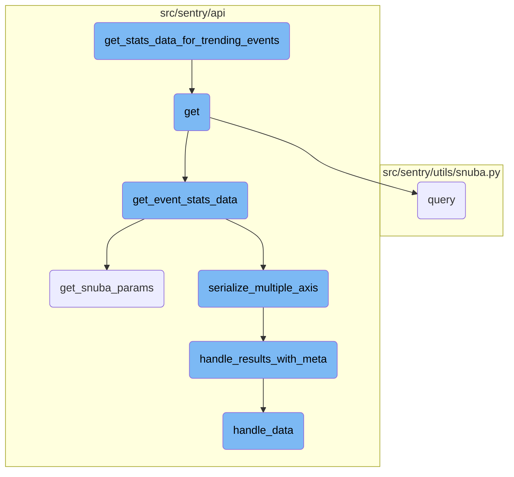
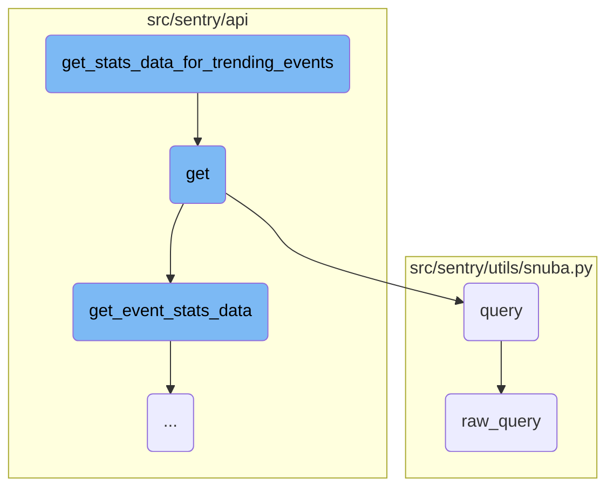

In this document, we will explore how trending event statistics are processed and formatted. The process involves retrieving profiling data, querying a data analytics service, and handling the results to ensure they are correctly formatted and aggregated.

The flow starts with retrieving profiling data for an organization. This data is then queried using a data analytics service to get the necessary statistics. The results are processed to format and aggregate the data, mapping each function to its project and fingerprint. Finally, the formatted data, including statistics and worst-case examples, is appended to a list and returned.

Here is a high level diagram of the flow, showing only the most important functions:



# Flow drill down

First, we'll zoom into this section of the flow:



<SwmSnippet path="/src/sentry/api/endpoints/organization_profiling_functions.py" line="234">

---

## <SwmToken path="src/sentry/api/endpoints/organization_profiling_functions.py" pos="234:3:3" line-data="        def get_stats_data_for_trending_events(results):">`get_stats_data_for_trending_events`</SwmToken>

The function <SwmToken path="src/sentry/api/endpoints/organization_profiling_functions.py" pos="234:3:3" line-data="        def get_stats_data_for_trending_events(results):">`get_stats_data_for_trending_events`</SwmToken> processes the results to format and aggregate statistical data for trending events. It maps each function to its project and fingerprint, then iterates over the results to format the data, including statistics and worst-case examples. This formatted data is then appended to a list and returned.

```python
        def get_stats_data_for_trending_events(results):
            functions = {
                f"{function['project.id']},{function['fingerprint']}": function
                for function in top_functions.get("data", [])
            }
            formatted_results = []
            for result in results["data"]:
                # The endpoint originally was meant for only transactions
                # hence the name of the key, but it can be adapted to work
                # for functions as well.
                key = f"{result['project']},{result['transaction']}"
                formatted_result = {
                    "stats": stats_data[key][data["function"]],
                    "worst": [
                        (ts, data[0]["count"][0])
                        for ts, data in stats_data[key]["examples()"]["data"]
                        if data[0]["count"]  # filter out entries without an example
                    ],
                }
                formatted_result.update(
                    {
```

---

</SwmSnippet>

<SwmSnippet path="/src/sentry/api/endpoints/organization_profiling_functions.py" line="81">

---

## get

The <SwmToken path="src/sentry/api/endpoints/organization_profiling_functions.py" pos="81:3:3" line-data="    def get(self, request: Request, organization: Organization) -&gt; Response:">`get`</SwmToken> function handles the HTTP GET request to retrieve profiling data for an organization. It includes several helper functions like <SwmToken path="src/sentry/api/bases/organization_events.py" pos="392:1:1" line-data="        get_event_stats: Callable[">`get_event_stats`</SwmToken> and <SwmToken path="src/sentry/api/endpoints/organization_profiling_functions.py" pos="166:3:3" line-data="        def get_trends_data(stats_data) -&gt; list[BreakpointData]:">`get_trends_data`</SwmToken> to process and paginate the trending events data.

```python
    def get(self, request: Request, organization: Organization) -> Response:
        if not self.has_feature(organization, request):
            return Response(status=404)

        try:
            snuba_params = self.get_snuba_params(request, organization)
        except NoProjects:
            return Response({})

        serializer = FunctionTrendsSerializer(data=request.GET)
        if not serializer.is_valid():
            return Response(serializer.errors, status=400)
        data = serializer.validated_data

        with handle_query_errors():
            top_functions = functions.query(
                selected_columns=[
                    "project.id",
                    "fingerprint",
                    "package",
                    "function",
```

---

</SwmSnippet>

<SwmSnippet path="/src/sentry/utils/snuba.py" line="1318">

---

## query

The <SwmToken path="src/sentry/utils/snuba.py" pos="1318:2:2" line-data="def query(">`query`</SwmToken> function constructs and sends a query to Snuba, a data analytics service. It handles the query parameters, sends the query using <SwmToken path="src/sentry/utils/snuba.py" pos="1337:5:5" line-data="        body = raw_query(">`raw_query`</SwmToken>, and processes the results to ensure they match the expected format.

```python
def query(
    dataset=None,
    start=None,
    end=None,
    groupby=None,
    conditions=None,
    filter_keys=None,
    aggregations=None,
    selected_columns=None,
    totals=None,
    use_cache=False,
    **kwargs,
):
    aggregations = aggregations or [["count()", "", "aggregate"]]
    filter_keys = filter_keys or {}
    selected_columns = selected_columns or []
    groupby = groupby or []

    try:
        body = raw_query(
            dataset=dataset,
```

---

</SwmSnippet>

<SwmSnippet path="/src/sentry/utils/snuba.py" line="846">

---

## <SwmToken path="src/sentry/utils/snuba.py" pos="846:2:2" line-data="def raw_query(">`raw_query`</SwmToken>

The <SwmToken path="src/sentry/utils/snuba.py" pos="846:2:2" line-data="def raw_query(">`raw_query`</SwmToken> function sends a low-level query to Snuba. It constructs the query parameters and sends them to Snuba, returning the raw results. This function is used by <SwmToken path="src/sentry/utils/snuba.py" pos="861:5:5" line-data="    Sends a query to snuba.  See `SnubaQueryParams` docstring for param">`query`</SwmToken> to perform the actual data retrieval.

```python
def raw_query(
    dataset=None,
    start=None,
    end=None,
    groupby=None,
    conditions=None,
    filter_keys=None,
    aggregations=None,
    rollup=None,
    referrer=None,
    is_grouprelease=False,
    use_cache=False,
    **kwargs,
) -> Mapping[str, Any]:
    """
    Sends a query to snuba.  See `SnubaQueryParams` docstring for param
    descriptions.
    """

    if referrer:
        kwargs["tenant_ids"] = kwargs.get("tenant_ids") or dict()
```

---

</SwmSnippet>

Now, lets zoom into this section of the flow:

```mermaid
graph TD;
      subgraph src/sentry/api/bases/organization_events.py
9a7c498c62bb10bd14cfa8e6b88481cb1758fe0fe619fac236b1dfc4f2bc9964(get_event_stats_data):::mainFlowStyle --> a4f25188cdb1c709695d3a93e7176ddb7bd151b9a322e0836404ad0986b5f514(get_snuba_params)
end

subgraph src/sentry/api/bases/organization_events.py
9a7c498c62bb10bd14cfa8e6b88481cb1758fe0fe619fac236b1dfc4f2bc9964(get_event_stats_data):::mainFlowStyle --> 6bfd0761a315100cfb455cd63eee604e1d6ebf8e2957d5881bc086457f48801e(serialize_multiple_axis):::mainFlowStyle
end

subgraph src/sentry/api/bases/organization_events.py
6bfd0761a315100cfb455cd63eee604e1d6ebf8e2957d5881bc086457f48801e(serialize_multiple_axis):::mainFlowStyle --> 76555db3c36df80d8ce698d10ee1f95e79e25496e48ce2c0e3a19dce410f1dcd(handle_results_with_meta):::mainFlowStyle
end

subgraph src/sentry/api/bases/organization_events.py
76555db3c36df80d8ce698d10ee1f95e79e25496e48ce2c0e3a19dce410f1dcd(handle_results_with_meta):::mainFlowStyle --> 9335165d6fb85d88094c6bb73f9e154b223f793b29b1af6be9aa07d145132b65(handle_data):::mainFlowStyle
end


      classDef mainFlowStyle color:#000000,fill:#7CB9F4
classDef rootsStyle color:#000000,fill:#00FFF4
classDef Style1 color:#000000,fill:#00FFAA
classDef Style2 color:#000000,fill:#FFFF00
classDef Style3 color:#000000,fill:#AA7CB9

%% Swimm:
%% graph TD;
%%       subgraph <SwmPath>[src/sentry/api/bases/organization_events.py](src/sentry/api/bases/organization_events.py)</SwmPath>
%% 9a7c498c62bb10bd14cfa8e6b88481cb1758fe0fe619fac236b1dfc4f2bc9964(get_event_stats_data):::mainFlowStyle --> a4f25188cdb1c709695d3a93e7176ddb7bd151b9a322e0836404ad0986b5f514(get_snuba_params)
%% end
%% 
%% subgraph <SwmPath>[src/sentry/api/bases/organization_events.py](src/sentry/api/bases/organization_events.py)</SwmPath>
%% 9a7c498c62bb10bd14cfa8e6b88481cb1758fe0fe619fac236b1dfc4f2bc9964(get_event_stats_data):::mainFlowStyle --> 6bfd0761a315100cfb455cd63eee604e1d6ebf8e2957d5881bc086457f48801e(serialize_multiple_axis):::mainFlowStyle
%% end
%% 
%% subgraph <SwmPath>[src/sentry/api/bases/organization_events.py](src/sentry/api/bases/organization_events.py)</SwmPath>
%% 6bfd0761a315100cfb455cd63eee604e1d6ebf8e2957d5881bc086457f48801e(serialize_multiple_axis):::mainFlowStyle --> 76555db3c36df80d8ce698d10ee1f95e79e25496e48ce2c0e3a19dce410f1dcd(handle_results_with_meta):::mainFlowStyle
%% end
%% 
%% subgraph <SwmPath>[src/sentry/api/bases/organization_events.py](src/sentry/api/bases/organization_events.py)</SwmPath>
%% 76555db3c36df80d8ce698d10ee1f95e79e25496e48ce2c0e3a19dce410f1dcd(handle_results_with_meta):::mainFlowStyle --> 9335165d6fb85d88094c6bb73f9e154b223f793b29b1af6be9aa07d145132b65(handle_data):::mainFlowStyle
%% end
%% 
%% 
%%       classDef mainFlowStyle color:#000000,fill:#7CB9F4
%% classDef rootsStyle color:#000000,fill:#00FFF4
%% classDef Style1 color:#000000,fill:#00FFAA
%% classDef Style2 color:#000000,fill:#FFFF00
%% classDef Style3 color:#000000,fill:#AA7CB9
```



<SwmSnippet path="/src/sentry/api/bases/organization_events.py" line="388">

---

## <SwmToken path="src/sentry/api/bases/organization_events.py" pos="388:3:3" line-data="    def get_event_stats_data(">`get_event_stats_data`</SwmToken>

The function <SwmToken path="src/sentry/api/bases/organization_events.py" pos="388:3:3" line-data="    def get_event_stats_data(">`get_event_stats_data`</SwmToken> orchestrates the retrieval and serialization of event statistics data. It first retrieves the necessary parameters using <SwmToken path="src/sentry/api/endpoints/organization_profiling_functions.py" pos="86:7:7" line-data="            snuba_params = self.get_snuba_params(request, organization)">`get_snuba_params`</SwmToken>, then performs the event statistics query. Depending on the results, it either serializes the data using <SwmToken path="src/sentry/api/bases/organization_events.py" pos="566:3:3" line-data="    def serialize_multiple_axis(">`serialize_multiple_axis`</SwmToken> or directly serializes it. Finally, it handles metadata using <SwmToken path="src/sentry/api/bases/organization_events.py" pos="290:3:3" line-data="    def handle_results_with_meta(">`handle_results_with_meta`</SwmToken> and processes the data with <SwmToken path="src/sentry/api/bases/organization_events.py" pos="300:7:7" line-data="            data = self.handle_data(request, organization, project_ids, results.get(&quot;data&quot;))">`handle_data`</SwmToken>.

```python
    def get_event_stats_data(
        self,
        request: Request,
        organization: Organization,
        get_event_stats: Callable[
            [Sequence[str], str, SnubaParams, int, bool, timedelta | None], SnubaTSResult
        ],
        top_events: int = 0,
        query_column: str = "count()",
        snuba_params: SnubaParams | None = None,
        query: str | None = None,
        allow_partial_buckets: bool = False,
        zerofill_results: bool = True,
        comparison_delta: timedelta | None = None,
        additional_query_column: str | None = None,
        dataset: Any | None = None,
    ) -> dict[str, Any]:
        with handle_query_errors():
            with sentry_sdk.start_span(
                op="discover.endpoint", description="base.stats_query_creation"
            ):
```

---

</SwmSnippet>

<SwmSnippet path="/src/sentry/api/bases/organization_events.py" line="91">

---

### <SwmToken path="src/sentry/api/bases/organization_events.py" pos="91:3:3" line-data="    def get_snuba_params(">`get_snuba_params`</SwmToken>

The function <SwmToken path="src/sentry/api/bases/organization_events.py" pos="91:3:3" line-data="    def get_snuba_params(">`get_snuba_params`</SwmToken> retrieves the parameters required to make Snuba queries. It ensures that the number of fields does not exceed the maximum allowed and checks for global view permissions if necessary.

```python
    def get_snuba_params(
        self,
        request: Request,
        organization: Organization,
        check_global_views: bool = True,
        quantize_date_params: bool = True,
    ) -> SnubaParams:
        """Returns params to make snuba queries with"""
        with sentry_sdk.start_span(op="discover.endpoint", description="filter_params(dataclass)"):
            if (
                len(self.get_field_list(organization, request))
                + len(self.get_equation_list(organization, request))
                > MAX_FIELDS
            ):
                raise ParseError(
                    detail=f"You can view up to {MAX_FIELDS} fields at a time. Please delete some and try again."
                )

            filter_params: dict[str, Any] = self.get_filter_params(request, organization)
            if quantize_date_params:
                filter_params = self.quantize_date_params(request, filter_params)
```

---

</SwmSnippet>

<SwmSnippet path="/src/sentry/api/bases/organization_events.py" line="566">

---

### <SwmToken path="src/sentry/api/bases/organization_events.py" pos="566:3:3" line-data="    def serialize_multiple_axis(">`serialize_multiple_axis`</SwmToken>

The function <SwmToken path="src/sentry/api/bases/organization_events.py" pos="566:3:3" line-data="    def serialize_multiple_axis(">`serialize_multiple_axis`</SwmToken> serializes the event statistics data when multiple axes are involved. It iterates over the query columns and serializes each one, adding metadata as needed.

```python
    def serialize_multiple_axis(
        self,
        request: Request,
        organization: Organization,
        serializer: BaseSnubaSerializer,
        event_result: SnubaTSResult,
        snuba_params: SnubaParams,
        columns: Sequence[str],
        query_columns: Sequence[str],
        allow_partial_buckets: bool,
        zerofill_results: bool = True,
        dataset: Any | None = None,
    ) -> dict[str, Any]:
        # Return with requested yAxis as the key
        result = {}
        equations = 0
        meta = self.handle_results_with_meta(
            request,
            organization,
            snuba_params.project_ids,
            event_result.data,
```

---

</SwmSnippet>

<SwmSnippet path="/src/sentry/api/bases/organization_events.py" line="290">

---

### <SwmToken path="src/sentry/api/bases/organization_events.py" pos="290:3:3" line-data="    def handle_results_with_meta(">`handle_results_with_meta`</SwmToken>

The function <SwmToken path="src/sentry/api/bases/organization_events.py" pos="290:3:3" line-data="    def handle_results_with_meta(">`handle_results_with_meta`</SwmToken> processes the results and adds metadata. It handles unit metadata and ensures that the results are formatted correctly.

```python
    def handle_results_with_meta(
        self,
        request: Request,
        organization: Organization,
        project_ids: Sequence[int],
        results: dict[str, Any],
        standard_meta: bool | None = False,
        dataset: Any | None = None,
    ) -> dict[str, Any]:
        with sentry_sdk.start_span(op="discover.endpoint", description="base.handle_results"):
            data = self.handle_data(request, organization, project_ids, results.get("data"))
            meta = results.get("meta", {})
            fields_meta = meta.get("fields", {})

            if standard_meta:
                isMetricsData = meta.pop("isMetricsData", False)
                isMetricsExtractedData = meta.pop("isMetricsExtractedData", False)
                discoverSplitDecision = meta.pop("discoverSplitDecision", None)
                fields, units = self.handle_unit_meta(fields_meta)
                meta = {
                    "fields": fields,
```

---

</SwmSnippet>

<SwmSnippet path="/src/sentry/api/bases/organization_events.py" line="332">

---

### <SwmToken path="src/sentry/api/bases/organization_events.py" pos="332:3:3" line-data="    def handle_data(">`handle_data`</SwmToken>

The function <SwmToken path="src/sentry/api/bases/organization_events.py" pos="332:3:3" line-data="    def handle_data(">`handle_data`</SwmToken> processes the raw data results. It formats the results, handles specific fields like <SwmToken path="src/sentry/api/bases/organization_events.py" pos="346:4:6" line-data="        if &quot;transaction.status&quot; in first_row:">`transaction.status`</SwmToken>, and removes unnecessary fields.

```python
    def handle_data(
        self,
        request: Request,
        organization: Organization,
        project_ids: Sequence[int],
        results: Sequence[Any] | None,
    ) -> Sequence[Any] | None:
        if not results:
            return results

        first_row = results[0]

        # TODO(mark) move all of this result formatting into discover.query()
        # once those APIs are used across the application.
        if "transaction.status" in first_row:
            for row in results:
                if "transaction.status" in row and type(row["transaction.status"]) is int:
                    row["transaction.status"] = SPAN_STATUS_CODE_TO_NAME.get(
                        row["transaction.status"]
                    )

```

---

</SwmSnippet>

&nbsp;

*This is an auto-generated document by Swimm AI 🌊 and has not yet been verified by a human*

<SwmMeta version="3.0.0" repo-id="Z2l0aHViJTNBJTNBc2VudHJ5LWRlbW8tMSUzQSUzQVN3aW1tLURlbW8=" repo-name="sentry-demo-1" doc-type="flows"><sup>Powered by [Swimm](/)</sup></SwmMeta>
