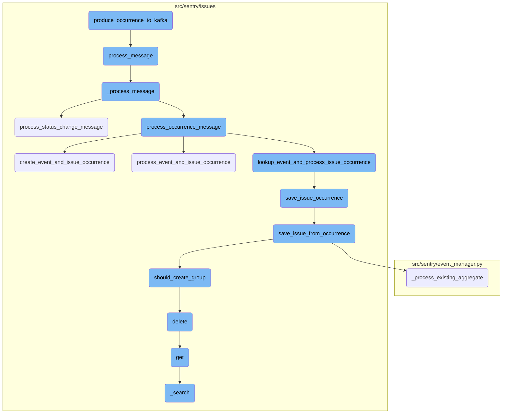
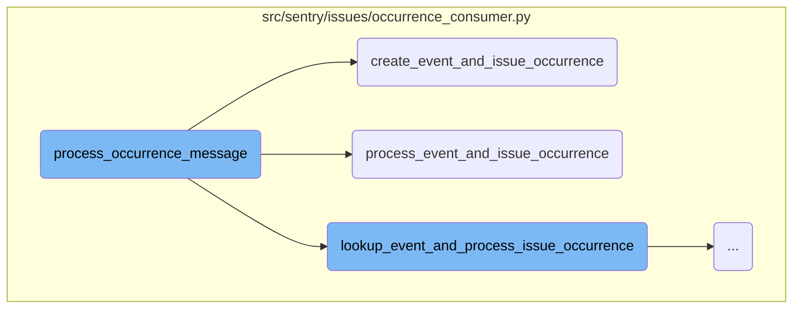
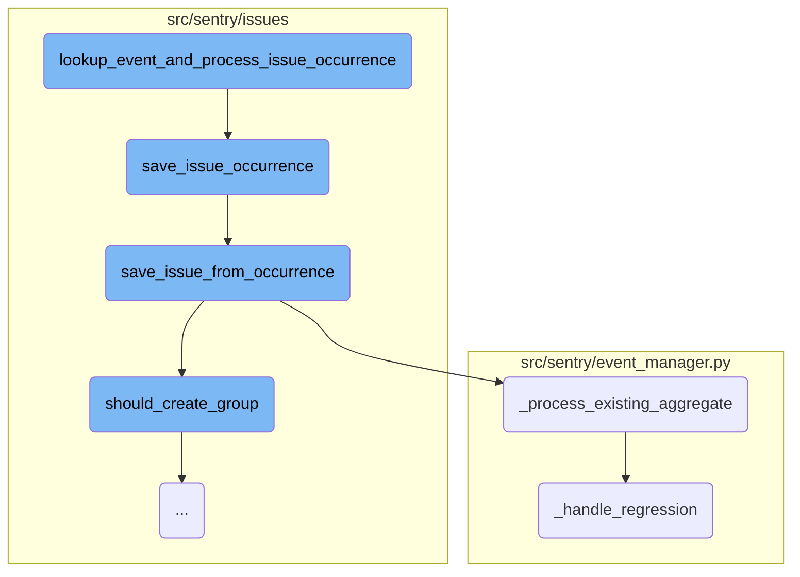

```mermaid
graph TD;
      subgraph src/sentry/issues
53b0f1a055e7d42105ff0f146acb6ee963337d2414ab6ffd49658c81c22f3925(should_create_group):::mainFlowStyle --> 46fd623efcf0e07f29eeff8dfb22b891d99366d92b989de50b3ebe258b2250c2(delete):::mainFlowStyle
end

subgraph src/sentry/issues
46fd623efcf0e07f29eeff8dfb22b891d99366d92b989de50b3ebe258b2250c2(delete):::mainFlowStyle --> 6a6c4d35daa9b5dfd9b380a4500d5f2e54056cd198f5a8081354febbd6bde7cb(get):::mainFlowStyle
end

subgraph src/sentry/issues
6a6c4d35daa9b5dfd9b380a4500d5f2e54056cd198f5a8081354febbd6bde7cb(get):::mainFlowStyle --> 5c2c7c800021b5710cca667044f2c20f2f4c5b0e41468fd7f58fef2f2118f594(_search):::mainFlowStyle
end


      classDef mainFlowStyle color:#000000,fill:#7CB9F4
classDef rootsStyle color:#000000,fill:#00FFF4
classDef Style1 color:#000000,fill:#00FFAA
classDef Style2 color:#000000,fill:#FFFF00
classDef Style3 color:#000000,fill:#AA7CB9

%% Swimm:
%% graph TD;
%%       subgraph <SwmPath>[src/sentry/issues/](src/sentry/issues/)</SwmPath>
%% 53b0f1a055e7d42105ff0f146acb6ee963337d2414ab6ffd49658c81c22f3925(should_create_group):::mainFlowStyle --> 46fd623efcf0e07f29eeff8dfb22b891d99366d92b989de50b3ebe258b2250c2(delete):::mainFlowStyle
%% end
%% 
%% subgraph <SwmPath>[src/sentry/issues/](src/sentry/issues/)</SwmPath>
%% 46fd623efcf0e07f29eeff8dfb22b891d99366d92b989de50b3ebe258b2250c2(delete):::mainFlowStyle --> 6a6c4d35daa9b5dfd9b380a4500d5f2e54056cd198f5a8081354febbd6bde7cb(get):::mainFlowStyle
%% end
%% 
%% subgraph <SwmPath>[src/sentry/issues/](src/sentry/issues/)</SwmPath>
%% 6a6c4d35daa9b5dfd9b380a4500d5f2e54056cd198f5a8081354febbd6bde7cb(get):::mainFlowStyle --> 5c2c7c800021b5710cca667044f2c20f2f4c5b0e41468fd7f58fef2f2118f594(_search):::mainFlowStyle
%% end
%% 
%% 
%%       classDef mainFlowStyle color:#000000,fill:#7CB9F4
%% classDef rootsStyle color:#000000,fill:#00FFF4
%% classDef Style1 color:#000000,fill:#00FFAA
%% classDef Style2 color:#000000,fill:#FFFF00
%% classDef Style3 color:#000000,fill:#AA7CB9
```

This document explains the process of producing occurrences to Kafka. It outlines the steps involved in preparing and sending messages to Kafka, handling different payload types, and processing messages directly if Kafka is not running.

The process starts by preparing the message based on its type, either an occurrence or a status change. Once the message is prepared, it is sent to the appropriate Kafka topic. If Kafka is not available, the message is processed directly. This ensures that all messages are handled appropriately, whether Kafka is running or not.

Here is a high level diagram of the flow, showing only the most important functions:



# Flow drill down

First, we'll zoom into this section of the flow:

```mermaid
graph TD;
      subgraph src/sentry/issues
2e06fee66f3056d62a645be3661efe91bdf1772a35b6db6f76828daa17080e9b(produce_occurrence_to_kafka):::mainFlowStyle --> eb11e30b486412c5d126c00ac2775ac5639b63dd9079d7ca168b99292709a07f(process_message):::mainFlowStyle
end

subgraph src/sentry/issues
eb11e30b486412c5d126c00ac2775ac5639b63dd9079d7ca168b99292709a07f(process_message):::mainFlowStyle --> a1f3f7172f58538a2b63315819a01097f02f8348a8aed6dfd17675a988d6badd(_process_message):::mainFlowStyle
end

subgraph src/sentry/issues
a1f3f7172f58538a2b63315819a01097f02f8348a8aed6dfd17675a988d6badd(_process_message):::mainFlowStyle --> e9ea1919fcca90844c6232d023ba5a8cac831e367af20a0e26d21057445a13fd(process_status_change_message)
end

subgraph src/sentry/issues
a1f3f7172f58538a2b63315819a01097f02f8348a8aed6dfd17675a988d6badd(_process_message):::mainFlowStyle --> ed9a03c8724a2bf2ae11da747aa8adcd4b29e68e178aff549c985b06e9f02d2e(process_occurrence_message):::mainFlowStyle
end

subgraph src/sentry/issues
ed9a03c8724a2bf2ae11da747aa8adcd4b29e68e178aff549c985b06e9f02d2e(process_occurrence_message):::mainFlowStyle --> ucygo(...)
end


      classDef mainFlowStyle color:#000000,fill:#7CB9F4
classDef rootsStyle color:#000000,fill:#00FFF4
classDef Style1 color:#000000,fill:#00FFAA
classDef Style2 color:#000000,fill:#FFFF00
classDef Style3 color:#000000,fill:#AA7CB9

%% Swimm:
%% graph TD;
%%       subgraph <SwmPath>[src/sentry/issues/](src/sentry/issues/)</SwmPath>
%% 2e06fee66f3056d62a645be3661efe91bdf1772a35b6db6f76828daa17080e9b(produce_occurrence_to_kafka):::mainFlowStyle --> eb11e30b486412c5d126c00ac2775ac5639b63dd9079d7ca168b99292709a07f(process_message):::mainFlowStyle
%% end
%% 
%% subgraph <SwmPath>[src/sentry/issues/](src/sentry/issues/)</SwmPath>
%% eb11e30b486412c5d126c00ac2775ac5639b63dd9079d7ca168b99292709a07f(process_message):::mainFlowStyle --> a1f3f7172f58538a2b63315819a01097f02f8348a8aed6dfd17675a988d6badd(_process_message):::mainFlowStyle
%% end
%% 
%% subgraph <SwmPath>[src/sentry/issues/](src/sentry/issues/)</SwmPath>
%% a1f3f7172f58538a2b63315819a01097f02f8348a8aed6dfd17675a988d6badd(_process_message):::mainFlowStyle --> e9ea1919fcca90844c6232d023ba5a8cac831e367af20a0e26d21057445a13fd(process_status_change_message)
%% end
%% 
%% subgraph <SwmPath>[src/sentry/issues/](src/sentry/issues/)</SwmPath>
%% a1f3f7172f58538a2b63315819a01097f02f8348a8aed6dfd17675a988d6badd(_process_message):::mainFlowStyle --> ed9a03c8724a2bf2ae11da747aa8adcd4b29e68e178aff549c985b06e9f02d2e(process_occurrence_message):::mainFlowStyle
%% end
%% 
%% subgraph <SwmPath>[src/sentry/issues/](src/sentry/issues/)</SwmPath>
%% ed9a03c8724a2bf2ae11da747aa8adcd4b29e68e178aff549c985b06e9f02d2e(process_occurrence_message):::mainFlowStyle --> ucygo(...)
%% end
%% 
%% 
%%       classDef mainFlowStyle color:#000000,fill:#7CB9F4
%% classDef rootsStyle color:#000000,fill:#00FFF4
%% classDef Style1 color:#000000,fill:#00FFAA
%% classDef Style2 color:#000000,fill:#FFFF00
%% classDef Style3 color:#000000,fill:#AA7CB9
```



<SwmSnippet path="/src/sentry/issues/producer.py" line="50">

---

## Producing Occurrence to Kafka

The function <SwmToken path="src/sentry/issues/producer.py" pos="50:2:2" line-data="def produce_occurrence_to_kafka(">`produce_occurrence_to_kafka`</SwmToken> is responsible for preparing and sending messages to Kafka. It handles different payload types, prepares the message accordingly, and sends it to the appropriate Kafka topic. If Kafka is not running, it processes the message directly.

```python
def produce_occurrence_to_kafka(
    payload_type: PayloadType = PayloadType.OCCURRENCE,
    occurrence: IssueOccurrence | None = None,
    status_change: StatusChangeMessage | None = None,
    event_data: dict[str, Any] | None = None,
    is_buffered_spans: bool | None = False,
) -> None:
    if payload_type == PayloadType.OCCURRENCE:
        payload_data = _prepare_occurrence_message(occurrence, event_data, is_buffered_spans)
    elif payload_type == PayloadType.STATUS_CHANGE:
        payload_data = _prepare_status_change_message(status_change)
    else:
        raise NotImplementedError(f"Unknown payload type: {payload_type}")

    if payload_data is None:
        return

    partition_key = None
    if occurrence and occurrence.fingerprint:
        partition_key = occurrence.fingerprint[0].encode()
    elif status_change and status_change.fingerprint:
```

---

</SwmSnippet>

<SwmSnippet path="/src/sentry/issues/run.py" line="95">

---

## Processing Message

The function <SwmToken path="src/sentry/issues/run.py" pos="95:2:2" line-data="def process_message(message: Message[KafkaPayload]) -&gt; None:">`process_message`</SwmToken> is responsible for deserializing the Kafka message payload and passing it to the <SwmToken path="src/sentry/issues/run.py" pos="96:11:11" line-data="    from sentry.issues.occurrence_consumer import _process_message">`_process_message`</SwmToken> function for further processing. It also handles any exceptions that occur during this process.

```python
def process_message(message: Message[KafkaPayload]) -> None:
    from sentry.issues.occurrence_consumer import _process_message

    try:
        payload = orjson.loads(message.payload.value)
        _process_message(payload)
    except Exception:
        logger.exception("failed to process message payload")
```

---

</SwmSnippet>

<SwmSnippet path="/src/sentry/issues/occurrence_consumer.py" line="344">

---

## Processing Message Internally

The function <SwmToken path="src/sentry/issues/occurrence_consumer.py" pos="344:2:2" line-data="def _process_message(">`_process_message`</SwmToken> handles the core logic of processing different types of messages. It starts a transaction, determines the payload type, and processes the message accordingly. If the payload type is invalid, it logs the error and increments a metric.

```python
def _process_message(
    message: Mapping[str, Any]
) -> tuple[IssueOccurrence | None, GroupInfo | None] | None:
    """
    :raises InvalidEventPayloadError: when the message is invalid
    :raises EventLookupError: when the provided event_id in the message couldn't be found.
    """
    with sentry_sdk.start_transaction(
        op="_process_message",
        name="issues.occurrence_consumer",
        sampled=True,
    ) as txn:
        try:
            # Messages without payload_type default to an OCCURRENCE payload
            payload_type = message.get("payload_type", PayloadType.OCCURRENCE.value)
            if payload_type == PayloadType.STATUS_CHANGE.value:
                group = process_status_change_message(message, txn)
                if not group:
                    return None

                return None, GroupInfo(group=group, is_new=False, is_regression=False)
```

---

</SwmSnippet>

<SwmSnippet path="/src/sentry/issues/status_change_consumer.py" line="172">

---

### Processing Status Change Message

The function <SwmToken path="src/sentry/issues/status_change_consumer.py" pos="172:2:2" line-data="def process_status_change_message(">`process_status_change_message`</SwmToken> processes messages related to status changes. It retrieves necessary data, updates the status of the group, and logs relevant metrics and tags. If the group is not found, it logs an info message and increments a metric.

```python
def process_status_change_message(
    message: Mapping[str, Any], txn: Transaction | NoOpSpan | Span
) -> Group | None:
    with metrics.timer("occurrence_consumer._process_message.status_change._get_kwargs"):
        kwargs = _get_status_change_kwargs(message)
    status_change_data = kwargs["status_change"]

    metrics.incr(
        "occurrence_ingest.status_change.messages",
        sample_rate=1.0,
        tags={"new_status": status_change_data["new_status"]},
    )
    txn.set_tag("new_status", status_change_data["new_status"])

    project = Project.objects.get_from_cache(id=status_change_data["project_id"])
    organization = Organization.objects.get_from_cache(id=project.organization_id)

    txn.set_tag("organization_id", organization.id)
    txn.set_tag("organization_slug", organization.slug)
    txn.set_tag("project_id", project.id)
    txn.set_tag("project_slug", project.slug)
```

---

</SwmSnippet>

Now, lets zoom into this section of the flow:



<SwmSnippet path="/src/sentry/issues/occurrence_consumer.py" line="288">

---

## Handling Occurrence Messages

The function <SwmToken path="src/sentry/issues/occurrence_consumer.py" pos="288:2:2" line-data="def process_occurrence_message(">`process_occurrence_message`</SwmToken> is responsible for handling incoming occurrence messages. It starts by extracting necessary data from the message and setting various tags for metrics and transaction tracking. It then checks if the occurrence type is allowed for ingestion. Depending on the presence of event data and whether spans are buffered, it either creates or processes events and issue occurrences or looks up and processes issue occurrences.

```python
def process_occurrence_message(
    message: Mapping[str, Any], txn: Transaction | NoOpSpan | Span
) -> tuple[IssueOccurrence, GroupInfo | None] | None:
    with metrics.timer("occurrence_consumer._process_message._get_kwargs"):
        kwargs = _get_kwargs(message)
    occurrence_data = kwargs["occurrence_data"]
    metric_tags = {"occurrence_type": occurrence_data["type"]}
    is_buffered_spans = kwargs.get("is_buffered_spans", False)

    metrics.incr(
        "occurrence_ingest.messages",
        sample_rate=1.0,
        tags=metric_tags,
    )
    txn.set_tag("occurrence_type", occurrence_data["type"])

    project = Project.objects.get_from_cache(id=occurrence_data["project_id"])
    organization = Organization.objects.get_from_cache(id=project.organization_id)

    txn.set_tag("organization_id", organization.id)
    txn.set_tag("organization_slug", organization.slug)
```

---

</SwmSnippet>

<SwmSnippet path="/src/sentry/issues/occurrence_consumer.py" line="92">

---

### Creating Event and Issue Occurrence

The function <SwmToken path="src/sentry/issues/occurrence_consumer.py" pos="92:2:2" line-data="def create_event_and_issue_occurrence(">`create_event_and_issue_occurrence`</SwmToken> is called when standalone span ingestion is used, meaning events are not stored in nodestore. It creates a lightweight event with essential fields and then saves the issue occurrence using this event.

```python
def create_event_and_issue_occurrence(
    occurrence_data: IssueOccurrenceData, event_data: dict[str, Any]
) -> tuple[IssueOccurrence, GroupInfo | None]:
    """With standalone span ingestion, we won't be storing events in
    nodestore, so instead we create a light-weight event with a small
    set of fields that lets us create occurrences.
    """
    project_id = occurrence_data["project_id"]
    event_id = occurrence_data["event_id"]
    if occurrence_data["event_id"] != event_data["event_id"]:
        raise ValueError(
            f"event_id in occurrence({occurrence_data['event_id']}) is different from event_id in event_data({event_data['event_id']})"
        )

    event = create_event(project_id, event_id, event_data)

    with metrics.timer(
        "occurrence_consumer._process_message.save_issue_occurrence",
        tags={"method": "create_event_and_issue_occurrence"},
    ):
        return save_issue_occurrence(occurrence_data, event)
```

---

</SwmSnippet>

<SwmSnippet path="/src/sentry/issues/occurrence_consumer.py" line="116">

---

### Processing Event and Issue Occurrence

The function <SwmToken path="src/sentry/issues/occurrence_consumer.py" pos="116:2:2" line-data="def process_event_and_issue_occurrence(">`process_event_and_issue_occurrence`</SwmToken> is used when event data is present. It first validates that the event <SwmToken path="src/sentry/issues/endpoints/organization_group_index.py" pos="506:5:5" line-data="        If any IDs are out of scope this operation will succeed without">`IDs`</SwmToken> match between the occurrence data and event data. It then saves the event from the occurrence and proceeds to save the issue occurrence.

```python
def process_event_and_issue_occurrence(
    occurrence_data: IssueOccurrenceData, event_data: dict[str, Any]
) -> tuple[IssueOccurrence, GroupInfo | None]:
    if occurrence_data["event_id"] != event_data["event_id"]:
        raise ValueError(
            f"event_id in occurrence({occurrence_data['event_id']}) is different from event_id in event_data({event_data['event_id']})"
        )

    event = save_event_from_occurrence(event_data)
    with metrics.timer(
        "occurrence_consumer._process_message.save_issue_occurrence",
        tags={"method": "process_event_and_issue_occurrence"},
    ):
        return save_issue_occurrence(occurrence_data, event)
```

---

</SwmSnippet>

Now, lets zoom into this section of the flow:



<SwmSnippet path="/src/sentry/issues/occurrence_consumer.py" line="133">

---

## Lookup Event and Process Issue Occurrence

The function <SwmToken path="src/sentry/issues/occurrence_consumer.py" pos="133:2:2" line-data="def lookup_event_and_process_issue_occurrence(">`lookup_event_and_process_issue_occurrence`</SwmToken> looks up an event based on the provided occurrence data and processes the issue occurrence by saving it. It ensures that the event exists and then delegates the saving process to <SwmToken path="src/sentry/issues/occurrence_consumer.py" pos="144:6:6" line-data="        &quot;occurrence_consumer._process_message.save_issue_occurrence&quot;,">`save_issue_occurrence`</SwmToken>.

```python
def lookup_event_and_process_issue_occurrence(
    occurrence_data: IssueOccurrenceData,
) -> tuple[IssueOccurrence, GroupInfo | None]:
    project_id = occurrence_data["project_id"]
    event_id = occurrence_data["event_id"]
    try:
        event = lookup_event(project_id, event_id)
    except Exception:
        raise EventLookupError(f"Failed to lookup event({event_id}) for project_id({project_id})")

    with metrics.timer(
        "occurrence_consumer._process_message.save_issue_occurrence",
        tags={"method": "lookup_event_and_process_issue_occurrence"},
    ):
        return save_issue_occurrence(occurrence_data, event)
```

---

</SwmSnippet>

<SwmSnippet path="/src/sentry/issues/ingest.py" line="43">

---

## Save Issue Occurrence

The function <SwmToken path="src/sentry/issues/ingest.py" pos="43:2:2" line-data="def save_issue_occurrence(">`save_issue_occurrence`</SwmToken> converts the occurrence data into an <SwmToken path="src/sentry/issues/ingest.py" pos="45:6:6" line-data=") -&gt; tuple[IssueOccurrence, GroupInfo | None]:">`IssueOccurrence`</SwmToken> object and validates it against the event. It saves the occurrence and attempts to retrieve the release associated with the event. If the release exists, it proceeds to save the issue from the occurrence using <SwmToken path="src/sentry/issues/ingest.py" pos="60:5:5" line-data="    group_info = save_issue_from_occurrence(occurrence, event, release)">`save_issue_from_occurrence`</SwmToken>.

```python
def save_issue_occurrence(
    occurrence_data: IssueOccurrenceData, event: Event
) -> tuple[IssueOccurrence, GroupInfo | None]:
    # Convert occurrence data to `IssueOccurrence`
    occurrence = IssueOccurrence.from_dict(occurrence_data)
    if occurrence.event_id != event.event_id:
        raise ValueError("IssueOccurrence must have the same event_id as the passed Event")
    # Note: For now we trust the project id passed along with the event. Later on we should make
    # sure that this is somehow validated.
    occurrence.save()

    try:
        release = Release.get(event.project, event.release)
    except Release.DoesNotExist:
        # The release should always exist here since event has been ingested at this point, but just
        # in case it has been deleted
        release = None
    group_info = save_issue_from_occurrence(occurrence, event, release)
    if group_info:
        environment = event.get_environment()
        _get_or_create_group_environment(environment, release, [group_info])
```

---

</SwmSnippet>

<SwmSnippet path="/src/sentry/issues/ingest.py" line="166">

---

## Save Issue from Occurrence

The function <SwmToken path="src/sentry/issues/ingest.py" pos="166:2:2" line-data="def save_issue_from_occurrence(">`save_issue_from_occurrence`</SwmToken> handles the creation or retrieval of a group hash and group, ensuring that the issue is correctly categorized and assigned. If the group already exists, it processes the existing aggregate using <SwmToken path="src/sentry/event_manager.py" pos="2279:2:2" line-data="def _process_existing_aggregate(">`_process_existing_aggregate`</SwmToken>.

```python
def save_issue_from_occurrence(
    occurrence: IssueOccurrence, event: Event, release: Release | None
) -> GroupInfo | None:
    project = event.project
    issue_kwargs = _create_issue_kwargs(occurrence, event, release)
    # We need to augment the message with occurrence data here since we can't build a `GroupEvent`
    # until after we have created a `Group`.
    issue_kwargs["message"] = augment_message_with_occurrence(issue_kwargs["message"], occurrence)

    # TODO: For now we will assume a single fingerprint. We can expand later if necessary.
    # Note that additional fingerprints won't be used to generated additional issues, they'll be
    # used to map the occurrence to a specific issue.
    new_grouphash = occurrence.fingerprint[0]
    existing_grouphash = (
        GroupHash.objects.filter(project=project, hash=new_grouphash)
        .select_related("group")
        .first()
    )

    if not existing_grouphash:
        cluster_key = settings.SENTRY_ISSUE_PLATFORM_RATE_LIMITER_OPTIONS.get("cluster", "default")
```

---

</SwmSnippet>

<SwmSnippet path="/src/sentry/event_manager.py" line="2279">

---

## Process Existing Aggregate

The function <SwmToken path="src/sentry/event_manager.py" pos="2279:2:2" line-data="def _process_existing_aggregate(">`_process_existing_aggregate`</SwmToken> updates the group's metadata and checks for any regressions using <SwmToken path="src/sentry/event_manager.py" pos="2095:2:2" line-data="def _handle_regression(group: Group, event: BaseEvent, release: Release | None) -&gt; bool | None:">`_handle_regression`</SwmToken>.

```python
def _process_existing_aggregate(
    group: Group,
    event: BaseEvent,
    incoming_group_values: Mapping[str, Any],
    release: Release | None,
) -> bool:
    last_seen = max(event.datetime, group.last_seen)
    updated_group_values: dict[str, Any] = {"last_seen": last_seen}
    # Unclear why this is necessary, given that it's also in `updated_group_values`, but removing
    # it causes unrelated tests to fail. Hard to say if that's the tests or the removal, though.
    group.last_seen = updated_group_values["last_seen"]

    if (
        event.search_message
        and event.search_message != group.message
        and not _is_placeholder_title(event.search_message)
        and event.get_event_type() != TransactionEvent.key
    ):
        updated_group_values["message"] = event.search_message
    if group.level != incoming_group_values["level"]:
        updated_group_values["level"] = incoming_group_values["level"]
```

---

</SwmSnippet>

<SwmSnippet path="/src/sentry/event_manager.py" line="2095">

---

## Handle Regression

The function <SwmToken path="src/sentry/event_manager.py" pos="2095:2:2" line-data="def _handle_regression(group: Group, event: BaseEvent, release: Release | None) -&gt; bool | None:">`_handle_regression`</SwmToken> determines if the issue has regressed based on the event and release information, updating the group's status and triggering any necessary signals.

```python
def _handle_regression(group: Group, event: BaseEvent, release: Release | None) -> bool | None:
    if not group.is_resolved():
        return None

    # we only mark it as a regression if the event's release is newer than
    # the release which we originally marked this as resolved
    elif GroupResolution.has_resolution(group, release):
        return None

    elif has_pending_commit_resolution(group):
        return None

    if not plugin_is_regression(group, event):
        return None

    # we now think its a regression, rely on the database to validate that
    # no one beat us to this
    date = max(event.datetime, group.last_seen)
    is_regression = bool(
        Group.objects.filter(
            id=group.id,
```

---

</SwmSnippet>

Now, lets zoom into this section of the flow:



<SwmSnippet path="/src/sentry/issues/grouptype.py" line="603">

---

## Decision-Making Process

The function <SwmToken path="src/sentry/issues/grouptype.py" pos="613:4:4" line-data="        &quot;noise_reduction.should_create_group.threshold&quot;,">`should_create_group`</SwmToken> determines whether a new group should be created based on the number of times a specific group hash has been seen. It increments a counter in Redis and checks against a noise threshold. If the threshold is exceeded, the group hash is deleted, and the function returns `True`, indicating that a new group should be created. Otherwise, it sets an expiration time for the key and returns `False`.

```python
    key = f"grouphash:{grouphash}:{project.id}"
    times_seen = client.incr(key)
    noise_config = grouptype.noise_config

    if not noise_config:
        return True

    over_threshold = times_seen >= noise_config.ignore_limit

    metrics.incr(
        "noise_reduction.should_create_group.threshold",
        tags={
            "over_threshold": over_threshold,
            "group_type": grouptype.slug,
        },
        sample_rate=1.0,
    )

    if over_threshold:
        client.delete(grouphash)
        return True
```

---

</SwmSnippet>

<SwmSnippet path="/src/sentry/issues/endpoints/organization_group_index.py" line="495">

---

## Bulk Removal of Issues

The <SwmToken path="src/sentry/issues/endpoints/organization_group_index.py" pos="495:3:3" line-data="    def delete(self, request: Request, organization) -&gt; Response:">`delete`</SwmToken> function handles the bulk removal of issues. It retrieves the projects associated with the request and checks if the user has the necessary permissions. If the conditions are met, it calls the <SwmToken path="src/sentry/issues/endpoints/organization_group_index.py" pos="23:1:1" line-data="    delete_groups,">`delete_groups`</SwmToken> function to perform the deletion.

`````````````````````````````python
    def delete(self, request: Request, organization) -> Response:
        """
        Bulk Remove a List of Issues
        ````````````````````````````

        Permanently remove the given issues. The list of issues to
        modify is given through the `id` query parameter.  It is repeated
        for each issue that should be removed.

        Only queries by 'id' are accepted.

        If any IDs are out of scope this operation will succeed without
        any data mutation.

        :qparam int id: a list of IDs of the issues to be removed.  This
                        parameter shall be repeated for each issue, e.g.
                        `?id=1&id=2&id=3`. If this parameter is not provided,
                        it will attempt to remove the first 1000 issues.
        :pparam string organization_id_or_slug: the id or slug of the organization the
                                          issues belong to.
        :auth: required
`````````````````````````````

---

</SwmSnippet>

<SwmSnippet path="/src/sentry/issues/endpoints/organization_group_index.py" line="203">

---

## Listing Organization's Issues

The <SwmToken path="src/sentry/issues/endpoints/organization_group_index.py" pos="203:3:3" line-data="    def get(self, request: Request, organization) -&gt; Response:">`get`</SwmToken> function returns a list of issues bound to an organization. It applies default query parameters and handles various filters and search criteria. The function also records analytics for the search query and returns the serialized results.

``````````````````````````````python
    def get(self, request: Request, organization) -> Response:
        """
        List an Organization's Issues
        `````````````````````````````

        Return a list of issues (groups) bound to an organization.  All parameters are
        supplied as query string parameters.

        A default query of ``is:unresolved issue.priority:[high,medium]`` is applied.
        To return results with other statuses send a new query value
        (i.e. ``?query=`` for all results).

        The ``groupStatsPeriod`` parameter can be used to select the timeline
        stats which should be present. Possible values are: '' (disable),
        '24h', '14d'

        The ``statsPeriod`` parameter can be used to select a date window starting
        from now. Ex. ``14d``.

        The ``start`` and ``end`` parameters can be used to select an absolute
        date period to fetch issues from.
``````````````````````````````

---

</SwmSnippet>

<SwmSnippet path="/src/sentry/issues/endpoints/organization_group_index.py" line="153">

---

## Searching for Issues

The <SwmToken path="src/sentry/issues/endpoints/organization_group_index.py" pos="153:3:3" line-data="    def _search(">`_search`</SwmToken> function builds query parameters from the request and performs the search using either the inbox search or the standard search backend. It returns the search results and query parameters.

```python
    def _search(
        self, request: Request, organization, projects, environments, extra_query_kwargs=None
    ):
        with start_span(op="_search"):
            query_kwargs = build_query_params_from_request(
                request, organization, projects, environments
            )
            if extra_query_kwargs is not None:
                assert "environment" not in extra_query_kwargs
                query_kwargs.update(extra_query_kwargs)

            query_kwargs["environments"] = environments if environments else None

            query_kwargs["actor"] = request.user
            if query_kwargs["sort_by"] == "inbox":
                query_kwargs.pop("sort_by")
                result = inbox_search(**query_kwargs)
            else:

                def use_group_snuba_dataset() -> bool:
                    # if useGroupSnubaDataset is present, override the flag so we can test the new dataset
```

---

</SwmSnippet>

# Where is this flow used?

This flow is used multiple times in the codebase as represented in the following diagram:

(Note - these are only some of the entry points of this flow)

```mermaid
graph TD;
      subgraph src/sentry/replays
1dce6bbfad949e3653c65b43c6911ab3d420991a8caedbd0b73679c2365bea07(get_result):::rootsStyle --> 352e4ac9f96abe3c942b81fd7fb53cd0d3d90421b8ff0c6d1a6b6c53fa029068(data_fn)
end

subgraph src/sentry/replays
352e4ac9f96abe3c942b81fd7fb53cd0d3d90421b8ff0c6d1a6b6c53fa029068(data_fn) --> 0732d878778149a2b5570d9242bd77c90592cd49755dde09c18bfda59ee3a441(get)
end

subgraph src/sentry/replays
0732d878778149a2b5570d9242bd77c90592cd49755dde09c18bfda59ee3a441(get) --> 067c13ee434a68e8d444d1c43c5a2ddb9b18f6104ed0eaedda570f9f6774c0f5(query_replays_collection_paginated)
end

subgraph src/sentry/replays/usecases
067c13ee434a68e8d444d1c43c5a2ddb9b18f6104ed0eaedda570f9f6774c0f5(query_replays_collection_paginated) --> bad1cc1964148e2c74ea858a500d0e0cbaaa0b0d8f407740464c264005bcdbd4(query_using_optimized_search)
end

subgraph src/sentry/replays/usecases
bad1cc1964148e2c74ea858a500d0e0cbaaa0b0d8f407740464c264005bcdbd4(query_using_optimized_search) --> e682540e522527782da9f73fbf8898594c93ea19ab77419d18879e6aa9962b31(_query_using_materialized_view_strategy)
end

subgraph src/sentry/replays/usecases
e682540e522527782da9f73fbf8898594c93ea19ab77419d18879e6aa9962b31(_query_using_materialized_view_strategy) --> 2c5e4522e9bfca8fa46f599037c4f9cff8cc9f28bad65a891186facc97fba7bc(_query_using_scalar_strategy)
end

subgraph src/sentry/replays/usecases
2c5e4522e9bfca8fa46f599037c4f9cff8cc9f28bad65a891186facc97fba7bc(_query_using_scalar_strategy) --> 6de0e5ddb87c987b8c3508c0d18f6dadf9e31d818da5be8e43c99eaae03720b0(_query_using_aggregated_strategy)
end

subgraph src/sentry/replays/usecases
6de0e5ddb87c987b8c3508c0d18f6dadf9e31d818da5be8e43c99eaae03720b0(_query_using_aggregated_strategy) --> aae957b83aafeb40cc2f96f1e440ca5b1c6b247aa92c3093f492475d13ab5f73(handle_search_filters)
end

subgraph src/sentry/replays/usecases
aae957b83aafeb40cc2f96f1e440ca5b1c6b247aa92c3093f492475d13ab5f73(handle_search_filters) --> a90cae483748f6562538006089695ddc6c6f0213ca7ec92d92008d1dca572c97(attempt_compressed_condition)
end

subgraph src/sentry/replays
a90cae483748f6562538006089695ddc6c6f0213ca7ec92d92008d1dca572c97(attempt_compressed_condition) --> e8180dd1487e3ce108f37a5d31494c6d455b17868ab7a67e3b48db380c1b3c98(append)
end

subgraph src/sentry/replays
e8180dd1487e3ce108f37a5d31494c6d455b17868ab7a67e3b48db380c1b3c98(append) --> cc3e85653bed81c9ae282de594596043aedea568dc339dce6f078b06e0ab5b04(process_message)
end

subgraph src/sentry/replays/usecases/ingest
cc3e85653bed81c9ae282de594596043aedea568dc339dce6f078b06e0ab5b04(process_message) --> d62f99fa8fbea3e750b40546c8593d1ccd1ce1b18dd2db1987aa378960a894c2(parse_replay_actions)
end

subgraph src/sentry/replays/usecases/ingest
d62f99fa8fbea3e750b40546c8593d1ccd1ce1b18dd2db1987aa378960a894c2(parse_replay_actions) --> da16a2f1064468142a8ab3c700af8cbfd7641293461d643061e0b5f81ff1d002(get_user_actions)
end

subgraph src/sentry/replays/usecases/ingest
da16a2f1064468142a8ab3c700af8cbfd7641293461d643061e0b5f81ff1d002(get_user_actions) --> 92a09ed224033563bb07c0b082ca92195958a360e1a9afada649b30ccdf7c8f7(_handle_breadcrumb)
end

subgraph src/sentry/replays/usecases/ingest
92a09ed224033563bb07c0b082ca92195958a360e1a9afada649b30ccdf7c8f7(_handle_breadcrumb) --> 02e4553f44543b8899d1557a10f93921a83d457a8779cfebef30953fe2a87dc0(report_rage_click_issue_with_replay_event)
end

subgraph src/sentry/replays/usecases
02e4553f44543b8899d1557a10f93921a83d457a8779cfebef30953fe2a87dc0(report_rage_click_issue_with_replay_event) --> 1a0f88ea21a651803ddd6bb0228c4eb8bcad44f54acda773380c7c8fa8750d44(new_issue_occurrence)
end

subgraph src/sentry
1a0f88ea21a651803ddd6bb0228c4eb8bcad44f54acda773380c7c8fa8750d44(new_issue_occurrence) --> 2e06fee66f3056d62a645be3661efe91bdf1772a35b6db6f76828daa17080e9b(produce_occurrence_to_kafka):::mainFlowStyle
end

subgraph src/sentry/replays
a4ef600ee102177449018a33a8b7ebfc0d25e359e11e671a71a5c8d6ffe72317(delete_replays):::rootsStyle --> 067c13ee434a68e8d444d1c43c5a2ddb9b18f6104ed0eaedda570f9f6774c0f5(query_replays_collection_paginated)
end

subgraph src/sentry/replays
80f5ca1bc4cb318fd3b0d7f3aa065b9490d5dac487f9e2cb184377b3927e3c4a(query_replays_collection):::rootsStyle --> 067c13ee434a68e8d444d1c43c5a2ddb9b18f6104ed0eaedda570f9f6774c0f5(query_replays_collection_paginated)
end

subgraph src/sentry
dd8e2dddf4ff69bc3ec8808c9dd82ae3948605d0e895bafe5cd544c09ae16747(finish_pipeline):::rootsStyle --> d0a57a6634b23b7a4dccbdf092a9e6ac4d530811a4335744e0c058732ff0701c(_finish_login_pipeline)
end

subgraph src/sentry
d0a57a6634b23b7a4dccbdf092a9e6ac4d530811a4335744e0c058732ff0701c(_finish_login_pipeline) --> b57da65401fb94068176c37267fdcba04187a4c4a9bd7c24bb4ff18cb1d65b1e(handle_unknown_identity)
end

subgraph src/sentry
b57da65401fb94068176c37267fdcba04187a4c4a9bd7c24bb4ff18cb1d65b1e(handle_unknown_identity) --> 6f93f374d8f1404e8a25f2413cc002a83b1ddbc8a4542da08d32dccffdf77588(handle_attach_identity)
end

subgraph src/sentry
6f93f374d8f1404e8a25f2413cc002a83b1ddbc8a4542da08d32dccffdf77588(handle_attach_identity) --> b43d9b265ab94543ec37fc859f44a77c8cc4cb0afaea9a0a34e5b1293356bd40(_get_organization_member)
end

subgraph src/sentry
b43d9b265ab94543ec37fc859f44a77c8cc4cb0afaea9a0a34e5b1293356bd40(_get_organization_member) --> 491201fb48ed6b9782cd7aebe831047d5a66f69111ffeae67921c2a0c2c68d69(_handle_new_membership)
end

subgraph src/sentry
491201fb48ed6b9782cd7aebe831047d5a66f69111ffeae67921c2a0c2c68d69(_handle_new_membership) --> 3941abdaeccb6c44e4a387e32c946377b4258e406f0c7c26590b0890ae3ed62d(_handle_membership)
end

subgraph src/sentry/api/invite_helper.py
3941abdaeccb6c44e4a387e32c946377b4258e406f0c7c26590b0890ae3ed62d(_handle_membership) --> bad70fd4c50a8bc45d1a75219b5ec4a4d71d23a6a7b2f868cbac851cb371bf1b(accept_invite)
end

subgraph src/sentry
bad70fd4c50a8bc45d1a75219b5ec4a4d71d23a6a7b2f868cbac851cb371bf1b(accept_invite) --> 88afa16f8fa3988124ee58fa20e0964b75044e9b24527e6e7d4bb4a48df7de8d(schedule_signal)
end

subgraph src/sentry
88afa16f8fa3988124ee58fa20e0964b75044e9b24527e6e7d4bb4a48df7de8d(schedule_signal) --> 5086692df24257d76a0adf892eba843feac14033d92b4a32022b125d5a725f9b(save)
end

subgraph src/sentry
5086692df24257d76a0adf892eba843feac14033d92b4a32022b125d5a725f9b(save) --> b8052a0e9cf4dd2783dd9f9b401321908e36ff05fa95ad9dd7944757173348b4(save_transaction_events)
end

subgraph src/sentry
b8052a0e9cf4dd2783dd9f9b401321908e36ff05fa95ad9dd7944757173348b4(save_transaction_events) --> 5f95c392b24af6452e8480c3330515c268a4c0acf93400b79a87066878df8353(_send_occurrence_to_platform)
end

subgraph src/sentry
5f95c392b24af6452e8480c3330515c268a4c0acf93400b79a87066878df8353(_send_occurrence_to_platform) --> 2e06fee66f3056d62a645be3661efe91bdf1772a35b6db6f76828daa17080e9b(produce_occurrence_to_kafka):::mainFlowStyle
end

subgraph src/sentry/api/serializers
c4576582ccd04726a4fb07fb3f6c0a8a751f8c7a9191c6c9ac96d2a08b9b1966(get_attrs):::rootsStyle --> c67478ca18aa36e053a1eae78eeb37cb6b67bccbaa2ec26e56074835bd106617(_get_last_commit_metadata)
end

subgraph src/sentry/api/serializers
c67478ca18aa36e053a1eae78eeb37cb6b67bccbaa2ec26e56074835bd106617(_get_last_commit_metadata) --> 56d5d358acf064b5ff96d94bdd762617a41283081e5053ccad1efcc4aea30b4a(serialize)
end

subgraph src/sentry/api/serializers
56d5d358acf064b5ff96d94bdd762617a41283081e5053ccad1efcc4aea30b4a(serialize) --> 41905746e4ff5df55085c014961c5253ab18ab335e5f8a72546a4982a87f93fc(expose_version_info)
end

subgraph src/sentry/api/serializers
41905746e4ff5df55085c014961c5253ab18ab335e5f8a72546a4982a87f93fc(expose_version_info) --> 22905eef3a92457f137106c85db1f668e2bc47558a4448ea0358af9f5d99ed98(update)
end

subgraph src/sentry/api/serializers
22905eef3a92457f137106c85db1f668e2bc47558a4448ea0358af9f5d99ed98(update) --> 26182bf2067521355a22b294c4bfbc6ce61733b69de325a6ff0cbcfff1e25ad7(update_widgets)
end

subgraph src/sentry/api/serializers
26182bf2067521355a22b294c4bfbc6ce61733b69de325a6ff0cbcfff1e25ad7(update_widgets) --> 7ba18986748f61b064ace4c6b31de7ff23bb069216a91da13ab6ce5f64279f67(update_widget)
end

subgraph src/sentry/api/serializers
7ba18986748f61b064ace4c6b31de7ff23bb069216a91da13ab6ce5f64279f67(update_widget) --> b63f820c96c22b450c3bf9d9324e5bea901d8079c04dc8fc4b04d206f3229994(update_widget_queries)
end

subgraph src/sentry/api/serializers
b63f820c96c22b450c3bf9d9324e5bea901d8079c04dc8fc4b04d206f3229994(update_widget_queries) --> d2d51e7814d9cff7bfc052199b3cf4290c035e22341baba3300ef9436d8c67bc(_check_query_cardinality)
end

subgraph src/sentry
d2d51e7814d9cff7bfc052199b3cf4290c035e22341baba3300ef9436d8c67bc(_check_query_cardinality) --> 8accbf5c2c57c93d4051ca41041ab085d40caf2f3aea8fbb3b0ca331da01682f(set_or_create_on_demand_state)
end

subgraph src/sentry
8accbf5c2c57c93d4051ca41041ab085d40caf2f3aea8fbb3b0ca331da01682f(set_or_create_on_demand_state) --> 5086692df24257d76a0adf892eba843feac14033d92b4a32022b125d5a725f9b(save)
end


      classDef mainFlowStyle color:#000000,fill:#7CB9F4
classDef rootsStyle color:#000000,fill:#00FFF4
classDef Style1 color:#000000,fill:#00FFAA
classDef Style2 color:#000000,fill:#FFFF00
classDef Style3 color:#000000,fill:#AA7CB9

%% Swimm:
%% graph TD;
%%       subgraph <SwmPath>[src/sentry/replays/](src/sentry/replays/)</SwmPath>
%% 1dce6bbfad949e3653c65b43c6911ab3d420991a8caedbd0b73679c2365bea07(get_result):::rootsStyle --> 352e4ac9f96abe3c942b81fd7fb53cd0d3d90421b8ff0c6d1a6b6c53fa029068(data_fn)
%% end
%% 
%% subgraph <SwmPath>[src/sentry/replays/](src/sentry/replays/)</SwmPath>
%% 352e4ac9f96abe3c942b81fd7fb53cd0d3d90421b8ff0c6d1a6b6c53fa029068(data_fn) --> 0732d878778149a2b5570d9242bd77c90592cd49755dde09c18bfda59ee3a441(get)
%% end
%% 
%% subgraph <SwmPath>[src/sentry/replays/](src/sentry/replays/)</SwmPath>
%% 0732d878778149a2b5570d9242bd77c90592cd49755dde09c18bfda59ee3a441(get) --> 067c13ee434a68e8d444d1c43c5a2ddb9b18f6104ed0eaedda570f9f6774c0f5(query_replays_collection_paginated)
%% end
%% 
%% subgraph <SwmPath>[src/sentry/replays/usecases/](src/sentry/replays/usecases/)</SwmPath>
%% 067c13ee434a68e8d444d1c43c5a2ddb9b18f6104ed0eaedda570f9f6774c0f5(query_replays_collection_paginated) --> bad1cc1964148e2c74ea858a500d0e0cbaaa0b0d8f407740464c264005bcdbd4(query_using_optimized_search)
%% end
%% 
%% subgraph <SwmPath>[src/sentry/replays/usecases/](src/sentry/replays/usecases/)</SwmPath>
%% bad1cc1964148e2c74ea858a500d0e0cbaaa0b0d8f407740464c264005bcdbd4(query_using_optimized_search) --> e682540e522527782da9f73fbf8898594c93ea19ab77419d18879e6aa9962b31(_query_using_materialized_view_strategy)
%% end
%% 
%% subgraph <SwmPath>[src/sentry/replays/usecases/](src/sentry/replays/usecases/)</SwmPath>
%% e682540e522527782da9f73fbf8898594c93ea19ab77419d18879e6aa9962b31(_query_using_materialized_view_strategy) --> 2c5e4522e9bfca8fa46f599037c4f9cff8cc9f28bad65a891186facc97fba7bc(_query_using_scalar_strategy)
%% end
%% 
%% subgraph <SwmPath>[src/sentry/replays/usecases/](src/sentry/replays/usecases/)</SwmPath>
%% 2c5e4522e9bfca8fa46f599037c4f9cff8cc9f28bad65a891186facc97fba7bc(_query_using_scalar_strategy) --> 6de0e5ddb87c987b8c3508c0d18f6dadf9e31d818da5be8e43c99eaae03720b0(_query_using_aggregated_strategy)
%% end
%% 
%% subgraph <SwmPath>[src/sentry/replays/usecases/](src/sentry/replays/usecases/)</SwmPath>
%% 6de0e5ddb87c987b8c3508c0d18f6dadf9e31d818da5be8e43c99eaae03720b0(_query_using_aggregated_strategy) --> aae957b83aafeb40cc2f96f1e440ca5b1c6b247aa92c3093f492475d13ab5f73(handle_search_filters)
%% end
%% 
%% subgraph <SwmPath>[src/sentry/replays/usecases/](src/sentry/replays/usecases/)</SwmPath>
%% aae957b83aafeb40cc2f96f1e440ca5b1c6b247aa92c3093f492475d13ab5f73(handle_search_filters) --> a90cae483748f6562538006089695ddc6c6f0213ca7ec92d92008d1dca572c97(attempt_compressed_condition)
%% end
%% 
%% subgraph <SwmPath>[src/sentry/replays/](src/sentry/replays/)</SwmPath>
%% a90cae483748f6562538006089695ddc6c6f0213ca7ec92d92008d1dca572c97(attempt_compressed_condition) --> e8180dd1487e3ce108f37a5d31494c6d455b17868ab7a67e3b48db380c1b3c98(append)
%% end
%% 
%% subgraph <SwmPath>[src/sentry/replays/](src/sentry/replays/)</SwmPath>
%% e8180dd1487e3ce108f37a5d31494c6d455b17868ab7a67e3b48db380c1b3c98(append) --> cc3e85653bed81c9ae282de594596043aedea568dc339dce6f078b06e0ab5b04(process_message)
%% end
%% 
%% subgraph <SwmPath>[src/sentry/replays/usecases/ingest/](src/sentry/replays/usecases/ingest/)</SwmPath>
%% cc3e85653bed81c9ae282de594596043aedea568dc339dce6f078b06e0ab5b04(process_message) --> d62f99fa8fbea3e750b40546c8593d1ccd1ce1b18dd2db1987aa378960a894c2(parse_replay_actions)
%% end
%% 
%% subgraph <SwmPath>[src/sentry/replays/usecases/ingest/](src/sentry/replays/usecases/ingest/)</SwmPath>
%% d62f99fa8fbea3e750b40546c8593d1ccd1ce1b18dd2db1987aa378960a894c2(parse_replay_actions) --> da16a2f1064468142a8ab3c700af8cbfd7641293461d643061e0b5f81ff1d002(get_user_actions)
%% end
%% 
%% subgraph <SwmPath>[src/sentry/replays/usecases/ingest/](src/sentry/replays/usecases/ingest/)</SwmPath>
%% da16a2f1064468142a8ab3c700af8cbfd7641293461d643061e0b5f81ff1d002(get_user_actions) --> 92a09ed224033563bb07c0b082ca92195958a360e1a9afada649b30ccdf7c8f7(_handle_breadcrumb)
%% end
%% 
%% subgraph <SwmPath>[src/sentry/replays/usecases/ingest/](src/sentry/replays/usecases/ingest/)</SwmPath>
%% 92a09ed224033563bb07c0b082ca92195958a360e1a9afada649b30ccdf7c8f7(_handle_breadcrumb) --> 02e4553f44543b8899d1557a10f93921a83d457a8779cfebef30953fe2a87dc0(report_rage_click_issue_with_replay_event)
%% end
%% 
%% subgraph <SwmPath>[src/sentry/replays/usecases/](src/sentry/replays/usecases/)</SwmPath>
%% 02e4553f44543b8899d1557a10f93921a83d457a8779cfebef30953fe2a87dc0(report_rage_click_issue_with_replay_event) --> 1a0f88ea21a651803ddd6bb0228c4eb8bcad44f54acda773380c7c8fa8750d44(new_issue_occurrence)
%% end
%% 
%% subgraph <SwmPath>[src/sentry/](src/sentry/)</SwmPath>
%% 1a0f88ea21a651803ddd6bb0228c4eb8bcad44f54acda773380c7c8fa8750d44(new_issue_occurrence) --> 2e06fee66f3056d62a645be3661efe91bdf1772a35b6db6f76828daa17080e9b(produce_occurrence_to_kafka):::mainFlowStyle
%% end
%% 
%% subgraph <SwmPath>[src/sentry/replays/](src/sentry/replays/)</SwmPath>
%% a4ef600ee102177449018a33a8b7ebfc0d25e359e11e671a71a5c8d6ffe72317(delete_replays):::rootsStyle --> 067c13ee434a68e8d444d1c43c5a2ddb9b18f6104ed0eaedda570f9f6774c0f5(query_replays_collection_paginated)
%% end
%% 
%% subgraph <SwmPath>[src/sentry/replays/](src/sentry/replays/)</SwmPath>
%% 80f5ca1bc4cb318fd3b0d7f3aa065b9490d5dac487f9e2cb184377b3927e3c4a(query_replays_collection):::rootsStyle --> 067c13ee434a68e8d444d1c43c5a2ddb9b18f6104ed0eaedda570f9f6774c0f5(query_replays_collection_paginated)
%% end
%% 
%% subgraph <SwmPath>[src/sentry/](src/sentry/)</SwmPath>
%% dd8e2dddf4ff69bc3ec8808c9dd82ae3948605d0e895bafe5cd544c09ae16747(finish_pipeline):::rootsStyle --> d0a57a6634b23b7a4dccbdf092a9e6ac4d530811a4335744e0c058732ff0701c(_finish_login_pipeline)
%% end
%% 
%% subgraph <SwmPath>[src/sentry/](src/sentry/)</SwmPath>
%% d0a57a6634b23b7a4dccbdf092a9e6ac4d530811a4335744e0c058732ff0701c(_finish_login_pipeline) --> b57da65401fb94068176c37267fdcba04187a4c4a9bd7c24bb4ff18cb1d65b1e(handle_unknown_identity)
%% end
%% 
%% subgraph <SwmPath>[src/sentry/](src/sentry/)</SwmPath>
%% b57da65401fb94068176c37267fdcba04187a4c4a9bd7c24bb4ff18cb1d65b1e(handle_unknown_identity) --> 6f93f374d8f1404e8a25f2413cc002a83b1ddbc8a4542da08d32dccffdf77588(handle_attach_identity)
%% end
%% 
%% subgraph <SwmPath>[src/sentry/](src/sentry/)</SwmPath>
%% 6f93f374d8f1404e8a25f2413cc002a83b1ddbc8a4542da08d32dccffdf77588(handle_attach_identity) --> b43d9b265ab94543ec37fc859f44a77c8cc4cb0afaea9a0a34e5b1293356bd40(_get_organization_member)
%% end
%% 
%% subgraph <SwmPath>[src/sentry/](src/sentry/)</SwmPath>
%% b43d9b265ab94543ec37fc859f44a77c8cc4cb0afaea9a0a34e5b1293356bd40(_get_organization_member) --> 491201fb48ed6b9782cd7aebe831047d5a66f69111ffeae67921c2a0c2c68d69(_handle_new_membership)
%% end
%% 
%% subgraph <SwmPath>[src/sentry/](src/sentry/)</SwmPath>
%% 491201fb48ed6b9782cd7aebe831047d5a66f69111ffeae67921c2a0c2c68d69(_handle_new_membership) --> 3941abdaeccb6c44e4a387e32c946377b4258e406f0c7c26590b0890ae3ed62d(_handle_membership)
%% end
%% 
%% subgraph <SwmPath>[src/sentry/api/invite_helper.py](src/sentry/api/invite_helper.py)</SwmPath>
%% 3941abdaeccb6c44e4a387e32c946377b4258e406f0c7c26590b0890ae3ed62d(_handle_membership) --> bad70fd4c50a8bc45d1a75219b5ec4a4d71d23a6a7b2f868cbac851cb371bf1b(accept_invite)
%% end
%% 
%% subgraph <SwmPath>[src/sentry/](src/sentry/)</SwmPath>
%% bad70fd4c50a8bc45d1a75219b5ec4a4d71d23a6a7b2f868cbac851cb371bf1b(accept_invite) --> 88afa16f8fa3988124ee58fa20e0964b75044e9b24527e6e7d4bb4a48df7de8d(schedule_signal)
%% end
%% 
%% subgraph <SwmPath>[src/sentry/](src/sentry/)</SwmPath>
%% 88afa16f8fa3988124ee58fa20e0964b75044e9b24527e6e7d4bb4a48df7de8d(schedule_signal) --> 5086692df24257d76a0adf892eba843feac14033d92b4a32022b125d5a725f9b(save)
%% end
%% 
%% subgraph <SwmPath>[src/sentry/](src/sentry/)</SwmPath>
%% 5086692df24257d76a0adf892eba843feac14033d92b4a32022b125d5a725f9b(save) --> b8052a0e9cf4dd2783dd9f9b401321908e36ff05fa95ad9dd7944757173348b4(save_transaction_events)
%% end
%% 
%% subgraph <SwmPath>[src/sentry/](src/sentry/)</SwmPath>
%% b8052a0e9cf4dd2783dd9f9b401321908e36ff05fa95ad9dd7944757173348b4(save_transaction_events) --> 5f95c392b24af6452e8480c3330515c268a4c0acf93400b79a87066878df8353(_send_occurrence_to_platform)
%% end
%% 
%% subgraph <SwmPath>[src/sentry/](src/sentry/)</SwmPath>
%% 5f95c392b24af6452e8480c3330515c268a4c0acf93400b79a87066878df8353(_send_occurrence_to_platform) --> 2e06fee66f3056d62a645be3661efe91bdf1772a35b6db6f76828daa17080e9b(produce_occurrence_to_kafka):::mainFlowStyle
%% end
%% 
%% subgraph <SwmPath>[src/sentry/api/serializers/](src/sentry/api/serializers/)</SwmPath>
%% c4576582ccd04726a4fb07fb3f6c0a8a751f8c7a9191c6c9ac96d2a08b9b1966(get_attrs):::rootsStyle --> c67478ca18aa36e053a1eae78eeb37cb6b67bccbaa2ec26e56074835bd106617(_get_last_commit_metadata)
%% end
%% 
%% subgraph <SwmPath>[src/sentry/api/serializers/](src/sentry/api/serializers/)</SwmPath>
%% c67478ca18aa36e053a1eae78eeb37cb6b67bccbaa2ec26e56074835bd106617(_get_last_commit_metadata) --> 56d5d358acf064b5ff96d94bdd762617a41283081e5053ccad1efcc4aea30b4a(serialize)
%% end
%% 
%% subgraph <SwmPath>[src/sentry/api/serializers/](src/sentry/api/serializers/)</SwmPath>
%% 56d5d358acf064b5ff96d94bdd762617a41283081e5053ccad1efcc4aea30b4a(serialize) --> 41905746e4ff5df55085c014961c5253ab18ab335e5f8a72546a4982a87f93fc(expose_version_info)
%% end
%% 
%% subgraph <SwmPath>[src/sentry/api/serializers/](src/sentry/api/serializers/)</SwmPath>
%% 41905746e4ff5df55085c014961c5253ab18ab335e5f8a72546a4982a87f93fc(expose_version_info) --> 22905eef3a92457f137106c85db1f668e2bc47558a4448ea0358af9f5d99ed98(update)
%% end
%% 
%% subgraph <SwmPath>[src/sentry/api/serializers/](src/sentry/api/serializers/)</SwmPath>
%% 22905eef3a92457f137106c85db1f668e2bc47558a4448ea0358af9f5d99ed98(update) --> 26182bf2067521355a22b294c4bfbc6ce61733b69de325a6ff0cbcfff1e25ad7(update_widgets)
%% end
%% 
%% subgraph <SwmPath>[src/sentry/api/serializers/](src/sentry/api/serializers/)</SwmPath>
%% 26182bf2067521355a22b294c4bfbc6ce61733b69de325a6ff0cbcfff1e25ad7(update_widgets) --> 7ba18986748f61b064ace4c6b31de7ff23bb069216a91da13ab6ce5f64279f67(update_widget)
%% end
%% 
%% subgraph <SwmPath>[src/sentry/api/serializers/](src/sentry/api/serializers/)</SwmPath>
%% 7ba18986748f61b064ace4c6b31de7ff23bb069216a91da13ab6ce5f64279f67(update_widget) --> b63f820c96c22b450c3bf9d9324e5bea901d8079c04dc8fc4b04d206f3229994(update_widget_queries)
%% end
%% 
%% subgraph <SwmPath>[src/sentry/api/serializers/](src/sentry/api/serializers/)</SwmPath>
%% b63f820c96c22b450c3bf9d9324e5bea901d8079c04dc8fc4b04d206f3229994(update_widget_queries) --> d2d51e7814d9cff7bfc052199b3cf4290c035e22341baba3300ef9436d8c67bc(_check_query_cardinality)
%% end
%% 
%% subgraph <SwmPath>[src/sentry/](src/sentry/)</SwmPath>
%% d2d51e7814d9cff7bfc052199b3cf4290c035e22341baba3300ef9436d8c67bc(_check_query_cardinality) --> 8accbf5c2c57c93d4051ca41041ab085d40caf2f3aea8fbb3b0ca331da01682f(set_or_create_on_demand_state)
%% end
%% 
%% subgraph <SwmPath>[src/sentry/](src/sentry/)</SwmPath>
%% 8accbf5c2c57c93d4051ca41041ab085d40caf2f3aea8fbb3b0ca331da01682f(set_or_create_on_demand_state) --> 5086692df24257d76a0adf892eba843feac14033d92b4a32022b125d5a725f9b(save)
%% end
%% 
%% 
%%       classDef mainFlowStyle color:#000000,fill:#7CB9F4
%% classDef rootsStyle color:#000000,fill:#00FFF4
%% classDef Style1 color:#000000,fill:#00FFAA
%% classDef Style2 color:#000000,fill:#FFFF00
%% classDef Style3 color:#000000,fill:#AA7CB9
```

&nbsp;

*This is an auto-generated document by Swimm AI 🌊 and has not yet been verified by a human*

<SwmMeta version="3.0.0" repo-id="Z2l0aHViJTNBJTNBc2VudHJ5LWRlbW8tMSUzQSUzQVN3aW1tLURlbW8=" repo-name="sentry-demo-1" doc-type="flows"><sup>Powered by [Swimm](/)</sup></SwmMeta>
