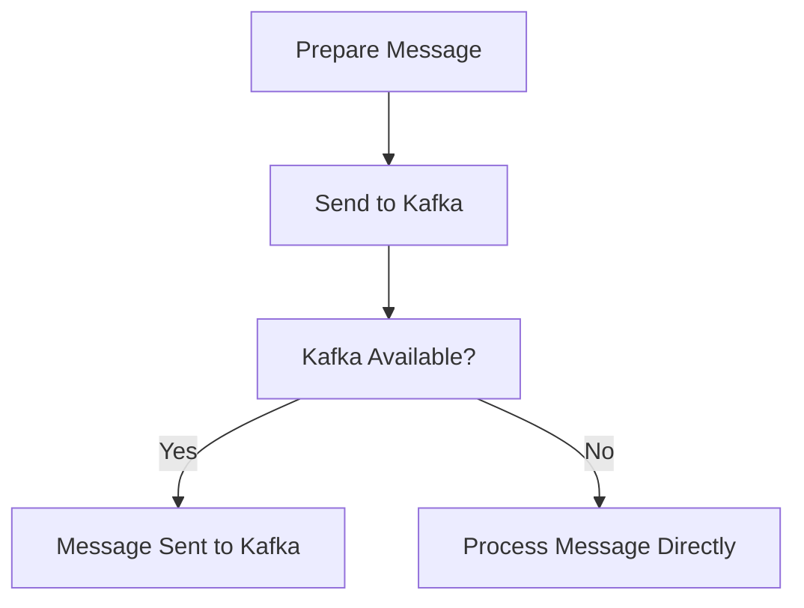

This document will cover the process of producing occurrences to Kafka, which includes:

1. Preparing the message
2. Sending the message to Kafka
3. Handling messages when Kafka is not available.

Technical document: <SwmLink doc-title="Producing Occurrences to Kafka">[Producing Occurrences to Kafka](/.swm/producing-occurrences-to-kafka.7zdkpkk9.sw.md)</SwmLink>

# [Preparing the Message](https://app.swimm.io/repos/Z2l0aHViJTNBJTNBc2VudHJ5LWRlbW8tMSUzQSUzQVN3aW1tLURlbW8=/docs/7zdkpkk9#producing-occurrence-to-kafka)

The process begins by preparing the message based on its type. There are two types of messages: occurrence and status change. For an occurrence, the message is prepared with relevant data such as the occurrence details and event data. For a status change, the message includes information about the status change. This step ensures that the message contains all necessary information before it is sent to Kafka.

# [Sending the Message to Kafka](https://app.swimm.io/repos/Z2l0aHViJTNBJTNBc2VudHJ5LWRlbW8tMSUzQSUzQVN3aW1tLURlbW8=/docs/7zdkpkk9#producing-occurrence-to-kafka)

Once the message is prepared, it is sent to the appropriate Kafka topic. Kafka topics are used to categorize and manage messages. The message is sent with a partition key if available, which helps in organizing the messages within Kafka. This step is crucial for ensuring that the message reaches the correct destination and can be processed efficiently.

# [Handling Messages When Kafka is Not Available](https://app.swimm.io/repos/Z2l0aHViJTNBJTNBc2VudHJ5LWRlbW8tMSUzQSUzQVN3aW1tLURlbW8=/docs/7zdkpkk9#producing-occurrence-to-kafka)

If Kafka is not available, the message is processed directly. This means that instead of sending the message to Kafka, the system handles it internally. This step ensures that messages are not lost and are processed even if Kafka is temporarily unavailable. It provides a fallback mechanism to maintain the reliability of the system.

&nbsp;

*This is an auto-generated document by Swimm AI 🌊 and has not yet been verified by a human*

<SwmMeta version="3.0.0" repo-id="Z2l0aHViJTNBJTNBc2VudHJ5LWRlbW8tMSUzQSUzQVN3aW1tLURlbW8=" repo-name="sentry-demo-1" doc-type="product-flows">Powered by [Swimm](/)</SwmMeta>
