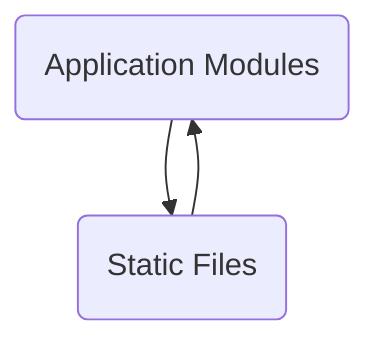

The repository 'sentry-demo-1' demonstrates how to use Sentry, a developer-first error tracking and performance monitoring platform, to identify and solve issues in applications.

## Main Components

### Application Modules

Application modules are distinct components within an application that encapsulate specific functionality or features. They help in organizing the codebase into manageable sections, making it easier to maintain and scale. Each module typically contains related code, such as models, views, and controllers, and can be independently developed and tested.

- <SwmLink doc-title="Authentication pipeline completion">[Authentication pipeline completion](.swm/authentication-pipeline-completion.x5364amq.sw.md)</SwmLink>
- <SwmLink doc-title="Backfilling seer grouping records">[Backfilling seer grouping records](.swm/backfilling-seer-grouping-records.97mjntgz.sw.md)</SwmLink>
- <SwmLink doc-title="Processing event statistics">[Processing event statistics](.swm/processing-event-statistics.ps470hdk.sw.md)</SwmLink>
- <SwmLink doc-title="Error tracking and performance monitoring">[Error tracking and performance monitoring](.swm/error-tracking-and-performance-monitoring.zl8a653y.sw.md)</SwmLink>
- **Flows**
  - <SwmLink doc-title="Handling slack events">[Handling slack events](.swm/handling-slack-events.a3rrt250.sw.md)</SwmLink>
  - <SwmLink doc-title="Constructing trend columns and handling query results">[Constructing trend columns and handling query results](.swm/constructing-trend-columns-and-handling-query-results.6i6ld8yg.sw.md)</SwmLink>
  - <SwmLink doc-title="Generating trending event statistics">[Generating trending event statistics](.swm/generating-trending-event-statistics.ar8qzmpa.sw.md)</SwmLink>
  - <SwmLink doc-title="Processing trending event statistics">[Processing trending event statistics](.swm/processing-trending-event-statistics.jo5g29ao.sw.md)</SwmLink>
  - <SwmLink doc-title="Fetching event statistics metrics">[Fetching event statistics metrics](.swm/fetching-event-statistics-metrics.3i2a0cup.sw.md)</SwmLink>
- **Flows**
  - <SwmLink doc-title="Producing occurrences to kafka">[Producing occurrences to kafka](.swm/producing-occurrences-to-kafka.gqyyu2pv.sw.md)</SwmLink>
  - <SwmLink doc-title="Overview of the save process">[Overview of the save process](.swm/overview-of-the-save-process.kngqeoc3.sw.md)</SwmLink>
  - <SwmLink doc-title="On demand metrics decision process">[On demand metrics decision process](.swm/on-demand-metrics-decision-process.v1de8eke.sw.md)</SwmLink>
  - <SwmLink doc-title="Handling missing values with resolve_weak">[Handling missing values with resolve_weak](.swm/handling-missing-values-with-resolve_weak.v9q4hsed.sw.md)</SwmLink>
  - <SwmLink doc-title="Querying replays with pagination">[Querying replays with pagination](.swm/querying-replays-with-pagination.vxx3qft8.sw.md)</SwmLink>
  - <SwmLink doc-title="Updating and creating widgets">[Updating and creating widgets](.swm/updating-and-creating-widgets.6u6w6iwm.sw.md)</SwmLink>
  - <SwmLink doc-title="Creating an alert rule trigger">[Creating an alert rule trigger](.swm/creating-an-alert-rule-trigger.0xcpwyk4.sw.md)</SwmLink>
  - <SwmLink doc-title="Comparing commits">[Comparing commits](.swm/comparing-commits.3ugc4gv1.sw.md)</SwmLink>
  - <SwmLink doc-title="Creating issue configurations without a group">[Creating issue configurations without a group](.swm/creating-issue-configurations-without-a-group.la9sp7gw.sw.md)</SwmLink>
  - <SwmLink doc-title="Processing occurrence groups">[Processing occurrence groups](.swm/processing-occurrence-groups.5jgzhau8.sw.md)</SwmLink>
  - <SwmLink doc-title="Updating an issue">[Updating an issue](.swm/updating-an-issue.rah44axx.sw.md)</SwmLink>
  - <SwmLink doc-title="Bulk mutating issue attributes">[Bulk mutating issue attributes](.swm/bulk-mutating-issue-attributes.pp6dtgih.sw.md)</SwmLink>
  - <SwmLink doc-title="Digest function overview">[Digest function overview](.swm/digest-function-overview.gz79de9p.sw.md)</SwmLink>
  - <SwmLink doc-title="Gathering health data for project releases">[Gathering health data for project releases](.swm/gathering-health-data-for-project-releases.6gaafjxs.sw.md)</SwmLink>
  - <SwmLink doc-title="Processing a single message flow">[Processing a single message flow](.swm/processing-a-single-message-flow.v9bne6ot.sw.md)</SwmLink>
  - <SwmLink doc-title="Handling check ins flow">[Handling check ins flow](.swm/handling-check-ins-flow.ly1x8ayv.sw.md)</SwmLink>
  - <SwmLink doc-title="Retrieving and updating repository data">[Retrieving and updating repository data](.swm/retrieving-and-updating-repository-data.y8722tap.sw.md)</SwmLink>
  - <SwmLink doc-title="Managing vsts subscriptions">[Managing vsts subscriptions](.swm/managing-vsts-subscriptions.kmpvwsc8.sw.md)</SwmLink>
  - <SwmLink doc-title="Synchronizing assignees">[Synchronizing assignees](.swm/synchronizing-assignees.e5kq0b6e.sw.md)</SwmLink>
  - <SwmLink doc-title="Retrieving and formatting issue details">[Retrieving and formatting issue details](.swm/retrieving-and-formatting-issue-details.7u0rfvtp.sw.md)</SwmLink>
  - <SwmLink doc-title="Using sentry for error tracking and performance monitoring">[Using sentry for error tracking and performance monitoring](.swm/using-sentry-for-error-tracking-and-performance-monitoring.hxtxso6l.sw.md)</SwmLink>
  - <SwmLink doc-title="Handling clock tasks">[Handling clock tasks](.swm/handling-clock-tasks.e3yvsfsi.sw.md)</SwmLink>
  - <SwmLink doc-title="Handling post requests for alert triggers">[Handling post requests for alert triggers](.swm/handling-post-requests-for-alert-triggers.hb76zlxp.sw.md)</SwmLink>
  - <SwmLink doc-title="Organization configuration flow">[Organization configuration flow](.swm/organization-configuration-flow.fy4h0k2z.sw.md)</SwmLink>
  - <SwmLink doc-title="Synchronizing external issue status">[Synchronizing external issue status](.swm/synchronizing-external-issue-status.20stsf1j.sw.md)</SwmLink>
  - <SwmLink doc-title="Post installation tasks">[Post installation tasks](.swm/post-installation-tasks.67o2vz3z.sw.md)</SwmLink>
  - <SwmLink doc-title="Creating an issue">[Creating an issue](.swm/creating-an-issue.vzo5wtik.sw.md)</SwmLink>
  - <SwmLink doc-title="Handling discord interactions">[Handling discord interactions](.swm/handling-discord-interactions.m87f7n20.sw.md)</SwmLink>
  - <SwmLink doc-title="Filtering unmigratable repositories">[Filtering unmigratable repositories](.swm/filtering-unmigratable-repositories.r5s7qmve.sw.md)</SwmLink>
  - <SwmLink doc-title="Determining issue resolution state">[Determining issue resolution state](.swm/determining-issue-resolution-state.mfdree1m.sw.md)</SwmLink>
  - <SwmLink doc-title="Checking repository access">[Checking repository access](.swm/checking-repository-access.l579ggpy.sw.md)</SwmLink>
  - <SwmLink doc-title="Dispatch process overview">[Dispatch process overview](.swm/dispatch-process-overview.z9luf1us.sw.md)</SwmLink>
  - <SwmLink doc-title="Build integration process">[Build integration process](.swm/build-integration-process.upn0si2q.sw.md)</SwmLink>
  - <SwmLink doc-title="Gathering release attributes">[Gathering release attributes](.swm/gathering-release-attributes.9dg21b6z.sw.md)</SwmLink>
  - <SwmLink doc-title="Using sentry for error tracking and performance monitoring">[Using sentry for error tracking and performance monitoring](.swm/using-sentry-for-error-tracking-and-performance-monitoring.pdbr5vcy.sw.md)</SwmLink>
  - <SwmLink doc-title="Creating and processing feedback issues">[Creating and processing feedback issues](.swm/creating-and-processing-feedback-issues.v0dn5f7r.sw.md)</SwmLink>
  - <SwmLink doc-title="Flow of retrieving and processing events and issues">[Flow of retrieving and processing events and issues](.swm/flow-of-retrieving-and-processing-events-and-issues.mb6xl43p.sw.md)</SwmLink>
  - <SwmLink doc-title="User registration and invitation acceptance flow">[User registration and invitation acceptance flow](.swm/user-registration-and-invitation-acceptance-flow.gw1fph7j.sw.md)</SwmLink>
  - <SwmLink doc-title="Synchronizing issue status with jira">[Synchronizing issue status with jira](.swm/synchronizing-issue-status-with-jira.z08azexj.sw.md)</SwmLink>
  - <SwmLink doc-title="Synchronizing sentry and jira issue status">[Synchronizing sentry and jira issue status](.swm/synchronizing-sentry-and-jira-issue-status.eo086h40.sw.md)</SwmLink>
  - <SwmLink doc-title="Gathering group attributes">[Gathering group attributes](.swm/gathering-group-attributes.tog9r8jg.sw.md)</SwmLink>
  - <SwmLink doc-title="Creating a comment in jira">[Creating a comment in jira](.swm/creating-a-comment-in-jira.23isz4o5.sw.md)</SwmLink>
  - <SwmLink doc-title="Creating an issue in jira">[Creating an issue in jira](.swm/creating-an-issue-in-jira.64a6ovwv.sw.md)</SwmLink>
  - <SwmLink doc-title="Handling authentication">[Handling authentication](.swm/handling-authentication.z58pibba.sw.md)</SwmLink>
  - <SwmLink doc-title="Jira server integration flow">[Jira server integration flow](.swm/jira-server-integration-flow.rhs6xu7b.sw.md)</SwmLink>
  - <SwmLink doc-title="Access token and webhook processing flow">[Access token and webhook processing flow](.swm/access-token-and-webhook-processing-flow.gwuupze6.sw.md)</SwmLink>
  - <SwmLink doc-title="Creating a comment on a jira issue">[Creating a comment on a jira issue](.swm/creating-a-comment-on-a-jira-issue.0y21n07o.sw.md)</SwmLink>
  - <SwmLink doc-title="Creating an issue">[Creating an issue](.swm/creating-an-issue.ekv42ef5.sw.md)</SwmLink>
  - <SwmLink doc-title="Handling oauth and webhook requests">[Handling oauth and webhook requests](.swm/handling-oauth-and-webhook-requests.4je6s8lr.sw.md)</SwmLink>
  - <SwmLink doc-title="Overview of the get_attrs function">[Overview of the get_attrs function](.swm/overview-of-the-get_attrs-function.bpr7hxpi.sw.md)</SwmLink>
  - <SwmLink doc-title="Handling metric operations">[Handling metric operations](.swm/handling-metric-operations.3oevzjd8.sw.md)</SwmLink>
  - <SwmLink doc-title="Creating a comment on an issue">[Creating a comment on an issue](.swm/creating-a-comment-on-an-issue.u57rm7vd.sw.md)</SwmLink>
  - <SwmLink doc-title="Authorizing a request">[Authorizing a request](.swm/authorizing-a-request.d51yi86z.sw.md)</SwmLink>
  - <SwmLink doc-title="Retrieving issue attributes">[Retrieving issue attributes](.swm/retrieving-issue-attributes.yn9izmtu.sw.md)</SwmLink>
  - <SwmLink doc-title="Initiating vsts subscription check">[Initiating vsts subscription check](.swm/initiating-vsts-subscription-check.ilz4hm4n.sw.md)</SwmLink>
  - <SwmLink doc-title="Repository validation process">[Repository validation process](.swm/repository-validation-process.ym7a5zsz.sw.md)</SwmLink>
  - <SwmLink doc-title="Identity retrieval and usage">[Identity retrieval and usage](.swm/identity-retrieval-and-usage.4jddfsm6.sw.md)</SwmLink>
  - <SwmLink doc-title="Creating a subscription and handling webhooks">[Creating a subscription and handling webhooks](.swm/creating-a-subscription-and-handling-webhooks.48ogg1rn.sw.md)</SwmLink>
  - <SwmLink doc-title="Updating release metadata">[Updating release metadata](.swm/updating-release-metadata.75bfpqy8.sw.md)</SwmLink>
  - <SwmLink doc-title="Creating a new release">[Creating a new release](.swm/creating-a-new-release.wdsdkrr7.sw.md)</SwmLink>
  - <SwmLink doc-title="Fetching and processing paginated data">[Fetching and processing paginated data](.swm/fetching-and-processing-paginated-data.aoe5byut.sw.md)</SwmLink>
  - <SwmLink doc-title="Calculating crash free rates">[Calculating crash free rates](.swm/calculating-crash-free-rates.i59le5b9.sw.md)</SwmLink>
  - <SwmLink doc-title="Bulk mutation of issues">[Bulk mutation of issues](.swm/bulk-mutation-of-issues.4tytk3jc.sw.md)</SwmLink>
  - <SwmLink doc-title="Bulk update and delete views flow">[Bulk update and delete views flow](.swm/bulk-update-and-delete-views-flow.4h5n6ufo.sw.md)</SwmLink>
  - <SwmLink doc-title="Issue resolution cleanup">[Issue resolution cleanup](.swm/issue-resolution-cleanup.z6vpcf8z.sw.md)</SwmLink>
  - <SwmLink doc-title="Event attribute collection and serialization">[Event attribute collection and serialization](.swm/event-attribute-collection-and-serialization.jjvm3dp1.sw.md)</SwmLink>
  - <SwmLink doc-title="Handling post requests">[Handling post requests](.swm/handling-post-requests.i6bo7nu5.sw.md)</SwmLink>
  - <SwmLink doc-title="Overview of the data_fn function">[Overview of the data_fn function](.swm/overview-of-the-data_fn-function.w8rsahbi.sw.md)</SwmLink>
  - <SwmLink doc-title="Handling search queries and retrieving replay data">[Handling search queries and retrieving replay data](.swm/handling-search-queries-and-retrieving-replay-data.ed6olpfd.sw.md)</SwmLink>
  - <SwmLink doc-title="Creating a new release">[Creating a new release](.swm/creating-a-new-release.e1fh1dvg.sw.md)</SwmLink>
  - <SwmLink doc-title="Flow of data function">[Flow of data function](.swm/flow-of-data-function.abuycdrt.sw.md)</SwmLink>
  - <SwmLink doc-title="Overview of query stats function">[Overview of query stats function](.swm/overview-of-query-stats-function.tlydxgwd.sw.md)</SwmLink>
  - <SwmLink doc-title="Using sentry for error tracking and performance monitoring">[Using sentry for error tracking and performance monitoring](.swm/using-sentry-for-error-tracking-and-performance-monitoring.w8zanh50.sw.md)</SwmLink>
  - <SwmLink doc-title="Notification sending process">[Notification sending process](.swm/notification-sending-process.o1hxto6l.sw.md)</SwmLink>
  - <SwmLink doc-title="Role of data_fn">[Role of data_fn](.swm/role-of-data_fn.5le1shmo.sw.md)</SwmLink>
  - <SwmLink doc-title="Retrieving release information">[Retrieving release information](.swm/retrieving-release-information.mz7pgan1.sw.md)</SwmLink>
  - <SwmLink doc-title="Retrieving and processing user reports">[Retrieving and processing user reports](.swm/retrieving-and-processing-user-reports.kthptvh1.sw.md)</SwmLink>
  - <SwmLink doc-title="Purpose of the validate function">[Purpose of the validate function](.swm/purpose-of-the-validate-function.lvjvzt1j.sw.md)</SwmLink>
  - <SwmLink doc-title="Handling discord commands">[Handling discord commands](.swm/handling-discord-commands.01uryw4o.sw.md)</SwmLink>
  - <SwmLink doc-title="Processing attachments and events">[Processing attachments and events](.swm/processing-attachments-and-events.no2zq9cx.sw.md)</SwmLink>
  - <SwmLink doc-title="Handling slack command requests">[Handling slack command requests](.swm/handling-slack-command-requests.vmd923qe.sw.md)</SwmLink>
  - <SwmLink doc-title="Handling message events">[Handling message events](.swm/handling-message-events.kmwnw6r2.sw.md)</SwmLink>
  - <SwmLink doc-title="Managing development services">[Managing development services](.swm/managing-development-services.tqvawnvf.sw.md)</SwmLink>
  - <SwmLink doc-title="Openai integration">[Openai integration](.swm/openai-integration.yhi1m1fy.sw.md)</SwmLink>
  - <SwmLink doc-title="Handling commits flow">[Handling commits flow](.swm/handling-commits-flow.tn69a7f0.sw.md)</SwmLink>
  - <SwmLink doc-title="Data fetching and analysis flow">[Data fetching and analysis flow](.swm/data-fetching-and-analysis-flow.9dh52lc3.sw.md)</SwmLink>
  - <SwmLink doc-title="Query execution flow">[Query execution flow](.swm/query-execution-flow.hride9kg.sw.md)</SwmLink>

### Static Files

Static files are assets that do not change during the execution of the application. They include resources like fonts, stylesheets, images, and scripts, which are served directly to the client without any server-side processing.

- **Flows**
  - <SwmLink doc-title="Formfield component overview">[Formfield component overview](.swm/formfield-component-overview.i7ztmoks.sw.md)</SwmLink>
  - <SwmLink doc-title="Field change notification and undo flow">[Field change notification and undo flow](.swm/field-change-notification-and-undo-flow.27q7le0m.sw.md)</SwmLink>
  - <SwmLink doc-title="Dashboard list overview">[Dashboard list overview](.swm/dashboard-list-overview.9shbglja.sw.md)</SwmLink>
  - <SwmLink doc-title="Fetching organization details">[Fetching organization details](.swm/fetching-organization-details.bq1t2jmf.sw.md)</SwmLink>
  - <SwmLink doc-title="Overview of configureintegration function">[Overview of configureintegration function](.swm/overview-of-configureintegration-function.zp801fgs.sw.md)</SwmLink>
  - <SwmLink doc-title="Managing code owner files">[Managing code owner files](.swm/managing-code-owner-files.51d4y2ve.sw.md)</SwmLink>
  - <SwmLink doc-title="Overview of usegenericdiscoverquery">[Overview of usegenericdiscoverquery](.swm/overview-of-usegenericdiscoverquery.4l6py2o6.sw.md)</SwmLink>
  - <SwmLink doc-title="Making event requests">[Making event requests](.swm/making-event-requests.q9sw0v8v.sw.md)</SwmLink>
  - <SwmLink doc-title="Query function flow">[Query function flow](.swm/query-function-flow.snxmxho7.sw.md)</SwmLink>
  - <SwmLink doc-title="Sudomodal component overview">[Sudomodal component overview](.swm/sudomodal-component-overview.3y62y4b5.sw.md)</SwmLink>
  - <SwmLink doc-title="Alert rule details flow">[Alert rule details flow](.swm/alert-rule-details-flow.b86v92f2.sw.md)</SwmLink>
  - <SwmLink doc-title="Querybatchnode overview">[Querybatchnode overview](.swm/querybatchnode-overview.oxgkhwmt.sw.md)</SwmLink>
  - <SwmLink doc-title="Query context menu feature">[Query context menu feature](.swm/query-context-menu-feature.mxr5a45y.sw.md)</SwmLink>
  - <SwmLink doc-title="Query handling process">[Query handling process](.swm/query-handling-process.pacmb0e2.sw.md)</SwmLink>
  - <SwmLink doc-title="Handling user actions">[Handling user actions](.swm/handling-user-actions.s729wn7i.sw.md)</SwmLink>
  - <SwmLink doc-title="Query batching process">[Query batching process](.swm/query-batching-process.9sbe68dn.sw.md)</SwmLink>

### Flows

- <SwmLink doc-title="Continuousprofileprovider overview">[Continuousprofileprovider overview](.swm/continuousprofileprovider-overview.pi6lxzt7.sw.md)</SwmLink>

&nbsp;

*This is an auto-generated document by Swimm AI 🌊 and has not yet been verified by a human*

<SwmMeta version="3.0.0" repo-id="Z2l0aHViJTNBJTNBc2VudHJ5LWRlbW8tMSUzQSUzQVN3aW1tLURlbW8=" repo-name="sentry-demo-1" doc-type="other">Powered by [Swimm](https://app.swimm.io/)</SwmMeta>
