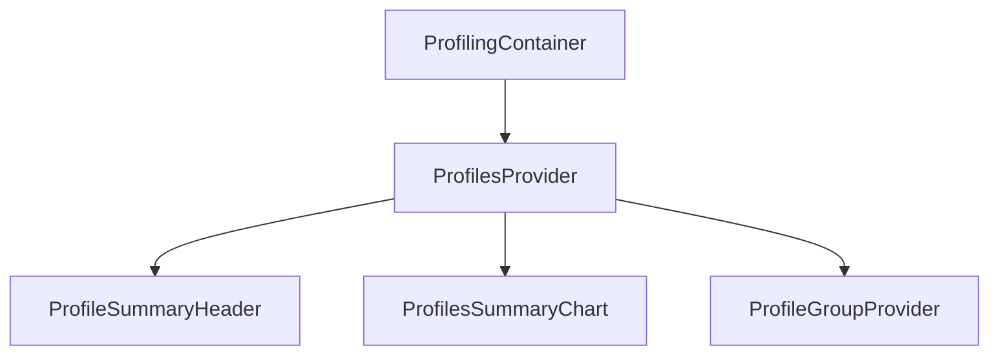

# What is Profiling in Views

Profiling refers to the process of collecting and analyzing performance data of an application to identify bottlenecks and optimize performance. In the Views section, profiling is implemented through various components and utilities that gather and display profiling data.

<SwmSnippet path="/static/app/views/profiling/index.tsx" line="14">

---

## <SwmToken path="static/app/views/profiling/index.tsx" pos="14:2:2" line-data="function ProfilingContainer({children}: Props) {">`ProfilingContainer`</SwmToken> Component

The <SwmToken path="static/app/views/profiling/index.tsx" pos="14:2:2" line-data="function ProfilingContainer({children}: Props) {">`ProfilingContainer`</SwmToken> component ensures that profiling features are only accessible to users with the appropriate permissions. It uses the <SwmToken path="static/app/views/profiling/index.tsx" pos="20:4:4" line-data="      features={profilingFeature}">`profilingFeature`</SwmToken> constant to check for the required permissions and renders an appropriate message if the user does not have access.

```tsx
function ProfilingContainer({children}: Props) {
  const organization = useOrganization();

  return (
    <Feature
      hookName="feature-disabled:profiling-page"
      features={profilingFeature}
      organization={organization}
      renderDisabled={() => (
        <Layout.Page withPadding>
          <Alert type="warning">{t("You don't have access to this feature")}</Alert>
        </Layout.Page>
      )}
    >
      <NoProjectMessage organization={organization}>{children}</NoProjectMessage>
    </Feature>
  );
}
```

---

</SwmSnippet>

<SwmSnippet path="/static/app/views/profiling/profilesProvider.tsx" line="135">

---

## <SwmToken path="static/app/views/profiling/profilesProvider.tsx" pos="99:2:2" line-data="    &lt;ProfilesProvider">`ProfilesProvider`</SwmToken> Component

The <SwmToken path="static/app/views/profiling/profilesProvider.tsx" pos="99:2:2" line-data="    &lt;ProfilesProvider">`ProfilesProvider`</SwmToken> component fetches profiling data, such as flamegraphs, and provides it to the rest of the application. It manages the state of the profiling data and handles the API calls to fetch the necessary information.

```tsx
}: ProfilesProviderProps) {
  const api = useApi();

  const [profiles, setProfiles] = useState<RequestState<Profiling.ProfileInput>>({
    type: 'initial',
  });

  useLayoutEffect(() => {
    if (!profileId || !projectSlug || !orgSlug) {
      return undefined;
    }

    setProfiles({type: 'loading'});

    fetchFlamegraphs(api, profileId, projectSlug, orgSlug)
      .then(p => {
        setProfiles({type: 'resolved', data: p});
        onUpdateProfiles?.({type: 'resolved', data: p});
      })
      .catch(err => {
        // XXX: our API client mock implementation does not mimick the real
```

---

</SwmSnippet>

<SwmSnippet path="/static/app/views/profiling/profileSummary/index.tsx" line="1">

---

## <SwmToken path="static/app/views/profiling/profileSummary/index.tsx" pos="70:15:15" line-data="import {ProfilesTable} from &#39;sentry/views/profiling/profileSummary/profilesTable&#39;;">`profileSummary`</SwmToken> Components

The <SwmToken path="static/app/views/profiling/profileSummary/index.tsx" pos="107:2:2" line-data="function ProfileSummaryHeader(props: ProfileSummaryHeaderProps) {">`ProfileSummaryHeader`</SwmToken> and <SwmToken path="static/app/views/profiling/profileSummary/index.tsx" pos="68:3:3" line-data="import {ProfilesSummaryChart} from &#39;sentry/views/profiling/landing/profilesSummaryChart&#39;;">`ProfilesSummaryChart`</SwmToken> components are used to display summarized profiling data, such as the slowest functions and profile durations. These components help in visualizing the profiling data in a user-friendly manner.

```tsx
import {useCallback, useEffect, useMemo, useState} from 'react';
import styled from '@emotion/styled';
import type {Location} from 'history';

import {Button, LinkButton} from 'sentry/components/button';
import {CompactSelect} from 'sentry/components/compactSelect';
import type {SelectOption} from 'sentry/components/compactSelect/types';
import Count from 'sentry/components/count';
import {DateTime} from 'sentry/components/dateTime';
import ErrorBoundary from 'sentry/components/errorBoundary';
import SearchBar from 'sentry/components/events/searchBar';
import FeedbackWidgetButton from 'sentry/components/feedback/widget/feedbackWidgetButton';
import IdBadge from 'sentry/components/idBadge';
import * as Layout from 'sentry/components/layouts/thirds';
import Link from 'sentry/components/links/link';
import LoadingIndicator from 'sentry/components/loadingIndicator';
```

---

</SwmSnippet>

<SwmSnippet path="/static/app/views/profiling/profilesProvider.tsx" line="1">

---

## <SwmToken path="static/app/views/profiling/profileSummary/index.tsx" pos="69:3:3" line-data="import {ProfileGroupProvider} from &#39;sentry/views/profiling/profileGroupProvider&#39;;">`ProfileGroupProvider`</SwmToken> Component

The <SwmToken path="static/app/views/profiling/profileSummary/index.tsx" pos="69:3:3" line-data="import {ProfileGroupProvider} from &#39;sentry/views/profiling/profileGroupProvider&#39;;">`ProfileGroupProvider`</SwmToken> component processes raw profiling data and makes it available to other components through context. This ensures that the profiling data is easily accessible throughout the application.

```tsx
import {createContext, useContext, useLayoutEffect, useState} from 'react';
import * as Sentry from '@sentry/react';

import type {Client} from 'sentry/api';
import {ProfileHeader} from 'sentry/components/profiling/profileHeader';
import {t} from 'sentry/locale';
import type {RequestState} from 'sentry/types/core';
import type {EventTransaction} from 'sentry/types/event';
import type {Organization} from 'sentry/types/organization';
import type {Project} from 'sentry/types/project';
import {isSchema, isSentrySampledProfile} from 'sentry/utils/profiling/guards/profile';
import {useSentryEvent} from 'sentry/utils/profiling/hooks/useSentryEvent';
import useApi from 'sentry/utils/useApi';
import useOrganization from 'sentry/utils/useOrganization';
import {useParams} from 'sentry/utils/useParams';
```

---

</SwmSnippet>

<SwmSnippet path="/static/app/views/profiling/content.tsx" line="308">

---

## <SwmToken path="static/app/views/profiling/content.tsx" pos="308:2:2" line-data="function ProfilingContent({location}: ProfilingContentProps) {">`ProfilingContent`</SwmToken> Function

The <SwmToken path="static/app/views/profiling/content.tsx" pos="308:2:2" line-data="function ProfilingContent({location}: ProfilingContentProps) {">`ProfilingContent`</SwmToken> function initializes profiling content by fetching organization and project data, setting up analytics tracking, and handling tab changes. It also determines whether to show the profiling onboarding panel based on the selected projects.

```tsx
function ProfilingContent({location}: ProfilingContentProps) {
  const organization = useOrganization();
  const {selection} = usePageFilters();
  const {projects} = useProjects();

  const tab = decodeTab(location.query.tab);

  useEffect(() => {
    trackAnalytics('profiling_views.landing', {
      organization,
    });
  }, [organization]);

  const onTabChange = useCallback(
    (newTab: 'flamegraph' | 'transactions') => {
      browserHistory.push({
        ...location,
        query: {
          ...location.query,
          tab: newTab,
        },
```

---

</SwmSnippet>

<SwmSnippet path="/static/app/views/profiling/content.tsx" line="65">

---

## <SwmToken path="static/app/views/profiling/content.tsx" pos="65:2:2" line-data="function ProfilingContentLegacy({location}: ProfilingContentProps) {">`ProfilingContentLegacy`</SwmToken> Function

The <SwmToken path="static/app/views/profiling/content.tsx" pos="65:2:2" line-data="function ProfilingContentLegacy({location}: ProfilingContentProps) {">`ProfilingContentLegacy`</SwmToken> function is similar to <SwmToken path="static/app/views/profiling/content.tsx" pos="308:2:2" line-data="function ProfilingContent({location}: ProfilingContentProps) {">`ProfilingContent`</SwmToken> but is used for legacy support. It fetches organization and project data, sets up analytics tracking, and handles search queries and onboarding clicks.

```tsx
function ProfilingContentLegacy({location}: ProfilingContentProps) {
  const organization = useOrganization();
  const {selection} = usePageFilters();
  const cursor = decodeScalar(location.query.cursor);
  const query = decodeScalar(location.query.query, '');

  const fields = ALL_FIELDS;

  const sort = formatSort<FieldType>(decodeScalar(location.query.sort), fields, {
    key: 'count()',
    order: 'desc',
  });

  const {projects} = useProjects();

  const transactions = useProfileEvents<FieldType>({
    cursor,
    fields,
    query,
    sort,
    referrer: 'api.profiling.landing-table',
```

---

</SwmSnippet>

## Profiling Endpoints

Profiling endpoints are used to retrieve and manage profiling data. Two key endpoints are <SwmToken path="static/app/views/profiling/profilesProvider.tsx" pos="17:2:2" line-data="function fetchFlamegraphs(">`fetchFlamegraphs`</SwmToken> and <SwmToken path="static/app/views/profiling/continuousProfileProvider.tsx" pos="23:2:2" line-data="function fetchContinuousProfileFlamegraph(">`fetchContinuousProfileFlamegraph`</SwmToken>.

<SwmSnippet path="/static/app/views/profiling/profilesProvider.tsx" line="17">

---

### <SwmToken path="static/app/views/profiling/profilesProvider.tsx" pos="17:2:2" line-data="function fetchFlamegraphs(">`fetchFlamegraphs`</SwmToken>

The <SwmToken path="static/app/views/profiling/profilesProvider.tsx" pos="17:2:2" line-data="function fetchFlamegraphs(">`fetchFlamegraphs`</SwmToken> function is an endpoint used to retrieve flamegraph data for a specific profiling event. It constructs a URL using the organization slug, project slug, and event ID, and makes a GET request to fetch the profiling data.

```tsx
function fetchFlamegraphs(
  api: Client,
  eventId: string,
  projectSlug: Project['slug'],
  orgSlug: Organization['slug']
): Promise<Profiling.ProfileInput> {
  return api
    .requestPromise(
      `/projects/${orgSlug}/${projectSlug}/profiling/profiles/${eventId}/`,
      {
        method: 'GET',
        includeAllArgs: true,
      }
    )
    .then(([data]) => data);
}
```

---

</SwmSnippet>

<SwmSnippet path="/static/app/views/profiling/continuousProfileProvider.tsx" line="23">

---

### <SwmToken path="static/app/views/profiling/continuousProfileProvider.tsx" pos="23:2:2" line-data="function fetchContinuousProfileFlamegraph(">`fetchContinuousProfileFlamegraph`</SwmToken>

The <SwmToken path="static/app/views/profiling/continuousProfileProvider.tsx" pos="23:2:2" line-data="function fetchContinuousProfileFlamegraph(">`fetchContinuousProfileFlamegraph`</SwmToken> function is an endpoint used to fetch continuous profiling data. It constructs a URL using the organization slug and query parameters, and makes a GET request to retrieve the profiling chunks.

```tsx
function fetchContinuousProfileFlamegraph(
  api: Client,
  query: ContinuousProfileQueryParams,
  projectSlug: Project['slug'],
  orgSlug: Organization['slug']
): Promise<Profiling.ProfileInput> {
  return api
    .requestPromise(`/organizations/${orgSlug}/profiling/chunks/`, {
      method: 'GET',
      query: {
        ...query,
        project: projectSlug,
      },
      includeAllArgs: true,
    })
    .then(([data]) => data.chunk);
```

---

</SwmSnippet>

## Profiling Data Flow

The data flow for profiling in views can be visualized as follows:



&nbsp;

*This is an auto-generated document by Swimm AI 🌊 and has not yet been verified by a human*

<SwmMeta version="3.0.0" repo-id="Z2l0aHViJTNBJTNBc2VudHJ5LWRlbW8tMSUzQSUzQVN3aW1tLURlbW8=" repo-name="sentry-demo-1" doc-type="overview"><sup>Powered by [Swimm](/)</sup></SwmMeta>
