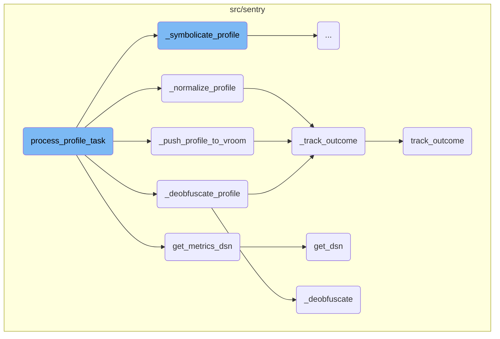
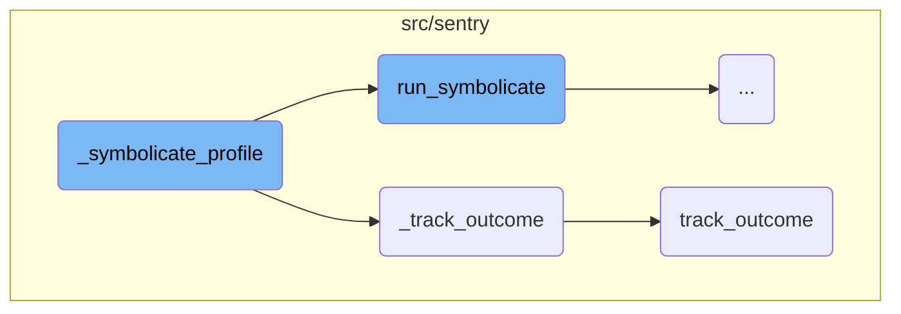
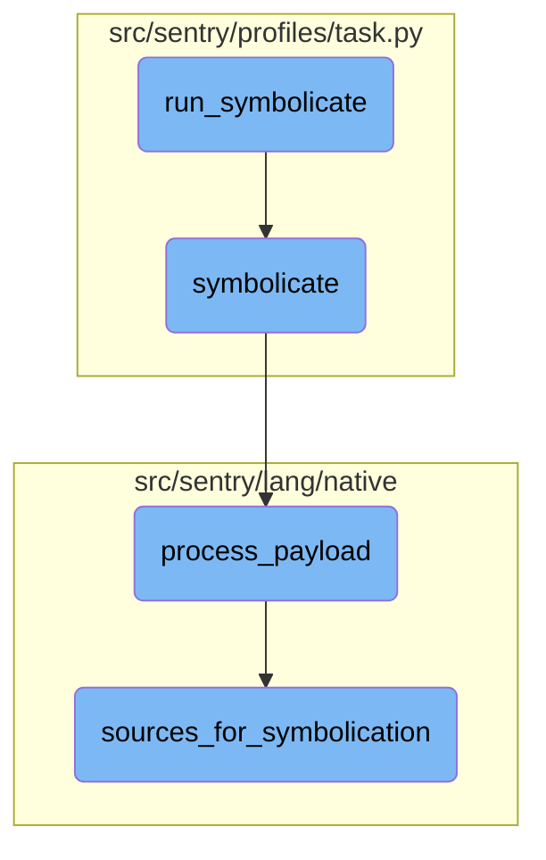

This document provides an overview of the <SwmToken path="src/sentry/profiles/task.py" pos="65:2:2" line-data="def process_profile_task(">`process_profile_task`</SwmToken> function, which orchestrates the profiling process. It includes steps such as checking if the profile is sampled, updating the profile with necessary metadata, performing symbolication, deobfuscation, normalization, pushing the profile to Vroom, and tracking the outcome.

The flow starts by checking if the profile should be sampled. If it should, the profile is updated with necessary information. Then, the profile goes through several steps: symbolication (translating addresses into human-readable names), deobfuscation (making the profile data understandable), and normalization (standardizing the data). After these steps, the profile is sent to Vroom for further processing. Finally, the outcome of the entire process is tracked to ensure everything went smoothly.

Here is a high level diagram of the flow, showing only the most important functions:

```mermaid
graph TD;
      subgraph src/sentry/profiles/task.py
c6d043b5793c5487e605d6b3a8c7c634e85c03ad0a8aa5f0382bfb001199ba99(process_profile_task):::mainFlowStyle --> f732a9273ab9a6942a156c49a721bafcef3a0e36c4f752fd0896bd382dd0dd0d(_deobfuscate_profile)
end

subgraph src/sentry/profiles/task.py
c6d043b5793c5487e605d6b3a8c7c634e85c03ad0a8aa5f0382bfb001199ba99(process_profile_task):::mainFlowStyle --> 8e8c137a998a250b32459f84268c113f3155dc01ebb56b6f86dbd15a32665ac9(get_metrics_dsn)
end

subgraph src/sentry/profiles/task.py
c6d043b5793c5487e605d6b3a8c7c634e85c03ad0a8aa5f0382bfb001199ba99(process_profile_task):::mainFlowStyle --> 19d8efd705eb056dba53f16107d955c495236b1114c4c031ac9067f4a0e94976(_push_profile_to_vroom)
end

subgraph src/sentry/profiles/task.py
c6d043b5793c5487e605d6b3a8c7c634e85c03ad0a8aa5f0382bfb001199ba99(process_profile_task):::mainFlowStyle --> 89866abd5fe111259e95e47ba7089660e7f1c35c0fe61bf947c2aa1222366153(_normalize_profile)
end

subgraph src/sentry/profiles/task.py
c6d043b5793c5487e605d6b3a8c7c634e85c03ad0a8aa5f0382bfb001199ba99(process_profile_task):::mainFlowStyle --> f3fc8bc849b8804226a5270a3655212def4a515c1d0264c9e8213a1af57e42bf(_symbolicate_profile):::mainFlowStyle
end

subgraph src/sentry/profiles/task.py
f3fc8bc849b8804226a5270a3655212def4a515c1d0264c9e8213a1af57e42bf(_symbolicate_profile):::mainFlowStyle --> c31f941f8470914b5dcf972469694eab7e4ffb8c674f9cef7ccf81d0552fde87(_track_outcome)
end

subgraph src/sentry/profiles/task.py
f3fc8bc849b8804226a5270a3655212def4a515c1d0264c9e8213a1af57e42bf(_symbolicate_profile):::mainFlowStyle --> 6478c0777478b774b9797797a9b2ef104efbd531187ee25bf7f28a403936aba8(run_symbolicate):::mainFlowStyle
end

subgraph src/sentry/profiles/task.py
6478c0777478b774b9797797a9b2ef104efbd531187ee25bf7f28a403936aba8(run_symbolicate):::mainFlowStyle --> 5839b8ca8d00c01147cb8dbe7fe5c0763351222a8b6da2f9f6ddeeab251e849c(symbolicate):::mainFlowStyle
end

subgraph src/sentry/lang/native
5839b8ca8d00c01147cb8dbe7fe5c0763351222a8b6da2f9f6ddeeab251e849c(symbolicate):::mainFlowStyle --> d3bf88030d979e3d2560b29cd64fa54f8fe7a4b23a64ca3ee433c02a40fa40da(process_payload):::mainFlowStyle
end

subgraph src/sentry/lang/native
d3bf88030d979e3d2560b29cd64fa54f8fe7a4b23a64ca3ee433c02a40fa40da(process_payload):::mainFlowStyle --> a242856e4c7f8c7142a60b06fd32a8167daff729bc9e60ef8822fc98824e3109(sources_for_symbolication):::mainFlowStyle
end


      classDef mainFlowStyle color:#000000,fill:#7CB9F4
classDef rootsStyle color:#000000,fill:#00FFF4
classDef Style1 color:#000000,fill:#00FFAA
classDef Style2 color:#000000,fill:#FFFF00
classDef Style3 color:#000000,fill:#AA7CB9

%% Swimm:
%% graph TD;
%%       subgraph <SwmPath>[src/sentry/profiles/task.py](src/sentry/profiles/task.py)</SwmPath>
%% c6d043b5793c5487e605d6b3a8c7c634e85c03ad0a8aa5f0382bfb001199ba99(process_profile_task):::mainFlowStyle --> f732a9273ab9a6942a156c49a721bafcef3a0e36c4f752fd0896bd382dd0dd0d(_deobfuscate_profile)
%% end
%% 
%% subgraph <SwmPath>[src/sentry/profiles/task.py](src/sentry/profiles/task.py)</SwmPath>
%% c6d043b5793c5487e605d6b3a8c7c634e85c03ad0a8aa5f0382bfb001199ba99(process_profile_task):::mainFlowStyle --> 8e8c137a998a250b32459f84268c113f3155dc01ebb56b6f86dbd15a32665ac9(get_metrics_dsn)
%% end
%% 
%% subgraph <SwmPath>[src/sentry/profiles/task.py](src/sentry/profiles/task.py)</SwmPath>
%% c6d043b5793c5487e605d6b3a8c7c634e85c03ad0a8aa5f0382bfb001199ba99(process_profile_task):::mainFlowStyle --> 19d8efd705eb056dba53f16107d955c495236b1114c4c031ac9067f4a0e94976(_push_profile_to_vroom)
%% end
%% 
%% subgraph <SwmPath>[src/sentry/profiles/task.py](src/sentry/profiles/task.py)</SwmPath>
%% c6d043b5793c5487e605d6b3a8c7c634e85c03ad0a8aa5f0382bfb001199ba99(process_profile_task):::mainFlowStyle --> 89866abd5fe111259e95e47ba7089660e7f1c35c0fe61bf947c2aa1222366153(_normalize_profile)
%% end
%% 
%% subgraph <SwmPath>[src/sentry/profiles/task.py](src/sentry/profiles/task.py)</SwmPath>
%% c6d043b5793c5487e605d6b3a8c7c634e85c03ad0a8aa5f0382bfb001199ba99(process_profile_task):::mainFlowStyle --> f3fc8bc849b8804226a5270a3655212def4a515c1d0264c9e8213a1af57e42bf(_symbolicate_profile):::mainFlowStyle
%% end
%% 
%% subgraph <SwmPath>[src/sentry/profiles/task.py](src/sentry/profiles/task.py)</SwmPath>
%% f3fc8bc849b8804226a5270a3655212def4a515c1d0264c9e8213a1af57e42bf(_symbolicate_profile):::mainFlowStyle --> c31f941f8470914b5dcf972469694eab7e4ffb8c674f9cef7ccf81d0552fde87(_track_outcome)
%% end
%% 
%% subgraph <SwmPath>[src/sentry/profiles/task.py](src/sentry/profiles/task.py)</SwmPath>
%% f3fc8bc849b8804226a5270a3655212def4a515c1d0264c9e8213a1af57e42bf(_symbolicate_profile):::mainFlowStyle --> 6478c0777478b774b9797797a9b2ef104efbd531187ee25bf7f28a403936aba8(run_symbolicate):::mainFlowStyle
%% end
%% 
%% subgraph <SwmPath>[src/sentry/profiles/task.py](src/sentry/profiles/task.py)</SwmPath>
%% 6478c0777478b774b9797797a9b2ef104efbd531187ee25bf7f28a403936aba8(run_symbolicate):::mainFlowStyle --> 5839b8ca8d00c01147cb8dbe7fe5c0763351222a8b6da2f9f6ddeeab251e849c(symbolicate):::mainFlowStyle
%% end
%% 
%% subgraph <SwmPath>[src/sentry/lang/native/](src/sentry/lang/native/)</SwmPath>
%% 5839b8ca8d00c01147cb8dbe7fe5c0763351222a8b6da2f9f6ddeeab251e849c(symbolicate):::mainFlowStyle --> d3bf88030d979e3d2560b29cd64fa54f8fe7a4b23a64ca3ee433c02a40fa40da(process_payload):::mainFlowStyle
%% end
%% 
%% subgraph <SwmPath>[src/sentry/lang/native/](src/sentry/lang/native/)</SwmPath>
%% d3bf88030d979e3d2560b29cd64fa54f8fe7a4b23a64ca3ee433c02a40fa40da(process_payload):::mainFlowStyle --> a242856e4c7f8c7142a60b06fd32a8167daff729bc9e60ef8822fc98824e3109(sources_for_symbolication):::mainFlowStyle
%% end
%% 
%% 
%%       classDef mainFlowStyle color:#000000,fill:#7CB9F4
%% classDef rootsStyle color:#000000,fill:#00FFF4
%% classDef Style1 color:#000000,fill:#00FFAA
%% classDef Style2 color:#000000,fill:#FFFF00
%% classDef Style3 color:#000000,fill:#AA7CB9
```



# Flow drill down

First, we'll zoom into this section of the flow:



<SwmSnippet path="/src/sentry/profiles/task.py" line="65">

---

## <SwmToken path="src/sentry/profiles/task.py" pos="65:2:2" line-data="def process_profile_task(">`process_profile_task`</SwmToken>

The <SwmToken path="src/sentry/profiles/task.py" pos="65:2:2" line-data="def process_profile_task(">`process_profile_task`</SwmToken> function orchestrates the profiling process. It starts by checking if the profile is sampled and updates the profile with necessary metadata. It then performs symbolication, deobfuscation, and normalization of the profile. Finally, it pushes the profile to Vroom for further processing and tracks the outcome.

```python
def process_profile_task(
    profile: Profile | None = None,
    payload: Any = None,
    sampled: bool = True,
    **kwargs: Any,
) -> None:
    if not sampled and not options.get("profiling.profile_metrics.unsampled_profiles.enabled"):
        return

    if payload:
        message_dict = msgpack.unpackb(payload, use_list=False)
        profile = json.loads(message_dict["payload"], use_rapid_json=True)

        assert profile is not None

        profile.update(
            {
                "organization_id": message_dict["organization_id"],
                "project_id": message_dict["project_id"],
                "received": message_dict["received"],
                "sampled": sampled,
```

---

</SwmSnippet>

<SwmSnippet path="/src/sentry/profiles/task.py" line="300">

---

## <SwmToken path="src/sentry/profiles/task.py" pos="300:2:2" line-data="def _deobfuscate_profile(profile: Profile, project: Project) -&gt; bool:">`_deobfuscate_profile`</SwmToken>

The <SwmToken path="src/sentry/profiles/task.py" pos="300:2:2" line-data="def _deobfuscate_profile(profile: Profile, project: Project) -&gt; bool:">`_deobfuscate_profile`</SwmToken> function checks if the profile needs deobfuscation and performs it if necessary. It updates the profile to indicate that deobfuscation has been completed and tracks the outcome in case of failure.

```python
def _deobfuscate_profile(profile: Profile, project: Project) -> bool:
    if not _should_deobfuscate(profile):
        return True

    with sentry_sdk.start_span(op="task.profiling.deobfuscate"):
        try:
            if "profile" not in profile or not profile["profile"]:
                metrics.incr(
                    "process_profile.missing_keys.profile",
                    tags={"platform": profile["platform"]},
                    sample_rate=1.0,
                )
                return True

            _deobfuscate(profile=profile, project=project)

            profile["deobfuscated"] = True
            return True
        except Exception as e:
            sentry_sdk.capture_exception(e)
            _track_outcome(
```

---

</SwmSnippet>

<SwmSnippet path="/src/sentry/profiles/task.py" line="1072">

---

## <SwmToken path="src/sentry/profiles/task.py" pos="1072:2:2" line-data="def get_metrics_dsn(project_id: int) -&gt; str:">`get_metrics_dsn`</SwmToken>

The <SwmToken path="src/sentry/profiles/task.py" pos="1072:2:2" line-data="def get_metrics_dsn(project_id: int) -&gt; str:">`get_metrics_dsn`</SwmToken> function retrieves the Data Source Name (DSN) for the given project. It ensures that the project key is created or retrieved and returns the DSN in a public format.

```python
def get_metrics_dsn(project_id: int) -> str:
    kwargs: _ProjectKeyKwargs = {"project_id": project_id, "use_case": UseCase.PROFILING.value}
    try:
        project_key, _ = ProjectKey.objects.get_or_create(**kwargs)
    except ProjectKey.MultipleObjectsReturned:
        # See https://docs.djangoproject.com/en/5.0/ref/models/querysets/#get-or-create
        project_key_first = ProjectKey.objects.filter(**kwargs).order_by("pk").first()
        assert project_key_first is not None
        project_key = project_key_first
    return project_key.get_dsn(public=True)
```

---

</SwmSnippet>

<SwmSnippet path="/src/sentry/profiles/task.py" line="1033">

---

## <SwmToken path="src/sentry/profiles/task.py" pos="1033:2:2" line-data="def _push_profile_to_vroom(profile: Profile, project: Project) -&gt; bool:">`_push_profile_to_vroom`</SwmToken>

The <SwmToken path="src/sentry/profiles/task.py" pos="1033:2:2" line-data="def _push_profile_to_vroom(profile: Profile, project: Project) -&gt; bool:">`_push_profile_to_vroom`</SwmToken> function attempts to insert the profile into Vroom. If the insertion fails, it tracks the outcome as invalid.

```python
def _push_profile_to_vroom(profile: Profile, project: Project) -> bool:
    if _insert_vroom_profile(profile=profile):
        return True
    _track_outcome(
        profile=profile,
        project=project,
        outcome=Outcome.INVALID,
        reason="profiling_failed_vroom_insertion",
    )
    return False
```

---

</SwmSnippet>

<SwmSnippet path="/src/sentry/profiles/task.py" line="329">

---

## <SwmToken path="src/sentry/profiles/task.py" pos="329:2:2" line-data="def _normalize_profile(profile: Profile, organization: Organization, project: Project) -&gt; bool:">`_normalize_profile`</SwmToken>

The <SwmToken path="src/sentry/profiles/task.py" pos="329:2:2" line-data="def _normalize_profile(profile: Profile, organization: Organization, project: Project) -&gt; bool:">`_normalize_profile`</SwmToken> function normalizes the profile data. It ensures that the profile is marked as normalized and tracks the outcome in case of failure.

```python
def _normalize_profile(profile: Profile, organization: Organization, project: Project) -> bool:
    if profile.get("normalized", False):
        return True

    with sentry_sdk.start_span(op="task.profiling.normalize"):
        try:
            _normalize(profile=profile, organization=organization)
            profile["normalized"] = True
            return True
        except Exception as e:
            sentry_sdk.capture_exception(e)
            _track_outcome(
                profile=profile,
                project=project,
                outcome=Outcome.INVALID,
                reason="profiling_failed_normalization",
            )
            return False
```

---

</SwmSnippet>

<SwmSnippet path="/src/sentry/profiles/task.py" line="974">

---

## <SwmToken path="src/sentry/profiles/task.py" pos="974:2:2" line-data="def _track_outcome(">`_track_outcome`</SwmToken>

The <SwmToken path="src/sentry/profiles/task.py" pos="974:2:2" line-data="def _track_outcome(">`_track_outcome`</SwmToken> function tracks the outcome of the profiling process. It calls the <SwmToken path="src/sentry/profiles/task.py" pos="980:1:1" line-data="    track_outcome(">`track_outcome`</SwmToken> function to log the outcome details such as organization ID, project ID, outcome type, and reason.

```python
def _track_outcome(
    profile: Profile,
    project: Project,
    outcome: Outcome,
    reason: str | None = None,
) -> None:
    track_outcome(
        org_id=project.organization_id,
        project_id=project.id,
        key_id=None,
        outcome=outcome,
        reason=reason,
        timestamp=datetime.now(timezone.utc),
        event_id=get_event_id(profile),
        category=get_data_category(profile),
        quantity=1,
    )
```

---

</SwmSnippet>

<SwmSnippet path="/src/sentry/utils/outcomes.py" line="40">

---

## <SwmToken path="src/sentry/utils/outcomes.py" pos="40:2:2" line-data="def track_outcome(">`track_outcome`</SwmToken>

The <SwmToken path="src/sentry/utils/outcomes.py" pos="40:2:2" line-data="def track_outcome(">`track_outcome`</SwmToken> function logs the outcome of an event to Kafka. It ensures that the outcome is tracked only once per event and sends the outcome message to Kafka, which is used by Snuba for metrics and analytics.

```python
def track_outcome(
    org_id: int,
    project_id: int,
    key_id: int | None,
    outcome: Outcome,
    reason: str | None = None,
    timestamp: datetime | None = None,
    event_id: str | None = None,
    category: DataCategory | None = None,
    quantity: int | None = None,
) -> None:
    """
    This is a central point to track org/project counters per incoming event.
    NB: This should only ever be called once per incoming event, which means
    it should only be called at the point we know the final outcome for the
    event (invalid, rate_limited, accepted, discarded, etc.)

    This sends the "outcome" message to Kafka which is used by Snuba to serve
    data for SnubaTSDB and RedisSnubaTSDB, such as # of rate-limited/filtered
    events.
    """
```

---

</SwmSnippet>

<SwmSnippet path="/src/sentry/models/projectkey.py" line="197">

---

## <SwmToken path="src/sentry/models/projectkey.py" pos="197:3:3" line-data="    def get_dsn(self, domain=None, secure=True, public=False):">`get_dsn`</SwmToken>

The <SwmToken path="src/sentry/models/projectkey.py" pos="197:3:3" line-data="    def get_dsn(self, domain=None, secure=True, public=False):">`get_dsn`</SwmToken> function constructs and returns the DSN for a project. It formats the DSN using the project's public and secret keys, ensuring that the DSN is valid and includes the necessary components.

```python
    def get_dsn(self, domain=None, secure=True, public=False):
        urlparts = urlparse(self.get_endpoint(public=public))

        if not public:
            key = f"{self.public_key}:{self.secret_key}"
        else:
            assert self.public_key is not None
            key = self.public_key

        # If we do not have a scheme or domain/hostname, dsn is never valid
        if not urlparts.netloc or not urlparts.scheme:
            return ""

        return "{}://{}@{}/{}".format(
            urlparts.scheme,
            key,
            urlparts.netloc + urlparts.path,
            self.project_id,
        )
```

---

</SwmSnippet>

<SwmSnippet path="/src/sentry/profiles/task.py" line="842">

---

## \_deobfuscate

The <SwmToken path="src/sentry/profiles/task.py" pos="842:2:2" line-data="def _deobfuscate(profile: Profile, project: Project) -&gt; None:">`_deobfuscate`</SwmToken> function performs the actual deobfuscation of the profile. It handles both local deobfuscation and deobfuscation using the symbolicator, updating the profile with the deobfuscated data.

```python
def _deobfuscate(profile: Profile, project: Project) -> None:
    debug_file_id = profile.get("build_id")
    if debug_file_id is None or debug_file_id == "":
        # we still need to decode signatures
        for m in profile["profile"]["methods"]:
            if m.get("signature"):
                types = deobfuscate_signature(m["signature"])
                m["signature"] = format_signature(types)
        return

    # We re-use this option as a deny list before we remove it completely.
    if project.id not in options.get("profiling.deobfuscate-using-symbolicator.enable-for-project"):
        try:
            with sentry_sdk.start_span(op="deobfuscate_with_symbolicator"):
                success = _deobfuscate_using_symbolicator(
                    project=project,
                    profile=profile,
                    debug_file_id=debug_file_id,
                )
                sentry_sdk.set_tag("deobfuscated_with_symbolicator_with_success", success)
                if success:
```

---

</SwmSnippet>

Now, lets zoom into this section of the flow:



<SwmSnippet path="/src/sentry/profiles/task.py" line="231">

---

## Symbolicating Profiles

The <SwmToken path="src/sentry/profiles/task.py" pos="231:2:2" line-data="def _symbolicate_profile(profile: Profile, project: Project) -&gt; bool:">`_symbolicate_profile`</SwmToken> function is responsible for symbolication of profiling data. It first checks if symbolication is necessary using <SwmToken path="src/sentry/profiles/task.py" pos="232:5:5" line-data="    if not _should_symbolicate(profile):">`_should_symbolicate`</SwmToken>. If not, it returns immediately. It then starts a Sentry span for profiling and checks for the presence of <SwmToken path="src/sentry/profiles/task.py" pos="237:4:4" line-data="            if &quot;debug_meta&quot; not in profile or not profile[&quot;debug_meta&quot;]:">`debug_meta`</SwmToken> in the profile. If <SwmToken path="src/sentry/profiles/task.py" pos="237:4:4" line-data="            if &quot;debug_meta&quot; not in profile or not profile[&quot;debug_meta&quot;]:">`debug_meta`</SwmToken> is missing, it logs a metric and returns. The function proceeds to gather debug images for each platform and prepares frames from the profile. It then calls <SwmToken path="src/sentry/profiles/task.py" pos="507:2:2" line-data="def run_symbolicate(">`run_symbolicate`</SwmToken> to perform the actual symbolication, merges the results back into the profile, and processes the symbolicator results if successful. If an exception occurs, it captures the exception, logs an error metric, and tracks the outcome as invalid.

```python
def _symbolicate_profile(profile: Profile, project: Project) -> bool:
    if not _should_symbolicate(profile):
        return True

    with sentry_sdk.start_span(op="task.profiling.symbolicate"):
        try:
            if "debug_meta" not in profile or not profile["debug_meta"]:
                metrics.incr(
                    "process_profile.missing_keys.debug_meta",
                    tags={"platform": profile["platform"]},
                    sample_rate=1.0,
                )
                return True

            platforms = get_profile_platforms(profile)
            original_images = profile["debug_meta"]["images"]
            images = dict()
            for platform in platforms:
                images[platform] = get_debug_images_for_platform(profile, platform)

            for platform in platforms:
```

---

</SwmSnippet>

Now, lets zoom into this section of the flow:



<SwmSnippet path="/src/sentry/profiles/task.py" line="507">

---

## Initiating Symbolication

The <SwmToken path="src/sentry/profiles/task.py" pos="507:2:2" line-data="def run_symbolicate(">`run_symbolicate`</SwmToken> function begins by recording the start time and defining a timeout handler. It then determines the appropriate symbolicator platform based on the provided platform.

```python
def run_symbolicate(
    project: Project,
    profile: Profile,
    modules: list[Any],
    stacktraces: list[Any],
    platform: str,
) -> tuple[list[Any], list[Any], bool]:
```

---

</SwmSnippet>

<SwmSnippet path="/src/sentry/profiles/task.py" line="516">

---

### Handling Symbolicator Request

The <SwmToken path="src/sentry/profiles/task.py" pos="516:3:3" line-data="    def on_symbolicator_request() -&gt; None:">`on_symbolicator_request`</SwmToken> function calculates the duration of the symbolication process and raises a <SwmToken path="src/sentry/profiles/task.py" pos="519:3:3" line-data="            raise SymbolicationTimeout">`SymbolicationTimeout`</SwmToken> if it exceeds the hard timeout limit.

```python
    def on_symbolicator_request() -> None:
        duration = time() - symbolication_start_time
        if duration > settings.SYMBOLICATOR_PROCESS_EVENT_HARD_TIMEOUT:
            raise SymbolicationTimeout
```

---

</SwmSnippet>

<SwmSnippet path="/src/sentry/profiles/task.py" line="521">

---

### Determining Symbolicator Platform

The function checks if the platform is in <SwmToken path="src/sentry/profiles/task.py" pos="521:7:7" line-data="    if platform in SHOULD_SYMBOLICATE_JS:">`SHOULD_SYMBOLICATE_JS`</SwmToken> to set the <SwmToken path="src/sentry/profiles/task.py" pos="522:1:1" line-data="        symbolicator_platform = SymbolicatorPlatform.js">`symbolicator_platform`</SwmToken> to <SwmToken path="src/sentry/profiles/task.py" pos="522:5:7" line-data="        symbolicator_platform = SymbolicatorPlatform.js">`SymbolicatorPlatform.js`</SwmToken>, otherwise it defaults to <SwmToken path="src/sentry/profiles/task.py" pos="524:5:7" line-data="        symbolicator_platform = SymbolicatorPlatform.native">`SymbolicatorPlatform.native`</SwmToken>.

```python
    if platform in SHOULD_SYMBOLICATE_JS:
        symbolicator_platform = SymbolicatorPlatform.js
    else:
        symbolicator_platform = SymbolicatorPlatform.native
```

---

</SwmSnippet>

<SwmSnippet path="/src/sentry/profiles/task.py" line="532">

---

## Invoking Symbolicate

The <SwmToken path="src/sentry/profiles/task.py" pos="507:2:2" line-data="def run_symbolicate(">`run_symbolicate`</SwmToken> function calls the <SwmToken path="src/sentry/profiles/task.py" pos="533:14:14" line-data="        with sentry_sdk.start_span(op=&quot;task.profiling.symbolicate.process_payload&quot;):">`symbolicate`</SwmToken> function with the appropriate parameters, including the symbolicator instance, profile, stacktraces, modules, and platform.

```python
    try:
        with sentry_sdk.start_span(op="task.profiling.symbolicate.process_payload"):
            response = symbolicate(
                symbolicator=symbolicator,
                profile=profile,
                stacktraces=stacktraces,
                modules=modules,
                platform=platform,
            )
```

---

</SwmSnippet>

<SwmSnippet path="/src/sentry/profiles/task.py" line="542">

---

## Handling Symbolicate Response

The function processes the response from <SwmToken path="src/sentry/profiles/task.py" pos="235:14:14" line-data="    with sentry_sdk.start_span(op=&quot;task.profiling.symbolicate&quot;):">`symbolicate`</SwmToken>. If the response is empty or indicates failure, it updates the profile with the appropriate error information. If the response is successful, it returns the updated modules and stacktraces.

```python
            if not response:
                profile["symbolicator_error"] = {
                    "type": EventError.NATIVE_INTERNAL_FAILURE,
                }
                return modules, stacktraces, False
            elif response["status"] == "completed":
                return (
                    response.get("modules", modules),
                    response.get("stacktraces", stacktraces),
                    True,
                )
            elif response["status"] == "failed":
                profile["symbolicator_error"] = {
                    "type": EventError.NATIVE_SYMBOLICATOR_FAILED,
                    "status": response.get("status"),
                    "message": response.get("message"),
                }
                return modules, stacktraces, False
            else:
                profile["symbolicator_error"] = {
                    "status": response.get("status"),
```

---

</SwmSnippet>

<SwmSnippet path="/src/sentry/profiles/task.py" line="566">

---

## Handling Symbolication Timeout

If a <SwmToken path="src/sentry/profiles/task.py" pos="566:3:3" line-data="    except SymbolicationTimeout:">`SymbolicationTimeout`</SwmToken> is raised, the function logs the timeout event and returns the unsymbolicated data to avoid further errors.

```python
    except SymbolicationTimeout:
        metrics.incr("process_profile.symbolicate.timeout", sample_rate=1.0)

    # returns the unsymbolicated data to avoid errors later
    return modules, stacktraces, False
```

---

</SwmSnippet>

&nbsp;

*This is an auto-generated document by Swimm AI 🌊 and has not yet been verified by a human*

<SwmMeta version="3.0.0" repo-id="Z2l0aHViJTNBJTNBc2VudHJ5LWRlbW8tMSUzQSUzQVN3aW1tLURlbW8=" repo-name="sentry-demo-1" doc-type="flows"><sup>Powered by [Swimm](/)</sup></SwmMeta>
