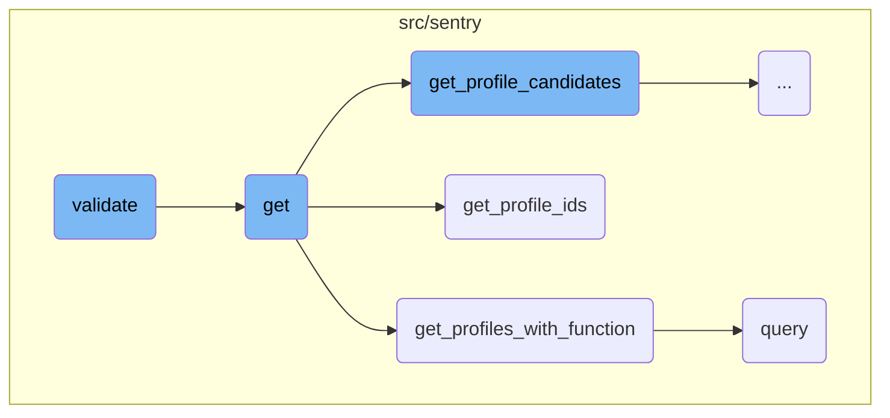
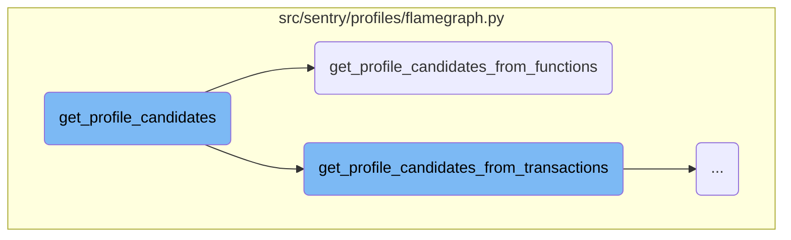

```mermaid
graph TD;
      subgraph src/sentry
3612ffdc6c588c4e037ddf31492fba536aa661ca9b3a11ae6d19456836ae7efe(get_profile_candidates_from_transactions):::mainFlowStyle --> 0855223e36ac882841bbf2e0ef2fb632f98281c9458dac000c15db12ffb5feef(run_query):::mainFlowStyle
end

subgraph src/sentry
0855223e36ac882841bbf2e0ef2fb632f98281c9458dac000c15db12ffb5feef(run_query):::mainFlowStyle --> bf51ad13267b0a966b2f78892bc9022bf6d0ea51971125b7eca85fe6a433e525(bulk_run_query):::mainFlowStyle
end

subgraph src/sentry
bf51ad13267b0a966b2f78892bc9022bf6d0ea51971125b7eca85fe6a433e525(bulk_run_query):::mainFlowStyle --> afa26eb3bcd732ed408aeef284bae8b24d15a01fc92344a09b40589f8d4801c0(_resolve_metrics_query):::mainFlowStyle
end

subgraph src/sentry
afa26eb3bcd732ed408aeef284bae8b24d15a01fc92344a09b40589f8d4801c0(_resolve_metrics_query):::mainFlowStyle --> 1d3614071269a61836ba62a83fa4234bce0f250a3733a501066af92cf030bc5a(_lookup_indexer_resolve)
end

subgraph src/sentry
afa26eb3bcd732ed408aeef284bae8b24d15a01fc92344a09b40589f8d4801c0(_resolve_metrics_query):::mainFlowStyle --> 6a277fe7c0cc01093d1b577ff3ab42c24481442497f437a04de3caa10040371d(_resolve_query_metadata):::mainFlowStyle
end

subgraph src/sentry
1d3614071269a61836ba62a83fa4234bce0f250a3733a501066af92cf030bc5a(_lookup_indexer_resolve) --> 9feba02f7a756e7911be847fa1baa7a3e1cd8bde3767144ba9c172f60dd737d0(_lookup_indexer_resolve_exp)
end


      classDef mainFlowStyle color:#000000,fill:#7CB9F4
classDef rootsStyle color:#000000,fill:#00FFF4
classDef Style1 color:#000000,fill:#00FFAA
classDef Style2 color:#000000,fill:#FFFF00
classDef Style3 color:#000000,fill:#AA7CB9

%% Swimm:
%% graph TD;
%%       subgraph <SwmPath>[src/sentry/](src/sentry/)</SwmPath>
%% 3612ffdc6c588c4e037ddf31492fba536aa661ca9b3a11ae6d19456836ae7efe(get_profile_candidates_from_transactions):::mainFlowStyle --> 0855223e36ac882841bbf2e0ef2fb632f98281c9458dac000c15db12ffb5feef(run_query):::mainFlowStyle
%% end
%% 
%% subgraph <SwmPath>[src/sentry/](src/sentry/)</SwmPath>
%% 0855223e36ac882841bbf2e0ef2fb632f98281c9458dac000c15db12ffb5feef(run_query):::mainFlowStyle --> bf51ad13267b0a966b2f78892bc9022bf6d0ea51971125b7eca85fe6a433e525(bulk_run_query):::mainFlowStyle
%% end
%% 
%% subgraph <SwmPath>[src/sentry/](src/sentry/)</SwmPath>
%% bf51ad13267b0a966b2f78892bc9022bf6d0ea51971125b7eca85fe6a433e525(bulk_run_query):::mainFlowStyle --> afa26eb3bcd732ed408aeef284bae8b24d15a01fc92344a09b40589f8d4801c0(_resolve_metrics_query):::mainFlowStyle
%% end
%% 
%% subgraph <SwmPath>[src/sentry/](src/sentry/)</SwmPath>
%% afa26eb3bcd732ed408aeef284bae8b24d15a01fc92344a09b40589f8d4801c0(_resolve_metrics_query):::mainFlowStyle --> 1d3614071269a61836ba62a83fa4234bce0f250a3733a501066af92cf030bc5a(_lookup_indexer_resolve)
%% end
%% 
%% subgraph <SwmPath>[src/sentry/](src/sentry/)</SwmPath>
%% afa26eb3bcd732ed408aeef284bae8b24d15a01fc92344a09b40589f8d4801c0(_resolve_metrics_query):::mainFlowStyle --> 6a277fe7c0cc01093d1b577ff3ab42c24481442497f437a04de3caa10040371d(_resolve_query_metadata):::mainFlowStyle
%% end
%% 
%% subgraph <SwmPath>[src/sentry/](src/sentry/)</SwmPath>
%% 1d3614071269a61836ba62a83fa4234bce0f250a3733a501066af92cf030bc5a(_lookup_indexer_resolve) --> 9feba02f7a756e7911be847fa1baa7a3e1cd8bde3767144ba9c172f60dd737d0(_lookup_indexer_resolve_exp)
%% end
%% 
%% 
%%       classDef mainFlowStyle color:#000000,fill:#7CB9F4
%% classDef rootsStyle color:#000000,fill:#00FFF4
%% classDef Style1 color:#000000,fill:#00FFAA
%% classDef Style2 color:#000000,fill:#FFFF00
%% classDef Style3 color:#000000,fill:#AA7CB9
```

This document explains the purpose and functionality of the <SwmToken path="src/sentry/api/endpoints/organization_profiling_profiles.py" pos="40:3:3" line-data="    def validate(self, attrs):">`validate`</SwmToken> function. The <SwmToken path="src/sentry/api/endpoints/organization_profiling_profiles.py" pos="40:3:3" line-data="    def validate(self, attrs):">`validate`</SwmToken> function ensures that the <SwmToken path="src/sentry/api/endpoints/organization_profiling_profiles.py" pos="40:8:8" line-data="    def validate(self, attrs):">`attrs`</SwmToken> dictionary contains a valid <SwmToken path="src/sentry/api/endpoints/organization_profiling_profiles.py" pos="41:10:10" line-data="        source = attrs.get(&quot;dataSource&quot;)">`dataSource`</SwmToken> and assigns default values based on certain conditions.

The <SwmToken path="src/sentry/api/endpoints/organization_profiling_profiles.py" pos="40:3:3" line-data="    def validate(self, attrs):">`validate`</SwmToken> function checks if the <SwmToken path="src/sentry/api/endpoints/organization_profiling_profiles.py" pos="41:10:10" line-data="        source = attrs.get(&quot;dataSource&quot;)">`dataSource`</SwmToken> is provided in the <SwmToken path="src/sentry/api/endpoints/organization_profiling_profiles.py" pos="40:8:8" line-data="    def validate(self, attrs):">`attrs`</SwmToken> dictionary. If not, it assigns a default value based on whether a <SwmToken path="src/sentry/api/endpoints/organization_profiling_profiles.py" pos="44:8:8" line-data="            if attrs.get(&quot;fingerprint&quot;) is not None:">`fingerprint`</SwmToken> is present. If the <SwmToken path="src/sentry/api/endpoints/organization_profiling_profiles.py" pos="41:10:10" line-data="        source = attrs.get(&quot;dataSource&quot;)">`dataSource`</SwmToken> is 'functions', it ensures the <SwmToken path="src/sentry/api/endpoints/organization_profiling_profiles.py" pos="44:8:8" line-data="            if attrs.get(&quot;fingerprint&quot;) is not None:">`fingerprint`</SwmToken> is valid. If the <SwmToken path="src/sentry/api/endpoints/organization_profiling_profiles.py" pos="41:10:10" line-data="        source = attrs.get(&quot;dataSource&quot;)">`dataSource`</SwmToken> is 'profiles', it sets it accordingly. Otherwise, it defaults to 'transactions'. This function helps maintain the integrity of the data being processed.

Here is a high level diagram of the flow, showing only the most important functions:

```mermaid
graph TD;
      subgraph src/sentry
0afa75868d2e5b649db396e13613287d7c2f879f99118ce022fe74ed11ab77da(validate):::mainFlowStyle --> b6c9d90cb44c633e93d110478d0bc0fffdab43b2f2372a324daf24081e3077e3(get):::mainFlowStyle
end

subgraph src/sentry
b6c9d90cb44c633e93d110478d0bc0fffdab43b2f2372a324daf24081e3077e3(get):::mainFlowStyle --> 270aef090f6deb0571a3b4fb349fcd5ca0362d19fa899a8d29b6092843d3161b(get_profiles_with_function)
end

subgraph src/sentry
b6c9d90cb44c633e93d110478d0bc0fffdab43b2f2372a324daf24081e3077e3(get):::mainFlowStyle --> 656e3869efbf623dada930412a948f19e55f19e1fe6ae6d8fdd29463db778cb2(get_profile_ids)
end

subgraph src/sentry
b6c9d90cb44c633e93d110478d0bc0fffdab43b2f2372a324daf24081e3077e3(get):::mainFlowStyle --> 1dce89c0af88a676804f85b868620772faaf5231168a1f6d7c9e92a560ec0c7d(get_profile_candidates):::mainFlowStyle
end

subgraph src/sentry
1dce89c0af88a676804f85b868620772faaf5231168a1f6d7c9e92a560ec0c7d(get_profile_candidates):::mainFlowStyle --> eaa2dc168ec007e95297e96e93bd11136eed710850b3789098e92d03cbefa877(get_profile_candidates_from_functions)
end

subgraph src/sentry
1dce89c0af88a676804f85b868620772faaf5231168a1f6d7c9e92a560ec0c7d(get_profile_candidates):::mainFlowStyle --> 3612ffdc6c588c4e037ddf31492fba536aa661ca9b3a11ae6d19456836ae7efe(get_profile_candidates_from_transactions):::mainFlowStyle
end

subgraph src/sentry
3612ffdc6c588c4e037ddf31492fba536aa661ca9b3a11ae6d19456836ae7efe(get_profile_candidates_from_transactions):::mainFlowStyle --> 0855223e36ac882841bbf2e0ef2fb632f98281c9458dac000c15db12ffb5feef(run_query):::mainFlowStyle
end

subgraph src/sentry
0855223e36ac882841bbf2e0ef2fb632f98281c9458dac000c15db12ffb5feef(run_query):::mainFlowStyle --> bf51ad13267b0a966b2f78892bc9022bf6d0ea51971125b7eca85fe6a433e525(bulk_run_query):::mainFlowStyle
end

subgraph src/sentry
bf51ad13267b0a966b2f78892bc9022bf6d0ea51971125b7eca85fe6a433e525(bulk_run_query):::mainFlowStyle --> afa26eb3bcd732ed408aeef284bae8b24d15a01fc92344a09b40589f8d4801c0(_resolve_metrics_query):::mainFlowStyle
end

subgraph src/sentry
afa26eb3bcd732ed408aeef284bae8b24d15a01fc92344a09b40589f8d4801c0(_resolve_metrics_query):::mainFlowStyle --> 1d3614071269a61836ba62a83fa4234bce0f250a3733a501066af92cf030bc5a(_lookup_indexer_resolve)
end

subgraph src/sentry
afa26eb3bcd732ed408aeef284bae8b24d15a01fc92344a09b40589f8d4801c0(_resolve_metrics_query):::mainFlowStyle --> 6a277fe7c0cc01093d1b577ff3ab42c24481442497f437a04de3caa10040371d(_resolve_query_metadata):::mainFlowStyle
end


      classDef mainFlowStyle color:#000000,fill:#7CB9F4
classDef rootsStyle color:#000000,fill:#00FFF4
classDef Style1 color:#000000,fill:#00FFAA
classDef Style2 color:#000000,fill:#FFFF00
classDef Style3 color:#000000,fill:#AA7CB9

%% Swimm:
%% graph TD;
%%       subgraph <SwmPath>[src/sentry/](src/sentry/)</SwmPath>
%% 0afa75868d2e5b649db396e13613287d7c2f879f99118ce022fe74ed11ab77da(validate):::mainFlowStyle --> b6c9d90cb44c633e93d110478d0bc0fffdab43b2f2372a324daf24081e3077e3(get):::mainFlowStyle
%% end
%% 
%% subgraph <SwmPath>[src/sentry/](src/sentry/)</SwmPath>
%% b6c9d90cb44c633e93d110478d0bc0fffdab43b2f2372a324daf24081e3077e3(get):::mainFlowStyle --> 270aef090f6deb0571a3b4fb349fcd5ca0362d19fa899a8d29b6092843d3161b(get_profiles_with_function)
%% end
%% 
%% subgraph <SwmPath>[src/sentry/](src/sentry/)</SwmPath>
%% b6c9d90cb44c633e93d110478d0bc0fffdab43b2f2372a324daf24081e3077e3(get):::mainFlowStyle --> 656e3869efbf623dada930412a948f19e55f19e1fe6ae6d8fdd29463db778cb2(get_profile_ids)
%% end
%% 
%% subgraph <SwmPath>[src/sentry/](src/sentry/)</SwmPath>
%% b6c9d90cb44c633e93d110478d0bc0fffdab43b2f2372a324daf24081e3077e3(get):::mainFlowStyle --> 1dce89c0af88a676804f85b868620772faaf5231168a1f6d7c9e92a560ec0c7d(get_profile_candidates):::mainFlowStyle
%% end
%% 
%% subgraph <SwmPath>[src/sentry/](src/sentry/)</SwmPath>
%% 1dce89c0af88a676804f85b868620772faaf5231168a1f6d7c9e92a560ec0c7d(get_profile_candidates):::mainFlowStyle --> eaa2dc168ec007e95297e96e93bd11136eed710850b3789098e92d03cbefa877(get_profile_candidates_from_functions)
%% end
%% 
%% subgraph <SwmPath>[src/sentry/](src/sentry/)</SwmPath>
%% 1dce89c0af88a676804f85b868620772faaf5231168a1f6d7c9e92a560ec0c7d(get_profile_candidates):::mainFlowStyle --> 3612ffdc6c588c4e037ddf31492fba536aa661ca9b3a11ae6d19456836ae7efe(get_profile_candidates_from_transactions):::mainFlowStyle
%% end
%% 
%% subgraph <SwmPath>[src/sentry/](src/sentry/)</SwmPath>
%% 3612ffdc6c588c4e037ddf31492fba536aa661ca9b3a11ae6d19456836ae7efe(get_profile_candidates_from_transactions):::mainFlowStyle --> 0855223e36ac882841bbf2e0ef2fb632f98281c9458dac000c15db12ffb5feef(run_query):::mainFlowStyle
%% end
%% 
%% subgraph <SwmPath>[src/sentry/](src/sentry/)</SwmPath>
%% 0855223e36ac882841bbf2e0ef2fb632f98281c9458dac000c15db12ffb5feef(run_query):::mainFlowStyle --> bf51ad13267b0a966b2f78892bc9022bf6d0ea51971125b7eca85fe6a433e525(bulk_run_query):::mainFlowStyle
%% end
%% 
%% subgraph <SwmPath>[src/sentry/](src/sentry/)</SwmPath>
%% bf51ad13267b0a966b2f78892bc9022bf6d0ea51971125b7eca85fe6a433e525(bulk_run_query):::mainFlowStyle --> afa26eb3bcd732ed408aeef284bae8b24d15a01fc92344a09b40589f8d4801c0(_resolve_metrics_query):::mainFlowStyle
%% end
%% 
%% subgraph <SwmPath>[src/sentry/](src/sentry/)</SwmPath>
%% afa26eb3bcd732ed408aeef284bae8b24d15a01fc92344a09b40589f8d4801c0(_resolve_metrics_query):::mainFlowStyle --> 1d3614071269a61836ba62a83fa4234bce0f250a3733a501066af92cf030bc5a(_lookup_indexer_resolve)
%% end
%% 
%% subgraph <SwmPath>[src/sentry/](src/sentry/)</SwmPath>
%% afa26eb3bcd732ed408aeef284bae8b24d15a01fc92344a09b40589f8d4801c0(_resolve_metrics_query):::mainFlowStyle --> 6a277fe7c0cc01093d1b577ff3ab42c24481442497f437a04de3caa10040371d(_resolve_query_metadata):::mainFlowStyle
%% end
%% 
%% 
%%       classDef mainFlowStyle color:#000000,fill:#7CB9F4
%% classDef rootsStyle color:#000000,fill:#00FFF4
%% classDef Style1 color:#000000,fill:#00FFAA
%% classDef Style2 color:#000000,fill:#FFFF00
%% classDef Style3 color:#000000,fill:#AA7CB9
```



# Flow drill down

First, we'll zoom into this section of the flow:



<SwmSnippet path="/src/sentry/api/endpoints/organization_profiling_profiles.py" line="40">

---

## Validate Function

The <SwmToken path="src/sentry/api/endpoints/organization_profiling_profiles.py" pos="40:3:3" line-data="    def validate(self, attrs):">`validate`</SwmToken> function is responsible for ensuring that the <SwmToken path="src/sentry/api/endpoints/organization_profiling_profiles.py" pos="40:8:8" line-data="    def validate(self, attrs):">`attrs`</SwmToken> dictionary contains a valid <SwmToken path="src/sentry/api/endpoints/organization_profiling_profiles.py" pos="41:10:10" line-data="        source = attrs.get(&quot;dataSource&quot;)">`dataSource`</SwmToken>. It checks if the <SwmToken path="src/sentry/api/endpoints/organization_profiling_profiles.py" pos="41:10:10" line-data="        source = attrs.get(&quot;dataSource&quot;)">`dataSource`</SwmToken> is provided and assigns a default value based on the presence of a <SwmToken path="src/sentry/api/endpoints/organization_profiling_profiles.py" pos="44:8:8" line-data="            if attrs.get(&quot;fingerprint&quot;) is not None:">`fingerprint`</SwmToken>. If the <SwmToken path="src/sentry/api/endpoints/organization_profiling_profiles.py" pos="41:10:10" line-data="        source = attrs.get(&quot;dataSource&quot;)">`dataSource`</SwmToken> is 'functions', it ensures that the <SwmToken path="src/sentry/api/endpoints/organization_profiling_profiles.py" pos="44:8:8" line-data="            if attrs.get(&quot;fingerprint&quot;) is not None:">`fingerprint`</SwmToken> is valid. If the <SwmToken path="src/sentry/api/endpoints/organization_profiling_profiles.py" pos="41:10:10" line-data="        source = attrs.get(&quot;dataSource&quot;)">`dataSource`</SwmToken> is 'profiles', it sets it accordingly. Otherwise, it defaults to 'transactions'. This function helps maintain the integrity of the data being processed.

```python
    def validate(self, attrs):
        source = attrs.get("dataSource")

        if source is None:
            if attrs.get("fingerprint") is not None:
                attrs["dataSource"] = "functions"
            else:
                attrs["dataSource"] = "transactions"
        elif source == "functions":
            attrs["dataSource"] = "functions"
        elif attrs.get("fingerprint") is not None:
            raise ParseError(
                detail='"fingerprint" is only permitted when using dataSource: "functions"'
            )
        elif source == "profiles":
            attrs["dataSource"] = "profiles"
        else:
            attrs["dataSource"] = "transactions"

        return attrs
```

---

</SwmSnippet>

<SwmSnippet path="/src/sentry/api/endpoints/organization_profiling_profiles.py" line="64">

---

## Get Function

The <SwmToken path="src/sentry/api/endpoints/organization_profiling_profiles.py" pos="64:3:3" line-data="    def get(self, request: Request, organization: Organization) -&gt; HttpResponse:">`get`</SwmToken> function handles the retrieval of profiling data for an organization. It first checks if the profiling feature is enabled for the organization. Depending on the presence of a <SwmToken path="src/sentry/api/endpoints/organization_profiling_profiles.py" pos="77:10:10" line-data="            if request.query_params.get(&quot;fingerprint&quot;):">`fingerprint`</SwmToken> in the request, it either calls <SwmToken path="src/sentry/api/endpoints/organization_profiling_profiles.py" pos="81:5:5" line-data="                profile_ids = get_profiles_with_function(">`get_profiles_with_function`</SwmToken> or <SwmToken path="src/sentry/profiles/flamegraph.py" pos="45:2:2" line-data="def get_profile_ids(">`get_profile_ids`</SwmToken> to fetch the relevant profile <SwmToken path="src/sentry/utils/snuba.py" pos="611:1:1" line-data="    ids = [set(get_related_project_ids(k, filter_keys[k])) for k in filter_keys]">`ids`</SwmToken>. Finally, it proxies the request to the profiling service to generate a flamegraph. This function orchestrates the flow of data retrieval and ensures that the correct profiling data is fetched based on the request parameters.

```python
    def get(self, request: Request, organization: Organization) -> HttpResponse:
        if not features.has("organizations:profiling", organization, actor=request.user):
            return Response(status=404)

        if not features.has(
            "organizations:continuous-profiling-compat", organization, actor=request.user
        ):
            snuba_params = self.get_snuba_params(request, organization)

            project_ids = snuba_params.project_ids
            if len(project_ids) > 1:
                raise ParseError(detail="You cannot get a flamegraph from multiple projects.")

            if request.query_params.get("fingerprint"):
                sentry_sdk.set_tag("data source", "functions")
                function_fingerprint = int(request.query_params["fingerprint"])

                profile_ids = get_profiles_with_function(
                    organization.id,
                    project_ids[0],
                    function_fingerprint,
```

---

</SwmSnippet>

<SwmSnippet path="/src/sentry/profiles/flamegraph.py" line="70">

---

### Get Profiles with Function

The <SwmToken path="src/sentry/profiles/flamegraph.py" pos="70:2:2" line-data="def get_profiles_with_function(">`get_profiles_with_function`</SwmToken> function retrieves profile <SwmToken path="src/sentry/utils/snuba.py" pos="611:1:1" line-data="    ids = [set(get_related_project_ids(k, filter_keys[k])) for k in filter_keys]">`ids`</SwmToken> that match a specific function fingerprint. It constructs a query with the given conditions and executes it using the <SwmToken path="src/sentry/profiles/flamegraph.py" pos="79:5:7" line-data="    result = functions.query(">`functions.query`</SwmToken> method. The results are processed to extract unique profile <SwmToken path="src/sentry/utils/snuba.py" pos="611:1:1" line-data="    ids = [set(get_related_project_ids(k, filter_keys[k])) for k in filter_keys]">`ids`</SwmToken>, which are then returned. This function is crucial for fetching profiles that are associated with a particular function, enabling targeted profiling analysis.

```python
def get_profiles_with_function(
    organization_id: int,
    project_id: int,
    function_fingerprint: int,
    snuba_params: SnubaParams,
    query: str,
) -> ProfileIds:
    conditions = [query, f"fingerprint:{function_fingerprint}"]

    result = functions.query(
        selected_columns=["timestamp", "unique_examples()"],
        query=" ".join(cond for cond in conditions if cond),
        snuba_params=snuba_params,
        limit=100,
        orderby=["-timestamp"],
        referrer=Referrer.API_PROFILING_FUNCTION_SCOPED_FLAMEGRAPH.value,
        auto_aggregations=True,
        use_aggregate_conditions=True,
        transform_alias_to_input_format=True,
    )

```

---

</SwmSnippet>

<SwmSnippet path="/src/sentry/profiles/flamegraph.py" line="45">

---

### Get Profile <SwmToken path="src/sentry/utils/snuba.py" pos="611:1:1" line-data="    ids = [set(get_related_project_ids(k, filter_keys[k])) for k in filter_keys]">`ids`</SwmToken>

The <SwmToken path="src/sentry/profiles/flamegraph.py" pos="45:2:2" line-data="def get_profile_ids(">`get_profile_ids`</SwmToken> function retrieves profile <SwmToken path="src/sentry/utils/snuba.py" pos="611:1:1" line-data="    ids = [set(get_related_project_ids(k, filter_keys[k])) for k in filter_keys]">`ids`</SwmToken> based on the provided Snuba parameters and an optional query. It builds a query using the <SwmToken path="src/sentry/profiles/flamegraph.py" pos="49:5:5" line-data="    builder = DiscoverQueryBuilder(">`DiscoverQueryBuilder`</SwmToken> and adds conditions to filter the results. The query is executed, and the profile <SwmToken path="src/sentry/utils/snuba.py" pos="611:1:1" line-data="    ids = [set(get_related_project_ids(k, filter_keys[k])) for k in filter_keys]">`ids`</SwmToken> are extracted from the results and returned. This function is essential for fetching a set of profile <SwmToken path="src/sentry/utils/snuba.py" pos="611:1:1" line-data="    ids = [set(get_related_project_ids(k, filter_keys[k])) for k in filter_keys]">`ids`</SwmToken> that match the given criteria, enabling further profiling analysis.

```python
def get_profile_ids(
    snuba_params: SnubaParams,
    query: str | None = None,
) -> ProfileIds:
    builder = DiscoverQueryBuilder(
        dataset=Dataset.Discover,
        params={},
        snuba_params=snuba_params,
        query=query,
        selected_columns=["profile.id"],
        limit=options.get("profiling.flamegraph.profile-set.size"),
    )

    builder.add_conditions(
        [
            Condition(Column("type"), Op.EQ, "transaction"),
            Condition(Column("profile_id"), Op.IS_NOT_NULL),
        ]
    )

    result = builder.run_query(Referrer.API_PROFILING_PROFILE_FLAMEGRAPH.value)
```

---

</SwmSnippet>

<SwmSnippet path="/src/sentry/utils/snuba.py" line="1318">

---

### Query Function

The <SwmToken path="src/sentry/utils/snuba.py" pos="1318:2:2" line-data="def query(">`query`</SwmToken> function executes a Snuba query with the specified parameters. It constructs the query body and handles any errors that may occur during execution. The results are validated and processed to ensure they match the expected format. This function is a core utility for interacting with Snuba, enabling the retrieval of data for various profiling and analytics purposes.

```python
def query(
    dataset=None,
    start=None,
    end=None,
    groupby=None,
    conditions=None,
    filter_keys=None,
    aggregations=None,
    selected_columns=None,
    totals=None,
    use_cache=False,
    **kwargs,
):
    aggregations = aggregations or [["count()", "", "aggregate"]]
    filter_keys = filter_keys or {}
    selected_columns = selected_columns or []
    groupby = groupby or []

    try:
        body = raw_query(
            dataset=dataset,
```

---

</SwmSnippet>

Now, lets zoom into this section of the flow:



<SwmSnippet path="/src/sentry/profiles/flamegraph.py" line="334">

---

## Decision-Making Based on Data Source

The function <SwmToken path="src/sentry/api/endpoints/organization_profiling_profiles.py" pos="115:7:7" line-data="            profile_candidates = executor.get_profile_candidates()">`get_profile_candidates`</SwmToken> determines the method to retrieve profile candidates based on the <SwmToken path="src/sentry/profiles/flamegraph.py" pos="334:5:5" line-data="        if self.data_source == &quot;functions&quot;:">`data_source`</SwmToken>. It calls different methods like <SwmToken path="src/sentry/profiles/flamegraph.py" pos="335:5:5" line-data="            return self.get_profile_candidates_from_functions()">`get_profile_candidates_from_functions`</SwmToken>, <SwmToken path="src/sentry/profiles/flamegraph.py" pos="337:5:5" line-data="            return self.get_profile_candidates_from_transactions()">`get_profile_candidates_from_transactions`</SwmToken>, or <SwmToken path="src/sentry/profiles/flamegraph.py" pos="339:5:5" line-data="            return self.get_profile_candidates_from_profiles()">`get_profile_candidates_from_profiles`</SwmToken> depending on the value of <SwmToken path="src/sentry/profiles/flamegraph.py" pos="334:5:5" line-data="        if self.data_source == &quot;functions&quot;:">`data_source`</SwmToken>. This decision-making process is crucial for directing the flow to the appropriate data retrieval method.

```python
        if self.data_source == "functions":
            return self.get_profile_candidates_from_functions()
        elif self.data_source == "transactions":
            return self.get_profile_candidates_from_transactions()
        elif self.data_source == "profiles":
            return self.get_profile_candidates_from_profiles()

        raise NotImplementedError
```

---

</SwmSnippet>

<SwmSnippet path="/src/sentry/profiles/flamegraph.py" line="347">

---

## Constructing the Query Builder

In the function <SwmToken path="src/sentry/profiles/flamegraph.py" pos="335:5:5" line-data="            return self.get_profile_candidates_from_functions()">`get_profile_candidates_from_functions`</SwmToken>, a <SwmToken path="src/sentry/profiles/flamegraph.py" pos="347:5:5" line-data="        builder = ProfileFunctionsQueryBuilder(">`ProfileFunctionsQueryBuilder`</SwmToken> is constructed to query the dataset. The builder is configured with parameters such as <SwmToken path="src/sentry/profiles/flamegraph.py" pos="348:1:1" line-data="            dataset=Dataset.Functions,">`dataset`</SwmToken>, <SwmToken path="src/sentry/profiles/flamegraph.py" pos="350:1:1" line-data="            snuba_params=self.snuba_params,">`snuba_params`</SwmToken>, <SwmToken path="src/sentry/profiles/flamegraph.py" pos="351:1:1" line-data="            selected_columns=[&quot;project.id&quot;, &quot;timestamp&quot;, &quot;unique_examples()&quot;],">`selected_columns`</SwmToken>, <SwmToken path="src/sentry/profiles/flamegraph.py" pos="352:1:1" line-data="            query=self.query,">`query`</SwmToken>, and <SwmToken path="src/sentry/profiles/flamegraph.py" pos="353:1:1" line-data="            limit=max_profiles,">`limit`</SwmToken>. This setup is essential for defining the scope and constraints of the query that will be executed to fetch profile candidates.

```python
        builder = ProfileFunctionsQueryBuilder(
            dataset=Dataset.Functions,
            params={},
            snuba_params=self.snuba_params,
            selected_columns=["project.id", "timestamp", "unique_examples()"],
            query=self.query,
            limit=max_profiles,
            config=QueryBuilderConfig(
                transform_alias_to_input_format=True,
            ),
        )
```

---

</SwmSnippet>

<SwmSnippet path="/src/sentry/profiles/flamegraph.py" line="359">

---

### Adding Conditions to the Query

If a <SwmToken path="src/sentry/profiles/flamegraph.py" pos="359:5:5" line-data="        if self.fingerprint is not None:">`fingerprint`</SwmToken> is provided, it adds a condition to the query builder to filter results based on the fingerprint. This step ensures that the query results are specific to the given fingerprint, enhancing the precision of the data retrieval.

```python
        if self.fingerprint is not None:
            builder.add_conditions(
                [Condition(builder.resolve_column("fingerprint"), Op.EQ, self.fingerprint)]
            )
```

---

</SwmSnippet>

<SwmSnippet path="/src/sentry/profiles/flamegraph.py" line="364">

---

### Processing Query Results

After running the query, the results are processed to extract profile candidates. The function iterates over the query results, extracting project <SwmToken path="src/sentry/utils/snuba.py" pos="611:1:1" line-data="    ids = [set(get_related_project_ids(k, filter_keys[k])) for k in filter_keys]">`ids`</SwmToken> and profile <SwmToken path="src/sentry/utils/snuba.py" pos="611:1:1" line-data="    ids = [set(get_related_project_ids(k, filter_keys[k])) for k in filter_keys]">`ids`</SwmToken>, and appends them to the <SwmToken path="src/sentry/profiles/flamegraph.py" pos="367:1:1" line-data="        transaction_profile_candidates: list[TransactionProfileCandidate] = []">`transaction_profile_candidates`</SwmToken> list. This processed data is then returned as part of the profile candidates, structured into <SwmToken path="src/sentry/profiles/flamegraph.py" pos="382:2:2" line-data="            &quot;transaction&quot;: transaction_profile_candidates,">`transaction`</SwmToken> and <SwmToken path="src/sentry/profiles/flamegraph.py" pos="383:2:2" line-data="            &quot;continuous&quot;: [],">`continuous`</SwmToken> categories.

```python
        results = builder.run_query(Referrer.API_PROFILING_FUNCTION_SCOPED_FLAMEGRAPH.value)
        results = builder.process_results(results)

        transaction_profile_candidates: list[TransactionProfileCandidate] = []

        for row in results["data"]:
            project = row["project.id"]
            for example in row["unique_examples()"]:
                if len(transaction_profile_candidates) > max_profiles:
                    break
                transaction_profile_candidates.append(
                    {
                        "project_id": project,
                        "profile_id": example,
                    }
                )

        return {
            "transaction": transaction_profile_candidates,
            "continuous": [],
        }
```

---

</SwmSnippet>

Now, lets zoom into this section of the flow:



<SwmSnippet path="/src/sentry/profiles/flamegraph.py" line="387">

---

## <SwmToken path="src/sentry/profiles/flamegraph.py" pos="337:5:5" line-data="            return self.get_profile_candidates_from_transactions()">`get_profile_candidates_from_transactions`</SwmToken>

The function <SwmToken path="src/sentry/profiles/flamegraph.py" pos="337:5:5" line-data="            return self.get_profile_candidates_from_transactions()">`get_profile_candidates_from_transactions`</SwmToken> is responsible for extracting profile candidates from transaction data. It first constructs a query using <SwmToken path="src/sentry/profiles/flamegraph.py" pos="387:7:7" line-data="        builder = self.get_transactions_based_candidate_query(query=self.query)">`get_transactions_based_candidate_query`</SwmToken> and runs it. The results are processed to extract continuous and transaction profile candidates, which are then returned in a structured format.

```python
        builder = self.get_transactions_based_candidate_query(query=self.query)

        results = builder.run_query(
            Referrer.API_PROFILING_PROFILE_FLAMEGRAPH_TRANSACTION_CANDIDATES.value,
        )
        results = builder.process_results(results)

        continuous_profile_candidates: list[
            ContinuousProfileCandidate
        ] = self.get_chunks_for_profilers(
            [
                ProfilerMeta(
                    project_id=row["project.id"],
                    profiler_id=row["profiler.id"],
                    thread_id=row["thread.id"],
                    start=row["precise.start_ts"],
                    end=row["precise.finish_ts"],
                    transaction_id=row["id"],
                )
                for row in results["data"]
                if row["profiler.id"] is not None and row["thread.id"]
```

---

</SwmSnippet>

<SwmSnippet path="/src/sentry/snuba/metrics_layer/query.py" line="143">

---

## <SwmToken path="src/sentry/snuba/metrics_layer/query.py" pos="143:2:2" line-data="def run_query(request: Request) -&gt; Mapping[str, Any]:">`run_query`</SwmToken>

The function <SwmToken path="src/sentry/snuba/metrics_layer/query.py" pos="143:2:2" line-data="def run_query(request: Request) -&gt; Mapping[str, Any]:">`run_query`</SwmToken> serves as the entry point for executing a single metrics query in Snuba. It delegates the actual execution to <SwmToken path="src/sentry/snuba/metrics_layer/query.py" pos="147:3:3" line-data="    return bulk_run_query([request])[0]">`bulk_run_query`</SwmToken> by passing a single request wrapped in a list.

```python
def run_query(request: Request) -> Mapping[str, Any]:
    """
    Entrypoint for executing a metrics query in Snuba.
    """
    return bulk_run_query([request])[0]
```

---

</SwmSnippet>

<SwmSnippet path="/src/sentry/snuba/metrics_layer/query.py" line="81">

---

## <SwmToken path="src/sentry/snuba/metrics_layer/query.py" pos="81:2:2" line-data="def bulk_run_query(requests: list[Request]) -&gt; list[Mapping[str, Any]]:">`bulk_run_query`</SwmToken>

The function <SwmToken path="src/sentry/snuba/metrics_layer/query.py" pos="81:2:2" line-data="def bulk_run_query(requests: list[Request]) -&gt; list[Mapping[str, Any]]:">`bulk_run_query`</SwmToken> handles the execution of multiple metrics queries in Snuba. It sets up each query, resolves metrics, and processes the results. This function is crucial for optimizing query performance by allowing batch processing.

```python
def bulk_run_query(requests: list[Request]) -> list[Mapping[str, Any]]:
    """
    Entrypoint for executing a list of metrics queries in Snuba.

    This function is used to execute multiple metrics queries in a single request.
    """
    if not requests:
        return []

    queries = []
    for request in requests:
        request, start, end = _setup_metrics_query(request)
        queries.append([request, start, end])

    logging_tags = {"referrer": request.tenant_ids["referrer"] or "unknown", "lang": "mql"}

    for q in queries:
        q[0], reverse_mappings, mappings = _resolve_metrics_query(q[0], logging_tags)
        q.extend([reverse_mappings, mappings])

    try:
```

---

</SwmSnippet>

<SwmSnippet path="/src/sentry/snuba/metrics_layer/query.py" line="242">

---

## <SwmToken path="src/sentry/snuba/metrics_layer/query.py" pos="242:2:2" line-data="def _resolve_metrics_query(">`_resolve_metrics_query`</SwmToken>

The function <SwmToken path="src/sentry/snuba/metrics_layer/query.py" pos="242:2:2" line-data="def _resolve_metrics_query(">`_resolve_metrics_query`</SwmToken> resolves various components of a metrics query, such as indexer mappings and metadata. It ensures that the query is correctly formatted and enriched with necessary information before execution.

```python
def _resolve_metrics_query(
    request: Request, logging_tags: dict[str, str]
) -> tuple[Request, ReverseMappings, dict[str, str | int]]:
    metrics_query = request.query

    try:
        # There are two kinds of resolving: lookup up in the indexer, and resolving things like
        # aggregate_alias, entities and use_case_id.
        metrics_query, mappings = _resolve_query_metadata(metrics_query)
        # Release health AKA sessions uses a separate Dataset. Change the dataset based on the use case id.
        # This is necessary here because the product code that uses this isn't aware of which feature is
        # using it.
        if metrics_query.scope.use_case_id == UseCaseID.SESSIONS.value:
            request.dataset = Dataset.Metrics.value
        else:
            request.dataset = Dataset.PerformanceMetrics.value
        indexer_mappings, reverse_mappings = _lookup_indexer_resolve(metrics_query, request.dataset)
        mappings.update(indexer_mappings)
        request.query = metrics_query.set_indexer_mappings(mappings)
        request.tenant_ids["use_case_id"] = metrics_query.scope.use_case_id
    except Exception:
```

---

</SwmSnippet>

<SwmSnippet path="/src/sentry/snuba/metrics_layer/query.py" line="383">

---

## <SwmToken path="src/sentry/snuba/metrics_layer/query.py" pos="383:2:2" line-data="def _lookup_indexer_resolve(">`_lookup_indexer_resolve`</SwmToken>

The function <SwmToken path="src/sentry/snuba/metrics_layer/query.py" pos="383:2:2" line-data="def _lookup_indexer_resolve(">`_lookup_indexer_resolve`</SwmToken> completes the indexer resolutions for a metrics query. It returns the updated query along with mappings that show the resolved strings and their corresponding <SwmToken path="src/sentry/utils/snuba.py" pos="611:1:1" line-data="    ids = [set(get_related_project_ids(k, filter_keys[k])) for k in filter_keys]">`ids`</SwmToken>.

```python
def _lookup_indexer_resolve(
    metrics_query: MetricsQuery, dataset: str
) -> tuple[Mapping[str, str | int], ReverseMappings]:
    """
    Returns an updated metrics query with all the indexer resolves complete. Also returns a mapping
    that shows all the strings that were resolved and what they were resolved too.
    """
    reverse_mappings = ReverseMappings()
    org_id = metrics_query.scope.org_ids[0]
    use_case_id = string_to_use_case_id(metrics_query.scope.use_case_id)
    indexer_mappings = _lookup_indexer_resolve_exp(
        metrics_query.query, org_id, use_case_id, dataset, reverse_mappings
    )
    return indexer_mappings, reverse_mappings
```

---

</SwmSnippet>

<SwmSnippet path="/src/sentry/snuba/metrics_layer/query.py" line="272">

---

## <SwmToken path="src/sentry/snuba/metrics_layer/query.py" pos="272:2:2" line-data="def _resolve_query_metadata(">`_resolve_query_metadata`</SwmToken>

The function <SwmToken path="src/sentry/snuba/metrics_layer/query.py" pos="272:2:2" line-data="def _resolve_query_metadata(">`_resolve_query_metadata`</SwmToken> resolves all fields of a metric in the query, such as public names, <SwmToken path="src/sentry/snuba/metrics_layer/query.py" pos="541:9:9" line-data="    Fetches all the metric MRIs for a set of projects and use case. This will reverse">`MRIs`</SwmToken>, and <SwmToken path="src/sentry/utils/snuba.py" pos="611:1:1" line-data="    ids = [set(get_related_project_ids(k, filter_keys[k])) for k in filter_keys]">`ids`</SwmToken>. It returns a modified query and a mapping dictionary that shows any resolving that was performed.

```python
def _resolve_query_metadata(
    metrics_query: MetricsQuery,
) -> tuple[MetricsQuery, dict[str, str | int]]:
    """
    Resolves all the fields of the Metric in the query. Public name -> MRI -> ID -> Entity.
    Returns a mapping dictionary that shows any resolving that the function did.

    Right now (2023-12-18) this function returns a modified query, since Timeseries objects have a Metric, and
    it's required for that Metric to have an ID in the SDK. Ideally, this function would only return a mapping
    and not modify the query at all. That simplifies the logic quite a bit.
    """
    assert metrics_query.query is not None

    org_id = metrics_query.scope.org_ids[0]
    use_case_ids = _resolve_use_case_ids(metrics_query.query)

    if not use_case_ids:
        raise InvalidParams("No use case found in formula parameters")
    if len(use_case_ids) > 1:
        raise InvalidParams("Formula parameters must all be from the same use case")
    use_case_id_str = use_case_ids.pop()
```

---

</SwmSnippet>

<SwmSnippet path="/src/sentry/snuba/metrics_layer/query.py" line="399">

---

## <SwmToken path="src/sentry/snuba/metrics_layer/query.py" pos="399:2:2" line-data="def _lookup_indexer_resolve_exp(">`_lookup_indexer_resolve_exp`</SwmToken>

The function <SwmToken path="src/sentry/snuba/metrics_layer/query.py" pos="399:2:2" line-data="def _lookup_indexer_resolve_exp(">`_lookup_indexer_resolve_exp`</SwmToken> performs the actual resolution of indexer values for groupby clauses and filters within a query. It recursively resolves nested expressions and updates the indexer mappings.

```python
def _lookup_indexer_resolve_exp(
    exp: Formula | Timeseries,
    org_id: int,
    use_case_id: UseCaseID,
    dataset: str,
    reverse_mappings: ReverseMappings,
) -> Mapping[str, str | int]:
    indexer_mappings: dict[str, str | int] = {}
    new_mappings = _lookup_resolve_groupby(exp.groupby, use_case_id, org_id, reverse_mappings)
    indexer_mappings.update(new_mappings)
    new_mappings = _lookup_resolve_filters(
        exp.filters, use_case_id, org_id, dataset, reverse_mappings
    )
    indexer_mappings.update(new_mappings)

    if isinstance(exp, Formula):
        parameters = exp.parameters
        for i, p in enumerate(parameters):
            if isinstance(p, (Formula, Timeseries)):
                new_mappings = _lookup_indexer_resolve_exp(
                    p, org_id, use_case_id, dataset, reverse_mappings
```

---

</SwmSnippet>

&nbsp;

*This is an auto-generated document by Swimm AI 🌊 and has not yet been verified by a human*

<SwmMeta version="3.0.0" repo-id="Z2l0aHViJTNBJTNBc2VudHJ5LWRlbW8tMSUzQSUzQVN3aW1tLURlbW8=" repo-name="sentry-demo-1" doc-type="flows"><sup>Powered by [Swimm](/)</sup></SwmMeta>
