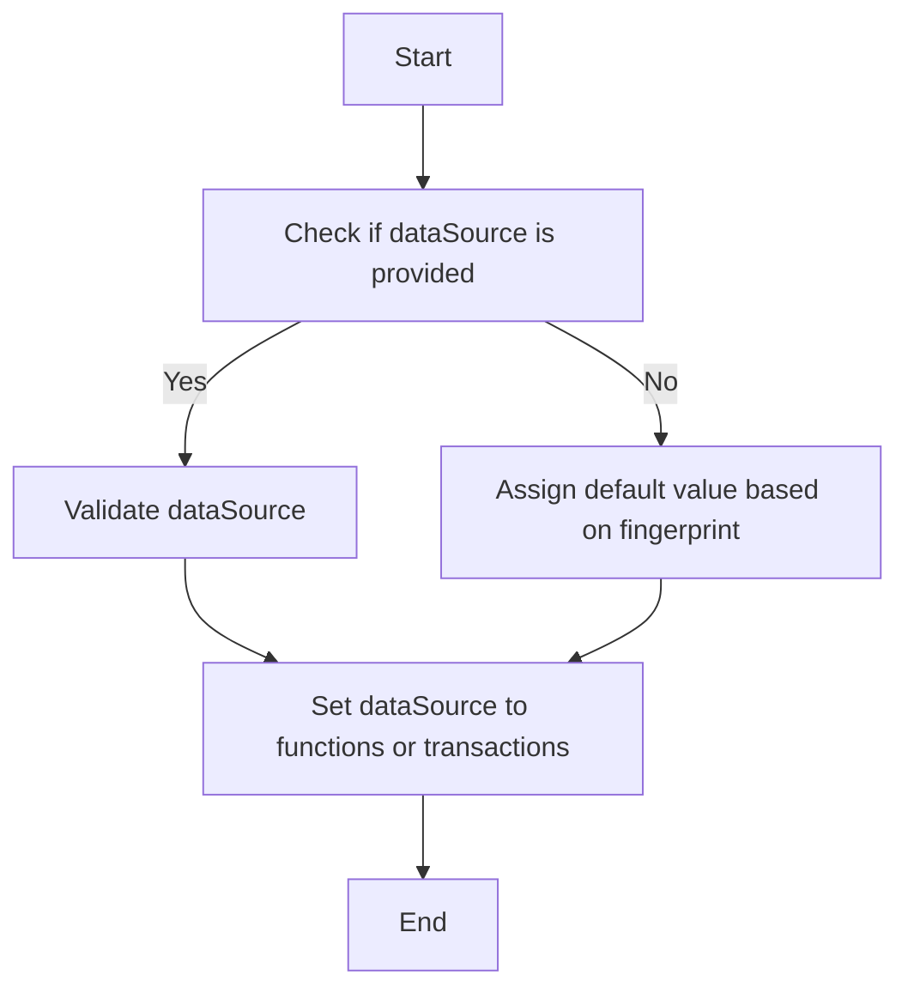

This document will cover the purpose and functionality of the Validate Function. We'll cover:

1. Ensuring data integrity
2. Assigning default values
3. Handling different data sources.

Technical document: <SwmLink doc-title="Purpose of the Validate Function">[Purpose of the Validate Function](/.swm/purpose-of-the-validate-function.jqsszrtb.sw.md)</SwmLink>

# [Ensuring data integrity](https://app.swimm.io/repos/Z2l0aHViJTNBJTNBc2VudHJ5LWRlbW8tMSUzQSUzQVN3aW1tLURlbW8=/docs/jqsszrtb#validate-function)

The Validate Function is responsible for ensuring that the data being processed is accurate and consistent. It checks if the `dataSource` is provided in the `attrs` dictionary. If the `dataSource` is not provided, it assigns a default value based on the presence of a `fingerprint`. This step is crucial for maintaining the integrity of the data, ensuring that all necessary information is present before further processing.

# [Assigning default values](https://app.swimm.io/repos/Z2l0aHViJTNBJTNBc2VudHJ5LWRlbW8tMSUzQSUzQVN3aW1tLURlbW8=/docs/jqsszrtb#validate-function)

When the `dataSource` is not provided, the Validate Function assigns a default value. If a `fingerprint` is present, it sets the `dataSource` to 'functions'. If no `fingerprint` is found, it defaults to 'transactions'. This ensures that the data has a valid source, which is essential for the subsequent steps in the data processing pipeline.

# [Handling different data sources](https://app.swimm.io/repos/Z2l0aHViJTNBJTNBc2VudHJ5LWRlbW8tMSUzQSUzQVN3aW1tLURlbW8=/docs/jqsszrtb#validate-function)

The Validate Function handles different types of data sources by setting the `dataSource` accordingly. If the `dataSource` is 'functions', it ensures that the `fingerprint` is valid. If the `dataSource` is 'profiles', it sets it accordingly. Otherwise, it defaults to 'transactions'. This step is important for directing the data to the appropriate processing path, ensuring that the data is handled correctly based on its source.

&nbsp;

*This is an auto-generated document by Swimm AI 🌊 and has not yet been verified by a human*

<SwmMeta version="3.0.0" repo-id="Z2l0aHViJTNBJTNBc2VudHJ5LWRlbW8tMSUzQSUzQVN3aW1tLURlbW8=" repo-name="sentry-demo-1" doc-type="product-flows">Powered by [Swimm](/)</SwmMeta>
