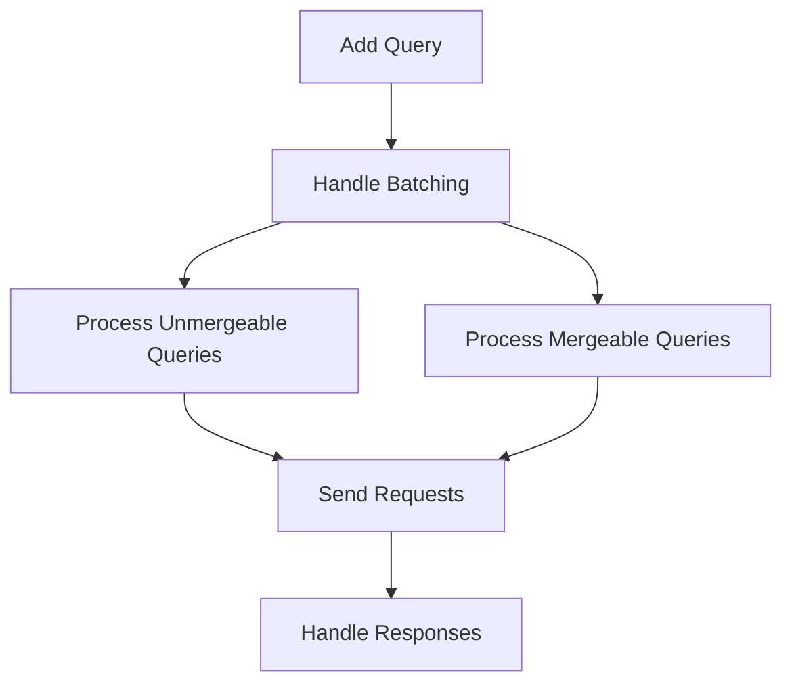

This document will cover the Query Batching Process, which includes:

1. Adding Queries to the Batch
2. Handling Batching
3. Processing Unmergeable Queries
4. Processing Mergeable Queries
5. Sending Requests and Handling Responses.

Technical document: <SwmLink doc-title="Query Batching Process">[Query Batching Process](/.swm/query-batching-process.xw1vqty8.sw.md)</SwmLink>

# [Adding Queries to the Batch](https://app.swimm.io/repos/Z2l0aHViJTNBJTNBc2VudHJ5LWRlbW8tMSUzQSUzQVN3aW1tLURlbW8=/docs/xw1vqty8#genericquerybatcher)

When a new query is added to the batch, it is temporarily stored and a short delay is introduced to allow more queries to be added. This delay helps in collecting multiple queries together, which can then be processed in a single batch. This reduces the number of individual requests sent to the server, improving efficiency.

# [Handling Batching](https://app.swimm.io/repos/Z2l0aHViJTNBJTNBc2VudHJ5LWRlbW8tMSUzQSUzQVN3aW1tLURlbW8=/docs/xw1vqty8#handlebatching)

The batching process involves converting the collected queries into a format that can be processed. The queries are then divided into two categories: mergeable and unmergeable. This categorization is essential because mergeable queries can be combined into a single request, while unmergeable queries need to be processed individually.

# [Processing Unmergeable Queries](https://app.swimm.io/repos/Z2l0aHViJTNBJTNBc2VudHJ5LWRlbW8tMSUzQSUzQVN3aW1tLURlbW8=/docs/xw1vqty8#_handleunmergeablequeries)

Unmergeable queries are those that cannot be combined with others due to their unique properties. Each unmergeable query is processed separately. This step ensures that all queries, regardless of their ability to be merged, are handled appropriately and sent to the server.

# [Processing Mergeable Queries](https://app.swimm.io/repos/Z2l0aHViJTNBJTNBc2VudHJ5LWRlbW8tMSUzQSUzQVN3aW1tLURlbW8=/docs/xw1vqty8#handling-mergeable-queries)

Mergeable queries are those that share common properties and can be combined into a single request. This process involves checking the properties of each query to determine if they can be merged. If they can, they are combined into a single request, which reduces the number of requests sent to the server and improves performance.

# [Sending Requests and Handling Responses](https://app.swimm.io/repos/Z2l0aHViJTNBJTNBc2VudHJ5LWRlbW8tMSUzQSUzQVN3aW1tLURlbW8=/docs/xw1vqty8#sending-requests)

Once the queries are categorized and processed, the requests are sent to the server. The server's responses are then handled appropriately. This step ensures that the results of the queries are received and processed, completing the query batching process.

&nbsp;

*This is an auto-generated document by Swimm AI 🌊 and has not yet been verified by a human*

<SwmMeta version="3.0.0" repo-id="Z2l0aHViJTNBJTNBc2VudHJ5LWRlbW8tMSUzQSUzQVN3aW1tLURlbW8=" repo-name="sentry-demo-1" doc-type="product-flows">Powered by [Swimm](/)</SwmMeta>
