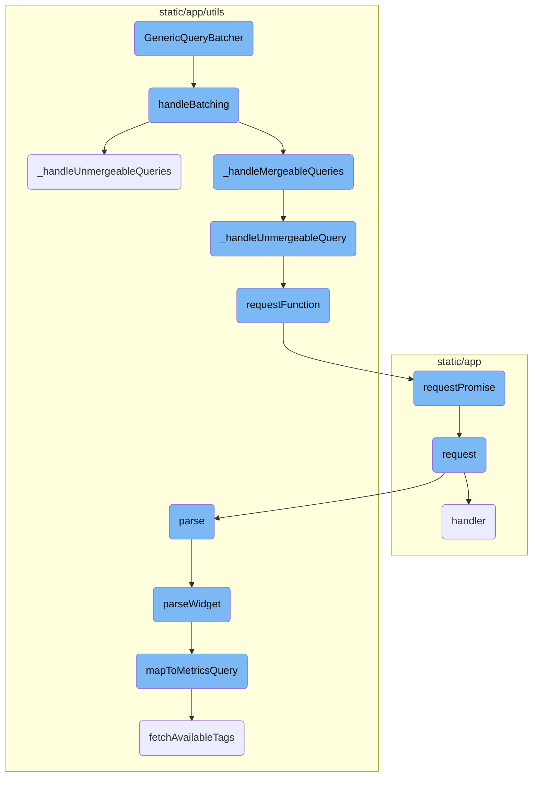
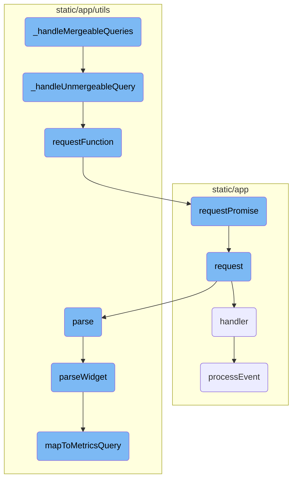

This document explains the <SwmToken path="static/app/utils/performance/contexts/genericQueryBatcher.tsx" pos="182:4:4" line-data="export function GenericQueryBatcher({children}: {children: React.ReactNode}) {">`GenericQueryBatcher`</SwmToken>, a utility for batching and processing queries efficiently. It includes an overview of the main functions involved in the batching process, such as handling mergeable and unmergeable queries, sending requests, and processing responses.

The <SwmToken path="static/app/utils/performance/contexts/genericQueryBatcher.tsx" pos="182:4:4" line-data="export function GenericQueryBatcher({children}: {children: React.ReactNode}) {">`GenericQueryBatcher`</SwmToken> is a tool that groups multiple queries together to process them more efficiently. When a new query is added, it waits for a short period to collect more queries before processing them all at once. It separates queries that can be combined from those that cannot. The combined queries are sent together in a single request, while the others are sent individually. This helps reduce the number of requests sent to the server, making the process faster and more efficient.

Here is a high level diagram of the flow, showing only the most important functions:



# Flow drill down

First, we'll zoom into this section of the flow:

```mermaid
graph TD;
      subgraph static/app/utils/performance/contexts/genericQueryBatcher.tsx
6ebb0b6166fbd902bf15240702b5194fe23cd1163f7d1ca0a2a3bd3086bc4629(GenericQueryBatcher):::mainFlowStyle --> 5b8c3af4c29605a7099831493304f29e9563c92a87bbc1501f00c37a627ee007(handleBatching):::mainFlowStyle
end

subgraph static/app/utils/performance/contexts/genericQueryBatcher.tsx
5b8c3af4c29605a7099831493304f29e9563c92a87bbc1501f00c37a627ee007(handleBatching):::mainFlowStyle --> 4828141d547f5f2e5afec5603e540d98fdbd67e4d4c1471cbb0eae026cd0cfbf(_handleUnmergeableQueries)
end

subgraph static/app/utils/performance/contexts/genericQueryBatcher.tsx
5b8c3af4c29605a7099831493304f29e9563c92a87bbc1501f00c37a627ee007(handleBatching):::mainFlowStyle --> 90ff9374397a0adb357fe4c2249524c2149f81c211a4b8b1f471066ba428f2de(_handleMergeableQueries):::mainFlowStyle
end

subgraph static/app/utils/performance/contexts/genericQueryBatcher.tsx
90ff9374397a0adb357fe4c2249524c2149f81c211a4b8b1f471066ba428f2de(_handleMergeableQueries):::mainFlowStyle --> a9pqt(...)
end


      classDef mainFlowStyle color:#000000,fill:#7CB9F4
classDef rootsStyle color:#000000,fill:#00FFF4
classDef Style1 color:#000000,fill:#00FFAA
classDef Style2 color:#000000,fill:#FFFF00
classDef Style3 color:#000000,fill:#AA7CB9

%% Swimm:
%% graph TD;
%%       subgraph <SwmPath>[static/app/utils/performance/contexts/genericQueryBatcher.tsx](static/app/utils/performance/contexts/genericQueryBatcher.tsx)</SwmPath>
%% 6ebb0b6166fbd902bf15240702b5194fe23cd1163f7d1ca0a2a3bd3086bc4629(GenericQueryBatcher):::mainFlowStyle --> 5b8c3af4c29605a7099831493304f29e9563c92a87bbc1501f00c37a627ee007(handleBatching):::mainFlowStyle
%% end
%% 
%% subgraph <SwmPath>[static/app/utils/performance/contexts/genericQueryBatcher.tsx](static/app/utils/performance/contexts/genericQueryBatcher.tsx)</SwmPath>
%% 5b8c3af4c29605a7099831493304f29e9563c92a87bbc1501f00c37a627ee007(handleBatching):::mainFlowStyle --> 4828141d547f5f2e5afec5603e540d98fdbd67e4d4c1471cbb0eae026cd0cfbf(_handleUnmergeableQueries)
%% end
%% 
%% subgraph <SwmPath>[static/app/utils/performance/contexts/genericQueryBatcher.tsx](static/app/utils/performance/contexts/genericQueryBatcher.tsx)</SwmPath>
%% 5b8c3af4c29605a7099831493304f29e9563c92a87bbc1501f00c37a627ee007(handleBatching):::mainFlowStyle --> 90ff9374397a0adb357fe4c2249524c2149f81c211a4b8b1f471066ba428f2de(_handleMergeableQueries):::mainFlowStyle
%% end
%% 
%% subgraph <SwmPath>[static/app/utils/performance/contexts/genericQueryBatcher.tsx](static/app/utils/performance/contexts/genericQueryBatcher.tsx)</SwmPath>
%% 90ff9374397a0adb357fe4c2249524c2149f81c211a4b8b1f471066ba428f2de(_handleMergeableQueries):::mainFlowStyle --> a9pqt(...)
%% end
%% 
%% 
%%       classDef mainFlowStyle color:#000000,fill:#7CB9F4
%% classDef rootsStyle color:#000000,fill:#00FFF4
%% classDef Style1 color:#000000,fill:#00FFAA
%% classDef Style2 color:#000000,fill:#FFFF00
%% classDef Style3 color:#000000,fill:#AA7CB9
```



<SwmSnippet path="/static/app/utils/performance/contexts/genericQueryBatcher.tsx" line="182">

---

## <SwmToken path="static/app/utils/performance/contexts/genericQueryBatcher.tsx" pos="182:4:4" line-data="export function GenericQueryBatcher({children}: {children: React.ReactNode}) {">`GenericQueryBatcher`</SwmToken>

The <SwmToken path="static/app/utils/performance/contexts/genericQueryBatcher.tsx" pos="182:4:4" line-data="export function GenericQueryBatcher({children}: {children: React.ReactNode}) {">`GenericQueryBatcher`</SwmToken> function is responsible for batching queries together. It uses a <SwmToken path="static/app/utils/performance/contexts/genericQueryBatcher.tsx" pos="183:7:7" line-data="  const queries = useRef&lt;Record&lt;symbol, BatchQueryDefinition&gt;&gt;({});">`useRef`</SwmToken> hook to keep track of the queries and a timeout reference. The <SwmToken path="static/app/utils/performance/contexts/genericQueryBatcher.tsx" pos="188:3:3" line-data="  const addQuery = (q: BatchQueryDefinition, id: symbol) =&gt; {">`addQuery`</SwmToken> function adds a new query to the batch and sets a timeout to call <SwmToken path="static/app/utils/performance/contexts/genericQueryBatcher.tsx" pos="194:1:1" line-data="      handleBatching(organization, queries.current);">`handleBatching`</SwmToken> to process the queries. The component also ensures that the timeout is cleared when the component unmounts.

```tsx
export function GenericQueryBatcher({children}: {children: React.ReactNode}) {
  const queries = useRef<Record<symbol, BatchQueryDefinition>>({});

  const timeoutRef = useRef<number | undefined>(undefined);
  const organization = useOrganization();

  const addQuery = (q: BatchQueryDefinition, id: symbol) => {
    queries.current[id] = q;

    window.clearTimeout(timeoutRef.current);
    // Put batch function in the next macro task to aggregate all requests in this frame.
    timeoutRef.current = window.setTimeout(() => {
      handleBatching(organization, queries.current);
      timeoutRef.current = undefined;
    }, 0);
  };

  // Cleanup timeout after component unmounts.
  useEffect(
    () => () => {
      timeoutRef.current && window.clearTimeout(timeoutRef.current);
```

---

</SwmSnippet>

<SwmSnippet path="/static/app/utils/performance/contexts/genericQueryBatcher.tsx" line="153">

---

## <SwmToken path="static/app/utils/performance/contexts/genericQueryBatcher.tsx" pos="153:2:2" line-data="function handleBatching(">`handleBatching`</SwmToken>

The <SwmToken path="static/app/utils/performance/contexts/genericQueryBatcher.tsx" pos="153:2:2" line-data="function handleBatching(">`handleBatching`</SwmToken> function processes the batched queries. It first converts the queries into a merge map using <SwmToken path="static/app/utils/performance/contexts/genericQueryBatcher.tsx" pos="157:7:7" line-data="  const mergeMap = queriesToMap(queries);">`queriesToMap`</SwmToken>. It then handles unmergeable and mergeable queries separately by calling <SwmToken path="static/app/utils/performance/contexts/genericQueryBatcher.tsx" pos="164:5:5" line-data="  queriesSent += _handleUnmergeableQueries(mergeMap);">`_handleUnmergeableQueries`</SwmToken> and <SwmToken path="static/app/utils/performance/contexts/genericQueryBatcher.tsx" pos="165:5:5" line-data="  queriesSent += _handleMergeableQueries(mergeMap);">`_handleMergeableQueries`</SwmToken>. Finally, it tracks analytics data about the number of queries collected, saved, and sent.

```tsx
function handleBatching(
  organization: Organization,
  queries: Record<symbol, BatchQueryDefinition>
) {
  const mergeMap = queriesToMap(queries);

  if (!mergeMap) {
    return;
  }

  let queriesSent = 0;
  queriesSent += _handleUnmergeableQueries(mergeMap);
  queriesSent += _handleMergeableQueries(mergeMap);

  const queriesCollected = Object.values(mergeMap).reduce(
    (acc, mergeList) => acc + mergeList.length,
    0
  );

  const queriesSaved = queriesCollected - queriesSent;

```

---

</SwmSnippet>

<SwmSnippet path="/static/app/utils/performance/contexts/genericQueryBatcher.tsx" line="80">

---

### <SwmToken path="static/app/utils/performance/contexts/genericQueryBatcher.tsx" pos="80:2:2" line-data="function _handleUnmergeableQueries(mergeMap: MergeMap) {">`_handleUnmergeableQueries`</SwmToken>

The <SwmToken path="static/app/utils/performance/contexts/genericQueryBatcher.tsx" pos="80:2:2" line-data="function _handleUnmergeableQueries(mergeMap: MergeMap) {">`_handleUnmergeableQueries`</SwmToken> function processes queries that cannot be merged. It iterates over the merge map and checks if the length of the merge list is one. If so, it handles the unmergeable query by calling <SwmToken path="static/app/utils/performance/contexts/genericQueryBatcher.tsx" pos="89:1:1" line-data="      _handleUnmergeableQuery(queryDefinition);">`_handleUnmergeableQuery`</SwmToken> and increments the count of queries sent.

```tsx
function _handleUnmergeableQueries(mergeMap: MergeMap) {
  let queriesSent = 0;
  Object.keys(mergeMap).forEach(k => {
    // Using async forEach to ensure calls start in parallel.
    const mergeList = mergeMap[k];

    if (mergeList.length === 1) {
      const [queryDefinition] = mergeList;
      queriesSent++;
      _handleUnmergeableQuery(queryDefinition);
    }
  });

  return queriesSent;
}
```

---

</SwmSnippet>

Now, lets zoom into this section of the flow:



<SwmSnippet path="/static/app/utils/performance/contexts/genericQueryBatcher.tsx" line="96">

---

## Handling Mergeable Queries

The function <SwmToken path="static/app/utils/performance/contexts/genericQueryBatcher.tsx" pos="96:2:2" line-data="function _handleMergeableQueries(mergeMap: MergeMap) {">`_handleMergeableQueries`</SwmToken> processes queries that can be batched together. It iterates over the <SwmToken path="static/app/utils/performance/contexts/genericQueryBatcher.tsx" pos="96:4:4" line-data="function _handleMergeableQueries(mergeMap: MergeMap) {">`mergeMap`</SwmToken>, checks if the queries can be merged based on their properties, and then sends a single request for the batch. If any query cannot be merged, it is handled separately by <SwmToken path="static/app/utils/performance/contexts/genericQueryBatcher.tsx" pos="71:2:2" line-data="function _handleUnmergeableQuery(queryDefinition: BatchQueryDefinition) {">`_handleUnmergeableQuery`</SwmToken>. This optimization reduces the number of requests sent to the server, improving performance.

```tsx
function _handleMergeableQueries(mergeMap: MergeMap) {
  let queriesSent = 0;
  Object.keys(mergeMap).forEach(async k => {
    const mergeList = mergeMap[k];

    if (mergeList.length <= 1) {
      return;
    }

    const [exampleDefinition] = mergeList;
    const batchProperty = exampleDefinition.batchProperty;
    const query = {...exampleDefinition.requestQueryObject.query};
    const requestQueryObject = {...exampleDefinition.requestQueryObject, query};

    const batchValues: string[] = [];

    mergeList.forEach(q => {
      const batchFieldValue = q.requestQueryObject.query[batchProperty];
      if (Array.isArray(batchFieldValue)) {
        if (batchFieldValue.length > 1) {
          // Omit multiple requests with multi fields (eg. yAxis) for now and run them as single queries
```

---

</SwmSnippet>

<SwmSnippet path="/static/app/utils/performance/contexts/genericQueryBatcher.tsx" line="71">

---

### Handling Unmergeable Queries

The function <SwmToken path="static/app/utils/performance/contexts/genericQueryBatcher.tsx" pos="71:2:2" line-data="function _handleUnmergeableQuery(queryDefinition: BatchQueryDefinition) {">`_handleUnmergeableQuery`</SwmToken> handles queries that cannot be merged. It sends a separate request for each unmergeable query using <SwmToken path="static/app/utils/performance/contexts/genericQueryBatcher.tsx" pos="72:7:7" line-data="  const result = requestFunction(">`requestFunction`</SwmToken> and resolves the query with the result.

```tsx
function _handleUnmergeableQuery(queryDefinition: BatchQueryDefinition) {
  const result = requestFunction(
    queryDefinition.api,
    queryDefinition.path,
    queryDefinition.requestQueryObject
  );
  queryDefinition.resolve(result);
}
```

---

</SwmSnippet>

<SwmSnippet path="/static/app/utils/performance/contexts/genericQueryBatcher.tsx" line="67">

---

### Sending Requests

The function <SwmToken path="static/app/utils/performance/contexts/genericQueryBatcher.tsx" pos="67:2:2" line-data="function requestFunction(api: Client, path: string, queryObject: QueryObject) {">`requestFunction`</SwmToken> sends a request to the server using the provided API client, path, and query object. It returns a promise that resolves with the server's response.

```tsx
function requestFunction(api: Client, path: string, queryObject: QueryObject) {
  return api.requestPromise(path, queryObject);
}
```

---

</SwmSnippet>

<SwmSnippet path="/static/app/api.tsx" line="656">

---

### Request Promise

The method <SwmToken path="static/app/api.tsx" pos="656:1:1" line-data="  requestPromise&lt;IncludeAllArgsType extends boolean&gt;(">`requestPromise`</SwmToken> creates and sends an HTTP request. It handles the response, resolving the promise with the data if the request is successful or rejecting it with an error if it fails.

```tsx
  requestPromise<IncludeAllArgsType extends boolean>(
    path: string,
    {
      includeAllArgs,
      ...options
    }: {includeAllArgs?: IncludeAllArgsType} & Readonly<RequestOptions> = {}
  ): Promise<IncludeAllArgsType extends true ? ApiResult : any> {
    // Create an error object here before we make any async calls so that we
    // have a helpful stack trace if it errors
    //
    // This *should* get logged to Sentry only if the promise rejection is not handled
    // (since SDK captures unhandled rejections). Ideally we explicitly ignore rejection
    // or handle with a user friendly error message
    const preservedError = new Error('API Request Error');

    return new Promise((resolve, reject) =>
      this.request(path, {
        ...options,
        preservedError,
        success: (data, textStatus, resp) => {
          if (includeAllArgs) {
```

---

</SwmSnippet>

<SwmSnippet path="/static/app/api.tsx" line="420">

---

### Handling Responses

The method <SwmToken path="static/app/api.tsx" pos="420:1:1" line-data="  request(path: string, options: Readonly&lt;RequestOptions&gt; = {}): Request {">`request`</SwmToken> constructs and sends an HTTP request. It processes the response, calling the appropriate success or error handler based on the response status.

```tsx
  request(path: string, options: Readonly<RequestOptions> = {}): Request {
    const method = options.method || (options.data ? 'POST' : 'GET');

    let fullUrl = buildRequestUrl(this.baseUrl, path, options);

    let data = options.data;

    if (data !== undefined && method !== 'GET' && !(data instanceof FormData)) {
      data = JSON.stringify(data);
    }

    // TODO(epurkhiser): Mimicking the old jQuery API, data could be a string /
    // object for GET requests. jQuery just sticks it onto the URL as query
    // parameters
    if (method === 'GET' && data) {
      const queryString = typeof data === 'string' ? data : qs.stringify(data);

      if (queryString.length > 0) {
        fullUrl = fullUrl + (fullUrl.includes('?') ? '&' : '?') + queryString;
      }
    }
```

---

</SwmSnippet>

<SwmSnippet path="/static/app/components/replays/canvasReplayerPlugin.tsx" line="230">

---

### Processing Events

The function <SwmToken path="static/app/components/replays/canvasReplayerPlugin.tsx" pos="233:5:5" line-data="  async function processEvent(e: CanvasEventWithTime, {replayer}: {replayer: Replayer}) {">`processEvent`</SwmToken> processes canvas mutation events. It preloads the event, applies the mutation to the target canvas, and updates the image source.

```tsx
  /**
   * Processes canvas mutation events
   */
  async function processEvent(e: CanvasEventWithTime, {replayer}: {replayer: Replayer}) {
    preload(e);

    const source = replayer.getMirror().getNode(e.data.id);
    const target =
      canvases.get(e.data.id) ||
      (source && cloneCanvas(e.data.id, source as HTMLCanvasElement));

    if (!target) {
      throw new InvalidCanvasNodeError('No canvas found for id');
    }

    await canvasMutation({
      event: e,
      mutation: e.data,
      target,
      imageMap,
      canvasEventMap,
```

---

</SwmSnippet>

<SwmSnippet path="/static/app/utils/metrics/dashboardImport.tsx" line="179">

---

### Parsing Widgets

The method <SwmToken path="static/app/utils/metrics/dashboardImport.tsx" pos="179:5:5" line-data="  private async parseWidget() {">`parseWidget`</SwmToken> parses the widget definition, maps queries to metrics queries, and converts the result to a dashboard widget.

```tsx
  private async parseWidget() {
    this.parseLegendColumns();

    const {title, requests = []} = this.importedWidget.definition as WidgetDefinition;

    const parsedRequests = requests.map(r => this.parseRequest(r));
    const parsedQueries = parsedRequests.flatMap(request => request.queries);

    const metricsQueries = await Promise.all(
      parsedQueries.map(async query => {
        const mapped = await this.mapToMetricsQuery(query);
        return {
          ...mapped,
        };
      })
    );

    const nonEmptyQueries = metricsQueries.filter(query => query.mri) as MetricsQuery[];

    if (!nonEmptyQueries.length) {
      return null;
```

---

</SwmSnippet>

<SwmSnippet path="/static/app/utils/metrics/dashboardImport.tsx" line="397">

---

### Mapping to Metrics Query

The method <SwmToken path="static/app/utils/metrics/dashboardImport.tsx" pos="398:5:5" line-data="  private async mapToMetricsQuery(widget): Promise&lt;MetricsQuery | null&gt; {">`mapToMetricsQuery`</SwmToken> maps a widget definition to a metrics query. It constructs the query filter and group by parameters based on the widget's properties and available tags.

```tsx
  // Mapping functions
  private async mapToMetricsQuery(widget): Promise<MetricsQuery | null> {
    const {metric, aggregation, filters} = widget;

    // @ts-expect-error name is actually defined on MetricMeta
    const metricMeta = this.availableMetrics.find(m => m.name === metric);

    if (!metricMeta) {
      this.errors.push(`widget.request.query - metric not found: ${metric}`);
      return null;
    }

    const availableTags = await this.fetchAvailableTags(metricMeta.mri);

    const query = this.constructMetricQueryFilter(filters, availableTags);
    const groupBy = this.constructMetricGroupBy(widget.groupBy, availableTags);

    return {
      mri: metricMeta.mri,
      aggregation,
      query,
```

---

</SwmSnippet>

&nbsp;

*This is an auto-generated document by Swimm AI 🌊 and has not yet been verified by a human*

<SwmMeta version="3.0.0" repo-id="Z2l0aHViJTNBJTNBc2VudHJ5LWRlbW8tMSUzQSUzQVN3aW1tLURlbW8=" repo-name="sentry-demo-1" doc-type="flows"><sup>Powered by [Swimm](/)</sup></SwmMeta>
