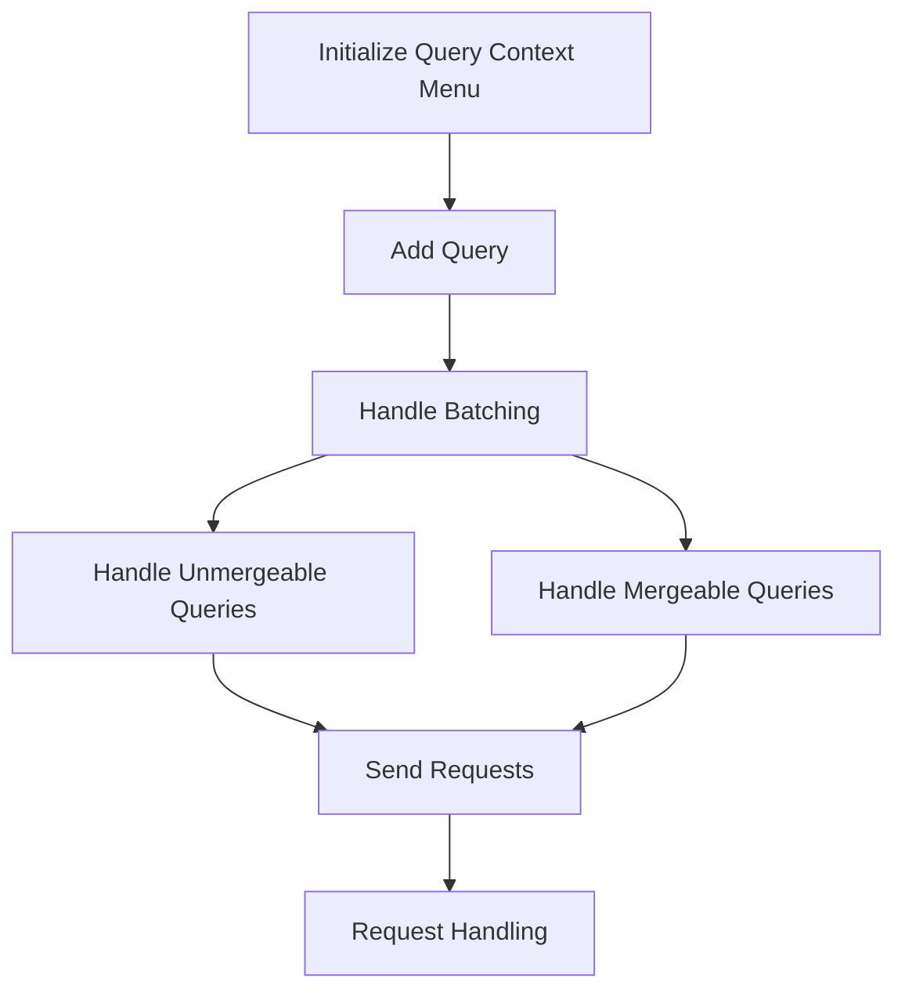

This document will cover the Query Context Menu feature, which includes:

1. Initializing the Query Context Menu
2. Adding a Query
3. Handling Batching
4. Handling Unmergeable Queries
5. Handling Mergeable Queries
6. Sending Requests
7. Request Handling

Technical document: <SwmLink doc-title="Query Context Menu Overview">[Query Context Menu Overview](/.swm/query-context-menu-overview.p58q0whr.sw.md)</SwmLink>

# [Initializing the Query Context Menu](https://app.swimm.io/repos/Z2l0aHViJTNBJTNBc2VudHJ5LWRlbW8tMSUzQSUzQVN3aW1tLURlbW8=/docs/p58q0whr#querycontextmenu-initialization)

The Query Context Menu is initialized to allow users to interact with metric queries through a context menu. This menu provides options such as 'Duplicate', 'Create Alert', 'Remove Metric', 'Add Alias', and 'Configure Metric'. Each menu item has an associated action that is triggered when selected. For example, selecting 'Duplicate' will create a copy of the metric query, while 'Remove Metric' will delete it from the list.

# [Adding a Query](https://app.swimm.io/repos/Z2l0aHViJTNBJTNBc2VudHJ5LWRlbW8tMSUzQSUzQVN3aW1tLURlbW8=/docs/p58q0whr#adding-a-query)

When a user adds a new query through the context menu, the system stores this query in a batch. This batching mechanism ensures that multiple queries can be aggregated and processed together, improving efficiency. A timeout is set to handle the batching of queries, ensuring that all queries added within a short timeframe are processed together.

# [Handling Batching](https://app.swimm.io/repos/Z2l0aHViJTNBJTNBc2VudHJ5LWRlbW8tMSUzQSUzQVN3aW1tLURlbW8=/docs/p58q0whr#handling-batching)

The batching process converts the stored queries into a merge map. This map helps in identifying which queries can be merged and which cannot. The system then processes unmergeable and mergeable queries separately. The number of queries collected, saved, and sent is tracked for performance analytics. This ensures that the system can handle a large number of queries efficiently.

# [Handling Unmergeable Queries](https://app.swimm.io/repos/Z2l0aHViJTNBJTNBc2VudHJ5LWRlbW8tMSUzQSUzQVN3aW1tLURlbW8=/docs/p58q0whr#handling-unmergeable-queries)

Unmergeable queries are those that cannot be combined with others for processing. These queries are handled individually. The system iterates over the merge map and processes each unmergeable query by sending individual requests. This ensures that even queries that cannot be batched are processed correctly and efficiently.

# [Handling Mergeable Queries](https://app.swimm.io/repos/Z2l0aHViJTNBJTNBc2VudHJ5LWRlbW8tMSUzQSUzQVN3aW1tLURlbW8=/docs/p58q0whr#handling-mergeable-queries)

Mergeable queries are those that can be combined with others for processing. The system checks if the queries can be merged based on their properties. If they can be merged, a single request is sent for the batch. If any query cannot be merged, it is handled individually. This approach ensures that the system can process multiple queries efficiently by reducing the number of requests sent.

# [Sending Requests](https://app.swimm.io/repos/Z2l0aHViJTNBJTNBc2VudHJ5LWRlbW8tMSUzQSUzQVN3aW1tLURlbW8=/docs/p58q0whr#sending-requests)

The system sends requests for both mergeable and unmergeable queries using a request function. This function sends a request using the provided API client, path, and query object. It returns a promise that resolves with the result of the request. This ensures that all queries are processed and the results are returned to the user.

# [Request Handling](https://app.swimm.io/repos/Z2l0aHViJTNBJTNBc2VudHJ5LWRlbW8tMSUzQSUzQVN3aW1tLURlbW8=/docs/p58q0whr#request-handling)

The request handling process involves constructing and sending an HTTP request using the Fetch API. The system handles various aspects of the request, including URL building, data serialization, and response parsing. This ensures that the requests are sent correctly and the responses are processed efficiently. The system also handles success and error scenarios, ensuring that errors are properly logged and rejected.

&nbsp;

*This is an auto-generated document by Swimm AI 🌊 and has not yet been verified by a human*

<SwmMeta version="3.0.0" repo-id="Z2l0aHViJTNBJTNBc2VudHJ5LWRlbW8tMSUzQSUzQVN3aW1tLURlbW8=" repo-name="sentry-demo-1" doc-type="product-flows">Powered by [Swimm](/)</SwmMeta>
