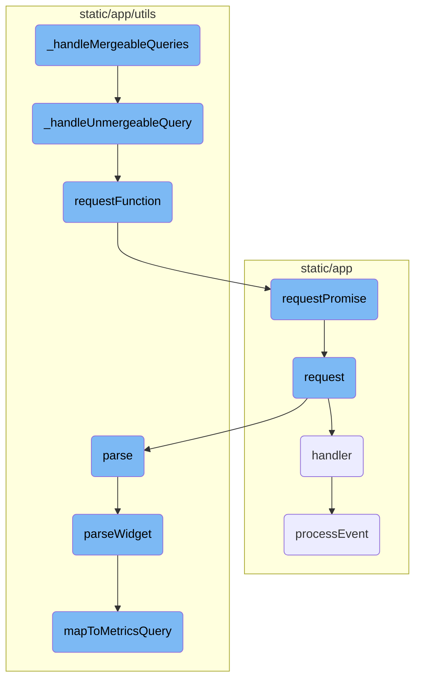

This document provides an overview of the <SwmToken path="static/app/components/modals/metricWidgetViewerModal/queries.tsx" pos="273:2:2" line-data="function QueryContextMenu({">`QueryContextMenu`</SwmToken> and its associated functions. It explains how the context menu is initialized, how queries are added and batched, and how both mergeable and unmergeable queries are handled.

The <SwmToken path="static/app/components/modals/metricWidgetViewerModal/queries.tsx" pos="273:2:2" line-data="function QueryContextMenu({">`QueryContextMenu`</SwmToken> is a feature that allows users to interact with metric queries through a context menu. When a user selects an action from the menu, such as adding or removing a query, the corresponding function is triggered. These functions manage the queries by batching them together for efficient processing. Some queries can be merged and sent as a single request, while others need to be handled individually. The system ensures that all queries are processed and the results are returned to the user.

Here is a high level diagram of the flow, showing only the most important functions:

```mermaid
graph TD;
      subgraph static/app/utils
e3cdb99f90c271ff24d907c4caa371759fdeb03462bb5261a8c12b20a6fb54f1(QueryContextMenu):::mainFlowStyle --> e2b67c983350bd142a5aaa1f1017d4bb264a9702d05bb48934bfa23cd89dfb08(addQuery):::mainFlowStyle
end

subgraph static/app/utils
e2b67c983350bd142a5aaa1f1017d4bb264a9702d05bb48934bfa23cd89dfb08(addQuery):::mainFlowStyle --> 5b8c3af4c29605a7099831493304f29e9563c92a87bbc1501f00c37a627ee007(handleBatching):::mainFlowStyle
end

subgraph static/app/utils
5b8c3af4c29605a7099831493304f29e9563c92a87bbc1501f00c37a627ee007(handleBatching):::mainFlowStyle --> 4828141d547f5f2e5afec5603e540d98fdbd67e4d4c1471cbb0eae026cd0cfbf(_handleUnmergeableQueries)
end

subgraph static/app/utils
5b8c3af4c29605a7099831493304f29e9563c92a87bbc1501f00c37a627ee007(handleBatching):::mainFlowStyle --> 90ff9374397a0adb357fe4c2249524c2149f81c211a4b8b1f471066ba428f2de(_handleMergeableQueries):::mainFlowStyle
end

subgraph static/app/utils
90ff9374397a0adb357fe4c2249524c2149f81c211a4b8b1f471066ba428f2de(_handleMergeableQueries):::mainFlowStyle --> b06d6a338d77963cde2551f503a2ce3b3530fa37719ed3615534229f27eaf648(_handleUnmergeableQuery):::mainFlowStyle
end

subgraph static/app/utils
b06d6a338d77963cde2551f503a2ce3b3530fa37719ed3615534229f27eaf648(_handleUnmergeableQuery):::mainFlowStyle --> c4380a03d42ac0c65470f5ea342d4dce126f01939798968b2931ae3e5837aea5(requestFunction):::mainFlowStyle
end

subgraph static/app/api.tsx
c4380a03d42ac0c65470f5ea342d4dce126f01939798968b2931ae3e5837aea5(requestFunction):::mainFlowStyle --> 1025c11ff078741e3a52849e4dc81510d630800b045c60aea951683433a1c993(requestPromise):::mainFlowStyle
end

subgraph static/app/api.tsx
1025c11ff078741e3a52849e4dc81510d630800b045c60aea951683433a1c993(requestPromise):::mainFlowStyle --> 4f5a67a71dfb71654db327ed24d5e8187187a49b58963a473eec18ecb0aef026(request):::mainFlowStyle
end

subgraph static/app/components
4f5a67a71dfb71654db327ed24d5e8187187a49b58963a473eec18ecb0aef026(request):::mainFlowStyle --> 2cd409575454572c7b228bde73d6eb55227f3d7b14d37cc7ca5415bbcb81e4e5(handler)
end

subgraph static/app/utils
4f5a67a71dfb71654db327ed24d5e8187187a49b58963a473eec18ecb0aef026(request):::mainFlowStyle --> 4b2faee236c2e651d9932fa234f72966df49f7aa0f85eb9909d65f4b6d8ce1a6(parse):::mainFlowStyle
end

subgraph static/app/utils
4b2faee236c2e651d9932fa234f72966df49f7aa0f85eb9909d65f4b6d8ce1a6(parse):::mainFlowStyle --> b2b47f6077e96a1ff47606d77c3fe70b18a84edc0ab0fa1349f7face4165d2ea(parseWidget):::mainFlowStyle
end

subgraph static/app/utils
b2b47f6077e96a1ff47606d77c3fe70b18a84edc0ab0fa1349f7face4165d2ea(parseWidget):::mainFlowStyle --> 05bf2ddeab316943d2187e10bc3886949b4b03ae946f68d4f27a5bfc0025e132(mapToMetricsQuery):::mainFlowStyle
end

subgraph static/app/utils
05bf2ddeab316943d2187e10bc3886949b4b03ae946f68d4f27a5bfc0025e132(mapToMetricsQuery):::mainFlowStyle --> 635bb507b11255a8fd7c2375dac3b6c46b736470cf89007061c6861fc973e73b(fetchAvailableTags)
end


      classDef mainFlowStyle color:#000000,fill:#7CB9F4
classDef rootsStyle color:#000000,fill:#00FFF4
classDef Style1 color:#000000,fill:#00FFAA
classDef Style2 color:#000000,fill:#FFFF00
classDef Style3 color:#000000,fill:#AA7CB9

%% Swimm:
%% graph TD;
%%       subgraph <SwmPath>[static/app/utils/](static/app/utils/)</SwmPath>
%% e3cdb99f90c271ff24d907c4caa371759fdeb03462bb5261a8c12b20a6fb54f1(QueryContextMenu):::mainFlowStyle --> e2b67c983350bd142a5aaa1f1017d4bb264a9702d05bb48934bfa23cd89dfb08(addQuery):::mainFlowStyle
%% end
%% 
%% subgraph <SwmPath>[static/app/utils/](static/app/utils/)</SwmPath>
%% e2b67c983350bd142a5aaa1f1017d4bb264a9702d05bb48934bfa23cd89dfb08(addQuery):::mainFlowStyle --> 5b8c3af4c29605a7099831493304f29e9563c92a87bbc1501f00c37a627ee007(handleBatching):::mainFlowStyle
%% end
%% 
%% subgraph <SwmPath>[static/app/utils/](static/app/utils/)</SwmPath>
%% 5b8c3af4c29605a7099831493304f29e9563c92a87bbc1501f00c37a627ee007(handleBatching):::mainFlowStyle --> 4828141d547f5f2e5afec5603e540d98fdbd67e4d4c1471cbb0eae026cd0cfbf(_handleUnmergeableQueries)
%% end
%% 
%% subgraph <SwmPath>[static/app/utils/](static/app/utils/)</SwmPath>
%% 5b8c3af4c29605a7099831493304f29e9563c92a87bbc1501f00c37a627ee007(handleBatching):::mainFlowStyle --> 90ff9374397a0adb357fe4c2249524c2149f81c211a4b8b1f471066ba428f2de(_handleMergeableQueries):::mainFlowStyle
%% end
%% 
%% subgraph <SwmPath>[static/app/utils/](static/app/utils/)</SwmPath>
%% 90ff9374397a0adb357fe4c2249524c2149f81c211a4b8b1f471066ba428f2de(_handleMergeableQueries):::mainFlowStyle --> b06d6a338d77963cde2551f503a2ce3b3530fa37719ed3615534229f27eaf648(_handleUnmergeableQuery):::mainFlowStyle
%% end
%% 
%% subgraph <SwmPath>[static/app/utils/](static/app/utils/)</SwmPath>
%% b06d6a338d77963cde2551f503a2ce3b3530fa37719ed3615534229f27eaf648(_handleUnmergeableQuery):::mainFlowStyle --> c4380a03d42ac0c65470f5ea342d4dce126f01939798968b2931ae3e5837aea5(requestFunction):::mainFlowStyle
%% end
%% 
%% subgraph <SwmPath>[static/app/api.tsx](static/app/api.tsx)</SwmPath>
%% c4380a03d42ac0c65470f5ea342d4dce126f01939798968b2931ae3e5837aea5(requestFunction):::mainFlowStyle --> 1025c11ff078741e3a52849e4dc81510d630800b045c60aea951683433a1c993(requestPromise):::mainFlowStyle
%% end
%% 
%% subgraph <SwmPath>[static/app/api.tsx](static/app/api.tsx)</SwmPath>
%% 1025c11ff078741e3a52849e4dc81510d630800b045c60aea951683433a1c993(requestPromise):::mainFlowStyle --> 4f5a67a71dfb71654db327ed24d5e8187187a49b58963a473eec18ecb0aef026(request):::mainFlowStyle
%% end
%% 
%% subgraph <SwmPath>[static/app/components/](static/app/components/)</SwmPath>
%% 4f5a67a71dfb71654db327ed24d5e8187187a49b58963a473eec18ecb0aef026(request):::mainFlowStyle --> 2cd409575454572c7b228bde73d6eb55227f3d7b14d37cc7ca5415bbcb81e4e5(handler)
%% end
%% 
%% subgraph <SwmPath>[static/app/utils/](static/app/utils/)</SwmPath>
%% 4f5a67a71dfb71654db327ed24d5e8187187a49b58963a473eec18ecb0aef026(request):::mainFlowStyle --> 4b2faee236c2e651d9932fa234f72966df49f7aa0f85eb9909d65f4b6d8ce1a6(parse):::mainFlowStyle
%% end
%% 
%% subgraph <SwmPath>[static/app/utils/](static/app/utils/)</SwmPath>
%% 4b2faee236c2e651d9932fa234f72966df49f7aa0f85eb9909d65f4b6d8ce1a6(parse):::mainFlowStyle --> b2b47f6077e96a1ff47606d77c3fe70b18a84edc0ab0fa1349f7face4165d2ea(parseWidget):::mainFlowStyle
%% end
%% 
%% subgraph <SwmPath>[static/app/utils/](static/app/utils/)</SwmPath>
%% b2b47f6077e96a1ff47606d77c3fe70b18a84edc0ab0fa1349f7face4165d2ea(parseWidget):::mainFlowStyle --> 05bf2ddeab316943d2187e10bc3886949b4b03ae946f68d4f27a5bfc0025e132(mapToMetricsQuery):::mainFlowStyle
%% end
%% 
%% subgraph <SwmPath>[static/app/utils/](static/app/utils/)</SwmPath>
%% 05bf2ddeab316943d2187e10bc3886949b4b03ae946f68d4f27a5bfc0025e132(mapToMetricsQuery):::mainFlowStyle --> 635bb507b11255a8fd7c2375dac3b6c46b736470cf89007061c6861fc973e73b(fetchAvailableTags)
%% end
%% 
%% 
%%       classDef mainFlowStyle color:#000000,fill:#7CB9F4
%% classDef rootsStyle color:#000000,fill:#00FFF4
%% classDef Style1 color:#000000,fill:#00FFAA
%% classDef Style2 color:#000000,fill:#FFFF00
%% classDef Style3 color:#000000,fill:#AA7CB9
```



# Flow drill down

First, we'll zoom into this section of the flow:

```mermaid
graph TD;
      subgraph static/app
e3cdb99f90c271ff24d907c4caa371759fdeb03462bb5261a8c12b20a6fb54f1(QueryContextMenu):::mainFlowStyle --> e2b67c983350bd142a5aaa1f1017d4bb264a9702d05bb48934bfa23cd89dfb08(addQuery):::mainFlowStyle
end

subgraph static/app
e2b67c983350bd142a5aaa1f1017d4bb264a9702d05bb48934bfa23cd89dfb08(addQuery):::mainFlowStyle --> 5b8c3af4c29605a7099831493304f29e9563c92a87bbc1501f00c37a627ee007(handleBatching):::mainFlowStyle
end

subgraph static/app
5b8c3af4c29605a7099831493304f29e9563c92a87bbc1501f00c37a627ee007(handleBatching):::mainFlowStyle --> 4828141d547f5f2e5afec5603e540d98fdbd67e4d4c1471cbb0eae026cd0cfbf(_handleUnmergeableQueries)
end

subgraph static/app
5b8c3af4c29605a7099831493304f29e9563c92a87bbc1501f00c37a627ee007(handleBatching):::mainFlowStyle --> 90ff9374397a0adb357fe4c2249524c2149f81c211a4b8b1f471066ba428f2de(_handleMergeableQueries):::mainFlowStyle
end

subgraph static/app
90ff9374397a0adb357fe4c2249524c2149f81c211a4b8b1f471066ba428f2de(_handleMergeableQueries):::mainFlowStyle --> rnqn1(...)
end


      classDef mainFlowStyle color:#000000,fill:#7CB9F4
classDef rootsStyle color:#000000,fill:#00FFF4
classDef Style1 color:#000000,fill:#00FFAA
classDef Style2 color:#000000,fill:#FFFF00
classDef Style3 color:#000000,fill:#AA7CB9

%% Swimm:
%% graph TD;
%%       subgraph <SwmPath>[static/app/](static/app/)</SwmPath>
%% e3cdb99f90c271ff24d907c4caa371759fdeb03462bb5261a8c12b20a6fb54f1(QueryContextMenu):::mainFlowStyle --> e2b67c983350bd142a5aaa1f1017d4bb264a9702d05bb48934bfa23cd89dfb08(addQuery):::mainFlowStyle
%% end
%% 
%% subgraph <SwmPath>[static/app/](static/app/)</SwmPath>
%% e2b67c983350bd142a5aaa1f1017d4bb264a9702d05bb48934bfa23cd89dfb08(addQuery):::mainFlowStyle --> 5b8c3af4c29605a7099831493304f29e9563c92a87bbc1501f00c37a627ee007(handleBatching):::mainFlowStyle
%% end
%% 
%% subgraph <SwmPath>[static/app/](static/app/)</SwmPath>
%% 5b8c3af4c29605a7099831493304f29e9563c92a87bbc1501f00c37a627ee007(handleBatching):::mainFlowStyle --> 4828141d547f5f2e5afec5603e540d98fdbd67e4d4c1471cbb0eae026cd0cfbf(_handleUnmergeableQueries)
%% end
%% 
%% subgraph <SwmPath>[static/app/](static/app/)</SwmPath>
%% 5b8c3af4c29605a7099831493304f29e9563c92a87bbc1501f00c37a627ee007(handleBatching):::mainFlowStyle --> 90ff9374397a0adb357fe4c2249524c2149f81c211a4b8b1f471066ba428f2de(_handleMergeableQueries):::mainFlowStyle
%% end
%% 
%% subgraph <SwmPath>[static/app/](static/app/)</SwmPath>
%% 90ff9374397a0adb357fe4c2249524c2149f81c211a4b8b1f471066ba428f2de(_handleMergeableQueries):::mainFlowStyle --> rnqn1(...)
%% end
%% 
%% 
%%       classDef mainFlowStyle color:#000000,fill:#7CB9F4
%% classDef rootsStyle color:#000000,fill:#00FFF4
%% classDef Style1 color:#000000,fill:#00FFAA
%% classDef Style2 color:#000000,fill:#FFFF00
%% classDef Style3 color:#000000,fill:#AA7CB9
```



<SwmSnippet path="/static/app/components/modals/metricWidgetViewerModal/queries.tsx" line="273">

---

## <SwmToken path="static/app/components/modals/metricWidgetViewerModal/queries.tsx" pos="273:2:2" line-data="function QueryContextMenu({">`QueryContextMenu`</SwmToken> Initialization

The <SwmToken path="static/app/components/modals/metricWidgetViewerModal/queries.tsx" pos="273:2:2" line-data="function QueryContextMenu({">`QueryContextMenu`</SwmToken> function initializes the context menu for a metric query. It uses <SwmToken path="static/app/components/modals/metricWidgetViewerModal/queries.tsx" pos="284:7:7" line-data="  const createAlert = useMemo(">`useMemo`</SwmToken> to create menu items like 'Duplicate', 'Create Alert', 'Remove Metric', 'Add Alias', and 'Configure Metric'. Each menu item has an associated action, such as <SwmToken path="static/app/components/modals/metricWidgetViewerModal/queries.tsx" pos="276:1:1" line-data="  addQuery,">`addQuery`</SwmToken>, <SwmToken path="static/app/components/modals/metricWidgetViewerModal/queries.tsx" pos="275:1:1" line-data="  removeQuery,">`removeQuery`</SwmToken>, or <SwmToken path="static/app/components/modals/metricWidgetViewerModal/queries.tsx" pos="279:1:1" line-data="  editAlias,">`editAlias`</SwmToken>, which are triggered when the menu item is selected.

```tsx
function QueryContextMenu({
  metricsQuery,
  removeQuery,
  addQuery,
  canRemoveQuery,
  queryIndex,
  editAlias,
}: QueryContextMenuProps) {
  const organization = useOrganization();
  const router = useRouter();

  const createAlert = useMemo(
    () => getCreateAlert(organization, metricsQuery),
    [metricsQuery, organization]
  );

  const items = useMemo<MenuItemProps[]>(() => {
    const customMetric = !isCustomMetric({mri: metricsQuery.mri});

    const duplicateQueryItem = {
      leadingItems: [<IconCopy key="icon" />],
```

---

</SwmSnippet>

<SwmSnippet path="/static/app/utils/performance/contexts/genericQueryBatcher.tsx" line="188">

---

## Adding a Query

The <SwmToken path="static/app/utils/performance/contexts/genericQueryBatcher.tsx" pos="188:3:3" line-data="  const addQuery = (q: BatchQueryDefinition, id: symbol) =&gt; {">`addQuery`</SwmToken> function adds a new query to the batch. It stores the query in a <SwmToken path="static/app/utils/performance/contexts/genericQueryBatcher.tsx" pos="189:1:1" line-data="    queries.current[id] = q;">`queries`</SwmToken> object and sets a timeout to handle batching of queries. This ensures that multiple queries can be aggregated and processed together.

```tsx
  const addQuery = (q: BatchQueryDefinition, id: symbol) => {
    queries.current[id] = q;

    window.clearTimeout(timeoutRef.current);
    // Put batch function in the next macro task to aggregate all requests in this frame.
    timeoutRef.current = window.setTimeout(() => {
      handleBatching(organization, queries.current);
      timeoutRef.current = undefined;
    }, 0);
  };
```

---

</SwmSnippet>

<SwmSnippet path="/static/app/utils/performance/contexts/genericQueryBatcher.tsx" line="153">

---

## Handling Batching

The <SwmToken path="static/app/utils/performance/contexts/genericQueryBatcher.tsx" pos="153:2:2" line-data="function handleBatching(">`handleBatching`</SwmToken> function processes the batched queries. It first converts the queries into a merge map using <SwmToken path="static/app/utils/performance/contexts/genericQueryBatcher.tsx" pos="157:7:7" line-data="  const mergeMap = queriesToMap(queries);">`queriesToMap`</SwmToken>. It then handles unmergeable and mergeable queries separately, tracking the number of queries collected, saved, and sent. This data is used for performance analytics.

```tsx
function handleBatching(
  organization: Organization,
  queries: Record<symbol, BatchQueryDefinition>
) {
  const mergeMap = queriesToMap(queries);

  if (!mergeMap) {
    return;
  }

  let queriesSent = 0;
  queriesSent += _handleUnmergeableQueries(mergeMap);
  queriesSent += _handleMergeableQueries(mergeMap);

  const queriesCollected = Object.values(mergeMap).reduce(
    (acc, mergeList) => acc + mergeList.length,
    0
  );

  const queriesSaved = queriesCollected - queriesSent;

```

---

</SwmSnippet>

<SwmSnippet path="/static/app/utils/performance/contexts/genericQueryBatcher.tsx" line="80">

---

### Handling Unmergeable Queries

The <SwmToken path="static/app/utils/performance/contexts/genericQueryBatcher.tsx" pos="80:2:2" line-data="function _handleUnmergeableQueries(mergeMap: MergeMap) {">`_handleUnmergeableQueries`</SwmToken> function processes queries that cannot be merged. It iterates over the merge map and handles each unmergeable query individually by calling <SwmToken path="static/app/utils/performance/contexts/genericQueryBatcher.tsx" pos="89:1:1" line-data="      _handleUnmergeableQuery(queryDefinition);">`_handleUnmergeableQuery`</SwmToken>. The function returns the number of queries sent.

```tsx
function _handleUnmergeableQueries(mergeMap: MergeMap) {
  let queriesSent = 0;
  Object.keys(mergeMap).forEach(k => {
    // Using async forEach to ensure calls start in parallel.
    const mergeList = mergeMap[k];

    if (mergeList.length === 1) {
      const [queryDefinition] = mergeList;
      queriesSent++;
      _handleUnmergeableQuery(queryDefinition);
    }
  });

  return queriesSent;
}
```

---

</SwmSnippet>

Now, lets zoom into this section of the flow:



<SwmSnippet path="/static/app/utils/performance/contexts/genericQueryBatcher.tsx" line="96">

---

## Handling Mergeable Queries

The function <SwmToken path="static/app/utils/performance/contexts/genericQueryBatcher.tsx" pos="96:2:2" line-data="function _handleMergeableQueries(mergeMap: MergeMap) {">`_handleMergeableQueries`</SwmToken> processes queries that can be batched together. It iterates over the <SwmToken path="static/app/utils/performance/contexts/genericQueryBatcher.tsx" pos="96:4:4" line-data="function _handleMergeableQueries(mergeMap: MergeMap) {">`mergeMap`</SwmToken>, checks if the queries can be merged based on their properties, and sends a single request for the batch. If any query cannot be merged, it delegates to <SwmToken path="static/app/utils/performance/contexts/genericQueryBatcher.tsx" pos="71:2:2" line-data="function _handleUnmergeableQuery(queryDefinition: BatchQueryDefinition) {">`_handleUnmergeableQuery`</SwmToken>.

```tsx
function _handleMergeableQueries(mergeMap: MergeMap) {
  let queriesSent = 0;
  Object.keys(mergeMap).forEach(async k => {
    const mergeList = mergeMap[k];

    if (mergeList.length <= 1) {
      return;
    }

    const [exampleDefinition] = mergeList;
    const batchProperty = exampleDefinition.batchProperty;
    const query = {...exampleDefinition.requestQueryObject.query};
    const requestQueryObject = {...exampleDefinition.requestQueryObject, query};

    const batchValues: string[] = [];

    mergeList.forEach(q => {
      const batchFieldValue = q.requestQueryObject.query[batchProperty];
      if (Array.isArray(batchFieldValue)) {
        if (batchFieldValue.length > 1) {
          // Omit multiple requests with multi fields (eg. yAxis) for now and run them as single queries
```

---

</SwmSnippet>

<SwmSnippet path="/static/app/utils/performance/contexts/genericQueryBatcher.tsx" line="71">

---

### Handling Unmergeable Queries

The function <SwmToken path="static/app/utils/performance/contexts/genericQueryBatcher.tsx" pos="71:2:2" line-data="function _handleUnmergeableQuery(queryDefinition: BatchQueryDefinition) {">`_handleUnmergeableQuery`</SwmToken> handles queries that cannot be merged by sending individual requests for each query. It uses <SwmToken path="static/app/utils/performance/contexts/genericQueryBatcher.tsx" pos="72:7:7" line-data="  const result = requestFunction(">`requestFunction`</SwmToken> to send the request and resolves the query with the result.

```tsx
function _handleUnmergeableQuery(queryDefinition: BatchQueryDefinition) {
  const result = requestFunction(
    queryDefinition.api,
    queryDefinition.path,
    queryDefinition.requestQueryObject
  );
  queryDefinition.resolve(result);
}
```

---

</SwmSnippet>

<SwmSnippet path="/static/app/utils/performance/contexts/genericQueryBatcher.tsx" line="67">

---

### Sending Requests

The function <SwmToken path="static/app/utils/performance/contexts/genericQueryBatcher.tsx" pos="67:2:2" line-data="function requestFunction(api: Client, path: string, queryObject: QueryObject) {">`requestFunction`</SwmToken> sends a request using the provided API client, path, and query object. It returns a promise that resolves with the result of the request.

```tsx
function requestFunction(api: Client, path: string, queryObject: QueryObject) {
  return api.requestPromise(path, queryObject);
}
```

---

</SwmSnippet>

<SwmSnippet path="/static/app/api.tsx" line="656">

---

### Request Promise

The method <SwmToken path="static/app/api.tsx" pos="656:1:1" line-data="  requestPromise&lt;IncludeAllArgsType extends boolean&gt;(">`requestPromise`</SwmToken> creates and sends an API request, returning a promise that resolves with the response data. It handles success and error scenarios, ensuring that errors are properly logged and rejected.

```tsx
  requestPromise<IncludeAllArgsType extends boolean>(
    path: string,
    {
      includeAllArgs,
      ...options
    }: {includeAllArgs?: IncludeAllArgsType} & Readonly<RequestOptions> = {}
  ): Promise<IncludeAllArgsType extends true ? ApiResult : any> {
    // Create an error object here before we make any async calls so that we
    // have a helpful stack trace if it errors
    //
    // This *should* get logged to Sentry only if the promise rejection is not handled
    // (since SDK captures unhandled rejections). Ideally we explicitly ignore rejection
    // or handle with a user friendly error message
    const preservedError = new Error('API Request Error');

    return new Promise((resolve, reject) =>
      this.request(path, {
        ...options,
        preservedError,
        success: (data, textStatus, resp) => {
          if (includeAllArgs) {
```

---

</SwmSnippet>

<SwmSnippet path="/static/app/api.tsx" line="420">

---

### Request Handling

The method <SwmToken path="static/app/api.tsx" pos="420:1:1" line-data="  request(path: string, options: Readonly&lt;RequestOptions&gt; = {}): Request {">`request`</SwmToken> constructs and sends an HTTP request using the Fetch API. It handles various aspects of the request, including URL building, data serialization, and response parsing.

```tsx
  request(path: string, options: Readonly<RequestOptions> = {}): Request {
    const method = options.method || (options.data ? 'POST' : 'GET');

    let fullUrl = buildRequestUrl(this.baseUrl, path, options);

    let data = options.data;

    if (data !== undefined && method !== 'GET' && !(data instanceof FormData)) {
      data = JSON.stringify(data);
    }

    // TODO(epurkhiser): Mimicking the old jQuery API, data could be a string /
    // object for GET requests. jQuery just sticks it onto the URL as query
    // parameters
    if (method === 'GET' && data) {
      const queryString = typeof data === 'string' ? data : qs.stringify(data);

      if (queryString.length > 0) {
        fullUrl = fullUrl + (fullUrl.includes('?') ? '&' : '?') + queryString;
      }
    }
```

---

</SwmSnippet>

<SwmSnippet path="/static/app/components/replays/canvasReplayerPlugin.tsx" line="300">

---

### Event Handler

The function <SwmToken path="static/app/components/replays/canvasReplayerPlugin.tsx" pos="304:1:1" line-data="    handler: (e: eventWithTime, isSync: boolean, {replayer}: {replayer: Replayer}) =&gt; {">`handler`</SwmToken> processes canvas mutation events, updating the canvas and handling errors. It distinguishes between synchronous and asynchronous events, ensuring proper handling for each case.

```tsx
    /**
     * Mutate canvas outside of iframe, then export the canvas as an image, and
     * draw inside of the image el inside of replay canvas.
     */
    handler: (e: eventWithTime, isSync: boolean, {replayer}: {replayer: Replayer}) => {
      const isCanvas = isCanvasMutationEvent(e);

      // isSync = true means it is fast forwarding vs playing
      // nothing to do when fast forwarding since canvas mutations for us are
      // image snapshots and do not depend on past events
      if (isSync) {
        // Set this to -1 to indicate that we will need to search
        // `canvasMutationEvents` for starting point of preloading
        //
        // Only do this when isSync is true, meaning there was a seek, since we
        // don't know where next index is
        nextPreloadIndex = -1;

        if (isCanvas) {
          processEventSync(e, {replayer});
        }
```

---

</SwmSnippet>

<SwmSnippet path="/static/app/utils/metrics/dashboardImport.tsx" line="138">

---

### Parsing Data

The method <SwmToken path="static/app/utils/metrics/dashboardImport.tsx" pos="139:5:5" line-data="  public async parse() {">`parse`</SwmToken> parses the imported widget data, extracting relevant information and handling errors. It ensures that only supported widget types are processed and returns a report with the parsing outcome.

```tsx
  // Parsing functions
  public async parse() {
    const {
      id,
      definition: {title, type: widgetType},
    } = this.importedWidget;

    try {
      if (!SUPPORTED_WIDGET_TYPES.has(widgetType)) {
        throw new Error(`widget - unsupported type ${widgetType}`);
      }
      const widget = await this.parseWidget();

      if (!widget || !widget.queries.length) {
        throw new Error('widget - no parseable queries found');
      }

      const outcome: ImportOutcome = this.errors.length ? 'warning' : 'success';

      return {
        report: {
```

---

</SwmSnippet>

<SwmSnippet path="/static/app/utils/metrics/dashboardImport.tsx" line="179">

---

### Parsing Widget

The method <SwmToken path="static/app/utils/metrics/dashboardImport.tsx" pos="179:5:5" line-data="  private async parseWidget() {">`parseWidget`</SwmToken> parses the widget definition, extracting queries and mapping them to metrics queries. It handles various aspects of the widget, including legend columns and equations, and converts the parsed data into a dashboard widget.

```tsx
  private async parseWidget() {
    this.parseLegendColumns();

    const {title, requests = []} = this.importedWidget.definition as WidgetDefinition;

    const parsedRequests = requests.map(r => this.parseRequest(r));
    const parsedQueries = parsedRequests.flatMap(request => request.queries);

    const metricsQueries = await Promise.all(
      parsedQueries.map(async query => {
        const mapped = await this.mapToMetricsQuery(query);
        return {
          ...mapped,
        };
      })
    );

    const nonEmptyQueries = metricsQueries.filter(query => query.mri) as MetricsQuery[];

    if (!nonEmptyQueries.length) {
      return null;
```

---

</SwmSnippet>

<SwmSnippet path="/static/app/components/replays/canvasReplayerPlugin.tsx" line="230">

---

### Processing Events

The function <SwmToken path="static/app/components/replays/canvasReplayerPlugin.tsx" pos="233:5:5" line-data="  async function processEvent(e: CanvasEventWithTime, {replayer}: {replayer: Replayer}) {">`processEvent`</SwmToken> processes canvas mutation events asynchronously, updating the canvas and handling errors. It ensures that the canvas is properly updated and prunes old events to maintain performance.

```tsx
  /**
   * Processes canvas mutation events
   */
  async function processEvent(e: CanvasEventWithTime, {replayer}: {replayer: Replayer}) {
    preload(e);

    const source = replayer.getMirror().getNode(e.data.id);
    const target =
      canvases.get(e.data.id) ||
      (source && cloneCanvas(e.data.id, source as HTMLCanvasElement));

    if (!target) {
      throw new InvalidCanvasNodeError('No canvas found for id');
    }

    await canvasMutation({
      event: e,
      mutation: e.data,
      target,
      imageMap,
      canvasEventMap,
```

---

</SwmSnippet>

<SwmSnippet path="/static/app/utils/metrics/dashboardImport.tsx" line="397">

---

### Mapping to Metrics Query

The method <SwmToken path="static/app/utils/metrics/dashboardImport.tsx" pos="398:5:5" line-data="  private async mapToMetricsQuery(widget): Promise&lt;MetricsQuery | null&gt; {">`mapToMetricsQuery`</SwmToken> maps a widget to a metrics query, constructing the query filter and group by parameters. It ensures that the metric is valid and fetches available tags for the metric, returning the constructed metrics query.

```tsx
  // Mapping functions
  private async mapToMetricsQuery(widget): Promise<MetricsQuery | null> {
    const {metric, aggregation, filters} = widget;

    // @ts-expect-error name is actually defined on MetricMeta
    const metricMeta = this.availableMetrics.find(m => m.name === metric);

    if (!metricMeta) {
      this.errors.push(`widget.request.query - metric not found: ${metric}`);
      return null;
    }

    const availableTags = await this.fetchAvailableTags(metricMeta.mri);

    const query = this.constructMetricQueryFilter(filters, availableTags);
    const groupBy = this.constructMetricGroupBy(widget.groupBy, availableTags);

    return {
      mri: metricMeta.mri,
      aggregation,
      query,
```

---

</SwmSnippet>

&nbsp;

*This is an auto-generated document by Swimm AI 🌊 and has not yet been verified by a human*

<SwmMeta version="3.0.0" repo-id="Z2l0aHViJTNBJTNBc2VudHJ5LWRlbW8tMSUzQSUzQVN3aW1tLURlbW8=" repo-name="sentry-demo-1" doc-type="flows"><sup>Powered by [Swimm](/)</sup></SwmMeta>
