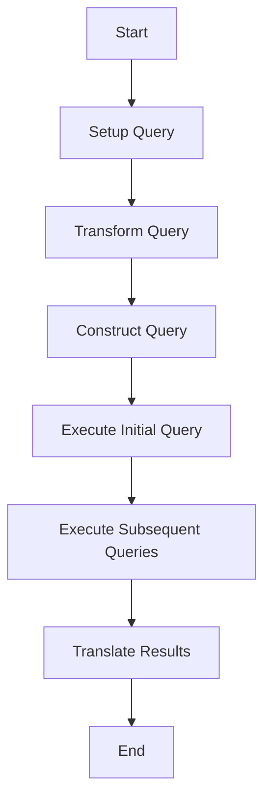

This document will cover the Query Execution Flow, which includes:

1. Setting up the query
2. Transforming the query
3. Constructing the query
4. Executing the initial query
5. Executing subsequent queries
6. Translating results.

Technical document: <SwmLink doc-title="Overview of the Query Execution Flow">[Overview of the Query Execution Flow](/.swm/overview-of-the-query-execution-flow.ihzh2dfz.sw.md)</SwmLink>

# [Setting up the query](https://app.swimm.io/repos/Z2l0aHViJTNBJTNBc2VudHJ5LWRlbW8tMSUzQSUzQVN3aW1tLURlbW8=/docs/ihzh2dfz#running-the-query)

The query execution flow begins with setting up the necessary groupings and conditions. This step involves defining the parameters and criteria that will be used to filter and group the data. The goal is to ensure that the query retrieves the most relevant metrics data for the user's needs.

# [Transforming the query](https://app.swimm.io/repos/Z2l0aHViJTNBJTNBc2VudHJ5LWRlbW8tMSUzQSUzQVN3aW1tLURlbW8=/docs/ihzh2dfz#transforming-the-query)

The next step is transforming the query into a format that the metrics layer can understand. This transformation is essential for ensuring compatibility and proper execution. It involves converting various components of the query, such as select, groupby, limit, and orderby, to align with the metrics layer's requirements.

# [Constructing the query](https://app.swimm.io/repos/Z2l0aHViJTNBJTNBc2VudHJ5LWRlbW8tMSUzQSUzQVN3aW1tLURlbW8=/docs/ihzh2dfz#constructing-the-query)

In this step, the query is constructed by extracting the organization ID and setting up tenant IDs. The time intervals for the query are determined, and the query is modified to handle order by fields appropriately. This construction ensures that the query is well-formed and ready for execution.

# [Executing the initial query](https://app.swimm.io/repos/Z2l0aHViJTNBJTNBc2VudHJ5LWRlbW8tMSUzQSUzQVN3aW1tLURlbW8=/docs/ihzh2dfz#executing-initial-query)

The initial query is executed to fetch the totals. If no results are returned, the process skips the subsequent queries. If results are returned, the query fields are reset to the original fields, and the order by clause is removed to prepare for the second query.

# [Executing subsequent queries](https://app.swimm.io/repos/Z2l0aHViJTNBJTNBc2VudHJ5LWRlbW8tMSUzQSUzQVN3aW1tLURlbW8=/docs/ihzh2dfz#executing-subsequent-queries)

Subsequent queries are executed for each entity, applying group limit filters if necessary. The results are processed and stored in the results dictionary. This step ensures that all relevant data is retrieved and organized for further analysis.

# [Translating results](https://app.swimm.io/repos/Z2l0aHViJTNBJTNBc2VudHJ5LWRlbW8tMSUzQSUzQVN3aW1tLURlbW8=/docs/ihzh2dfz#translating-results)

The final step involves translating the results into a format suitable for the response. The SnubaResultConverter is used to handle this translation, ensuring that the data is presented in a user-friendly manner. If the include_meta flag is set, meta results are also translated.

&nbsp;

*This is an auto-generated document by Swimm AI 🌊 and has not yet been verified by a human*

<SwmMeta version="3.0.0" repo-id="Z2l0aHViJTNBJTNBc2VudHJ5LWRlbW8tMSUzQSUzQVN3aW1tLURlbW8=" repo-name="sentry-demo-1" doc-type="product-flows">Powered by [Swimm](/)</SwmMeta>
