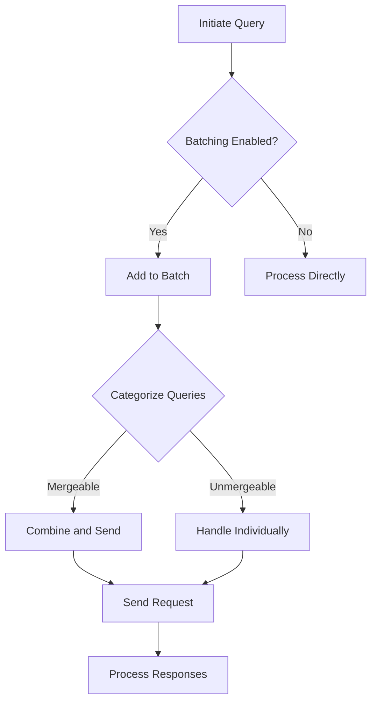

This document will cover the Query Function Flow, which includes:

1. Initiating the Query
2. Handling Batching
3. Processing Responses.

Technical document: <SwmLink doc-title="Query Function Flow">[Query Function Flow](/.swm/query-function-flow.9nu2nxpw.sw.md)</SwmLink>

# [Initiating the Query](https://app.swimm.io/repos/Z2l0aHViJTNBJTNBc2VudHJ5LWRlbW8tMSUzQSUzQVN3aW1tLURlbW8=/docs/9nu2nxpw#query-function)

The query process begins when a user initiates a query request. This step involves setting up the query with specific options such as whether batching is enabled or if the query should skip aborting. This setup ensures that the query is configured correctly before proceeding to the next steps.

# [Handling Batching](https://app.swimm.io/repos/Z2l0aHViJTNBJTNBc2VudHJ5LWRlbW8tMSUzQSUzQVN3aW1tLURlbW8=/docs/9nu2nxpw#discover-query)

Once the query is initiated, the system checks if batching is enabled. Batching allows multiple queries to be processed together, which can improve efficiency. If batching is enabled, the query is added to a batch. If not, the query is processed directly. This decision impacts how quickly and efficiently the queries are handled.

# [Adding to Batch](https://app.swimm.io/repos/Z2l0aHViJTNBJTNBc2VudHJ5LWRlbW8tMSUzQSUzQVN3aW1tLURlbW8=/docs/9nu2nxpw#batch-request)

When a query is added to a batch, it is stored temporarily until enough queries are collected to process together. This step involves creating a promise for the query and adding it to the batch context. This ensures that the system can manage multiple queries efficiently by processing them in groups.

# [Categorizing Queries](https://app.swimm.io/repos/Z2l0aHViJTNBJTNBc2VudHJ5LWRlbW8tMSUzQSUzQVN3aW1tLURlbW8=/docs/9nu2nxpw#handle-batching)

The batched queries are then categorized into mergeable and unmergeable queries. Mergeable queries are those that can be combined into a single request, while unmergeable queries need to be handled individually. This categorization helps in optimizing the query processing by reducing the number of requests sent to the server.

# [Processing Mergeable Queries](https://app.swimm.io/repos/Z2l0aHViJTNBJTNBc2VudHJ5LWRlbW8tMSUzQSUzQVN3aW1tLURlbW8=/docs/9nu2nxpw#handling-mergeable-queries)

Mergeable queries are combined and sent as a single request. This step involves iterating over the mergeable queries, checking if they can be merged based on their properties, and then sending a single batch request. This reduces the number of requests and improves the efficiency of the system.

# [Handling Unmergeable Queries](https://app.swimm.io/repos/Z2l0aHViJTNBJTNBc2VudHJ5LWRlbW8tMSUzQSUzQVN3aW1tLURlbW8=/docs/9nu2nxpw#handling-unmergeable-queries)

Unmergeable queries are handled individually. Each query is processed separately, and individual requests are sent for each query. This ensures that all queries, even those that cannot be merged, are processed correctly and efficiently.

# [Sending Requests](https://app.swimm.io/repos/Z2l0aHViJTNBJTNBc2VudHJ5LWRlbW8tMSUzQSUzQVN3aW1tLURlbW8=/docs/9nu2nxpw#sending-requests)

Once the queries are categorized and processed, the requests are sent to the server. This step involves using a helper function to send the request with the provided API client, path, and query object. The system ensures that the requests are sent correctly and efficiently.

# [Processing Responses](https://app.swimm.io/repos/Z2l0aHViJTNBJTNBc2VudHJ5LWRlbW8tMSUzQSUzQVN3aW1tLURlbW8=/docs/9nu2nxpw#request-promise)

After the requests are sent, the responses are processed. This step involves handling success and error responses, ensuring that errors are properly logged and managed. The system processes the responses to provide the necessary data to the user.

&nbsp;

*This is an auto-generated document by Swimm AI 🌊 and has not yet been verified by a human*

<SwmMeta version="3.0.0" repo-id="Z2l0aHViJTNBJTNBc2VudHJ5LWRlbW8tMSUzQSUzQVN3aW1tLURlbW8=" repo-name="sentry-demo-1" doc-type="product-flows">Powered by [Swimm](/)</SwmMeta>
