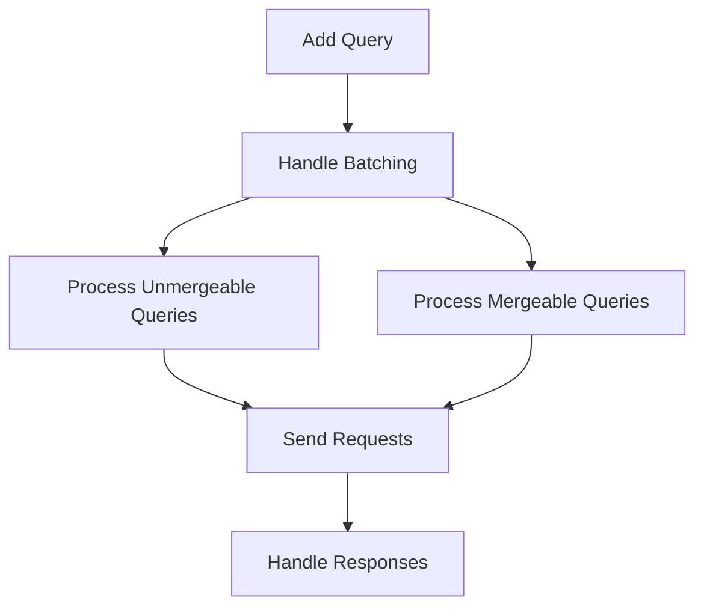

This document will cover the Query Handling feature, which includes:

1. Adding a query
2. Handling batching
3. Processing unmergeable queries
4. Processing mergeable queries
5. Sending requests
6. Handling responses.

Technical document: <SwmLink doc-title="Query Handling Overview">[Query Handling Overview](/.swm/query-handling-overview.hleqpcn6.sw.md)</SwmLink>

# [Adding a Query](https://app.swimm.io/repos/Z2l0aHViJTNBJTNBc2VudHJ5LWRlbW8tMSUzQSUzQVN3aW1tLURlbW8=/docs/hleqpcn6#adding-a-query)

When a new query is added, it is stored in a temporary storage and a timer is set to handle batching. This ensures that multiple queries can be grouped together and sent in a single request, which improves performance and reduces the number of network requests.

# [Handling Batching](https://app.swimm.io/repos/Z2l0aHViJTNBJTNBc2VudHJ5LWRlbW8tMSUzQSUzQVN3aW1tLURlbW8=/docs/hleqpcn6#handling-batching)

Batching is the process of grouping multiple queries together to send them in a single request. This step involves converting the stored queries into a format that can be processed, and then determining which queries can be merged together and which cannot. This helps in optimizing the performance by reducing the number of network requests.

# [Processing Unmergeable Queries](https://app.swimm.io/repos/Z2l0aHViJTNBJTNBc2VudHJ5LWRlbW8tMSUzQSUzQVN3aW1tLURlbW8=/docs/hleqpcn6#handling-unmergeable-queries)

Unmergeable queries are those that cannot be grouped with other queries. Each unmergeable query is processed individually. This ensures that even if a query cannot be batched, it is still handled and sent as a request.

# [Processing Mergeable Queries](https://app.swimm.io/repos/Z2l0aHViJTNBJTNBc2VudHJ5LWRlbW8tMSUzQSUzQVN3aW1tLURlbW8=/docs/hleqpcn6#handling-mergeable-queries)

Mergeable queries are those that can be grouped together based on certain properties. These queries are combined into a single request, which is then sent. This step helps in reducing the number of network requests by combining multiple queries into one.

# [Sending Requests](https://app.swimm.io/repos/Z2l0aHViJTNBJTNBc2VudHJ5LWRlbW8tMSUzQSUzQVN3aW1tLURlbW8=/docs/hleqpcn6#sending-requests)

Once the queries are processed, whether individually or in batches, they are sent as requests to the server. This step involves creating the request with the necessary parameters and sending it to the appropriate endpoint.

# [Handling Responses](https://app.swimm.io/repos/Z2l0aHViJTNBJTNBc2VudHJ5LWRlbW8tMSUzQSUzQVN3aW1tLURlbW8=/docs/hleqpcn6#request-handling)

After the requests are sent, the responses are handled to update the application state. This involves processing the data returned from the server and updating the relevant parts of the application to reflect the new data.

&nbsp;

*This is an auto-generated document by Swimm AI 🌊 and has not yet been verified by a human*

<SwmMeta version="3.0.0" repo-id="Z2l0aHViJTNBJTNBc2VudHJ5LWRlbW8tMSUzQSUzQVN3aW1tLURlbW8=" repo-name="sentry-demo-1" doc-type="product-flows">Powered by [Swimm](/)</SwmMeta>
