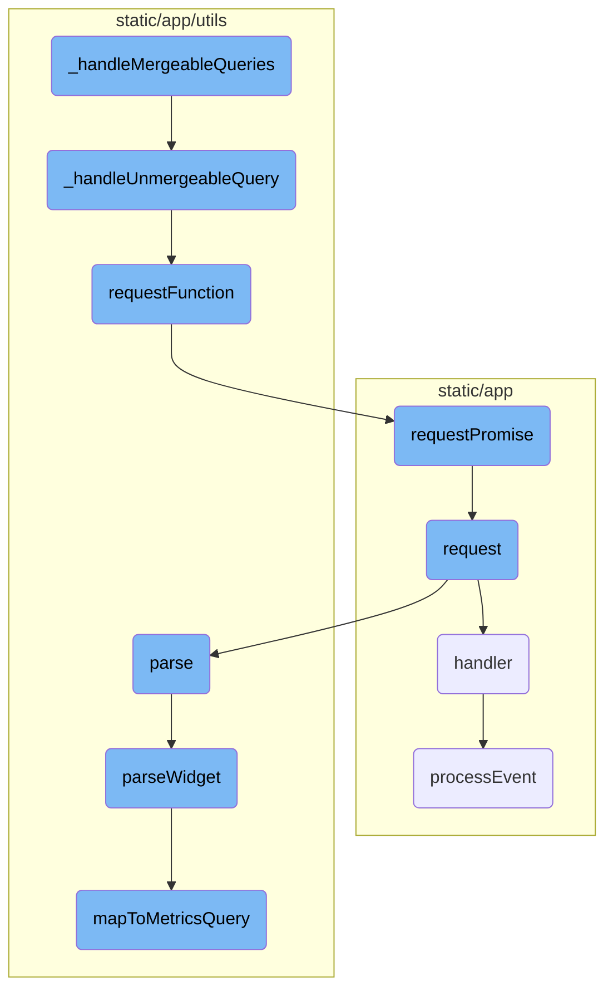

This document provides an overview of the <SwmToken path="static/app/utils/performance/contexts/genericQueryBatcher.tsx" pos="231:4:4" line-data="export function QueryBatchNode(props: {">`QueryBatchNode`</SwmToken> and its role in batching API requests. It explains how the <SwmToken path="static/app/utils/performance/contexts/genericQueryBatcher.tsx" pos="231:4:4" line-data="export function QueryBatchNode(props: {">`QueryBatchNode`</SwmToken> initializes the batching context, adds queries to the batch, handles batching, and processes both mergeable and unmergeable queries.

The <SwmToken path="static/app/utils/performance/contexts/genericQueryBatcher.tsx" pos="231:4:4" line-data="export function QueryBatchNode(props: {">`QueryBatchNode`</SwmToken> is responsible for efficiently managing API requests by batching them together. It starts by initializing a context for batching. When a query is added, it is stored and a timeout is set to handle batching in the next frame. The batching process involves converting queries into a merge map and handling both mergeable and unmergeable queries. Mergeable queries are combined into a single request, while unmergeable queries are processed individually. This approach reduces the number of API requests and improves performance.

Here is a high level diagram of the flow, showing only the most important functions:

```mermaid
graph TD;
      subgraph static/app/utils
19bcf8f8b1f2aff9b2edcdbc955e10351cd38e085fe43dd45d0fd57881500d6e(QueryBatchNode):::mainFlowStyle --> e2b67c983350bd142a5aaa1f1017d4bb264a9702d05bb48934bfa23cd89dfb08(addQuery):::mainFlowStyle
end

subgraph static/app/utils
e2b67c983350bd142a5aaa1f1017d4bb264a9702d05bb48934bfa23cd89dfb08(addQuery):::mainFlowStyle --> 5b8c3af4c29605a7099831493304f29e9563c92a87bbc1501f00c37a627ee007(handleBatching):::mainFlowStyle
end

subgraph static/app/utils
5b8c3af4c29605a7099831493304f29e9563c92a87bbc1501f00c37a627ee007(handleBatching):::mainFlowStyle --> 4828141d547f5f2e5afec5603e540d98fdbd67e4d4c1471cbb0eae026cd0cfbf(_handleUnmergeableQueries)
end

subgraph static/app/utils
5b8c3af4c29605a7099831493304f29e9563c92a87bbc1501f00c37a627ee007(handleBatching):::mainFlowStyle --> 90ff9374397a0adb357fe4c2249524c2149f81c211a4b8b1f471066ba428f2de(_handleMergeableQueries):::mainFlowStyle
end

subgraph static/app/utils
90ff9374397a0adb357fe4c2249524c2149f81c211a4b8b1f471066ba428f2de(_handleMergeableQueries):::mainFlowStyle --> b06d6a338d77963cde2551f503a2ce3b3530fa37719ed3615534229f27eaf648(_handleUnmergeableQuery):::mainFlowStyle
end

subgraph static/app/utils
b06d6a338d77963cde2551f503a2ce3b3530fa37719ed3615534229f27eaf648(_handleUnmergeableQuery):::mainFlowStyle --> c4380a03d42ac0c65470f5ea342d4dce126f01939798968b2931ae3e5837aea5(requestFunction):::mainFlowStyle
end

subgraph static/app
c4380a03d42ac0c65470f5ea342d4dce126f01939798968b2931ae3e5837aea5(requestFunction):::mainFlowStyle --> 1025c11ff078741e3a52849e4dc81510d630800b045c60aea951683433a1c993(requestPromise):::mainFlowStyle
end

subgraph static/app
1025c11ff078741e3a52849e4dc81510d630800b045c60aea951683433a1c993(requestPromise):::mainFlowStyle --> 4f5a67a71dfb71654db327ed24d5e8187187a49b58963a473eec18ecb0aef026(request):::mainFlowStyle
end

subgraph static/app
4f5a67a71dfb71654db327ed24d5e8187187a49b58963a473eec18ecb0aef026(request):::mainFlowStyle --> 2cd409575454572c7b228bde73d6eb55227f3d7b14d37cc7ca5415bbcb81e4e5(handler)
end

subgraph static/app/utils
4f5a67a71dfb71654db327ed24d5e8187187a49b58963a473eec18ecb0aef026(request):::mainFlowStyle --> 4b2faee236c2e651d9932fa234f72966df49f7aa0f85eb9909d65f4b6d8ce1a6(parse):::mainFlowStyle
end

subgraph static/app/utils
4b2faee236c2e651d9932fa234f72966df49f7aa0f85eb9909d65f4b6d8ce1a6(parse):::mainFlowStyle --> b2b47f6077e96a1ff47606d77c3fe70b18a84edc0ab0fa1349f7face4165d2ea(parseWidget):::mainFlowStyle
end

subgraph static/app/utils
b2b47f6077e96a1ff47606d77c3fe70b18a84edc0ab0fa1349f7face4165d2ea(parseWidget):::mainFlowStyle --> 05bf2ddeab316943d2187e10bc3886949b4b03ae946f68d4f27a5bfc0025e132(mapToMetricsQuery):::mainFlowStyle
end

subgraph static/app/utils
05bf2ddeab316943d2187e10bc3886949b4b03ae946f68d4f27a5bfc0025e132(mapToMetricsQuery):::mainFlowStyle --> 635bb507b11255a8fd7c2375dac3b6c46b736470cf89007061c6861fc973e73b(fetchAvailableTags)
end


      classDef mainFlowStyle color:#000000,fill:#7CB9F4
classDef rootsStyle color:#000000,fill:#00FFF4
classDef Style1 color:#000000,fill:#00FFAA
classDef Style2 color:#000000,fill:#FFFF00
classDef Style3 color:#000000,fill:#AA7CB9

%% Swimm:
%% graph TD;
%%       subgraph <SwmPath>[static/app/utils/](static/app/utils/)</SwmPath>
%% 19bcf8f8b1f2aff9b2edcdbc955e10351cd38e085fe43dd45d0fd57881500d6e(QueryBatchNode):::mainFlowStyle --> e2b67c983350bd142a5aaa1f1017d4bb264a9702d05bb48934bfa23cd89dfb08(addQuery):::mainFlowStyle
%% end
%% 
%% subgraph <SwmPath>[static/app/utils/](static/app/utils/)</SwmPath>
%% e2b67c983350bd142a5aaa1f1017d4bb264a9702d05bb48934bfa23cd89dfb08(addQuery):::mainFlowStyle --> 5b8c3af4c29605a7099831493304f29e9563c92a87bbc1501f00c37a627ee007(handleBatching):::mainFlowStyle
%% end
%% 
%% subgraph <SwmPath>[static/app/utils/](static/app/utils/)</SwmPath>
%% 5b8c3af4c29605a7099831493304f29e9563c92a87bbc1501f00c37a627ee007(handleBatching):::mainFlowStyle --> 4828141d547f5f2e5afec5603e540d98fdbd67e4d4c1471cbb0eae026cd0cfbf(_handleUnmergeableQueries)
%% end
%% 
%% subgraph <SwmPath>[static/app/utils/](static/app/utils/)</SwmPath>
%% 5b8c3af4c29605a7099831493304f29e9563c92a87bbc1501f00c37a627ee007(handleBatching):::mainFlowStyle --> 90ff9374397a0adb357fe4c2249524c2149f81c211a4b8b1f471066ba428f2de(_handleMergeableQueries):::mainFlowStyle
%% end
%% 
%% subgraph <SwmPath>[static/app/utils/](static/app/utils/)</SwmPath>
%% 90ff9374397a0adb357fe4c2249524c2149f81c211a4b8b1f471066ba428f2de(_handleMergeableQueries):::mainFlowStyle --> b06d6a338d77963cde2551f503a2ce3b3530fa37719ed3615534229f27eaf648(_handleUnmergeableQuery):::mainFlowStyle
%% end
%% 
%% subgraph <SwmPath>[static/app/utils/](static/app/utils/)</SwmPath>
%% b06d6a338d77963cde2551f503a2ce3b3530fa37719ed3615534229f27eaf648(_handleUnmergeableQuery):::mainFlowStyle --> c4380a03d42ac0c65470f5ea342d4dce126f01939798968b2931ae3e5837aea5(requestFunction):::mainFlowStyle
%% end
%% 
%% subgraph <SwmPath>[static/app/](static/app/)</SwmPath>
%% c4380a03d42ac0c65470f5ea342d4dce126f01939798968b2931ae3e5837aea5(requestFunction):::mainFlowStyle --> 1025c11ff078741e3a52849e4dc81510d630800b045c60aea951683433a1c993(requestPromise):::mainFlowStyle
%% end
%% 
%% subgraph <SwmPath>[static/app/](static/app/)</SwmPath>
%% 1025c11ff078741e3a52849e4dc81510d630800b045c60aea951683433a1c993(requestPromise):::mainFlowStyle --> 4f5a67a71dfb71654db327ed24d5e8187187a49b58963a473eec18ecb0aef026(request):::mainFlowStyle
%% end
%% 
%% subgraph <SwmPath>[static/app/](static/app/)</SwmPath>
%% 4f5a67a71dfb71654db327ed24d5e8187187a49b58963a473eec18ecb0aef026(request):::mainFlowStyle --> 2cd409575454572c7b228bde73d6eb55227f3d7b14d37cc7ca5415bbcb81e4e5(handler)
%% end
%% 
%% subgraph <SwmPath>[static/app/utils/](static/app/utils/)</SwmPath>
%% 4f5a67a71dfb71654db327ed24d5e8187187a49b58963a473eec18ecb0aef026(request):::mainFlowStyle --> 4b2faee236c2e651d9932fa234f72966df49f7aa0f85eb9909d65f4b6d8ce1a6(parse):::mainFlowStyle
%% end
%% 
%% subgraph <SwmPath>[static/app/utils/](static/app/utils/)</SwmPath>
%% 4b2faee236c2e651d9932fa234f72966df49f7aa0f85eb9909d65f4b6d8ce1a6(parse):::mainFlowStyle --> b2b47f6077e96a1ff47606d77c3fe70b18a84edc0ab0fa1349f7face4165d2ea(parseWidget):::mainFlowStyle
%% end
%% 
%% subgraph <SwmPath>[static/app/utils/](static/app/utils/)</SwmPath>
%% b2b47f6077e96a1ff47606d77c3fe70b18a84edc0ab0fa1349f7face4165d2ea(parseWidget):::mainFlowStyle --> 05bf2ddeab316943d2187e10bc3886949b4b03ae946f68d4f27a5bfc0025e132(mapToMetricsQuery):::mainFlowStyle
%% end
%% 
%% subgraph <SwmPath>[static/app/utils/](static/app/utils/)</SwmPath>
%% 05bf2ddeab316943d2187e10bc3886949b4b03ae946f68d4f27a5bfc0025e132(mapToMetricsQuery):::mainFlowStyle --> 635bb507b11255a8fd7c2375dac3b6c46b736470cf89007061c6861fc973e73b(fetchAvailableTags)
%% end
%% 
%% 
%%       classDef mainFlowStyle color:#000000,fill:#7CB9F4
%% classDef rootsStyle color:#000000,fill:#00FFF4
%% classDef Style1 color:#000000,fill:#00FFAA
%% classDef Style2 color:#000000,fill:#FFFF00
%% classDef Style3 color:#000000,fill:#AA7CB9
```



# Flow drill down

First, we'll zoom into this section of the flow:

```mermaid
graph TD;
      subgraph static/app/utils/performance/contexts/genericQueryBatcher.tsx
19bcf8f8b1f2aff9b2edcdbc955e10351cd38e085fe43dd45d0fd57881500d6e(QueryBatchNode):::mainFlowStyle --> e2b67c983350bd142a5aaa1f1017d4bb264a9702d05bb48934bfa23cd89dfb08(addQuery):::mainFlowStyle
end

subgraph static/app/utils/performance/contexts/genericQueryBatcher.tsx
e2b67c983350bd142a5aaa1f1017d4bb264a9702d05bb48934bfa23cd89dfb08(addQuery):::mainFlowStyle --> 5b8c3af4c29605a7099831493304f29e9563c92a87bbc1501f00c37a627ee007(handleBatching):::mainFlowStyle
end

subgraph static/app/utils/performance/contexts/genericQueryBatcher.tsx
5b8c3af4c29605a7099831493304f29e9563c92a87bbc1501f00c37a627ee007(handleBatching):::mainFlowStyle --> 4828141d547f5f2e5afec5603e540d98fdbd67e4d4c1471cbb0eae026cd0cfbf(_handleUnmergeableQueries)
end

subgraph static/app/utils/performance/contexts/genericQueryBatcher.tsx
5b8c3af4c29605a7099831493304f29e9563c92a87bbc1501f00c37a627ee007(handleBatching):::mainFlowStyle --> 90ff9374397a0adb357fe4c2249524c2149f81c211a4b8b1f471066ba428f2de(_handleMergeableQueries):::mainFlowStyle
end

subgraph static/app/utils/performance/contexts/genericQueryBatcher.tsx
90ff9374397a0adb357fe4c2249524c2149f81c211a4b8b1f471066ba428f2de(_handleMergeableQueries):::mainFlowStyle --> wlm5r(...)
end


      classDef mainFlowStyle color:#000000,fill:#7CB9F4
classDef rootsStyle color:#000000,fill:#00FFF4
classDef Style1 color:#000000,fill:#00FFAA
classDef Style2 color:#000000,fill:#FFFF00
classDef Style3 color:#000000,fill:#AA7CB9

%% Swimm:
%% graph TD;
%%       subgraph <SwmPath>[static/app/utils/performance/contexts/genericQueryBatcher.tsx](static/app/utils/performance/contexts/genericQueryBatcher.tsx)</SwmPath>
%% 19bcf8f8b1f2aff9b2edcdbc955e10351cd38e085fe43dd45d0fd57881500d6e(QueryBatchNode):::mainFlowStyle --> e2b67c983350bd142a5aaa1f1017d4bb264a9702d05bb48934bfa23cd89dfb08(addQuery):::mainFlowStyle
%% end
%% 
%% subgraph <SwmPath>[static/app/utils/performance/contexts/genericQueryBatcher.tsx](static/app/utils/performance/contexts/genericQueryBatcher.tsx)</SwmPath>
%% e2b67c983350bd142a5aaa1f1017d4bb264a9702d05bb48934bfa23cd89dfb08(addQuery):::mainFlowStyle --> 5b8c3af4c29605a7099831493304f29e9563c92a87bbc1501f00c37a627ee007(handleBatching):::mainFlowStyle
%% end
%% 
%% subgraph <SwmPath>[static/app/utils/performance/contexts/genericQueryBatcher.tsx](static/app/utils/performance/contexts/genericQueryBatcher.tsx)</SwmPath>
%% 5b8c3af4c29605a7099831493304f29e9563c92a87bbc1501f00c37a627ee007(handleBatching):::mainFlowStyle --> 4828141d547f5f2e5afec5603e540d98fdbd67e4d4c1471cbb0eae026cd0cfbf(_handleUnmergeableQueries)
%% end
%% 
%% subgraph <SwmPath>[static/app/utils/performance/contexts/genericQueryBatcher.tsx](static/app/utils/performance/contexts/genericQueryBatcher.tsx)</SwmPath>
%% 5b8c3af4c29605a7099831493304f29e9563c92a87bbc1501f00c37a627ee007(handleBatching):::mainFlowStyle --> 90ff9374397a0adb357fe4c2249524c2149f81c211a4b8b1f471066ba428f2de(_handleMergeableQueries):::mainFlowStyle
%% end
%% 
%% subgraph <SwmPath>[static/app/utils/performance/contexts/genericQueryBatcher.tsx](static/app/utils/performance/contexts/genericQueryBatcher.tsx)</SwmPath>
%% 90ff9374397a0adb357fe4c2249524c2149f81c211a4b8b1f471066ba428f2de(_handleMergeableQueries):::mainFlowStyle --> wlm5r(...)
%% end
%% 
%% 
%%       classDef mainFlowStyle color:#000000,fill:#7CB9F4
%% classDef rootsStyle color:#000000,fill:#00FFF4
%% classDef Style1 color:#000000,fill:#00FFAA
%% classDef Style2 color:#000000,fill:#FFFF00
%% classDef Style3 color:#000000,fill:#AA7CB9
```



<SwmSnippet path="/static/app/utils/performance/contexts/genericQueryBatcher.tsx" line="229">

---

## <SwmToken path="static/app/utils/performance/contexts/genericQueryBatcher.tsx" pos="231:4:4" line-data="export function QueryBatchNode(props: {">`QueryBatchNode`</SwmToken> Initialization

The <SwmToken path="static/app/utils/performance/contexts/genericQueryBatcher.tsx" pos="231:4:4" line-data="export function QueryBatchNode(props: {">`QueryBatchNode`</SwmToken> function initializes the batching context for API requests. It wraps the API request components to collect at most one request per frame/render pass using a symbol as a unique identifier. The function transforms these requests into an intermediate promise and adds a query definition that the batch function will use. This setup ensures that multiple requests can be batched together efficiently.

```tsx
// Wraps api request components to collect at most one request per frame / render pass using symbol as a unique id.
// Transforms these requests into an intermediate promise and adds a query definition that the batch function will use.
export function QueryBatchNode(props: {
  batchProperty: string;
  children(_: any): React.ReactNode;
  transform?: Transform;
}) {
  const api = useApi();
  const {batchProperty, children, transform} = props;
  const id = useRef(Symbol());

  let batchContext: QueryBatch;
  try {
    batchContext = _useGenericQueryBatcher();
  } catch (_) {
    return <Fragment>{children({})}</Fragment>;
  }

  function batchRequest(
    _: Client,
    path: string,
```

---

</SwmSnippet>

<SwmSnippet path="/static/app/utils/performance/contexts/genericQueryBatcher.tsx" line="188">

---

## Adding Queries to Batch

The <SwmToken path="static/app/utils/performance/contexts/genericQueryBatcher.tsx" pos="188:3:3" line-data="  const addQuery = (q: BatchQueryDefinition, id: symbol) =&gt; {">`addQuery`</SwmToken> function adds a query to the batch. It stores the query in a current queries object and sets a timeout to handle batching in the next macro task. This allows the system to aggregate all requests within the current frame before sending them out.

```tsx
  const addQuery = (q: BatchQueryDefinition, id: symbol) => {
    queries.current[id] = q;

    window.clearTimeout(timeoutRef.current);
    // Put batch function in the next macro task to aggregate all requests in this frame.
    timeoutRef.current = window.setTimeout(() => {
      handleBatching(organization, queries.current);
      timeoutRef.current = undefined;
    }, 0);
  };
```

---

</SwmSnippet>

<SwmSnippet path="/static/app/utils/performance/contexts/genericQueryBatcher.tsx" line="153">

---

## Handling Batching

The <SwmToken path="static/app/utils/performance/contexts/genericQueryBatcher.tsx" pos="153:2:2" line-data="function handleBatching(">`handleBatching`</SwmToken> function processes the batched queries. It first converts the queries into a merge map. Then, it handles both mergeable and unmergeable queries, tracking the number of queries collected, saved, and sent. This function ensures that the queries are efficiently batched and sent, reducing the number of API requests.

```tsx
function handleBatching(
  organization: Organization,
  queries: Record<symbol, BatchQueryDefinition>
) {
  const mergeMap = queriesToMap(queries);

  if (!mergeMap) {
    return;
  }

  let queriesSent = 0;
  queriesSent += _handleUnmergeableQueries(mergeMap);
  queriesSent += _handleMergeableQueries(mergeMap);

  const queriesCollected = Object.values(mergeMap).reduce(
    (acc, mergeList) => acc + mergeList.length,
    0
  );

  const queriesSaved = queriesCollected - queriesSent;

```

---

</SwmSnippet>

<SwmSnippet path="/static/app/utils/performance/contexts/genericQueryBatcher.tsx" line="80">

---

### Handling Unmergeable Queries

The <SwmToken path="static/app/utils/performance/contexts/genericQueryBatcher.tsx" pos="80:2:2" line-data="function _handleUnmergeableQueries(mergeMap: MergeMap) {">`_handleUnmergeableQueries`</SwmToken> function processes queries that cannot be merged. It iterates over the merge map and handles each unmergeable query individually. This ensures that even queries that cannot be batched are still processed and sent.

```tsx
function _handleUnmergeableQueries(mergeMap: MergeMap) {
  let queriesSent = 0;
  Object.keys(mergeMap).forEach(k => {
    // Using async forEach to ensure calls start in parallel.
    const mergeList = mergeMap[k];

    if (mergeList.length === 1) {
      const [queryDefinition] = mergeList;
      queriesSent++;
      _handleUnmergeableQuery(queryDefinition);
    }
  });

  return queriesSent;
}
```

---

</SwmSnippet>

Now, lets zoom into this section of the flow:



<SwmSnippet path="/static/app/utils/performance/contexts/genericQueryBatcher.tsx" line="96">

---

## Handling Mergeable Queries

The function <SwmToken path="static/app/utils/performance/contexts/genericQueryBatcher.tsx" pos="96:2:2" line-data="function _handleMergeableQueries(mergeMap: MergeMap) {">`_handleMergeableQueries`</SwmToken> processes queries that can be batched together. It iterates over the <SwmToken path="static/app/utils/performance/contexts/genericQueryBatcher.tsx" pos="96:4:4" line-data="function _handleMergeableQueries(mergeMap: MergeMap) {">`mergeMap`</SwmToken>, checks if the queries can be merged, and sends a single request for the batch. If the queries cannot be merged, it delegates them to <SwmToken path="static/app/utils/performance/contexts/genericQueryBatcher.tsx" pos="71:2:2" line-data="function _handleUnmergeableQuery(queryDefinition: BatchQueryDefinition) {">`_handleUnmergeableQuery`</SwmToken>.

```tsx
function _handleMergeableQueries(mergeMap: MergeMap) {
  let queriesSent = 0;
  Object.keys(mergeMap).forEach(async k => {
    const mergeList = mergeMap[k];

    if (mergeList.length <= 1) {
      return;
    }

    const [exampleDefinition] = mergeList;
    const batchProperty = exampleDefinition.batchProperty;
    const query = {...exampleDefinition.requestQueryObject.query};
    const requestQueryObject = {...exampleDefinition.requestQueryObject, query};

    const batchValues: string[] = [];

    mergeList.forEach(q => {
      const batchFieldValue = q.requestQueryObject.query[batchProperty];
      if (Array.isArray(batchFieldValue)) {
        if (batchFieldValue.length > 1) {
          // Omit multiple requests with multi fields (eg. yAxis) for now and run them as single queries
```

---

</SwmSnippet>

<SwmSnippet path="/static/app/utils/performance/contexts/genericQueryBatcher.tsx" line="71">

---

### Handling Unmergeable Queries

The function <SwmToken path="static/app/utils/performance/contexts/genericQueryBatcher.tsx" pos="71:2:2" line-data="function _handleUnmergeableQuery(queryDefinition: BatchQueryDefinition) {">`_handleUnmergeableQuery`</SwmToken> handles queries that cannot be merged by sending individual requests for each query.

```tsx
function _handleUnmergeableQuery(queryDefinition: BatchQueryDefinition) {
  const result = requestFunction(
    queryDefinition.api,
    queryDefinition.path,
    queryDefinition.requestQueryObject
  );
  queryDefinition.resolve(result);
}
```

---

</SwmSnippet>

<SwmSnippet path="/static/app/utils/performance/contexts/genericQueryBatcher.tsx" line="67">

---

### Sending Requests

The function <SwmToken path="static/app/utils/performance/contexts/genericQueryBatcher.tsx" pos="67:2:2" line-data="function requestFunction(api: Client, path: string, queryObject: QueryObject) {">`requestFunction`</SwmToken> sends a request using the <SwmToken path="static/app/utils/performance/contexts/genericQueryBatcher.tsx" pos="67:4:4" line-data="function requestFunction(api: Client, path: string, queryObject: QueryObject) {">`api`</SwmToken> client and returns a promise.

```tsx
function requestFunction(api: Client, path: string, queryObject: QueryObject) {
  return api.requestPromise(path, queryObject);
}
```

---

</SwmSnippet>

<SwmSnippet path="/static/app/api.tsx" line="656">

---

### Request Promise

The method <SwmToken path="static/app/api.tsx" pos="656:1:1" line-data="  requestPromise&lt;IncludeAllArgsType extends boolean&gt;(">`requestPromise`</SwmToken> creates and returns a promise for an API request, handling success and error responses.

```tsx
  requestPromise<IncludeAllArgsType extends boolean>(
    path: string,
    {
      includeAllArgs,
      ...options
    }: {includeAllArgs?: IncludeAllArgsType} & Readonly<RequestOptions> = {}
  ): Promise<IncludeAllArgsType extends true ? ApiResult : any> {
    // Create an error object here before we make any async calls so that we
    // have a helpful stack trace if it errors
    //
    // This *should* get logged to Sentry only if the promise rejection is not handled
    // (since SDK captures unhandled rejections). Ideally we explicitly ignore rejection
    // or handle with a user friendly error message
    const preservedError = new Error('API Request Error');

    return new Promise((resolve, reject) =>
      this.request(path, {
        ...options,
        preservedError,
        success: (data, textStatus, resp) => {
          if (includeAllArgs) {
```

---

</SwmSnippet>

<SwmSnippet path="/static/app/api.tsx" line="420">

---

### Making the Request

The method <SwmToken path="static/app/api.tsx" pos="420:1:1" line-data="  request(path: string, options: Readonly&lt;RequestOptions&gt; = {}): Request {">`request`</SwmToken> constructs and sends the actual HTTP request, handling various aspects like headers, data, and response parsing.

```tsx
  request(path: string, options: Readonly<RequestOptions> = {}): Request {
    const method = options.method || (options.data ? 'POST' : 'GET');

    let fullUrl = buildRequestUrl(this.baseUrl, path, options);

    let data = options.data;

    if (data !== undefined && method !== 'GET' && !(data instanceof FormData)) {
      data = JSON.stringify(data);
    }

    // TODO(epurkhiser): Mimicking the old jQuery API, data could be a string /
    // object for GET requests. jQuery just sticks it onto the URL as query
    // parameters
    if (method === 'GET' && data) {
      const queryString = typeof data === 'string' ? data : qs.stringify(data);

      if (queryString.length > 0) {
        fullUrl = fullUrl + (fullUrl.includes('?') ? '&' : '?') + queryString;
      }
    }
```

---

</SwmSnippet>

<SwmSnippet path="/static/app/components/replays/canvasReplayerPlugin.tsx" line="230">

---

### Processing Events

The function <SwmToken path="static/app/components/replays/canvasReplayerPlugin.tsx" pos="233:5:5" line-data="  async function processEvent(e: CanvasEventWithTime, {replayer}: {replayer: Replayer}) {">`processEvent`</SwmToken> processes canvas mutation events, updating the canvas and handling errors.

```tsx
  /**
   * Processes canvas mutation events
   */
  async function processEvent(e: CanvasEventWithTime, {replayer}: {replayer: Replayer}) {
    preload(e);

    const source = replayer.getMirror().getNode(e.data.id);
    const target =
      canvases.get(e.data.id) ||
      (source && cloneCanvas(e.data.id, source as HTMLCanvasElement));

    if (!target) {
      throw new InvalidCanvasNodeError('No canvas found for id');
    }

    await canvasMutation({
      event: e,
      mutation: e.data,
      target,
      imageMap,
      canvasEventMap,
```

---

</SwmSnippet>

<SwmSnippet path="/static/app/utils/metrics/dashboardImport.tsx" line="179">

---

### Parsing Widgets

The method <SwmToken path="static/app/utils/metrics/dashboardImport.tsx" pos="179:5:5" line-data="  private async parseWidget() {">`parseWidget`</SwmToken> parses the widget definition, processes requests, and maps them to metrics queries.

```tsx
  private async parseWidget() {
    this.parseLegendColumns();

    const {title, requests = []} = this.importedWidget.definition as WidgetDefinition;

    const parsedRequests = requests.map(r => this.parseRequest(r));
    const parsedQueries = parsedRequests.flatMap(request => request.queries);

    const metricsQueries = await Promise.all(
      parsedQueries.map(async query => {
        const mapped = await this.mapToMetricsQuery(query);
        return {
          ...mapped,
        };
      })
    );

    const nonEmptyQueries = metricsQueries.filter(query => query.mri) as MetricsQuery[];

    if (!nonEmptyQueries.length) {
      return null;
```

---

</SwmSnippet>

<SwmSnippet path="/static/app/utils/metrics/dashboardImport.tsx" line="397">

---

### Mapping to Metrics Query

The method <SwmToken path="static/app/utils/metrics/dashboardImport.tsx" pos="398:5:5" line-data="  private async mapToMetricsQuery(widget): Promise&lt;MetricsQuery | null&gt; {">`mapToMetricsQuery`</SwmToken> maps a widget's query to a metrics query, fetching available tags and constructing the query filter and group by clauses.

```tsx
  // Mapping functions
  private async mapToMetricsQuery(widget): Promise<MetricsQuery | null> {
    const {metric, aggregation, filters} = widget;

    // @ts-expect-error name is actually defined on MetricMeta
    const metricMeta = this.availableMetrics.find(m => m.name === metric);

    if (!metricMeta) {
      this.errors.push(`widget.request.query - metric not found: ${metric}`);
      return null;
    }

    const availableTags = await this.fetchAvailableTags(metricMeta.mri);

    const query = this.constructMetricQueryFilter(filters, availableTags);
    const groupBy = this.constructMetricGroupBy(widget.groupBy, availableTags);

    return {
      mri: metricMeta.mri,
      aggregation,
      query,
```

---

</SwmSnippet>

&nbsp;

*This is an auto-generated document by Swimm AI 🌊 and has not yet been verified by a human*

<SwmMeta version="3.0.0" repo-id="Z2l0aHViJTNBJTNBc2VudHJ5LWRlbW8tMSUzQSUzQVN3aW1tLURlbW8=" repo-name="sentry-demo-1" doc-type="flows"><sup>Powered by [Swimm](/)</sup></SwmMeta>
