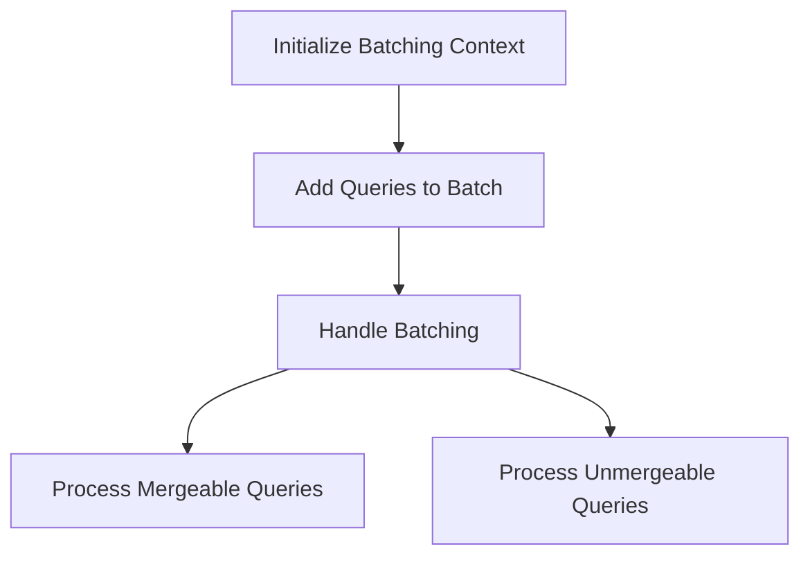

This document will cover the QueryBatchNode feature, which includes:

1. Initializing the batching context
2. Adding queries to the batch
3. Handling batching
4. Processing mergeable and unmergeable queries.

Technical document: <SwmLink doc-title="QueryBatchNode Overview">[QueryBatchNode Overview](/.swm/querybatchnode-overview.93fmzvgi.sw.md)</SwmLink>

# [Initializing the Batching Context](https://app.swimm.io/repos/Z2l0aHViJTNBJTNBc2VudHJ5LWRlbW8tMSUzQSUzQVN3aW1tLURlbW8=/docs/93fmzvgi#querybatchnode-initialization)

The QueryBatchNode function sets up the environment for batching API requests. It wraps the API request components to ensure that only one request is collected per frame or render pass. This is achieved by using a unique identifier for each request. The function then transforms these requests into an intermediate promise and adds a query definition that the batch function will use. This setup is crucial for efficiently managing multiple API requests by batching them together.

# [Adding Queries to the Batch](https://app.swimm.io/repos/Z2l0aHViJTNBJTNBc2VudHJ5LWRlbW8tMSUzQSUzQVN3aW1tLURlbW8=/docs/93fmzvgi#adding-queries-to-batch)

The addQuery function is responsible for adding individual queries to the batch. When a query is added, it is stored in a current queries object. A timeout is then set to handle batching in the next macro task. This allows the system to aggregate all requests within the current frame before sending them out. This step is essential for reducing the number of API requests by combining them into a single batch.

# [Handling Batching](https://app.swimm.io/repos/Z2l0aHViJTNBJTNBc2VudHJ5LWRlbW8tMSUzQSUzQVN3aW1tLURlbW8=/docs/93fmzvgi#handling-batching)

The handleBatching function processes the batched queries. It first converts the queries into a merge map, which organizes the queries based on their mergeability. The function then handles both mergeable and unmergeable queries. Mergeable queries are combined into a single request, while unmergeable queries are processed individually. This function ensures that the queries are efficiently batched and sent, thereby reducing the number of API requests and improving performance.

# [Processing Mergeable Queries](https://app.swimm.io/repos/Z2l0aHViJTNBJTNBc2VudHJ5LWRlbW8tMSUzQSUzQVN3aW1tLURlbW8=/docs/93fmzvgi#handling-mergeable-queries)

The \_handleMergeableQueries function processes queries that can be batched together. It iterates over the merge map, checks if the queries can be merged, and sends a single request for the batch. If the queries cannot be merged, they are delegated to the \_handleUnmergeableQuery function. This step is crucial for optimizing the number of API requests by combining multiple queries into a single request whenever possible.

# [Processing Unmergeable Queries](https://app.swimm.io/repos/Z2l0aHViJTNBJTNBc2VudHJ5LWRlbW8tMSUzQSUzQVN3aW1tLURlbW8=/docs/93fmzvgi#handling-unmergeable-queries)

The \_handleUnmergeableQueries function processes queries that cannot be merged. It iterates over the merge map and handles each unmergeable query individually. This ensures that even queries that cannot be batched are still processed and sent. This step is essential for ensuring that all queries, regardless of their mergeability, are handled efficiently.

&nbsp;

*This is an auto-generated document by Swimm AI 🌊 and has not yet been verified by a human*

<SwmMeta version="3.0.0" repo-id="Z2l0aHViJTNBJTNBc2VudHJ5LWRlbW8tMSUzQSUzQVN3aW1tLURlbW8=" repo-name="sentry-demo-1" doc-type="product-flows">Powered by [Swimm](/)</SwmMeta>
