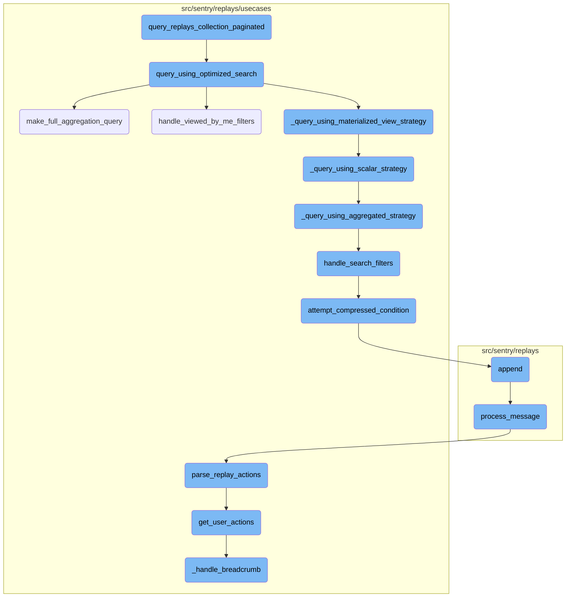
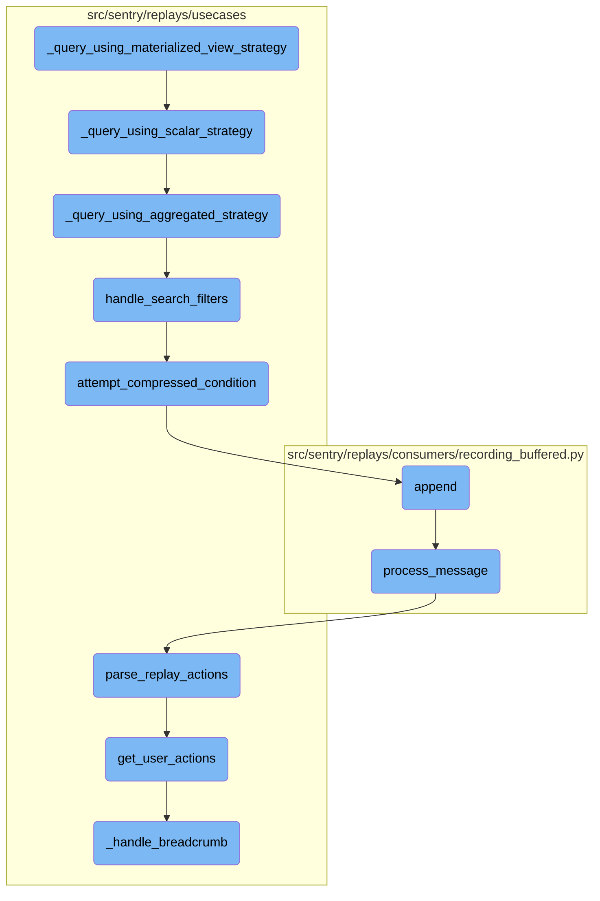
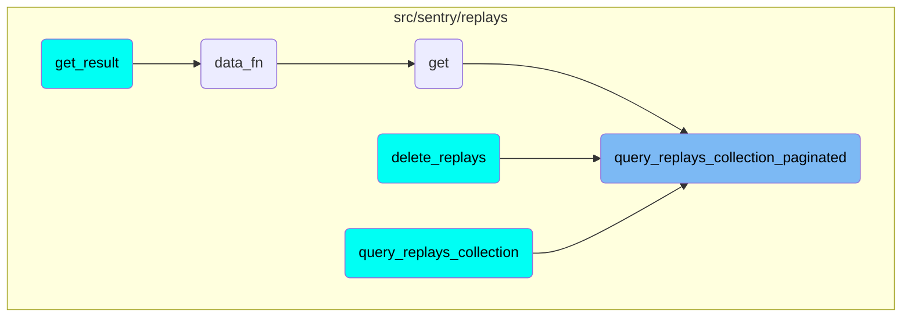

In this document, we will explain the process of querying replays in a paginated manner. This involves initializing pagination parameters, applying search filters, and executing the query using an optimized search strategy.

The flow starts by setting up pagination parameters to handle large sets of data. It then applies various search filters to narrow down the results. The optimized search strategy is used to execute the query efficiently, ensuring that the most relevant replays are retrieved. The results are then aggregated and returned.

Here is a high level diagram of the flow, showing only the most important functions:



# Flow drill down

First, we'll zoom into this section of the flow:

```mermaid
graph TD;
      subgraph src/sentry/replays
067c13ee434a68e8d444d1c43c5a2ddb9b18f6104ed0eaedda570f9f6774c0f5(query_replays_collection_paginated):::mainFlowStyle --> bad1cc1964148e2c74ea858a500d0e0cbaaa0b0d8f407740464c264005bcdbd4(query_using_optimized_search):::mainFlowStyle
end

subgraph src/sentry/replays
bad1cc1964148e2c74ea858a500d0e0cbaaa0b0d8f407740464c264005bcdbd4(query_using_optimized_search):::mainFlowStyle --> e79a45badee7a68d04b76c068a3112def4ed2f2aa2298055a54a21331ff1bd35(make_full_aggregation_query)
end

subgraph src/sentry/replays
bad1cc1964148e2c74ea858a500d0e0cbaaa0b0d8f407740464c264005bcdbd4(query_using_optimized_search):::mainFlowStyle --> 8e2df40f74f97b4332c4ef29d57c629999986fd12744a919e981351943d235d5(handle_viewed_by_me_filters)
end

subgraph src/sentry/replays
bad1cc1964148e2c74ea858a500d0e0cbaaa0b0d8f407740464c264005bcdbd4(query_using_optimized_search):::mainFlowStyle --> e682540e522527782da9f73fbf8898594c93ea19ab77419d18879e6aa9962b31(_query_using_materialized_view_strategy):::mainFlowStyle
end

subgraph src/sentry/replays
e682540e522527782da9f73fbf8898594c93ea19ab77419d18879e6aa9962b31(_query_using_materialized_view_strategy):::mainFlowStyle --> bdrdv(...)
end

subgraph src/sentry/replays
e79a45badee7a68d04b76c068a3112def4ed2f2aa2298055a54a21331ff1bd35(make_full_aggregation_query) --> e19d4cefa5a0336e5cb440ca6d2d66c959376509c5d37d29f1c14f46d807c054(_select_from_fields)
end

subgraph src/sentry/replays
e79a45badee7a68d04b76c068a3112def4ed2f2aa2298055a54a21331ff1bd35(make_full_aggregation_query) --> 84220ebe3b8135f426abe554f13de324751fe5c35e4854e6f1dbdfa77a4e7411(select_from_fields)
end


      classDef mainFlowStyle color:#000000,fill:#7CB9F4
classDef rootsStyle color:#000000,fill:#00FFF4
classDef Style1 color:#000000,fill:#00FFAA
classDef Style2 color:#000000,fill:#FFFF00
classDef Style3 color:#000000,fill:#AA7CB9

%% Swimm:
%% graph TD;
%%       subgraph <SwmPath>[src/sentry/replays/](src/sentry/replays/)</SwmPath>
%% 067c13ee434a68e8d444d1c43c5a2ddb9b18f6104ed0eaedda570f9f6774c0f5(query_replays_collection_paginated):::mainFlowStyle --> bad1cc1964148e2c74ea858a500d0e0cbaaa0b0d8f407740464c264005bcdbd4(query_using_optimized_search):::mainFlowStyle
%% end
%% 
%% subgraph <SwmPath>[src/sentry/replays/](src/sentry/replays/)</SwmPath>
%% bad1cc1964148e2c74ea858a500d0e0cbaaa0b0d8f407740464c264005bcdbd4(query_using_optimized_search):::mainFlowStyle --> e79a45badee7a68d04b76c068a3112def4ed2f2aa2298055a54a21331ff1bd35(make_full_aggregation_query)
%% end
%% 
%% subgraph <SwmPath>[src/sentry/replays/](src/sentry/replays/)</SwmPath>
%% bad1cc1964148e2c74ea858a500d0e0cbaaa0b0d8f407740464c264005bcdbd4(query_using_optimized_search):::mainFlowStyle --> 8e2df40f74f97b4332c4ef29d57c629999986fd12744a919e981351943d235d5(handle_viewed_by_me_filters)
%% end
%% 
%% subgraph <SwmPath>[src/sentry/replays/](src/sentry/replays/)</SwmPath>
%% bad1cc1964148e2c74ea858a500d0e0cbaaa0b0d8f407740464c264005bcdbd4(query_using_optimized_search):::mainFlowStyle --> e682540e522527782da9f73fbf8898594c93ea19ab77419d18879e6aa9962b31(_query_using_materialized_view_strategy):::mainFlowStyle
%% end
%% 
%% subgraph <SwmPath>[src/sentry/replays/](src/sentry/replays/)</SwmPath>
%% e682540e522527782da9f73fbf8898594c93ea19ab77419d18879e6aa9962b31(_query_using_materialized_view_strategy):::mainFlowStyle --> bdrdv(...)
%% end
%% 
%% subgraph <SwmPath>[src/sentry/replays/](src/sentry/replays/)</SwmPath>
%% e79a45badee7a68d04b76c068a3112def4ed2f2aa2298055a54a21331ff1bd35(make_full_aggregation_query) --> e19d4cefa5a0336e5cb440ca6d2d66c959376509c5d37d29f1c14f46d807c054(_select_from_fields)
%% end
%% 
%% subgraph <SwmPath>[src/sentry/replays/](src/sentry/replays/)</SwmPath>
%% e79a45badee7a68d04b76c068a3112def4ed2f2aa2298055a54a21331ff1bd35(make_full_aggregation_query) --> 84220ebe3b8135f426abe554f13de324751fe5c35e4854e6f1dbdfa77a4e7411(select_from_fields)
%% end
%% 
%% 
%%       classDef mainFlowStyle color:#000000,fill:#7CB9F4
%% classDef rootsStyle color:#000000,fill:#00FFF4
%% classDef Style1 color:#000000,fill:#00FFAA
%% classDef Style2 color:#000000,fill:#FFFF00
%% classDef Style3 color:#000000,fill:#AA7CB9
```



<SwmSnippet path="/src/sentry/replays/query.py" line="48">

---

## <SwmToken path="src/sentry/replays/query.py" pos="48:2:2" line-data="def query_replays_collection_paginated(">`query_replays_collection_paginated`</SwmToken>

The function <SwmToken path="src/sentry/replays/query.py" pos="48:2:2" line-data="def query_replays_collection_paginated(">`query_replays_collection_paginated`</SwmToken> is responsible for querying an aggregated replay collection. It initializes pagination parameters and then calls <SwmToken path="src/sentry/replays/query.py" pos="65:3:3" line-data="    return query_using_optimized_search(">`query_using_optimized_search`</SwmToken> with the provided filters and parameters.

```python
def query_replays_collection_paginated(
    project_ids: list[int],
    start: datetime,
    end: datetime,
    environment: list[str],
    fields: list[str],
    sort: str | None,
    limit: int,
    offset: int,
    search_filters: Sequence[SearchFilter],
    preferred_source: PREFERRED_SOURCE,
    organization: Organization | None = None,
    actor: Any | None = None,
):
    """Query aggregated replay collection."""
    paginators = Paginators(limit, offset)

    return query_using_optimized_search(
        fields=fields,
        search_filters=search_filters,
        environments=environment,
```

---

</SwmSnippet>

<SwmSnippet path="/src/sentry/replays/usecases/query/__init__.py" line="198">

---

## <SwmToken path="src/sentry/replays/usecases/query/__init__.py" pos="198:2:2" line-data="def query_using_optimized_search(">`query_using_optimized_search`</SwmToken>

The function <SwmToken path="src/sentry/replays/usecases/query/__init__.py" pos="198:2:2" line-data="def query_using_optimized_search(">`query_using_optimized_search`</SwmToken> processes the search filters and determines the appropriate query strategy based on the <SwmToken path="src/sentry/replays/usecases/query/__init__.py" pos="209:1:1" line-data="    preferred_source: PREFERRED_SOURCE = &quot;scalar&quot;,">`preferred_source`</SwmToken>. It handles the translation of <SwmToken path="src/sentry/replays/usecases/query/__init__.py" pos="57:7:7" line-data="    &quot;&quot;&quot;Translate &quot;viewed_by_me&quot; as it&#39;s not a valid Snuba field, but a convenience alias for the frontend&quot;&quot;&quot;">`viewed_by_me`</SwmToken> filters and executes the query using the selected strategy. The results are then aggregated and returned.

```python
def query_using_optimized_search(
    fields: list[str],
    search_filters: Sequence[SearchFilter | str | ParenExpression],
    environments: list[str],
    sort: str | None,
    pagination: Paginators,
    organization: Organization | None,
    project_ids: list[int],
    period_start: datetime,
    period_stop: datetime,
    request_user_id: int | None = None,
    preferred_source: PREFERRED_SOURCE = "scalar",
):
    tenant_id = _make_tenant_id(organization)

    # Environments is provided to us outside of the ?query= url parameter. It's stil filtered like
    # the values in that parameter so let's shove it inside and process it like any other filter.
    if environments:
        search_filters = [
            *search_filters,
            SearchFilter(SearchKey("environment"), "IN", SearchValue(environments)),
```

---

</SwmSnippet>

<SwmSnippet path="/src/sentry/replays/usecases/query/__init__.py" line="54">

---

### <SwmToken path="src/sentry/replays/usecases/query/__init__.py" pos="54:2:2" line-data="def handle_viewed_by_me_filters(">`handle_viewed_by_me_filters`</SwmToken>

The function <SwmToken path="src/sentry/replays/usecases/query/__init__.py" pos="54:2:2" line-data="def handle_viewed_by_me_filters(">`handle_viewed_by_me_filters`</SwmToken> translates the <SwmToken path="src/sentry/replays/usecases/query/__init__.py" pos="57:7:7" line-data="    &quot;&quot;&quot;Translate &quot;viewed_by_me&quot; as it&#39;s not a valid Snuba field, but a convenience alias for the frontend&quot;&quot;&quot;">`viewed_by_me`</SwmToken> filter into a valid search filter by replacing it with <SwmToken path="src/sentry/replays/query.py" pos="763:4:4" line-data="            Column(&quot;viewed_by_id&quot;),">`viewed_by_id`</SwmToken> and the current user's ID. This is a convenience alias for the frontend.

```python
def handle_viewed_by_me_filters(
    search_filters: Sequence[SearchFilter | str | ParenExpression], request_user_id: int | None
) -> Sequence[SearchFilter | str | ParenExpression]:
    """Translate "viewed_by_me" as it's not a valid Snuba field, but a convenience alias for the frontend"""
    new_filters = []
    for search_filter in search_filters:
        if (
            not isinstance(search_filter, SearchFilter)
            or search_filter.key.name not in VIEWED_BY_ME_KEY_ALIASES
        ):
            new_filters.append(search_filter)
            continue

        # since the value is boolean, negations (!) are not supported
        if search_filter.operator != "=":
            raise ParseError(f"Invalid operator specified for `{search_filter.key.name}`")

        value = search_filter.value.value
        if not isinstance(value, str) or value.lower() not in ["true", "false"]:
            raise ParseError(f"Could not parse value for `{search_filter.key.name}`")
        value = value.lower() == "true"
```

---

</SwmSnippet>

<SwmSnippet path="/src/sentry/replays/usecases/query/__init__.py" line="409">

---

## <SwmToken path="src/sentry/replays/usecases/query/__init__.py" pos="409:2:2" line-data="def make_full_aggregation_query(">`make_full_aggregation_query`</SwmToken>

The function <SwmToken path="src/sentry/replays/usecases/query/__init__.py" pos="409:2:2" line-data="def make_full_aggregation_query(">`make_full_aggregation_query`</SwmToken> constructs a query to fetch every replay in the set. It selects the appropriate fields and applies conditions to filter the replays based on project <SwmToken path="src/sentry/replays/query.py" pos="116:10:10" line-data="    &quot;&quot;&quot;Query unique user ids who viewed a given replay.&quot;&quot;&quot;">`ids`</SwmToken>, replay <SwmToken path="src/sentry/replays/query.py" pos="116:10:10" line-data="    &quot;&quot;&quot;Query unique user ids who viewed a given replay.&quot;&quot;&quot;">`ids`</SwmToken>, and timestamps.

```python
def make_full_aggregation_query(
    fields: list[str],
    replay_ids: list[str],
    project_ids: list[int],
    period_start: datetime,
    period_end: datetime,
    request_user_id: int | None,
) -> Query:
    """Return a query to fetch every replay in the set.

    Arguments:
        fields -- if non-empty, used to query a subset of fields. Corresponds to the keys in QUERY_ALIAS_COLUMN_MAP.
    """
    from sentry.replays.query import QUERY_ALIAS_COLUMN_MAP, compute_has_viewed, select_from_fields

    def _select_from_fields() -> list[Column | Function]:
        if fields:
            return select_from_fields(list(set(fields)), user_id=request_user_id)
        else:
            return list(QUERY_ALIAS_COLUMN_MAP.values()) + [compute_has_viewed(request_user_id)]

```

---

</SwmSnippet>

<SwmSnippet path="/src/sentry/replays/usecases/query/__init__.py" line="424">

---

### <SwmToken path="src/sentry/replays/usecases/query/__init__.py" pos="424:3:3" line-data="    def _select_from_fields() -&gt; list[Column | Function]:">`_select_from_fields`</SwmToken>

The function <SwmToken path="src/sentry/replays/usecases/query/__init__.py" pos="424:3:3" line-data="    def _select_from_fields() -&gt; list[Column | Function]:">`_select_from_fields`</SwmToken> determines which fields to select in the query. If specific fields are provided, it uses <SwmToken path="src/sentry/replays/usecases/query/__init__.py" pos="426:3:3" line-data="            return select_from_fields(list(set(fields)), user_id=request_user_id)">`select_from_fields`</SwmToken> to get the corresponding columns; otherwise, it selects all columns defined in <SwmToken path="src/sentry/replays/usecases/query/__init__.py" pos="428:5:5" line-data="            return list(QUERY_ALIAS_COLUMN_MAP.values()) + [compute_has_viewed(request_user_id)]">`QUERY_ALIAS_COLUMN_MAP`</SwmToken>.

```python
    def _select_from_fields() -> list[Column | Function]:
        if fields:
            return select_from_fields(list(set(fields)), user_id=request_user_id)
        else:
            return list(QUERY_ALIAS_COLUMN_MAP.values()) + [compute_has_viewed(request_user_id)]
```

---

</SwmSnippet>

<SwmSnippet path="/src/sentry/replays/query.py" line="819">

---

## <SwmToken path="src/sentry/replays/query.py" pos="819:2:2" line-data="def select_from_fields(fields: list[str], user_id: int | None) -&gt; list[Column | Function]:">`select_from_fields`</SwmToken>

The function <SwmToken path="src/sentry/replays/query.py" pos="819:2:2" line-data="def select_from_fields(fields: list[str], user_id: int | None) -&gt; list[Column | Function]:">`select_from_fields`</SwmToken> returns a list of columns to select based on the provided field aliases. It includes a special case for the <SwmToken path="src/sentry/replays/query.py" pos="823:8:8" line-data="        if alias == &quot;has_viewed&quot;:">`has_viewed`</SwmToken> field, which is computed using the <SwmToken path="src/sentry/replays/query.py" pos="824:5:5" line-data="            selection.append(compute_has_viewed(user_id))">`compute_has_viewed`</SwmToken> function.

```python
def select_from_fields(fields: list[str], user_id: int | None) -> list[Column | Function]:
    """Return a list of columns to select."""
    selection = []
    for alias in collect_aliases(fields):
        if alias == "has_viewed":
            selection.append(compute_has_viewed(user_id))
        else:
            selection.append(QUERY_ALIAS_COLUMN_MAP[alias])

    return selection
```

---

</SwmSnippet>

Now, lets zoom into this section of the flow:



<SwmSnippet path="/src/sentry/replays/usecases/query/__init__.py" line="301">

---

## Materialized View Strategy

The function <SwmToken path="src/sentry/replays/usecases/query/__init__.py" pos="225:11:11" line-data="        query, referrer, source = _query_using_materialized_view_strategy(">`_query_using_materialized_view_strategy`</SwmToken> first checks if the materialized view can be used for the given search filters and sort criteria. If not, it falls back to the scalar strategy by calling <SwmToken path="src/sentry/replays/usecases/query/__init__.py" pos="302:3:3" line-data="        return _query_using_scalar_strategy(">`_query_using_scalar_strategy`</SwmToken>.

```python
    if not mv.can_search(search_filters) or not mv.can_sort(sort or DEFAULT_SORT_FIELD):
        return _query_using_scalar_strategy(
            search_filters,
            sort,
            project_ids,
            period_start,
            period_stop,
        )
```

---

</SwmSnippet>

<SwmSnippet path="/src/sentry/replays/usecases/query/__init__.py" line="310">

---

## Handling Ordering and Search Filters

The function then handles the ordering and search filters. It uses <SwmToken path="src/sentry/replays/usecases/query/__init__.py" pos="310:5:5" line-data="    orderby = handle_ordering(mv.sort_config, sort or &quot;-&quot; + DEFAULT_SORT_FIELD)">`handle_ordering`</SwmToken> to determine the order by clause and <SwmToken path="src/sentry/replays/usecases/query/__init__.py" pos="312:11:11" line-data="    having: list[Condition] = handle_search_filters(mv.search_config, search_filters)">`handle_search_filters`</SwmToken> to convert search filters into conditions.

```python
    orderby = handle_ordering(mv.sort_config, sort or "-" + DEFAULT_SORT_FIELD)

    having: list[Condition] = handle_search_filters(mv.search_config, search_filters)
    having.append(Condition(Function("minMerge", parameters=[Column("min_segment_id")]), Op.EQ, 0))
```

---

</SwmSnippet>

<SwmSnippet path="/src/sentry/replays/usecases/query/__init__.py" line="315">

---

## Constructing the Query

The function constructs a query using the <SwmToken path="src/sentry/replays/usecases/query/__init__.py" pos="315:1:1" line-data="    query = Query(">`query`</SwmToken> class. It specifies the entity to query, the columns to select, the conditions for the where clause, the having clause, the order by clause, and the group by clause.

```python
    query = Query(
        match=Entity("replays_aggregated"),
        select=[Column("replay_id")],
        where=[
            Condition(Column("project_id"), Op.IN, project_ids),
            Condition(Column("to_hour_timestamp"), Op.LT, period_stop),
            Condition(Column("to_hour_timestamp"), Op.GTE, period_start),
        ],
        having=having,
        orderby=orderby,
        groupby=[Column("replay_id")],
    )
```

---

</SwmSnippet>

<SwmSnippet path="/src/sentry/replays/usecases/query/__init__.py" line="328">

---

## Returning the Query

Finally, the function returns the constructed query along with some metadata, including the query type and the source of the query.

```python
    return (
        query,
        "replays.query.browse_materialized_view_conditions_subquery",
        "materialized-view",
    )
```

---

</SwmSnippet>

# Where is this flow used?

This flow is used multiple times in the codebase as represented in the following diagram:



&nbsp;

*This is an auto-generated document by Swimm AI 🌊 and has not yet been verified by a human*

<SwmMeta version="3.0.0" repo-id="Z2l0aHViJTNBJTNBc2VudHJ5LWRlbW8tMSUzQSUzQVN3aW1tLURlbW8=" repo-name="sentry-demo-1" doc-type="flows"><sup>Powered by [Swimm](/)</sup></SwmMeta>
