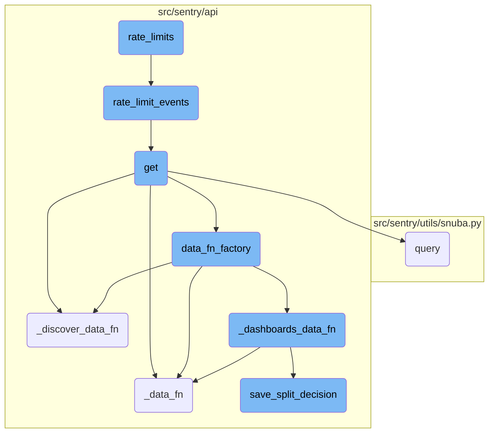
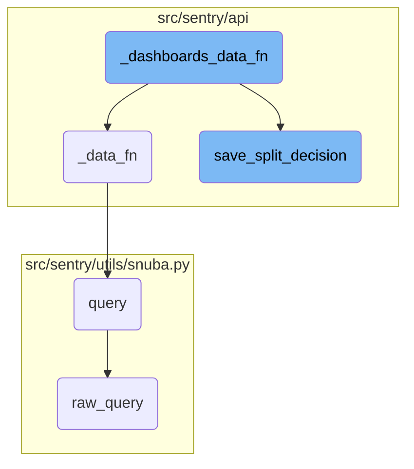

```mermaid
graph TD;
      subgraph src/sentry
f540f15f97ffda616abd0e1ed4b727359eb142ff389618257e8d9bd42effdf2d(data_fn_factory):::mainFlowStyle --> 2143f18fec886744c662636f05c1d74bcd7870af91656702b2bba1ffdd09c68e(_discover_data_fn)
end

subgraph src/sentry
f540f15f97ffda616abd0e1ed4b727359eb142ff389618257e8d9bd42effdf2d(data_fn_factory):::mainFlowStyle --> dd31e28d6b994b9793c5513018c9dbaf046e78befdd97be27cbdeb40094d3998(_data_fn)
end

subgraph src/sentry
f540f15f97ffda616abd0e1ed4b727359eb142ff389618257e8d9bd42effdf2d(data_fn_factory):::mainFlowStyle --> 685bc1fbc479c5a90f8e8be6e768763f51565292d145e717448c0667d94ddc8c(_dashboards_data_fn):::mainFlowStyle
end

subgraph src/sentry
685bc1fbc479c5a90f8e8be6e768763f51565292d145e717448c0667d94ddc8c(_dashboards_data_fn):::mainFlowStyle --> uvhrs(...)
end

subgraph src/sentry
dd31e28d6b994b9793c5513018c9dbaf046e78befdd97be27cbdeb40094d3998(_data_fn) --> 217c286b55931189987f173388d83db5200b62a8b3969018948674c19e4cb939(query)
end

subgraph src/sentry
217c286b55931189987f173388d83db5200b62a8b3969018948674c19e4cb939(query) --> 9e7271ad0c817bc7beb2e7483b4bfd667fbb5ef81afffec4ead5ea943e43fb58(raw_query)
end

subgraph src/sentry
2143f18fec886744c662636f05c1d74bcd7870af91656702b2bba1ffdd09c68e(_discover_data_fn) --> dd31e28d6b994b9793c5513018c9dbaf046e78befdd97be27cbdeb40094d3998(_data_fn)
end


      classDef mainFlowStyle color:#000000,fill:#7CB9F4
classDef rootsStyle color:#000000,fill:#00FFF4
classDef Style1 color:#000000,fill:#00FFAA
classDef Style2 color:#000000,fill:#FFFF00
classDef Style3 color:#000000,fill:#AA7CB9

%% Swimm:
%% graph TD;
%%       subgraph <SwmPath>[src/sentry/](src/sentry/)</SwmPath>
%% f540f15f97ffda616abd0e1ed4b727359eb142ff389618257e8d9bd42effdf2d(data_fn_factory):::mainFlowStyle --> 2143f18fec886744c662636f05c1d74bcd7870af91656702b2bba1ffdd09c68e(_discover_data_fn)
%% end
%% 
%% subgraph <SwmPath>[src/sentry/](src/sentry/)</SwmPath>
%% f540f15f97ffda616abd0e1ed4b727359eb142ff389618257e8d9bd42effdf2d(data_fn_factory):::mainFlowStyle --> dd31e28d6b994b9793c5513018c9dbaf046e78befdd97be27cbdeb40094d3998(_data_fn)
%% end
%% 
%% subgraph <SwmPath>[src/sentry/](src/sentry/)</SwmPath>
%% f540f15f97ffda616abd0e1ed4b727359eb142ff389618257e8d9bd42effdf2d(data_fn_factory):::mainFlowStyle --> 685bc1fbc479c5a90f8e8be6e768763f51565292d145e717448c0667d94ddc8c(_dashboards_data_fn):::mainFlowStyle
%% end
%% 
%% subgraph <SwmPath>[src/sentry/](src/sentry/)</SwmPath>
%% 685bc1fbc479c5a90f8e8be6e768763f51565292d145e717448c0667d94ddc8c(_dashboards_data_fn):::mainFlowStyle --> uvhrs(...)
%% end
%% 
%% subgraph <SwmPath>[src/sentry/](src/sentry/)</SwmPath>
%% dd31e28d6b994b9793c5513018c9dbaf046e78befdd97be27cbdeb40094d3998(_data_fn) --> 217c286b55931189987f173388d83db5200b62a8b3969018948674c19e4cb939(query)
%% end
%% 
%% subgraph <SwmPath>[src/sentry/](src/sentry/)</SwmPath>
%% 217c286b55931189987f173388d83db5200b62a8b3969018948674c19e4cb939(query) --> 9e7271ad0c817bc7beb2e7483b4bfd667fbb5ef81afffec4ead5ea943e43fb58(raw_query)
%% end
%% 
%% subgraph <SwmPath>[src/sentry/](src/sentry/)</SwmPath>
%% 2143f18fec886744c662636f05c1d74bcd7870af91656702b2bba1ffdd09c68e(_discover_data_fn) --> dd31e28d6b994b9793c5513018c9dbaf046e78befdd97be27cbdeb40094d3998(_data_fn)
%% end
%% 
%% 
%%       classDef mainFlowStyle color:#000000,fill:#7CB9F4
%% classDef rootsStyle color:#000000,fill:#00FFF4
%% classDef Style1 color:#000000,fill:#00FFAA
%% classDef Style2 color:#000000,fill:#FFFF00
%% classDef Style3 color:#000000,fill:#AA7CB9
```

This document explains the concept of rate limits, which are used to control the number of requests an organization can make to the Sentry API within a certain time frame. The rate limiting process involves determining the appropriate rate limits for an organization based on its configuration and applying these limits to manage the load on the system.

The flow starts with the <SwmToken path="src/sentry/api/endpoints/organization_events.py" pos="243:3:3" line-data="    def rate_limits(*args, **kwargs) -&gt; dict[str, dict[RateLimitCategory, RateLimit]]:">`rate_limits`</SwmToken> function, which calls the <SwmToken path="src/sentry/api/endpoints/organization_events.py" pos="163:2:2" line-data="def rate_limit_events(">`rate_limit_events`</SwmToken> function to determine the rate limits for an organization. The <SwmToken path="src/sentry/api/endpoints/organization_events.py" pos="163:2:2" line-data="def rate_limit_events(">`rate_limit_events`</SwmToken> function checks if the organization exists and then applies either legacy, increased, or reduced rate limits based on the organization's configuration. The <SwmToken path="src/sentry/api/endpoints/organization_events.py" pos="170:3:3" line-data="         A[Get organization] --&gt; B{Organization\nexists}">`Get`</SwmToken> function handles the request to fetch organization events and uses helper functions like <SwmToken path="src/sentry/api/endpoints/organization_events.py" pos="397:3:3" line-data="        def _data_fn(scoped_dataset, offset, limit, query) -&gt; dict[str, Any]:">`_data_fn`</SwmToken> and <SwmToken path="src/sentry/api/endpoints/organization_events.py" pos="494:3:3" line-data="        def _discover_data_fn(scoped_dataset, offset, limit, scoped_query, discover_saved_query_id):">`_discover_data_fn`</SwmToken> to query the data and apply the rate limits. The <SwmToken path="src/sentry/api/endpoints/organization_events.py" pos="397:3:3" line-data="        def _data_fn(scoped_dataset, offset, limit, query) -&gt; dict[str, Any]:">`_data_fn`</SwmToken> function performs the actual data query, while the <SwmToken path="src/sentry/api/endpoints/organization_events.py" pos="494:3:3" line-data="        def _discover_data_fn(scoped_dataset, offset, limit, scoped_query, discover_saved_query_id):">`_discover_data_fn`</SwmToken> function is used for discover queries. The <SwmToken path="src/sentry/api/endpoints/organization_events.py" pos="317:7:7" line-data="        The `field` query parameter determines what fields will be selected in the `data` and `meta` keys of the endpoint response.">`query`</SwmToken> function in <SwmPath>[src/sentry/utils/snuba.py](src/sentry/utils/snuba.py)</SwmPath> constructs and sends a query to the Snuba service, and the <SwmToken path="src/sentry/utils/snuba.py" pos="846:2:2" line-data="def raw_query(">`raw_query`</SwmToken> function sends a low-level query to the Snuba service.

Here is a high level diagram of the flow, showing only the most important functions:



# Flow drill down

First, we'll zoom into this section of the flow:

```mermaid
graph TD;
      subgraph src/sentry
45b99972c7515e24c1f3dd181cefea57591577c6bae41813f6736c3ee2e59e67(rate_limits):::mainFlowStyle --> e2d4fa1cd017f73a276983e60520b8e7eaa716b4e0cdb4e61275170ba912bbc7(rate_limit_events):::mainFlowStyle
end

subgraph src/sentry
e2d4fa1cd017f73a276983e60520b8e7eaa716b4e0cdb4e61275170ba912bbc7(rate_limit_events):::mainFlowStyle --> 3b03c8d24a957d56c78a43405468e4f045ce82bae47291aa645702a685a3fd96(get):::mainFlowStyle
end

subgraph src/sentry
3b03c8d24a957d56c78a43405468e4f045ce82bae47291aa645702a685a3fd96(get):::mainFlowStyle --> 2143f18fec886744c662636f05c1d74bcd7870af91656702b2bba1ffdd09c68e(_discover_data_fn)
end

subgraph src/sentry
3b03c8d24a957d56c78a43405468e4f045ce82bae47291aa645702a685a3fd96(get):::mainFlowStyle --> dd31e28d6b994b9793c5513018c9dbaf046e78befdd97be27cbdeb40094d3998(_data_fn)
end

subgraph src/sentry
3b03c8d24a957d56c78a43405468e4f045ce82bae47291aa645702a685a3fd96(get):::mainFlowStyle --> 217c286b55931189987f173388d83db5200b62a8b3969018948674c19e4cb939(query)
end

subgraph src/sentry
3b03c8d24a957d56c78a43405468e4f045ce82bae47291aa645702a685a3fd96(get):::mainFlowStyle --> f540f15f97ffda616abd0e1ed4b727359eb142ff389618257e8d9bd42effdf2d(data_fn_factory):::mainFlowStyle
end

subgraph src/sentry
f540f15f97ffda616abd0e1ed4b727359eb142ff389618257e8d9bd42effdf2d(data_fn_factory):::mainFlowStyle --> bj96q(...)
end

subgraph src/sentry
217c286b55931189987f173388d83db5200b62a8b3969018948674c19e4cb939(query) --> 9e7271ad0c817bc7beb2e7483b4bfd667fbb5ef81afffec4ead5ea943e43fb58(raw_query)
end

subgraph src/sentry
dd31e28d6b994b9793c5513018c9dbaf046e78befdd97be27cbdeb40094d3998(_data_fn) --> 217c286b55931189987f173388d83db5200b62a8b3969018948674c19e4cb939(query)
end

subgraph src/sentry
2143f18fec886744c662636f05c1d74bcd7870af91656702b2bba1ffdd09c68e(_discover_data_fn) --> dd31e28d6b994b9793c5513018c9dbaf046e78befdd97be27cbdeb40094d3998(_data_fn)
end


      classDef mainFlowStyle color:#000000,fill:#7CB9F4
classDef rootsStyle color:#000000,fill:#00FFF4
classDef Style1 color:#000000,fill:#00FFAA
classDef Style2 color:#000000,fill:#FFFF00
classDef Style3 color:#000000,fill:#AA7CB9

%% Swimm:
%% graph TD;
%%       subgraph <SwmPath>[src/sentry/](src/sentry/)</SwmPath>
%% 45b99972c7515e24c1f3dd181cefea57591577c6bae41813f6736c3ee2e59e67(rate_limits):::mainFlowStyle --> e2d4fa1cd017f73a276983e60520b8e7eaa716b4e0cdb4e61275170ba912bbc7(rate_limit_events):::mainFlowStyle
%% end
%% 
%% subgraph <SwmPath>[src/sentry/](src/sentry/)</SwmPath>
%% e2d4fa1cd017f73a276983e60520b8e7eaa716b4e0cdb4e61275170ba912bbc7(rate_limit_events):::mainFlowStyle --> 3b03c8d24a957d56c78a43405468e4f045ce82bae47291aa645702a685a3fd96(get):::mainFlowStyle
%% end
%% 
%% subgraph <SwmPath>[src/sentry/](src/sentry/)</SwmPath>
%% 3b03c8d24a957d56c78a43405468e4f045ce82bae47291aa645702a685a3fd96(get):::mainFlowStyle --> 2143f18fec886744c662636f05c1d74bcd7870af91656702b2bba1ffdd09c68e(_discover_data_fn)
%% end
%% 
%% subgraph <SwmPath>[src/sentry/](src/sentry/)</SwmPath>
%% 3b03c8d24a957d56c78a43405468e4f045ce82bae47291aa645702a685a3fd96(get):::mainFlowStyle --> dd31e28d6b994b9793c5513018c9dbaf046e78befdd97be27cbdeb40094d3998(_data_fn)
%% end
%% 
%% subgraph <SwmPath>[src/sentry/](src/sentry/)</SwmPath>
%% 3b03c8d24a957d56c78a43405468e4f045ce82bae47291aa645702a685a3fd96(get):::mainFlowStyle --> 217c286b55931189987f173388d83db5200b62a8b3969018948674c19e4cb939(query)
%% end
%% 
%% subgraph <SwmPath>[src/sentry/](src/sentry/)</SwmPath>
%% 3b03c8d24a957d56c78a43405468e4f045ce82bae47291aa645702a685a3fd96(get):::mainFlowStyle --> f540f15f97ffda616abd0e1ed4b727359eb142ff389618257e8d9bd42effdf2d(data_fn_factory):::mainFlowStyle
%% end
%% 
%% subgraph <SwmPath>[src/sentry/](src/sentry/)</SwmPath>
%% f540f15f97ffda616abd0e1ed4b727359eb142ff389618257e8d9bd42effdf2d(data_fn_factory):::mainFlowStyle --> bj96q(...)
%% end
%% 
%% subgraph <SwmPath>[src/sentry/](src/sentry/)</SwmPath>
%% 217c286b55931189987f173388d83db5200b62a8b3969018948674c19e4cb939(query) --> 9e7271ad0c817bc7beb2e7483b4bfd667fbb5ef81afffec4ead5ea943e43fb58(raw_query)
%% end
%% 
%% subgraph <SwmPath>[src/sentry/](src/sentry/)</SwmPath>
%% dd31e28d6b994b9793c5513018c9dbaf046e78befdd97be27cbdeb40094d3998(_data_fn) --> 217c286b55931189987f173388d83db5200b62a8b3969018948674c19e4cb939(query)
%% end
%% 
%% subgraph <SwmPath>[src/sentry/](src/sentry/)</SwmPath>
%% 2143f18fec886744c662636f05c1d74bcd7870af91656702b2bba1ffdd09c68e(_discover_data_fn) --> dd31e28d6b994b9793c5513018c9dbaf046e78befdd97be27cbdeb40094d3998(_data_fn)
%% end
%% 
%% 
%%       classDef mainFlowStyle color:#000000,fill:#7CB9F4
%% classDef rootsStyle color:#000000,fill:#00FFF4
%% classDef Style1 color:#000000,fill:#00FFAA
%% classDef Style2 color:#000000,fill:#FFFF00
%% classDef Style3 color:#000000,fill:#AA7CB9
```



<SwmSnippet path="/src/sentry/api/endpoints/organization_events.py" line="241">

---

## <SwmToken path="src/sentry/api/endpoints/organization_events.py" pos="243:3:3" line-data="    def rate_limits(*args, **kwargs) -&gt; dict[str, dict[RateLimitCategory, RateLimit]]:">`rate_limits`</SwmToken> Function

The <SwmToken path="src/sentry/api/endpoints/organization_events.py" pos="243:3:3" line-data="    def rate_limits(*args, **kwargs) -&gt; dict[str, dict[RateLimitCategory, RateLimit]]:">`rate_limits`</SwmToken> function is the entry point for rate limiting logic. It calls the <SwmToken path="src/sentry/api/endpoints/organization_events.py" pos="244:3:3" line-data="        return rate_limit_events(*args, **kwargs)">`rate_limit_events`</SwmToken> function to determine the appropriate rate limits for an organization.

```python
    enforce_rate_limit = True

    def rate_limits(*args, **kwargs) -> dict[str, dict[RateLimitCategory, RateLimit]]:
        return rate_limit_events(*args, **kwargs)
```

---

</SwmSnippet>

<SwmSnippet path="/src/sentry/api/endpoints/organization_events.py" line="163">

---

## <SwmToken path="src/sentry/api/endpoints/organization_events.py" pos="163:2:2" line-data="def rate_limit_events(">`rate_limit_events`</SwmToken> Function

The <SwmToken path="src/sentry/api/endpoints/organization_events.py" pos="163:2:2" line-data="def rate_limit_events(">`rate_limit_events`</SwmToken> function contains the decision tree for determining the rate limits for an organization. It checks if the organization exists, and then applies either legacy, increased, or reduced rate limits based on the organization's configuration.

````python
def rate_limit_events(
    request: Request, organization_id_or_slug: str | None = None, *args, **kwargs
) -> dict[str, dict[RateLimitCategory, RateLimit]]:
    """
    Decision tree for rate limiting for organization events endpoint.
    ```mermaid
     flowchart TD
         A[Get organization] --> B{Organization\nexists}
         B -->|No| C[Return legacy rate limit]
         B -->|Yes| D{Organization\nin increased\nrate limit}
         D -->|Yes| E[Return increased rate limit]
         D -->|No| F{Organization in\nreduced limit\nroll-out}
         F -->|Yes| G[Return reduced rate limit]
         F -->|No| H[Return legacy rate limit]
     ```
    """

    def _config_for_limit(limit: RateLimit) -> dict[str, dict[RateLimitCategory, RateLimit]]:
        return {
            "GET": {
                RateLimitCategory.IP: limit,
````

---

</SwmSnippet>

<SwmSnippet path="/src/sentry/api/endpoints/organization_events.py" line="302">

---

## get Function

The <SwmToken path="src/sentry/api/endpoints/organization_events.py" pos="302:3:3" line-data="    def get(self, request: Request, organization) -&gt; Response:">`get`</SwmToken> function handles the request to fetch organization events. It uses helper functions like <SwmToken path="src/sentry/api/endpoints/organization_events.py" pos="397:3:3" line-data="        def _data_fn(scoped_dataset, offset, limit, query) -&gt; dict[str, Any]:">`_data_fn`</SwmToken> and <SwmToken path="src/sentry/api/endpoints/organization_events.py" pos="494:3:3" line-data="        def _discover_data_fn(scoped_dataset, offset, limit, scoped_query, discover_saved_query_id):">`_discover_data_fn`</SwmToken> to query the data and apply rate limits.

```python
    def get(self, request: Request, organization) -> Response:
        """
        Retrieves discover (also known as events) data for a given organization.

        **Eventsv2 Deprecation Note**: Users who may be using the `eventsv2` endpoint should update their requests to the `events` endpoint outline in this document.
        The `eventsv2` endpoint is not a public endpoint and has no guaranteed availability. If you are not making any API calls to `eventsv2`, you can safely ignore this.
        Changes between `eventsv2` and `events` include:
        - Field keys in the response now match the keys in the requested `field` param exactly.
        - The `meta` object in the response now shows types in the nested `field` object.

        Aside from the url change, there are no changes to the request payload itself.

        **Note**: This endpoint is intended to get a table of results, and is not for doing a full export of data sent to
        Sentry.

        The `field` query parameter determines what fields will be selected in the `data` and `meta` keys of the endpoint response.
        - The `data` key contains a list of results row by row that match the `query` made
        - The `meta` key contains information about the response, including the unit or type of the fields requested
        """
        if not self.has_feature(organization, request):
            return Response(status=404)
```

---

</SwmSnippet>

<SwmSnippet path="/src/sentry/api/endpoints/organization_events.py" line="494">

---

### <SwmToken path="src/sentry/api/endpoints/organization_events.py" pos="494:3:3" line-data="        def _discover_data_fn(scoped_dataset, offset, limit, scoped_query, discover_saved_query_id):">`_discover_data_fn`</SwmToken> Function

The <SwmToken path="src/sentry/api/endpoints/organization_events.py" pos="494:3:3" line-data="        def _discover_data_fn(scoped_dataset, offset, limit, scoped_query, discover_saved_query_id):">`_discover_data_fn`</SwmToken> function is used to fetch data for discover queries. It determines whether to split the query into multiple datasets and processes the results accordingly.

```python
        def _discover_data_fn(scoped_dataset, offset, limit, scoped_query, discover_saved_query_id):
            try:
                discover_query = DiscoverSavedQuery.objects.get(
                    id=discover_saved_query_id, organization=organization
                )
                does_widget_have_split = (
                    discover_query.dataset is not DiscoverSavedQueryTypes.DISCOVER
                )
                if does_widget_have_split:
                    return _data_fn(scoped_dataset, offset, limit, scoped_query)

                dataset_inferred_from_query = dataset_split_decision_inferred_from_query(
                    self.get_field_list(organization, request),
                    scoped_query,
                )
                has_errors = False
                has_transactions = False

                # See if we can infer which dataset based on selected columns and query string.
                if dataset_inferred_from_query is not None:
                    result = _data_fn(
```

---

</SwmSnippet>

<SwmSnippet path="/src/sentry/api/endpoints/organization_events.py" line="397">

---

### <SwmToken path="src/sentry/api/endpoints/organization_events.py" pos="397:3:3" line-data="        def _data_fn(scoped_dataset, offset, limit, query) -&gt; dict[str, Any]:">`_data_fn`</SwmToken> Function

The <SwmToken path="src/sentry/api/endpoints/organization_events.py" pos="397:3:3" line-data="        def _data_fn(scoped_dataset, offset, limit, query) -&gt; dict[str, Any]:">`_data_fn`</SwmToken> function performs the actual data query using the scoped dataset. It constructs the query parameters and executes the query to fetch the required data.

```python
        def _data_fn(scoped_dataset, offset, limit, query) -> dict[str, Any]:
            query_source = self.get_request_source(request)
            return scoped_dataset.query(
                selected_columns=self.get_field_list(organization, request),
                query=query,
                snuba_params=snuba_params,
                equations=self.get_equation_list(organization, request),
                orderby=self.get_orderby(request),
                offset=offset,
                limit=limit,
                referrer=referrer,
                auto_fields=True,
                auto_aggregations=True,
                use_aggregate_conditions=True,
                allow_metric_aggregates=allow_metric_aggregates,
                transform_alias_to_input_format=True,
                # Whether the flag is enabled or not, regardless of the referrer
                has_metrics=use_metrics,
                use_metrics_layer=batch_features.get("organizations:use-metrics-layer", False),
                on_demand_metrics_enabled=on_demand_metrics_enabled,
                on_demand_metrics_type=on_demand_metrics_type,
```

---

</SwmSnippet>

<SwmSnippet path="/src/sentry/utils/snuba.py" line="1318">

---

## query Function

The <SwmToken path="src/sentry/utils/snuba.py" pos="1318:2:2" line-data="def query(">`query`</SwmToken> function in <SwmPath>[src/sentry/utils/snuba.py](src/sentry/utils/snuba.py)</SwmPath> constructs and sends a query to the Snuba service. It handles the response and validates the results.

```python
def query(
    dataset=None,
    start=None,
    end=None,
    groupby=None,
    conditions=None,
    filter_keys=None,
    aggregations=None,
    selected_columns=None,
    totals=None,
    use_cache=False,
    **kwargs,
):
    aggregations = aggregations or [["count()", "", "aggregate"]]
    filter_keys = filter_keys or {}
    selected_columns = selected_columns or []
    groupby = groupby or []

    try:
        body = raw_query(
            dataset=dataset,
```

---

</SwmSnippet>

<SwmSnippet path="/src/sentry/utils/snuba.py" line="846">

---

### <SwmToken path="src/sentry/utils/snuba.py" pos="846:2:2" line-data="def raw_query(">`raw_query`</SwmToken> Function

The <SwmToken path="src/sentry/utils/snuba.py" pos="846:2:2" line-data="def raw_query(">`raw_query`</SwmToken> function sends a low-level query to the Snuba service. It constructs the query parameters and handles the execution of the query.

```python
def raw_query(
    dataset=None,
    start=None,
    end=None,
    groupby=None,
    conditions=None,
    filter_keys=None,
    aggregations=None,
    rollup=None,
    referrer=None,
    is_grouprelease=False,
    use_cache=False,
    **kwargs,
) -> Mapping[str, Any]:
    """
    Sends a query to snuba.  See `SnubaQueryParams` docstring for param
    descriptions.
    """

    if referrer:
        kwargs["tenant_ids"] = kwargs.get("tenant_ids") or dict()
```

---

</SwmSnippet>

Now, lets zoom into this section of the flow:



<SwmSnippet path="/src/sentry/api/endpoints/organization_events.py" line="607">

---

## Handling different data functions based on conditions

The <SwmToken path="src/sentry/api/endpoints/organization_events.py" pos="595:3:3" line-data="        def data_fn_factory(scoped_dataset):">`data_fn_factory`</SwmToken> function determines which data function to call based on the presence of <SwmToken path="src/sentry/api/endpoints/organization_events.py" pos="608:7:7" line-data="                if save_discover_dataset_decision and discover_saved_query_id:">`discover_saved_query_id`</SwmToken> and <SwmToken path="src/sentry/api/endpoints/organization_events.py" pos="613:10:10" line-data="                if not (metrics_enhanced and dashboard_widget_id):">`dashboard_widget_id`</SwmToken>. If <SwmToken path="src/sentry/api/endpoints/organization_events.py" pos="608:7:7" line-data="                if save_discover_dataset_decision and discover_saved_query_id:">`discover_saved_query_id`</SwmToken> is present, it calls <SwmToken path="src/sentry/api/endpoints/organization_events.py" pos="609:3:3" line-data="                    return _discover_data_fn(">`_discover_data_fn`</SwmToken>. If <SwmToken path="src/sentry/api/endpoints/organization_events.py" pos="613:10:10" line-data="                if not (metrics_enhanced and dashboard_widget_id):">`dashboard_widget_id`</SwmToken> is not present, it calls <SwmToken path="src/sentry/api/endpoints/organization_events.py" pos="614:3:3" line-data="                    return _data_fn(scoped_dataset, offset, limit, scoped_query)">`_data_fn`</SwmToken>. Otherwise, it calls <SwmToken path="src/sentry/api/endpoints/organization_events.py" pos="616:3:3" line-data="                return _dashboards_data_fn(">`_dashboards_data_fn`</SwmToken>.

```python
            def fn(offset, limit) -> dict[str, Any]:
                if save_discover_dataset_decision and discover_saved_query_id:
                    return _discover_data_fn(
                        scoped_dataset, offset, limit, scoped_query, discover_saved_query_id
                    )

                if not (metrics_enhanced and dashboard_widget_id):
                    return _data_fn(scoped_dataset, offset, limit, scoped_query)

                return _dashboards_data_fn(
                    scoped_dataset, offset, limit, scoped_query, dashboard_widget_id
                )
```

---

</SwmSnippet>

<SwmSnippet path="/src/sentry/api/endpoints/organization_events.py" line="608">

---

### Calling <SwmToken path="src/sentry/api/endpoints/organization_events.py" pos="609:3:3" line-data="                    return _discover_data_fn(">`_discover_data_fn`</SwmToken>

If <SwmToken path="src/sentry/api/endpoints/organization_events.py" pos="608:7:7" line-data="                if save_discover_dataset_decision and discover_saved_query_id:">`discover_saved_query_id`</SwmToken> is present, the function <SwmToken path="src/sentry/api/endpoints/organization_events.py" pos="609:3:3" line-data="                    return _discover_data_fn(">`_discover_data_fn`</SwmToken> is called with the parameters <SwmToken path="src/sentry/api/endpoints/organization_events.py" pos="610:1:1" line-data="                        scoped_dataset, offset, limit, scoped_query, discover_saved_query_id">`scoped_dataset`</SwmToken>, <SwmToken path="src/sentry/api/endpoints/organization_events.py" pos="610:4:4" line-data="                        scoped_dataset, offset, limit, scoped_query, discover_saved_query_id">`offset`</SwmToken>, <SwmToken path="src/sentry/api/endpoints/organization_events.py" pos="610:7:7" line-data="                        scoped_dataset, offset, limit, scoped_query, discover_saved_query_id">`limit`</SwmToken>, <SwmToken path="src/sentry/api/endpoints/organization_events.py" pos="610:10:10" line-data="                        scoped_dataset, offset, limit, scoped_query, discover_saved_query_id">`scoped_query`</SwmToken>, and <SwmToken path="src/sentry/api/endpoints/organization_events.py" pos="608:7:7" line-data="                if save_discover_dataset_decision and discover_saved_query_id:">`discover_saved_query_id`</SwmToken>.

```python
                if save_discover_dataset_decision and discover_saved_query_id:
                    return _discover_data_fn(
                        scoped_dataset, offset, limit, scoped_query, discover_saved_query_id
                    )
```

---

</SwmSnippet>

<SwmSnippet path="/src/sentry/api/endpoints/organization_events.py" line="613">

---

### Calling <SwmToken path="src/sentry/api/endpoints/organization_events.py" pos="614:3:3" line-data="                    return _data_fn(scoped_dataset, offset, limit, scoped_query)">`_data_fn`</SwmToken>

If <SwmToken path="src/sentry/api/endpoints/organization_events.py" pos="613:6:6" line-data="                if not (metrics_enhanced and dashboard_widget_id):">`metrics_enhanced`</SwmToken> is not enabled and <SwmToken path="src/sentry/api/endpoints/organization_events.py" pos="613:10:10" line-data="                if not (metrics_enhanced and dashboard_widget_id):">`dashboard_widget_id`</SwmToken> is not present, the function <SwmToken path="src/sentry/api/endpoints/organization_events.py" pos="614:3:3" line-data="                    return _data_fn(scoped_dataset, offset, limit, scoped_query)">`_data_fn`</SwmToken> is called with the parameters <SwmToken path="src/sentry/api/endpoints/organization_events.py" pos="614:5:5" line-data="                    return _data_fn(scoped_dataset, offset, limit, scoped_query)">`scoped_dataset`</SwmToken>, <SwmToken path="src/sentry/api/endpoints/organization_events.py" pos="614:8:8" line-data="                    return _data_fn(scoped_dataset, offset, limit, scoped_query)">`offset`</SwmToken>, <SwmToken path="src/sentry/api/endpoints/organization_events.py" pos="614:11:11" line-data="                    return _data_fn(scoped_dataset, offset, limit, scoped_query)">`limit`</SwmToken>, and <SwmToken path="src/sentry/api/endpoints/organization_events.py" pos="614:14:14" line-data="                    return _data_fn(scoped_dataset, offset, limit, scoped_query)">`scoped_query`</SwmToken>.

```python
                if not (metrics_enhanced and dashboard_widget_id):
                    return _data_fn(scoped_dataset, offset, limit, scoped_query)
```

---

</SwmSnippet>

<SwmSnippet path="/src/sentry/api/endpoints/organization_events.py" line="616">

---

### Calling <SwmToken path="src/sentry/api/endpoints/organization_events.py" pos="616:3:3" line-data="                return _dashboards_data_fn(">`_dashboards_data_fn`</SwmToken>

If none of the above conditions are met, the function <SwmToken path="src/sentry/api/endpoints/organization_events.py" pos="616:3:3" line-data="                return _dashboards_data_fn(">`_dashboards_data_fn`</SwmToken> is called with the parameters <SwmToken path="src/sentry/api/endpoints/organization_events.py" pos="617:1:1" line-data="                    scoped_dataset, offset, limit, scoped_query, dashboard_widget_id">`scoped_dataset`</SwmToken>, <SwmToken path="src/sentry/api/endpoints/organization_events.py" pos="617:4:4" line-data="                    scoped_dataset, offset, limit, scoped_query, dashboard_widget_id">`offset`</SwmToken>, <SwmToken path="src/sentry/api/endpoints/organization_events.py" pos="617:7:7" line-data="                    scoped_dataset, offset, limit, scoped_query, dashboard_widget_id">`limit`</SwmToken>, <SwmToken path="src/sentry/api/endpoints/organization_events.py" pos="617:10:10" line-data="                    scoped_dataset, offset, limit, scoped_query, dashboard_widget_id">`scoped_query`</SwmToken>, and <SwmToken path="src/sentry/api/endpoints/organization_events.py" pos="617:13:13" line-data="                    scoped_dataset, offset, limit, scoped_query, dashboard_widget_id">`dashboard_widget_id`</SwmToken>.

```python
                return _dashboards_data_fn(
                    scoped_dataset, offset, limit, scoped_query, dashboard_widget_id
                )
```

---

</SwmSnippet>

Now, lets zoom into this section of the flow:



<SwmSnippet path="/src/sentry/api/endpoints/organization_events.py" line="422">

---

## <SwmToken path="src/sentry/api/endpoints/organization_events.py" pos="422:3:3" line-data="        def _dashboards_data_fn(scoped_dataset, offset, limit, scoped_query, dashboard_widget_id):">`_dashboards_data_fn`</SwmToken>

The <SwmToken path="src/sentry/api/endpoints/organization_events.py" pos="422:3:3" line-data="        def _dashboards_data_fn(scoped_dataset, offset, limit, scoped_query, dashboard_widget_id):">`_dashboards_data_fn`</SwmToken> function is responsible for determining the appropriate dataset to query based on the widget's configuration and the presence of errors or transactions in the data. It first checks if the widget has a predefined split and whether the user has the necessary feature override. If the widget has a split, it uses the corresponding dataset; otherwise, it performs multiple queries to determine the presence of errors and transactions. Based on these results, it makes a decision on which dataset to use and returns the query results accordingly.

```python
        def _dashboards_data_fn(scoped_dataset, offset, limit, scoped_query, dashboard_widget_id):
            try:
                widget = DashboardWidget.objects.get(id=dashboard_widget_id)
                does_widget_have_split = widget.discover_widget_split is not None
                has_override_feature = features.has(
                    "organizations:performance-discover-widget-split-override-save",
                    organization,
                    actor=request.user,
                )

                if does_widget_have_split and not has_override_feature:
                    # This is essentially cached behaviour and we skip the check
                    if widget.discover_widget_split == DashboardWidgetTypes.ERROR_EVENTS:
                        split_dataset = errors
                    elif widget.discover_widget_split == DashboardWidgetTypes.TRANSACTION_LIKE:
                        # We can't add event.type:transaction for now because of on-demand.
                        split_dataset = scoped_dataset
                    else:
                        split_dataset = discover

                    return _data_fn(split_dataset, offset, limit, scoped_query)
```

---

</SwmSnippet>

<SwmSnippet path="/src/sentry/api/bases/organization_events.py" line="199">

---

## <SwmToken path="src/sentry/api/bases/organization_events.py" pos="199:3:3" line-data="    def save_split_decision(self, widget, has_errors, has_transactions_data, organization, user):">`save_split_decision`</SwmToken>

The <SwmToken path="src/sentry/api/bases/organization_events.py" pos="199:3:3" line-data="    def save_split_decision(self, widget, has_errors, has_transactions_data, organization, user):">`save_split_decision`</SwmToken> function is used to save the decision on which dataset to use for a widget. It takes into account the presence of errors and transactions in the data, as well as feature flags, to determine the appropriate dataset. If the decision differs from the current widget configuration, it updates the widget and saves the new configuration. This function ensures that the widget uses the most relevant dataset based on the latest data and feature flags.

```python
    def save_split_decision(self, widget, has_errors, has_transactions_data, organization, user):
        """This can be removed once the discover dataset has been fully split"""
        source = DashboardDatasetSourcesTypes.INFERRED.value
        if has_errors and not has_transactions_data:
            decision = DashboardWidgetTypes.ERROR_EVENTS
            sentry_sdk.set_tag("discover.split_reason", "query_result")
        elif not has_errors and has_transactions_data:
            decision = DashboardWidgetTypes.TRANSACTION_LIKE
            sentry_sdk.set_tag("discover.split_reason", "query_result")
        else:
            if features.has(
                "organizations:performance-discover-dataset-selector", organization, actor=user
            ):
                # In the case that neither side has data, or both sides have data, default to errors.
                decision = DashboardWidgetTypes.ERROR_EVENTS
                source = DashboardDatasetSourcesTypes.FORCED.value
                sentry_sdk.set_tag("discover.split_reason", "default")
            else:
                # This branch can be deleted once the feature flag for the discover split is removed
                if has_errors and has_transactions_data:
                    decision = DashboardWidgetTypes.DISCOVER
```

---

</SwmSnippet>

&nbsp;

*This is an auto-generated document by Swimm AI 🌊 and has not yet been verified by a human*

<SwmMeta version="3.0.0" repo-id="Z2l0aHViJTNBJTNBc2VudHJ5LWRlbW8tMSUzQSUzQVN3aW1tLURlbW8=" repo-name="sentry-demo-1" doc-type="flows"><sup>Powered by [Swimm](/)</sup></SwmMeta>
