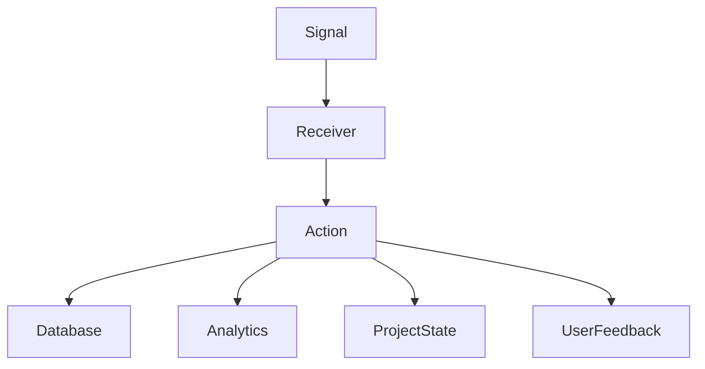

# Overview

Receivers are functions that respond to specific signals emitted during various events in the application. They are used to execute code in response to these events. In the application modules, receivers are connected to signals using the <SwmToken path="src/sentry/receivers/useremail.py" pos="16:2:2" line-data="post_save.connect(create_user_email, sender=User, dispatch_uid=&quot;create_user_email&quot;, weak=False)">`connect`</SwmToken> method. This method binds the receiver function to a specific signal, ensuring that the function is called whenever the signal is emitted.

# Use Cases for Receivers

Receivers are used for a variety of purposes, such as recording feature adoption, tracking user actions, and updating project states. For example, the `record_first_event` receiver is connected to the `first_event_received` signal and records the first event for a project. Receivers can also handle more complex tasks, such as updating project flags, recording analytics data, and managing user feedback. They provide a flexible way to extend the functionality of the application by reacting to specific events.

# Connecting Receivers to Signals

The <SwmToken path="src/sentry/receivers/useremail.py" pos="16:0:2" line-data="post_save.connect(create_user_email, sender=User, dispatch_uid=&quot;create_user_email&quot;, weak=False)">`post_save.connect`</SwmToken> method binds the <SwmToken path="src/sentry/receivers/useremail.py" pos="8:2:2" line-data="def create_user_email(instance, created, **kwargs):">`create_user_email`</SwmToken> receiver function to the <SwmToken path="src/sentry/receivers/useremail.py" pos="16:0:0" line-data="post_save.connect(create_user_email, sender=User, dispatch_uid=&quot;create_user_email&quot;, weak=False)">`post_save`</SwmToken> signal emitted by the <SwmToken path="src/sentry/receivers/useremail.py" pos="11:14:14" line-data="            UserEmail.objects.create(email=instance.email, user=instance)">`user`</SwmToken> model. This ensures that the <SwmToken path="src/sentry/receivers/useremail.py" pos="8:2:2" line-data="def create_user_email(instance, created, **kwargs):">`create_user_email`</SwmToken> function is called whenever a new <SwmToken path="src/sentry/receivers/useremail.py" pos="11:14:14" line-data="            UserEmail.objects.create(email=instance.email, user=instance)">`user`</SwmToken> instance is saved.

<SwmSnippet path="/src/sentry/receivers/useremail.py" line="16">

---

The <SwmToken path="src/sentry/receivers/useremail.py" pos="16:0:2" line-data="post_save.connect(create_user_email, sender=User, dispatch_uid=&quot;create_user_email&quot;, weak=False)">`post_save.connect`</SwmToken> method binds the <SwmToken path="src/sentry/receivers/useremail.py" pos="16:4:4" line-data="post_save.connect(create_user_email, sender=User, dispatch_uid=&quot;create_user_email&quot;, weak=False)">`create_user_email`</SwmToken> receiver function to the <SwmToken path="src/sentry/receivers/useremail.py" pos="16:0:0" line-data="post_save.connect(create_user_email, sender=User, dispatch_uid=&quot;create_user_email&quot;, weak=False)">`post_save`</SwmToken> signal emitted by the <SwmToken path="src/sentry/receivers/useremail.py" pos="16:9:9" line-data="post_save.connect(create_user_email, sender=User, dispatch_uid=&quot;create_user_email&quot;, weak=False)">`User`</SwmToken> model.

```python
post_save.connect(create_user_email, sender=User, dispatch_uid="create_user_email", weak=False)
```

---

</SwmSnippet>

# Example of a Receiver Function

The <SwmToken path="src/sentry/receivers/useremail.py" pos="8:2:2" line-data="def create_user_email(instance, created, **kwargs):">`create_user_email`</SwmToken> function is a receiver that creates a <SwmToken path="src/sentry/receivers/useremail.py" pos="11:1:1" line-data="            UserEmail.objects.create(email=instance.email, user=instance)">`UserEmail`</SwmToken> instance whenever a new <SwmToken path="src/sentry/receivers/useremail.py" pos="11:14:14" line-data="            UserEmail.objects.create(email=instance.email, user=instance)">`user`</SwmToken> is created. It handles the <SwmToken path="src/sentry/receivers/useremail.py" pos="16:0:0" line-data="post_save.connect(create_user_email, sender=User, dispatch_uid=&quot;create_user_email&quot;, weak=False)">`post_save`</SwmToken> signal for the <SwmToken path="src/sentry/receivers/useremail.py" pos="11:14:14" line-data="            UserEmail.objects.create(email=instance.email, user=instance)">`user`</SwmToken> model.

<SwmSnippet path="/src/sentry/receivers/useremail.py" line="8">

---

The <SwmToken path="src/sentry/receivers/useremail.py" pos="8:2:2" line-data="def create_user_email(instance, created, **kwargs):">`create_user_email`</SwmToken> function creates a <SwmToken path="src/sentry/receivers/useremail.py" pos="11:1:1" line-data="            UserEmail.objects.create(email=instance.email, user=instance)">`UserEmail`</SwmToken> instance whenever a new <SwmToken path="src/sentry/receivers/useremail.py" pos="11:14:14" line-data="            UserEmail.objects.create(email=instance.email, user=instance)">`user`</SwmToken> is created.

```python
def create_user_email(instance, created, **kwargs):
    if created:
        try:
            UserEmail.objects.create(email=instance.email, user=instance)
        except IntegrityError:
            pass
```

---

</SwmSnippet>

# Handling Complex Tasks with Receivers

The <SwmToken path="src/sentry/receivers/users.py" pos="31:0:2" line-data="post_upgrade.connect(">`post_upgrade.connect`</SwmToken> method binds the <SwmToken path="src/sentry/receivers/users.py" pos="32:1:1" line-data="    create_first_user, dispatch_uid=&quot;create_first_user&quot;, weak=False, sender=SiloMode.MONOLITH">`create_first_user`</SwmToken> receiver function to the <SwmToken path="src/sentry/receivers/users.py" pos="31:0:0" line-data="post_upgrade.connect(">`post_upgrade`</SwmToken> signal emitted by the <SwmToken path="src/sentry/receivers/users.py" pos="32:18:20" line-data="    create_first_user, dispatch_uid=&quot;create_first_user&quot;, weak=False, sender=SiloMode.MONOLITH">`SiloMode.MONOLITH`</SwmToken> sender. This ensures that the <SwmToken path="src/sentry/receivers/users.py" pos="32:1:1" line-data="    create_first_user, dispatch_uid=&quot;create_first_user&quot;, weak=False, sender=SiloMode.MONOLITH">`create_first_user`</SwmToken> function is called after an upgrade, allowing the application to prompt for the creation of a superuser if none exists.

<SwmSnippet path="/src/sentry/receivers/users.py" line="31">

---

The <SwmToken path="src/sentry/receivers/users.py" pos="31:0:2" line-data="post_upgrade.connect(">`post_upgrade.connect`</SwmToken> method binds the <SwmToken path="src/sentry/receivers/users.py" pos="32:1:1" line-data="    create_first_user, dispatch_uid=&quot;create_first_user&quot;, weak=False, sender=SiloMode.MONOLITH">`create_first_user`</SwmToken> receiver function to the <SwmToken path="src/sentry/receivers/users.py" pos="31:0:0" line-data="post_upgrade.connect(">`post_upgrade`</SwmToken> signal emitted by the <SwmToken path="src/sentry/receivers/users.py" pos="32:18:20" line-data="    create_first_user, dispatch_uid=&quot;create_first_user&quot;, weak=False, sender=SiloMode.MONOLITH">`SiloMode.MONOLITH`</SwmToken> sender.

```python
post_upgrade.connect(
    create_first_user, dispatch_uid="create_first_user", weak=False, sender=SiloMode.MONOLITH
)
```

---

</SwmSnippet>

# Receiver Endpoints

Endpoints of Receivers

## <SwmToken path="src/sentry/receivers/outbox/control.py" pos="37:2:2" line-data="def process_integration_updates(object_identifier: int, region_name: str, **kwds: Any):">`process_integration_updates`</SwmToken>

The <SwmToken path="src/sentry/receivers/outbox/control.py" pos="37:2:2" line-data="def process_integration_updates(object_identifier: int, region_name: str, **kwds: Any):">`process_integration_updates`</SwmToken> function is a receiver that handles updates for integrations. It processes the integration updates by checking for tombstones and then performs necessary actions based on the integration data.

<SwmSnippet path="/src/sentry/receivers/outbox/control.py" line="36">

---

The <SwmToken path="src/sentry/receivers/outbox/control.py" pos="37:2:2" line-data="def process_integration_updates(object_identifier: int, region_name: str, **kwds: Any):">`process_integration_updates`</SwmToken> function handles updates for integrations by checking for tombstones and performing necessary actions.

```python
@receiver(process_control_outbox, sender=OutboxCategory.INTEGRATION_UPDATE)
def process_integration_updates(object_identifier: int, region_name: str, **kwds: Any):
    if (
        integration := maybe_process_tombstone(
            Integration, object_identifier, region_name=region_name
        )
    ) is None:
        return
    integration  # Currently we do not sync any other integration changes, but if we did, you can use this variable.
```

---

</SwmSnippet>

## <SwmToken path="src/sentry/receivers/outbox/control.py" pos="48:2:2" line-data="def process_sentry_app_updates(object_identifier: int, region_name: str, **kwds: Any):">`process_sentry_app_updates`</SwmToken>

The <SwmToken path="src/sentry/receivers/outbox/control.py" pos="48:2:2" line-data="def process_sentry_app_updates(object_identifier: int, region_name: str, **kwds: Any):">`process_sentry_app_updates`</SwmToken> function is a receiver that handles updates for Sentry applications. It processes the updates by checking for tombstones and then purges the cache for all installations of the Sentry app. It also clears the application ID cache and handles region-specific operations.

<SwmSnippet path="/src/sentry/receivers/outbox/control.py" line="47">

---

The <SwmToken path="src/sentry/receivers/outbox/control.py" pos="48:2:2" line-data="def process_sentry_app_updates(object_identifier: int, region_name: str, **kwds: Any):">`process_sentry_app_updates`</SwmToken> function handles updates for Sentry applications by checking for tombstones, purging the cache for all installations, and clearing the application ID cache.

```python
@receiver(process_control_outbox, sender=OutboxCategory.SENTRY_APP_UPDATE)
def process_sentry_app_updates(object_identifier: int, region_name: str, **kwds: Any):

    if (
        sentry_app := maybe_process_tombstone(
            model=SentryApp, object_identifier=object_identifier, region_name=region_name
        )
    ) is None:
        return

    # When a sentry app's definition changes purge cache for all the installations.
    # This could get slow for large applications, but generally big applications don't change often.
    install_query = SentryAppInstallation.objects.filter(sentry_app=sentry_app).values(
        "id", "organization_id"
    )
    # There isn't a constraint on org : sentryapp so we have to handle lists
    install_map: dict[int, list[int]] = defaultdict(list)
    for install_row in install_query:
        install_map[install_row["organization_id"]].append(install_row["id"])

    # Clear application_id cache
```

---

</SwmSnippet>

&nbsp;

*This is an auto-generated document by Swimm AI 🌊 and has not yet been verified by a human*

<SwmMeta version="3.0.0" repo-id="Z2l0aHViJTNBJTNBc2VudHJ5LWRlbW8tMSUzQSUzQVN3aW1tLURlbW8=" repo-name="sentry-demo-1" doc-type="overview"><sup>Powered by [Swimm](/)</sup></SwmMeta>
