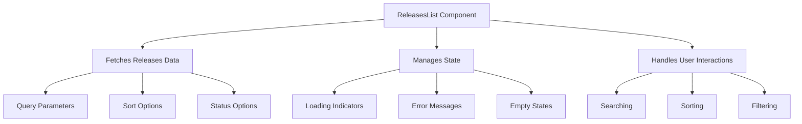

# Overview

The <SwmToken path="static/app/views/releases/list/index.tsx" pos="79:2:2" line-data="class ReleasesList extends DeprecatedAsyncView&lt;Props, State&gt; {">`ReleasesList`</SwmToken> component is responsible for displaying a list of releases. It fetches and manages the state of releases, including filtering, sorting, and displaying them based on various criteria. The component also handles user interactions such as searching, sorting, and filtering releases through various event handlers. Additionally, it includes logic to show loading indicators, error messages, and empty states based on the current state of the releases data.

<SwmSnippet path="/static/app/views/releases/list/index.tsx" line="98">

---

# Fetching and Managing Releases

The <SwmToken path="static/app/views/releases/list/index.tsx" pos="98:1:1" line-data="  getEndpoints(): ReturnType&lt;DeprecatedAsyncView[&#39;getEndpoints&#39;]&gt; {">`getEndpoints`</SwmToken> method in the <SwmToken path="static/app/views/releases/list/index.tsx" pos="79:2:2" line-data="class ReleasesList extends DeprecatedAsyncView&lt;Props, State&gt; {">`ReleasesList`</SwmToken> component defines the endpoints used to fetch release data. It constructs the query parameters based on the current state and props, such as organization, location, <SwmToken path="static/app/views/releases/list/index.tsx" pos="100:4:4" line-data="    const {statsPeriod} = location.query;">`statsPeriod`</SwmToken>, <SwmToken path="static/app/views/releases/list/index.tsx" pos="101:3:3" line-data="    const activeSort = this.getSort();">`activeSort`</SwmToken>, and <SwmToken path="static/app/views/releases/list/index.tsx" pos="102:3:3" line-data="    const activeStatus = this.getStatus();">`activeStatus`</SwmToken>. The method returns an array of endpoints that are used to fetch the necessary data for displaying the releases.

```tsx
  getEndpoints(): ReturnType<DeprecatedAsyncView['getEndpoints']> {
    const {organization, location} = this.props;
    const {statsPeriod} = location.query;
    const activeSort = this.getSort();
    const activeStatus = this.getStatus();

    const query = {
      ...pick(location.query, ['project', 'environment', 'cursor', 'query', 'sort']),
      summaryStatsPeriod: statsPeriod,
      per_page: 20,
      flatten: activeSort === ReleasesSortOption.DATE ? 0 : 1,
      adoptionStages: 1,
      status:
        activeStatus === ReleasesStatusOption.ARCHIVED
          ? ReleaseStatus.ARCHIVED
          : ReleaseStatus.ACTIVE,
    };

    const endpoints: ReturnType<DeprecatedAsyncView['getEndpoints']> = [
      [
        'releases', // stateKey
```

---

</SwmSnippet>

<SwmSnippet path="/static/app/views/releases/list/index.tsx" line="127">

---

# Handling User Interactions

The component handles user interactions such as searching, sorting, and filtering releases through various event handlers. It includes logic to show loading indicators, error messages, and empty states based on the current state of the releases data.

```tsx
  componentDidUpdate(prevProps: Props, prevState: State) {
    super.componentDidUpdate(prevProps, prevState);

    if (prevState.releases !== this.state.releases) {
      /**
       * Manually trigger checking for elements in viewport.
       * Helpful when LazyLoad components enter the viewport without resize or scroll events,
       * https://github.com/twobin/react-lazyload#forcecheck
       *
       * HealthStatsCharts are being rendered only when they are scrolled into viewport.
       * This is how we re-check them without scrolling once releases change as this view
       * uses shouldReload=true and there is no reloading happening.
       */
      forceCheck();
    }
  }
```

---

</SwmSnippet>

# Main Functions

There are several main functions in this folder. Some of them are <SwmToken path="static/app/views/releases/list/index.tsx" pos="101:9:9" line-data="    const activeSort = this.getSort();">`getSort`</SwmToken>, <SwmToken path="static/app/views/releases/list/index.tsx" pos="167:1:1" line-data="  getDisplay(): ReleasesDisplayOption {">`getDisplay`</SwmToken>, <SwmToken path="static/app/views/releases/list/index.tsx" pos="102:9:9" line-data="    const activeStatus = this.getStatus();">`getStatus`</SwmToken>, and <SwmToken path="static/app/views/releases/list/index.tsx" pos="213:1:1" line-data="  handleSearch = (query: string) =&gt; {">`handleSearch`</SwmToken>. We will dive a little into <SwmToken path="static/app/views/releases/list/index.tsx" pos="101:9:9" line-data="    const activeSort = this.getSort();">`getSort`</SwmToken> and <SwmToken path="static/app/views/releases/list/index.tsx" pos="213:1:1" line-data="  handleSearch = (query: string) =&gt; {">`handleSearch`</SwmToken>.

<SwmSnippet path="/static/app/views/releases/list/index.tsx" line="150">

---

## <SwmToken path="static/app/views/releases/list/index.tsx" pos="150:1:1" line-data="  getSort(): ReleasesSortOption {">`getSort`</SwmToken>

The <SwmToken path="static/app/views/releases/list/index.tsx" pos="150:1:1" line-data="  getSort(): ReleasesSortOption {">`getSort`</SwmToken> function determines the sorting option for the releases. It checks the current environment and the sort query parameter to return the appropriate sorting option.

```tsx
  getSort(): ReleasesSortOption {
    const {environments} = this.props.selection;
    const {sort} = this.props.location.query;

    // Require 1 environment for date adopted
    if (sort === ReleasesSortOption.ADOPTION && environments.length !== 1) {
      return ReleasesSortOption.DATE;
    }

    const sortExists = Object.values(ReleasesSortOption).includes(sort);
    if (sortExists) {
      return sort;
    }

    return ReleasesSortOption.DATE;
  }
```

---

</SwmSnippet>

<SwmSnippet path="/static/app/views/releases/list/index.tsx" line="213">

---

## <SwmToken path="static/app/views/releases/list/index.tsx" pos="213:1:1" line-data="  handleSearch = (query: string) =&gt; {">`handleSearch`</SwmToken>

The <SwmToken path="static/app/views/releases/list/index.tsx" pos="213:1:1" line-data="  handleSearch = (query: string) =&gt; {">`handleSearch`</SwmToken> function updates the query parameter in the URL based on the user's search input. It uses the router to push the new location with the updated query.

```tsx
  handleSearch = (query: string) => {
    const {location, router} = this.props;

    router.push({
      ...location,
      query: {...location.query, cursor: undefined, query},
    });
  };
```

---

</SwmSnippet>

&nbsp;

*This is an auto-generated document by Swimm AI 🌊 and has not yet been verified by a human*

<SwmMeta version="3.0.0" repo-id="Z2l0aHViJTNBJTNBc2VudHJ5LWRlbW8tMSUzQSUzQVN3aW1tLURlbW8=" repo-name="sentry-demo-1" doc-type="overview"><sup>Powered by [Swimm](/)</sup></SwmMeta>
