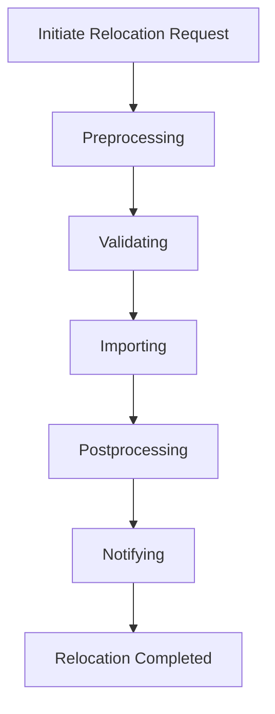

# What is Relocations in Endpoints

Relocations refer to the process of moving organizations and their associated data to a new environment, specifically to [sentry.io](http://sentry.io). The process involves several steps, including preprocessing, validating, importing, postprocessing, and notifying.

# Relocation Endpoints

Endpoints related to relocations handle various actions such as starting, pausing, unpausing, and canceling the relocation process.

## Relocation Notifications

Relocations also involve sending notifications to users about the status of their relocation requests, such as when a relocation has started or succeeded. This template is used to notify users that their relocation request has been accepted and is in progress.

## Relocation Success

This template is used to notify users that their relocation request was successful and provides additional information about the changes.

## Unpausing Relocations

The <SwmToken path="src/sentry/api/endpoints/relocations/unpause.py" pos="33:2:2" line-data="class RelocationUnpauseEndpoint(Endpoint):">`RelocationUnpauseEndpoint`</SwmToken> class manages the unpausing of an <SwmToken path="src/sentry/api/endpoints/relocations/pause.py" pos="43:5:7" line-data="        Pause an in-progress relocation.">`in-progress`</SwmToken> relocation, ensuring that the process can be safely resumed from a paused state.

## \_unpause Function

The <SwmToken path="src/sentry/api/endpoints/relocations/unpause.py" pos="41:3:3" line-data="    def _unpause(self, request: Request, relocation: Relocation) -&gt; Response | None:">`_unpause`</SwmToken> function is a helper function that performs the actual unpausing in a <SwmToken path="src/sentry/api/endpoints/relocations/unpause.py" pos="43:19:21" line-data="        Helper function to do the actual unpausing in a transaction-safe manner. It will only return">`transaction-safe`</SwmToken> manner. It only returns a <SwmToken path="src/sentry/api/endpoints/relocations/unpause.py" pos="41:22:22" line-data="    def _unpause(self, request: Request, relocation: Relocation) -&gt; Response | None:">`Response`</SwmToken> if the relocation failed; otherwise, it returns `None` and lets the calling function perform the serialization for the return payload.

<SwmSnippet path="/src/sentry/api/endpoints/relocations/unpause.py" line="41">

---

The <SwmToken path="src/sentry/api/endpoints/relocations/unpause.py" pos="41:3:3" line-data="    def _unpause(self, request: Request, relocation: Relocation) -&gt; Response | None:">`_unpause`</SwmToken> function is a helper function that performs the actual unpausing in a <SwmToken path="src/sentry/api/endpoints/relocations/unpause.py" pos="43:19:21" line-data="        Helper function to do the actual unpausing in a transaction-safe manner. It will only return">`transaction-safe`</SwmToken> manner.

```python
    def _unpause(self, request: Request, relocation: Relocation) -> Response | None:
        """
        Helper function to do the actual unpausing in a transaction-safe manner. It will only return
        a `Response` if the relocation failed - otherwise, it will return `None` and let the calling
        function perform the serialization for the return payload.
        """
```

---

</SwmSnippet>

## <SwmToken path="src/sentry/api/endpoints/relocations/recover.py" pos="35:2:2" line-data="class RelocationRecoverEndpoint(Endpoint):">`RelocationRecoverEndpoint`</SwmToken>

The <SwmToken path="src/sentry/api/endpoints/relocations/recover.py" pos="35:2:2" line-data="class RelocationRecoverEndpoint(Endpoint):">`RelocationRecoverEndpoint`</SwmToken> class defines an endpoint to recover a failed relocation. The <SwmToken path="src/sentry/api/endpoints/relocations/recover.py" pos="39:2:2" line-data="        &quot;PUT&quot;: ApiPublishStatus.EXPERIMENTAL,">`PUT`</SwmToken> method allows a user to retry the last attempted task of a failed relocation, potentially after a bug fix. It accepts an optional parameter <SwmToken path="src/sentry/api/endpoints/relocations/recover.py" pos="49:12:12" line-data="        until_step = request.data.get(&quot;untilStep&quot;, None)">`untilStep`</SwmToken> to specify the step before which the next pause should occur.

<SwmSnippet path="/src/sentry/api/endpoints/relocations/recover.py" line="34">

---

The <SwmToken path="src/sentry/api/endpoints/relocations/recover.py" pos="35:2:2" line-data="class RelocationRecoverEndpoint(Endpoint):">`RelocationRecoverEndpoint`</SwmToken> class defines an endpoint to recover a failed relocation.

```python
@region_silo_endpoint
class RelocationRecoverEndpoint(Endpoint):
    owner = ApiOwner.OPEN_SOURCE
    publish_status = {
        # TODO(getsentry/team-ospo#214): Stabilize before GA.
        "PUT": ApiPublishStatus.EXPERIMENTAL,
    }
    permission_classes = (SuperuserOrStaffFeatureFlaggedPermission,)

    def _recover(self, request: Request, relocation: Relocation) -> Response | None:
        """
        Helper function to do just... one... more... attempt of a the last task that the relocation
        failed at. Useful to try to recover a relocation after a fix has been pushed.
        """

        until_step = request.data.get("untilStep", None)
        if until_step is not None:
            try:
                step = Relocation.Step[until_step.upper()]
            except KeyError:
                return Response(
```

---

</SwmSnippet>

## <SwmToken path="src/sentry/api/endpoints/relocations/pause.py" pos="33:2:2" line-data="class RelocationPauseEndpoint(Endpoint):">`RelocationPauseEndpoint`</SwmToken>

The <SwmToken path="src/sentry/api/endpoints/relocations/pause.py" pos="33:2:2" line-data="class RelocationPauseEndpoint(Endpoint):">`RelocationPauseEndpoint`</SwmToken> class defines an endpoint to pause an <SwmToken path="src/sentry/api/endpoints/relocations/pause.py" pos="43:5:7" line-data="        Pause an in-progress relocation.">`in-progress`</SwmToken> relocation. The <SwmToken path="src/sentry/api/endpoints/relocations/recover.py" pos="39:2:2" line-data="        &quot;PUT&quot;: ApiPublishStatus.EXPERIMENTAL,">`PUT`</SwmToken> method allows a user to schedule a pause at a specific step in the relocation process. It accepts an optional parameter <SwmToken path="src/sentry/api/endpoints/relocations/pause.py" pos="51:6:6" line-data="        :param string atStep: an optional string identifying the step to pause at; must be greater">`atStep`</SwmToken> to specify the step at which the pause should occur.

<SwmSnippet path="/src/sentry/api/endpoints/relocations/pause.py" line="32">

---

The <SwmToken path="src/sentry/api/endpoints/relocations/pause.py" pos="33:2:2" line-data="class RelocationPauseEndpoint(Endpoint):">`RelocationPauseEndpoint`</SwmToken> class defines an endpoint to pause an <SwmToken path="src/sentry/api/endpoints/relocations/pause.py" pos="43:5:7" line-data="        Pause an in-progress relocation.">`in-progress`</SwmToken> relocation.

```````````````````````````````````````````````````python
@region_silo_endpoint
class RelocationPauseEndpoint(Endpoint):
    owner = ApiOwner.OPEN_SOURCE
    publish_status = {
        # TODO(getsentry/team-ospo#214): Stabilize before GA.
        "PUT": ApiPublishStatus.EXPERIMENTAL,
    }
    permission_classes = (SuperuserOrStaffFeatureFlaggedPermission,)

    def put(self, request: Request, relocation_uuid: str) -> Response:
        """
        Pause an in-progress relocation.
        ``````````````````````````````````````````````````

        This command accepts a single optional parameter, which specifies the step BEFORE which the
        pause should occur. If no such parameter is specified, the pause is scheduled for the step
        immediately following the currently active one, if possible.

        :pparam string relocation_uuid: a UUID identifying the relocation.
        :param string atStep: an optional string identifying the step to pause at; must be greater
                               than the currently active step, and one of: `PREPROCESSING`,
```````````````````````````````````````````````````

---

</SwmSnippet>

&nbsp;

*This is an auto-generated document by Swimm AI 🌊 and has not yet been verified by a human*

<SwmMeta version="3.0.0" repo-id="Z2l0aHViJTNBJTNBc2VudHJ5LWRlbW8tMSUzQSUzQVN3aW1tLURlbW8=" repo-name="sentry-demo-1" doc-type="overview"><sup>Powered by [Swimm](/)</sup></SwmMeta>
