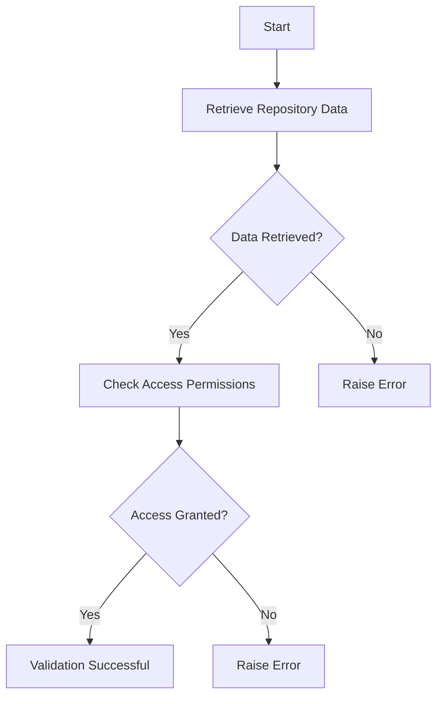

This document will cover the process of validating a repository. We'll cover:

1. Retrieving repository data
2. Checking access permissions

Technical document: <SwmLink doc-title="Validating a Repository">[Validating a Repository](/.swm/validating-a-repository.hter470m.sw.md)</SwmLink>

# [Retrieving Repository Data](https://app.swimm.io/repos/Z2l0aHViJTNBJTNBc2VudHJ5LWRlbW8tMSUzQSUzQVN3aW1tLURlbW8=/docs/hter470m#validating-the-repository)

The first step in validating a repository is to retrieve the repository data. This involves attempting to access the repository using the provided repository identifier. If the repository data cannot be retrieved, an error is raised. This step ensures that the repository exists and is accessible.

# [Checking Access Permissions](https://app.swimm.io/repos/Z2l0aHViJTNBJTNBc2VudHJ5LWRlbW8tMSUzQSUzQVN3aW1tLURlbW8=/docs/hter470m#validating-the-repository)

After successfully retrieving the repository data, the next step is to check if the installation has the necessary permissions to access the repository. This is done by attempting to retrieve the commits from the repository. If the installation does not have access, an error is raised. This step ensures that the installation has the appropriate permissions to interact with the repository.

&nbsp;

*This is an auto-generated document by Swimm AI 🌊 and has not yet been verified by a human*

<SwmMeta version="3.0.0" repo-id="Z2l0aHViJTNBJTNBc2VudHJ5LWRlbW8tMSUzQSUzQVN3aW1tLURlbW8=" repo-name="sentry-demo-1" doc-type="product-flows">Powered by [Swimm](/)</SwmMeta>
