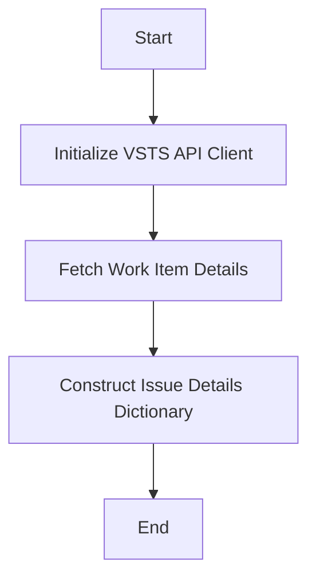

This document will cover the process of retrieving and formatting issue details from VSTS. We'll cover:

1. Initializing the VSTS API Client
2. Fetching Work Item Details
3. Constructing the Issue Details Dictionary

Technical document: <SwmLink doc-title="Retrieving and Formatting Issue Details">[Retrieving and Formatting Issue Details](/.swm/retrieving-and-formatting-issue-details.7pxhq4xd.sw.md)</SwmLink>

# [Initializing the VSTS API Client](https://app.swimm.io/repos/Z2l0aHViJTNBJTNBc2VudHJ5LWRlbW8tMSUzQSUzQVN3aW1tLURlbW8=/docs/7pxhq4xd#initializing-the-vsts-api-client)

The process begins by initializing the VSTS API client. This step involves setting the base URL and handling authentication details. The system ensures that the default identity and organization integration are properly configured. This is crucial because it establishes a secure and authenticated connection to the VSTS service, which is necessary for retrieving issue details.

# [Fetching Work Item Details](https://app.swimm.io/repos/Z2l0aHViJTNBJTNBc2VudHJ5LWRlbW8tMSUzQSUzQVN3aW1tLURlbW8=/docs/7pxhq4xd#fetching-work-item-details)

Once the VSTS API client is initialized, the next step is to fetch the details of the work item. This is done by constructing the appropriate API endpoint URL and performing a GET request. The work item details include various fields such as the issue's ID, title, and description. This step is essential because it gathers all the necessary information about the issue that needs to be formatted and displayed.

# [Constructing the Issue Details Dictionary](https://app.swimm.io/repos/Z2l0aHViJTNBJTNBc2VudHJ5LWRlbW8tMSUzQSUzQVN3aW1tLURlbW8=/docs/7pxhq4xd#retrieving-and-formatting-issue-details)

The final step is to format the retrieved work item details into a dictionary. This dictionary includes the issue's key, title, description, and some metadata. The metadata is formatted to display the issue's area path and ID. This step is important because it organizes the issue details in a structured format that can be easily displayed to the end user. The formatted dictionary ensures that all relevant information is presented clearly and concisely.

&nbsp;

*This is an auto-generated document by Swimm AI 🌊 and has not yet been verified by a human*

<SwmMeta version="3.0.0" repo-id="Z2l0aHViJTNBJTNBc2VudHJ5LWRlbW8tMSUzQSUzQVN3aW1tLURlbW8=" repo-name="sentry-demo-1" doc-type="product-flows">Powered by [Swimm](/)</SwmMeta>
