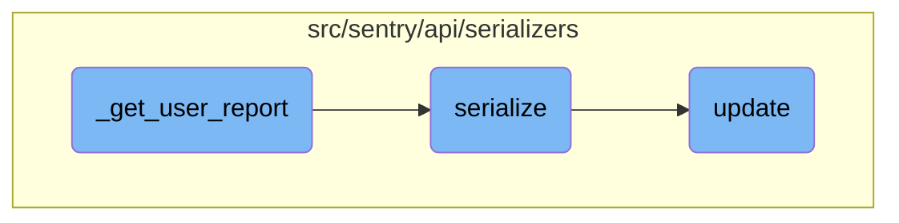

This document explains the process of retrieving a user report based on an event ID and project ID, serializing the report, and updating the dashboard with the relevant data. The process ensures that user reports are consistently formatted and integrated into the dashboard for further analysis.

The flow starts by retrieving a user report using the event ID and project ID. If the report exists, it is then converted into a serialized format. This serialized data is then used to update the dashboard, ensuring that all widgets and queries are consistent with the latest user report data.

# Flow drill down



<SwmSnippet path="/src/sentry/api/serializers/models/event.py" line="167">

---

## <SwmToken path="src/sentry/api/serializers/models/event.py" pos="167:3:3" line-data="    def _get_user_report(self, user, event):">`_get_user_report`</SwmToken>

The <SwmToken path="src/sentry/api/serializers/models/event.py" pos="167:3:3" line-data="    def _get_user_report(self, user, event):">`_get_user_report`</SwmToken> function retrieves a user report based on the event ID and project ID. If the user report does not exist, it returns `None`. The function then calls <SwmToken path="src/sentry/api/serializers/models/event.py" pos="174:3:3" line-data="        return serialize(user_report, user)">`serialize`</SwmToken> to convert the user report into a serialized format.

```python
    def _get_user_report(self, user, event):
        try:
            user_report = UserReport.objects.get(
                event_id=event.event_id, project_id=event.project_id
            )
        except UserReport.DoesNotExist:
            user_report = None
        return serialize(user_report, user)
```

---

</SwmSnippet>

<SwmSnippet path="/src/sentry/api/serializers/models/event.py" line="220">

---

## serialize

The <SwmToken path="src/sentry/api/serializers/models/event.py" pos="220:3:3" line-data="    def serialize(self, obj, attrs, user, **kwargs):">`serialize`</SwmToken> function converts an object into a dictionary format suitable for API responses. It handles various attributes of the event, such as errors, messages, tags, and metadata. This function ensures that the data is in a consistent format for further processing or display.

```python
    def serialize(self, obj, attrs, user, **kwargs):
        from sentry.api.serializers.rest_framework import convert_dict_key_case, snake_to_camel_case

        errors = [
            EventError(error).get_api_context()
            for error in get_path(obj.data, "errors", filter=True, default=())
            # TODO(ja): Temporary workaround to hide certain normalization errors.
            # Remove this and the test in tests/sentry/api/serializers/test_event.py
            if self.should_display_error(error)
        ]

        (message, message_meta) = self._get_legacy_message_with_meta(obj)
        (tags, tags_meta) = get_tags_with_meta(obj)
        (context, context_meta) = self._get_attr_with_meta(obj, "extra", {})
        (packages, packages_meta) = self._get_attr_with_meta(obj, "modules", {})

        received = obj.data.get("received")
        if received:
            # Sentry at one point attempted to record invalid types here.
            # Remove after June 2 2016
            try:
```

---

</SwmSnippet>

<SwmSnippet path="/src/sentry/api/serializers/rest_framework/dashboard.py" line="565">

---

## update

The <SwmToken path="src/sentry/api/serializers/rest_framework/dashboard.py" pos="565:3:3" line-data="    def update(self, instance, validated_data):">`update`</SwmToken> function updates a dashboard and its associated widgets and queries. It handles the creation, updating, and deletion of widgets based on the provided validated data. This function ensures that the dashboard remains consistent with the user's modifications.

```python
    def update(self, instance, validated_data):
        """
        Update a dashboard, the connected widgets and queries

        - Widgets in the dashboard currently, but not in validated_data will be removed.
        - Widgets without ids will be created.
        - Widgets with matching IDs will be updated.
        - The order of the widgets will be updated based on the order in the request data.

        Only call save() on this serializer from within a transaction or
        bad things will happen
        """
        instance.title = validated_data.get("title", instance.title)
        instance.save()

        if "widgets" in validated_data:
            self.update_widgets(instance, validated_data["widgets"])

        self.update_dashboard_filters(instance, validated_data)

        schedule_update_project_configs(instance)
```

---

</SwmSnippet>

&nbsp;

*This is an auto-generated document by Swimm AI 🌊 and has not yet been verified by a human*

<SwmMeta version="3.0.0" repo-id="Z2l0aHViJTNBJTNBc2VudHJ5LWRlbW8tMSUzQSUzQVN3aW1tLURlbW8=" repo-name="sentry-demo-1" doc-type="flows"><sup>Powered by [Swimm](/)</sup></SwmMeta>
