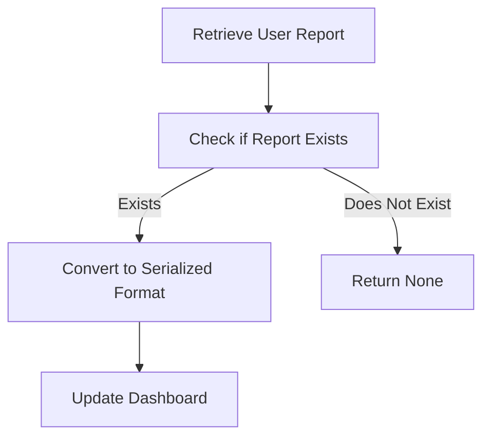

This document will cover the process of retrieving and processing user reports, which includes:

1. Retrieving the user report
2. Serializing the user report
3. Updating the dashboard with the serialized data.

Technical document: <SwmLink doc-title="Retrieving and Processing User Reports">[Retrieving and Processing User Reports](/.swm/retrieving-and-processing-user-reports.ax9hin48.sw.md)</SwmLink>

# [Retrieving the User Report](https://app.swimm.io/repos/Z2l0aHViJTNBJTNBc2VudHJ5LWRlbW8tMSUzQSUzQVN3aW1tLURlbW8=/docs/ax9hin48#_get_user_report)

The process begins by retrieving a user report using the event ID and project ID. This step ensures that we are fetching the correct report associated with a specific event and project. If the report exists, it will be used in the subsequent steps. If it does not exist, the process will return 'None', indicating that there is no report to process.

# [Serializing the User Report](https://app.swimm.io/repos/Z2l0aHViJTNBJTNBc2VudHJ5LWRlbW8tMSUzQSUzQVN3aW1tLURlbW8=/docs/ax9hin48#serialize)

Once the user report is retrieved, it needs to be converted into a serialized format. Serialization involves transforming the report into a structured format that can be easily processed and displayed. This step ensures that the data is consistent and includes all necessary attributes such as errors, messages, tags, and metadata. The serialized data is now ready for further processing or display.

# [Updating the Dashboard](https://app.swimm.io/repos/Z2l0aHViJTNBJTNBc2VudHJ5LWRlbW8tMSUzQSUzQVN3aW1tLURlbW8=/docs/ax9hin48#update)

The final step involves updating the dashboard with the serialized user report data. This step ensures that the dashboard reflects the latest information from the user report. It handles the creation, updating, and deletion of widgets based on the provided data. This ensures that all widgets and queries on the dashboard are consistent with the latest user report data, providing an up-to-date view for further analysis.

&nbsp;

*This is an auto-generated document by Swimm AI 🌊 and has not yet been verified by a human*

<SwmMeta version="3.0.0" repo-id="Z2l0aHViJTNBJTNBc2VudHJ5LWRlbW8tMSUzQSUzQVN3aW1tLURlbW8=" repo-name="sentry-demo-1" doc-type="product-flows">Powered by [Swimm](/)</SwmMeta>
