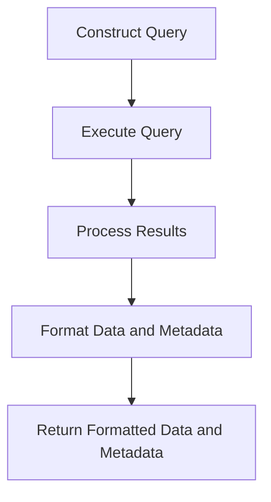

This document will cover the process of retrieving and processing user span data, which includes:

1. Constructing the query
2. Executing the query
3. Processing the results
4. Formatting the data and metadata
5. Returning the formatted data and metadata.

Technical document: <SwmLink doc-title="Retrieving and Processing User Span Data">[Retrieving and Processing User Span Data](/.swm/retrieving-and-processing-user-span-data.rl7u8kqm.sw.md)</SwmLink>

# [Constructing the Query](https://app.swimm.io/repos/Z2l0aHViJTNBJTNBc2VudHJ5LWRlbW8tMSUzQSUzQVN3aW1tLURlbW8=/docs/rl7u8kqm#get_user_spans)

The process begins with constructing a query to retrieve user span data. This query is built based on specific parameters such as the span keys, limit, and offset. The goal is to create a precise query that will fetch the relevant span data for the user.

# [Executing the Query](https://app.swimm.io/repos/Z2l0aHViJTNBJTNBc2VudHJ5LWRlbW8tMSUzQSUzQVN3aW1tLURlbW8=/docs/rl7u8kqm#run_query)

Once the query is constructed, it is executed to fetch the raw span data. This involves sending the query to the database and retrieving the results. The execution step is crucial as it ensures that the data is accurately fetched based on the constructed query.

# [Processing the Results](https://app.swimm.io/repos/Z2l0aHViJTNBJTNBc2VudHJ5LWRlbW8tMSUzQSUzQVN3aW1tLURlbW8=/docs/rl7u8kqm#process_final_results)

After retrieving the raw data, the next step is to process these results. This involves organizing the data into meaningful intervals and handling any exceptions that may occur. The processing step ensures that the data is structured in a way that is useful for further analysis.

# [Formatting the Data and Metadata](https://app.swimm.io/repos/Z2l0aHViJTNBJTNBc2VudHJ5LWRlbW8tMSUzQSUzQVN3aW1tLURlbW8=/docs/rl7u8kqm#handle_results_with_meta)

The processed data is then formatted along with any necessary metadata. This includes assigning names to traces, handling transaction statuses, and mapping issue IDs to their corresponding issue objects. The formatting step ensures that the data is presented in a clear and understandable format.

# [Returning the Formatted Data and Metadata](https://app.swimm.io/repos/Z2l0aHViJTNBJTNBc2VudHJ5LWRlbW8tMSUzQSUzQVN3aW1tLURlbW8=/docs/rl7u8kqm#serialize)

Finally, the formatted data and metadata are returned. This step involves converting the data into a format that can be easily consumed by other parts of the application. The goal is to provide a comprehensive and well-structured dataset that can be used for further analysis and decision-making.

&nbsp;

*This is an auto-generated document by Swimm AI 🌊 and has not yet been verified by a human*

<SwmMeta version="3.0.0" repo-id="Z2l0aHViJTNBJTNBc2VudHJ5LWRlbW8tMSUzQSUzQVN3aW1tLURlbW8=" repo-name="sentry-demo-1" doc-type="product-flows">Powered by [Swimm](/)</SwmMeta>
