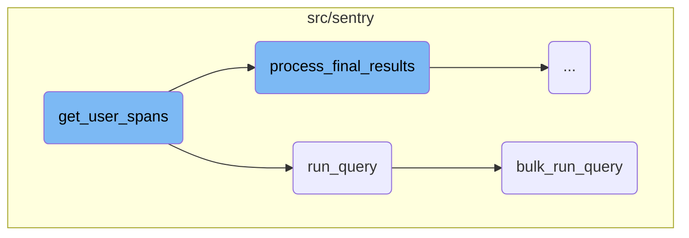
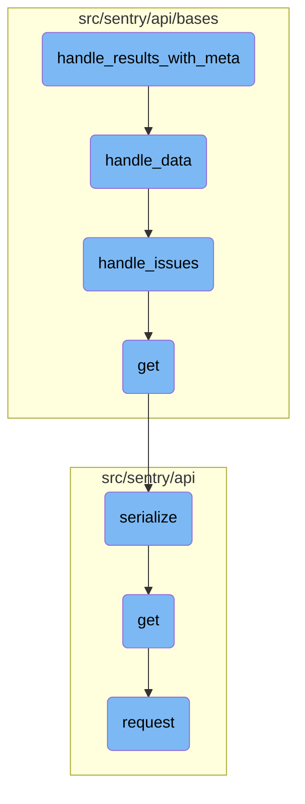

```mermaid
graph TD;
      subgraph src/sentry/api
0118137c1f91b17b6ac71cd9660b3974ee398845c92ac976d9e2c83b70213c23(process_final_results):::mainFlowStyle --> 3cd1b1a0e8a728db57f669bad3f106ec90842fca07422760267389e206165e0b(process_breakdowns):::mainFlowStyle
end

subgraph src/sentry/api
3cd1b1a0e8a728db57f669bad3f106ec90842fca07422760267389e206165e0b(process_breakdowns):::mainFlowStyle --> 2451435e15272d333ed36ebed5fe1a6c18e1343163cd2b698a0ed4f1071b3b63(new_trace_interval):::mainFlowStyle
end

subgraph src/sentry/api
2451435e15272d333ed36ebed5fe1a6c18e1343163cd2b698a0ed4f1071b3b63(new_trace_interval):::mainFlowStyle --> ba18c5554394177c4ba758ce8262e4486312fe1945d3a8c33084e911a1d88843(get):::mainFlowStyle
end

subgraph src/sentry/api
ba18c5554394177c4ba758ce8262e4486312fe1945d3a8c33084e911a1d88843(get):::mainFlowStyle --> b78f090bee5ee1b80e0cefdc5ef9f091d68feb8de625f9b05752b648208fc62b(get_per_page)
end

subgraph src/sentry/api
ba18c5554394177c4ba758ce8262e4486312fe1945d3a8c33084e911a1d88843(get):::mainFlowStyle --> 76555db3c36df80d8ce698d10ee1f95e79e25496e48ce2c0e3a19dce410f1dcd(handle_results_with_meta):::mainFlowStyle
end

subgraph src/sentry/api
76555db3c36df80d8ce698d10ee1f95e79e25496e48ce2c0e3a19dce410f1dcd(handle_results_with_meta):::mainFlowStyle --> j22q0(...)
end


      classDef mainFlowStyle color:#000000,fill:#7CB9F4
classDef rootsStyle color:#000000,fill:#00FFF4
classDef Style1 color:#000000,fill:#00FFAA
classDef Style2 color:#000000,fill:#FFFF00
classDef Style3 color:#000000,fill:#AA7CB9

%% Swimm:
%% graph TD;
%%       subgraph <SwmPath>[src/sentry/api/](src/sentry/api/)</SwmPath>
%% 0118137c1f91b17b6ac71cd9660b3974ee398845c92ac976d9e2c83b70213c23(process_final_results):::mainFlowStyle --> 3cd1b1a0e8a728db57f669bad3f106ec90842fca07422760267389e206165e0b(process_breakdowns):::mainFlowStyle
%% end
%% 
%% subgraph <SwmPath>[src/sentry/api/](src/sentry/api/)</SwmPath>
%% 3cd1b1a0e8a728db57f669bad3f106ec90842fca07422760267389e206165e0b(process_breakdowns):::mainFlowStyle --> 2451435e15272d333ed36ebed5fe1a6c18e1343163cd2b698a0ed4f1071b3b63(new_trace_interval):::mainFlowStyle
%% end
%% 
%% subgraph <SwmPath>[src/sentry/api/](src/sentry/api/)</SwmPath>
%% 2451435e15272d333ed36ebed5fe1a6c18e1343163cd2b698a0ed4f1071b3b63(new_trace_interval):::mainFlowStyle --> ba18c5554394177c4ba758ce8262e4486312fe1945d3a8c33084e911a1d88843(get):::mainFlowStyle
%% end
%% 
%% subgraph <SwmPath>[src/sentry/api/](src/sentry/api/)</SwmPath>
%% ba18c5554394177c4ba758ce8262e4486312fe1945d3a8c33084e911a1d88843(get):::mainFlowStyle --> b78f090bee5ee1b80e0cefdc5ef9f091d68feb8de625f9b05752b648208fc62b(get_per_page)
%% end
%% 
%% subgraph <SwmPath>[src/sentry/api/](src/sentry/api/)</SwmPath>
%% ba18c5554394177c4ba758ce8262e4486312fe1945d3a8c33084e911a1d88843(get):::mainFlowStyle --> 76555db3c36df80d8ce698d10ee1f95e79e25496e48ce2c0e3a19dce410f1dcd(handle_results_with_meta):::mainFlowStyle
%% end
%% 
%% subgraph <SwmPath>[src/sentry/api/](src/sentry/api/)</SwmPath>
%% 76555db3c36df80d8ce698d10ee1f95e79e25496e48ce2c0e3a19dce410f1dcd(handle_results_with_meta):::mainFlowStyle --> j22q0(...)
%% end
%% 
%% 
%%       classDef mainFlowStyle color:#000000,fill:#7CB9F4
%% classDef rootsStyle color:#000000,fill:#00FFF4
%% classDef Style1 color:#000000,fill:#00FFAA
%% classDef Style2 color:#000000,fill:#FFFF00
%% classDef Style3 color:#000000,fill:#AA7CB9
```

This document provides an overview of the process involved in retrieving and processing user span data. The process includes constructing a query, executing it, and then processing the results to format the data and metadata before returning them.

The flow starts with constructing a query to get user span data. This query is then executed to fetch the raw data. The raw data is processed through several steps to format it properly and add any necessary metadata. Finally, the formatted data and metadata are returned.

Here is a high level diagram of the flow, showing only the most important functions:

```mermaid
graph TD;
      subgraph src/sentry/snuba/metrics_layer/query.py
b3a38fdcc1655709fb1ea71976f05cfb7e688e5bb94b00bb8436936048bbb331(get_user_spans):::mainFlowStyle --> 0855223e36ac882841bbf2e0ef2fb632f98281c9458dac000c15db12ffb5feef(run_query)
end

subgraph src/sentry/api
b3a38fdcc1655709fb1ea71976f05cfb7e688e5bb94b00bb8436936048bbb331(get_user_spans):::mainFlowStyle --> 0118137c1f91b17b6ac71cd9660b3974ee398845c92ac976d9e2c83b70213c23(process_final_results):::mainFlowStyle
end

subgraph src/sentry/api
0118137c1f91b17b6ac71cd9660b3974ee398845c92ac976d9e2c83b70213c23(process_final_results):::mainFlowStyle --> 3cd1b1a0e8a728db57f669bad3f106ec90842fca07422760267389e206165e0b(process_breakdowns):::mainFlowStyle
end

subgraph src/sentry/api
3cd1b1a0e8a728db57f669bad3f106ec90842fca07422760267389e206165e0b(process_breakdowns):::mainFlowStyle --> 2451435e15272d333ed36ebed5fe1a6c18e1343163cd2b698a0ed4f1071b3b63(new_trace_interval):::mainFlowStyle
end

subgraph src/sentry/api
2451435e15272d333ed36ebed5fe1a6c18e1343163cd2b698a0ed4f1071b3b63(new_trace_interval):::mainFlowStyle --> ba18c5554394177c4ba758ce8262e4486312fe1945d3a8c33084e911a1d88843(get):::mainFlowStyle
end

subgraph src/sentry/api
ba18c5554394177c4ba758ce8262e4486312fe1945d3a8c33084e911a1d88843(get):::mainFlowStyle --> b78f090bee5ee1b80e0cefdc5ef9f091d68feb8de625f9b05752b648208fc62b(get_per_page)
end

subgraph src/sentry/api/bases
ba18c5554394177c4ba758ce8262e4486312fe1945d3a8c33084e911a1d88843(get):::mainFlowStyle --> 76555db3c36df80d8ce698d10ee1f95e79e25496e48ce2c0e3a19dce410f1dcd(handle_results_with_meta):::mainFlowStyle
end

subgraph src/sentry/api/bases
76555db3c36df80d8ce698d10ee1f95e79e25496e48ce2c0e3a19dce410f1dcd(handle_results_with_meta):::mainFlowStyle --> 9335165d6fb85d88094c6bb73f9e154b223f793b29b1af6be9aa07d145132b65(handle_data):::mainFlowStyle
end

subgraph src/sentry/api/bases
9335165d6fb85d88094c6bb73f9e154b223f793b29b1af6be9aa07d145132b65(handle_data):::mainFlowStyle --> 605b60781a4fbfeba3f444390472368700ddbddedce4a63bab202354b89e439d(handle_issues):::mainFlowStyle
end

subgraph src/sentry/api/bases
605b60781a4fbfeba3f444390472368700ddbddedce4a63bab202354b89e439d(handle_issues):::mainFlowStyle --> f60b5d50f3c7351433cbd1cf5c331e11b46d667524061d08fe91a0711b674de5(get):::mainFlowStyle
end

subgraph src/sentry/api
f60b5d50f3c7351433cbd1cf5c331e11b46d667524061d08fe91a0711b674de5(get):::mainFlowStyle --> 1400fb4f92d6544713dbe3f2d258a2bc468cc19c4b2c1e43d5119a7f6abd1aba(serialize):::mainFlowStyle
end

subgraph src/sentry/api
1400fb4f92d6544713dbe3f2d258a2bc468cc19c4b2c1e43d5119a7f6abd1aba(serialize):::mainFlowStyle --> 83c60e09691cf8078a6d5775d6d8159fb99f2e95ba4d7ab7bd7c38fc01a7d08d(get):::mainFlowStyle
end

subgraph src/sentry/api
83c60e09691cf8078a6d5775d6d8159fb99f2e95ba4d7ab7bd7c38fc01a7d08d(get):::mainFlowStyle --> f9a76a621506843e728c753bbfd65f5dee5fa0fc21993c46938d555bf01dd967(request):::mainFlowStyle
end


      classDef mainFlowStyle color:#000000,fill:#7CB9F4
classDef rootsStyle color:#000000,fill:#00FFF4
classDef Style1 color:#000000,fill:#00FFAA
classDef Style2 color:#000000,fill:#FFFF00
classDef Style3 color:#000000,fill:#AA7CB9

%% Swimm:
%% graph TD;
%%       subgraph <SwmPath>[src/sentry/snuba/metrics_layer/query.py](src/sentry/snuba/metrics_layer/query.py)</SwmPath>
%% b3a38fdcc1655709fb1ea71976f05cfb7e688e5bb94b00bb8436936048bbb331(get_user_spans):::mainFlowStyle --> 0855223e36ac882841bbf2e0ef2fb632f98281c9458dac000c15db12ffb5feef(run_query)
%% end
%% 
%% subgraph <SwmPath>[src/sentry/api/](src/sentry/api/)</SwmPath>
%% b3a38fdcc1655709fb1ea71976f05cfb7e688e5bb94b00bb8436936048bbb331(get_user_spans):::mainFlowStyle --> 0118137c1f91b17b6ac71cd9660b3974ee398845c92ac976d9e2c83b70213c23(process_final_results):::mainFlowStyle
%% end
%% 
%% subgraph <SwmPath>[src/sentry/api/](src/sentry/api/)</SwmPath>
%% 0118137c1f91b17b6ac71cd9660b3974ee398845c92ac976d9e2c83b70213c23(process_final_results):::mainFlowStyle --> 3cd1b1a0e8a728db57f669bad3f106ec90842fca07422760267389e206165e0b(process_breakdowns):::mainFlowStyle
%% end
%% 
%% subgraph <SwmPath>[src/sentry/api/](src/sentry/api/)</SwmPath>
%% 3cd1b1a0e8a728db57f669bad3f106ec90842fca07422760267389e206165e0b(process_breakdowns):::mainFlowStyle --> 2451435e15272d333ed36ebed5fe1a6c18e1343163cd2b698a0ed4f1071b3b63(new_trace_interval):::mainFlowStyle
%% end
%% 
%% subgraph <SwmPath>[src/sentry/api/](src/sentry/api/)</SwmPath>
%% 2451435e15272d333ed36ebed5fe1a6c18e1343163cd2b698a0ed4f1071b3b63(new_trace_interval):::mainFlowStyle --> ba18c5554394177c4ba758ce8262e4486312fe1945d3a8c33084e911a1d88843(get):::mainFlowStyle
%% end
%% 
%% subgraph <SwmPath>[src/sentry/api/](src/sentry/api/)</SwmPath>
%% ba18c5554394177c4ba758ce8262e4486312fe1945d3a8c33084e911a1d88843(get):::mainFlowStyle --> b78f090bee5ee1b80e0cefdc5ef9f091d68feb8de625f9b05752b648208fc62b(get_per_page)
%% end
%% 
%% subgraph <SwmPath>[src/sentry/api/bases/](src/sentry/api/bases/)</SwmPath>
%% ba18c5554394177c4ba758ce8262e4486312fe1945d3a8c33084e911a1d88843(get):::mainFlowStyle --> 76555db3c36df80d8ce698d10ee1f95e79e25496e48ce2c0e3a19dce410f1dcd(handle_results_with_meta):::mainFlowStyle
%% end
%% 
%% subgraph <SwmPath>[src/sentry/api/bases/](src/sentry/api/bases/)</SwmPath>
%% 76555db3c36df80d8ce698d10ee1f95e79e25496e48ce2c0e3a19dce410f1dcd(handle_results_with_meta):::mainFlowStyle --> 9335165d6fb85d88094c6bb73f9e154b223f793b29b1af6be9aa07d145132b65(handle_data):::mainFlowStyle
%% end
%% 
%% subgraph <SwmPath>[src/sentry/api/bases/](src/sentry/api/bases/)</SwmPath>
%% 9335165d6fb85d88094c6bb73f9e154b223f793b29b1af6be9aa07d145132b65(handle_data):::mainFlowStyle --> 605b60781a4fbfeba3f444390472368700ddbddedce4a63bab202354b89e439d(handle_issues):::mainFlowStyle
%% end
%% 
%% subgraph <SwmPath>[src/sentry/api/bases/](src/sentry/api/bases/)</SwmPath>
%% 605b60781a4fbfeba3f444390472368700ddbddedce4a63bab202354b89e439d(handle_issues):::mainFlowStyle --> f60b5d50f3c7351433cbd1cf5c331e11b46d667524061d08fe91a0711b674de5(get):::mainFlowStyle
%% end
%% 
%% subgraph <SwmPath>[src/sentry/api/](src/sentry/api/)</SwmPath>
%% f60b5d50f3c7351433cbd1cf5c331e11b46d667524061d08fe91a0711b674de5(get):::mainFlowStyle --> 1400fb4f92d6544713dbe3f2d258a2bc468cc19c4b2c1e43d5119a7f6abd1aba(serialize):::mainFlowStyle
%% end
%% 
%% subgraph <SwmPath>[src/sentry/api/](src/sentry/api/)</SwmPath>
%% 1400fb4f92d6544713dbe3f2d258a2bc468cc19c4b2c1e43d5119a7f6abd1aba(serialize):::mainFlowStyle --> 83c60e09691cf8078a6d5775d6d8159fb99f2e95ba4d7ab7bd7c38fc01a7d08d(get):::mainFlowStyle
%% end
%% 
%% subgraph <SwmPath>[src/sentry/api/](src/sentry/api/)</SwmPath>
%% 83c60e09691cf8078a6d5775d6d8159fb99f2e95ba4d7ab7bd7c38fc01a7d08d(get):::mainFlowStyle --> f9a76a621506843e728c753bbfd65f5dee5fa0fc21993c46938d555bf01dd967(request):::mainFlowStyle
%% end
%% 
%% 
%%       classDef mainFlowStyle color:#000000,fill:#7CB9F4
%% classDef rootsStyle color:#000000,fill:#00FFF4
%% classDef Style1 color:#000000,fill:#00FFAA
%% classDef Style2 color:#000000,fill:#FFFF00
%% classDef Style3 color:#000000,fill:#AA7CB9
```



# Flow drill down

First, we'll zoom into this section of the flow:



<SwmSnippet path="/src/sentry/api/endpoints/organization_traces.py" line="963">

---

## <SwmToken path="src/sentry/api/endpoints/organization_traces.py" pos="963:3:3" line-data="    def get_user_spans(">`get_user_spans`</SwmToken>

The <SwmToken path="src/sentry/api/endpoints/organization_traces.py" pos="963:3:3" line-data="    def get_user_spans(">`get_user_spans`</SwmToken> function is responsible for orchestrating the retrieval and processing of user span data. It first constructs a query using <SwmToken path="src/sentry/api/endpoints/organization_traces.py" pos="970:7:7" line-data="        user_spans_query = self.get_user_spans_query(">`get_user_spans_query`</SwmToken>, then executes this query with <SwmToken path="src/sentry/api/endpoints/organization_traces.py" pos="977:7:7" line-data="        user_spans_results = user_spans_query.run_query(">`run_query`</SwmToken>. The results are processed through <SwmToken path="src/sentry/api/endpoints/organization_traces.py" pos="980:7:7" line-data="        user_spans_results = user_spans_query.process_results(user_spans_results)">`process_results`</SwmToken>, <SwmToken path="src/sentry/api/endpoints/organization_traces.py" pos="982:7:7" line-data="        meta = self.process_meta_results(user_spans_results)">`process_meta_results`</SwmToken>, and <SwmToken path="src/sentry/api/endpoints/organization_traces.py" pos="983:7:7" line-data="        data = self.process_final_results(user_spans_results)">`process_final_results`</SwmToken> to format the data and metadata before returning them.

```python
    def get_user_spans(
        self,
        snuba_params: SnubaParams,
        span_keys: list[SpanKey] | None,
        limit: int,
        offset: int,
    ):
        user_spans_query = self.get_user_spans_query(
            snuba_params,
            span_keys,
            limit=limit,
            offset=offset,
        )

        user_spans_results = user_spans_query.run_query(
            referrer=Referrer.API_TRACE_EXPLORER_TRACE_SPANS_LIST.value
        )
        user_spans_results = user_spans_query.process_results(user_spans_results)

        meta = self.process_meta_results(user_spans_results)
        data = self.process_final_results(user_spans_results)
```

---

</SwmSnippet>

<SwmSnippet path="/src/sentry/snuba/metrics_layer/query.py" line="143">

---

### <SwmToken path="src/sentry/snuba/metrics_layer/query.py" pos="143:2:2" line-data="def run_query(request: Request) -&gt; Mapping[str, Any]:">`run_query`</SwmToken>

The <SwmToken path="src/sentry/snuba/metrics_layer/query.py" pos="143:2:2" line-data="def run_query(request: Request) -&gt; Mapping[str, Any]:">`run_query`</SwmToken> function serves as the entry point for executing a single metrics query in Snuba. It delegates the actual execution to <SwmToken path="src/sentry/snuba/metrics_layer/query.py" pos="147:3:3" line-data="    return bulk_run_query([request])[0]">`bulk_run_query`</SwmToken> by wrapping the single request in a list and then extracting the first result from the returned list.

```python
def run_query(request: Request) -> Mapping[str, Any]:
    """
    Entrypoint for executing a metrics query in Snuba.
    """
    return bulk_run_query([request])[0]
```

---

</SwmSnippet>

<SwmSnippet path="/src/sentry/snuba/metrics_layer/query.py" line="81">

---

### <SwmToken path="src/sentry/snuba/metrics_layer/query.py" pos="81:2:2" line-data="def bulk_run_query(requests: list[Request]) -&gt; list[Mapping[str, Any]]:">`bulk_run_query`</SwmToken>

The <SwmToken path="src/sentry/snuba/metrics_layer/query.py" pos="81:2:2" line-data="def bulk_run_query(requests: list[Request]) -&gt; list[Mapping[str, Any]]:">`bulk_run_query`</SwmToken> function handles the execution of multiple metrics queries in a single request to Snuba. It sets up each query, resolves metrics, and processes the results. This function ensures efficient querying by batching multiple requests and handling errors and logging.

```python
def bulk_run_query(requests: list[Request]) -> list[Mapping[str, Any]]:
    """
    Entrypoint for executing a list of metrics queries in Snuba.

    This function is used to execute multiple metrics queries in a single request.
    """
    if not requests:
        return []

    queries = []
    for request in requests:
        request, start, end = _setup_metrics_query(request)
        queries.append([request, start, end])

    logging_tags = {"referrer": request.tenant_ids["referrer"] or "unknown", "lang": "mql"}

    for q in queries:
        q[0], reverse_mappings, mappings = _resolve_metrics_query(q[0], logging_tags)
        q.extend([reverse_mappings, mappings])

    try:
```

---

</SwmSnippet>

Now, lets zoom into this section of the flow:



<SwmSnippet path="/src/sentry/api/endpoints/organization_traces.py" line="693">

---

## Handling Trace Breakdowns

The <SwmToken path="src/sentry/api/endpoints/organization_traces.py" pos="983:7:7" line-data="        data = self.process_final_results(user_spans_results)">`process_final_results`</SwmToken> function calls <SwmToken path="src/sentry/api/endpoints/organization_traces.py" pos="694:5:5" line-data="            traces_breakdowns = process_breakdowns(spans, traces_range)">`process_breakdowns`</SwmToken> to handle the breakdown of trace spans. This step is crucial as it organizes the spans into meaningful intervals and handles any exceptions that may occur during the process.

```python
        try:
            traces_breakdowns = process_breakdowns(spans, traces_range)
        except Exception as e:
            traces_breakdowns = defaultdict(list)
```

---

</SwmSnippet>

<SwmSnippet path="/src/sentry/api/endpoints/organization_traces.py" line="701">

---

## Naming Traces

The function assigns names to traces based on the first root transaction or a suitable span if no root transaction is found. This ensures that each trace has a meaningful name, which is important for identifying and analyzing traces.

```python
        # Normally, the name given to a trace is the name of the first root transaction
        # found within the trace.
        #
        # But there are some cases where traces do not have any root transactions. For
        # these traces, we try to pick out a name from the first span that is a good
        # candidate for the trace name.
        traces_primary_names: MutableMapping[str, tuple[str, str]] = {}
        traces_fallback_names: MutableMapping[str, tuple[str, str]] = {}
        for row in traces_breakdown_projects_results["data"]:
            if row["trace"] in traces_primary_names:
                continue
            else:
                # The underlying column is a Nullable(UInt64) but we write a default of 0 to it.
                # So make sure to handle both in case something changes.
                if not row["parent_span"] or int(row["parent_span"], 16) == 0:
                    traces_primary_names[row["trace"]] = (row["project"], row["transaction"])

            if row["trace"] not in traces_fallback_names and is_trace_name_candidate(row):
                traces_fallback_names[row["trace"]] = (row["project"], row["transaction"])

        def get_trace_name(trace):
```

---

</SwmSnippet>

<SwmSnippet path="/src/sentry/api/endpoints/organization_traces.py" line="707">

---

### Primary and Fallback Names

The code iterates over the trace data to assign primary and fallback names. Primary names are assigned to traces with root transactions, while fallback names are assigned to traces without root transactions but with suitable spans.

```python
        traces_primary_names: MutableMapping[str, tuple[str, str]] = {}
        traces_fallback_names: MutableMapping[str, tuple[str, str]] = {}
        for row in traces_breakdown_projects_results["data"]:
            if row["trace"] in traces_primary_names:
                continue
            else:
                # The underlying column is a Nullable(UInt64) but we write a default of 0 to it.
                # So make sure to handle both in case something changes.
                if not row["parent_span"] or int(row["parent_span"], 16) == 0:
                    traces_primary_names[row["trace"]] = (row["project"], row["transaction"])

            if row["trace"] not in traces_fallback_names and is_trace_name_candidate(row):
                traces_fallback_names[row["trace"]] = (row["project"], row["transaction"])
```

---

</SwmSnippet>

Now, lets zoom into this section of the flow:



<SwmSnippet path="/src/sentry/api/bases/organization_events.py" line="299">

---

## Handling results with metadata

The function <SwmToken path="src/sentry/api/endpoints/organization_traces.py" pos="154:10:10" line-data="            on_results=lambda results: self.handle_results_with_meta(">`handle_results_with_meta`</SwmToken> processes the results and metadata from a request. It first calls <SwmToken path="src/sentry/api/bases/organization_events.py" pos="300:7:7" line-data="            data = self.handle_data(request, organization, project_ids, results.get(&quot;data&quot;))">`handle_data`</SwmToken> to process the data portion of the results. If <SwmToken path="src/sentry/api/bases/organization_events.py" pos="304:3:3" line-data="            if standard_meta:">`standard_meta`</SwmToken> is true, it extracts and processes various metadata fields, including metrics data and dataset information. The function then returns a dictionary containing the processed data and metadata.

```python
        with sentry_sdk.start_span(op="discover.endpoint", description="base.handle_results"):
            data = self.handle_data(request, organization, project_ids, results.get("data"))
            meta = results.get("meta", {})
            fields_meta = meta.get("fields", {})

            if standard_meta:
                isMetricsData = meta.pop("isMetricsData", False)
                isMetricsExtractedData = meta.pop("isMetricsExtractedData", False)
                discoverSplitDecision = meta.pop("discoverSplitDecision", None)
                fields, units = self.handle_unit_meta(fields_meta)
                meta = {
                    "fields": fields,
                    "units": units,
                    "isMetricsData": isMetricsData,
                    "isMetricsExtractedData": isMetricsExtractedData,
                    "tips": meta.get("tips", {}),
                    "datasetReason": meta.get("datasetReason", discover.DEFAULT_DATASET_REASON),
                }
                if dataset is not None:
                    meta["dataset"] = DATASET_LABELS.get(dataset, "unknown")

```

---

</SwmSnippet>

<SwmSnippet path="/src/sentry/api/bases/organization_events.py" line="332">

---

### Processing data

The function <SwmToken path="src/sentry/api/bases/organization_events.py" pos="332:3:3" line-data="    def handle_data(">`handle_data`</SwmToken> processes the data results by formatting transaction statuses and handling specific fields like 'issue' and 'device'. It ensures that unnecessary fields are removed from the results before returning them.

```python
    def handle_data(
        self,
        request: Request,
        organization: Organization,
        project_ids: Sequence[int],
        results: Sequence[Any] | None,
    ) -> Sequence[Any] | None:
        if not results:
            return results

        first_row = results[0]

        # TODO(mark) move all of this result formatting into discover.query()
        # once those APIs are used across the application.
        if "transaction.status" in first_row:
            for row in results:
                if "transaction.status" in row and type(row["transaction.status"]) is int:
                    row["transaction.status"] = SPAN_STATUS_CODE_TO_NAME.get(
                        row["transaction.status"]
                    )

```

---

</SwmSnippet>

<SwmSnippet path="/src/sentry/api/bases/organization_events.py" line="370">

---

### Handling issues

The function <SwmToken path="src/sentry/api/bases/organization_events.py" pos="370:3:3" line-data="    def handle_issues(">`handle_issues`</SwmToken> maps issue <SwmToken path="src/sentry/api/endpoints/organization_traces.py" pos="450:22:22" line-data="            # If there are user queries, further refine the trace ids by applying them">`ids`</SwmToken> in the results to their corresponding issue objects. It updates the results with the issue information, making it easier to understand the context of each issue.

```python
    def handle_issues(
        self, results: Sequence[Any], project_ids: Sequence[int], organization: Organization
    ) -> None:
        issue_ids = {row.get("issue.id") for row in results if row.get("issue.id")}
        issues = Group.objects.get_issues_mapping(issue_ids, project_ids, organization)
        for result in results:
            if "issue.id" in result:
                result["issue"] = issues.get(result["issue.id"], "unknown")
```

---

</SwmSnippet>

<SwmSnippet path="/src/sentry/api/bases/avatar.py" line="55">

---

### Fetching objects

The <SwmToken path="src/sentry/api/bases/avatar.py" pos="55:3:3" line-data="    def get(self, request: Request, **kwargs: Any) -&gt; Response:">`get`</SwmToken> function in <SwmPath>[src/sentry/api/bases/avatar.py](src/sentry/api/bases/avatar.py)</SwmPath> fetches an object based on the provided request and returns a serialized response. This is useful for retrieving specific objects in a standardized format.

```python
    def get(self, request: Request, **kwargs: Any) -> Response:
        obj = kwargs.pop(self.object_type, None)
        return Response(serialize(obj, request.user, **kwargs))
```

---

</SwmSnippet>

<SwmSnippet path="/src/sentry/api/serializers/base.py" line="27">

---

### Serializing objects

The <SwmToken path="src/sentry/api/serializers/base.py" pos="27:2:2" line-data="def serialize(">`serialize`</SwmToken> function converts a list of objects into a format that can be easily consumed by other parts of the application. It supports various data types and ensures that the serialization process is efficient and consistent.

```python
def serialize(
    objects: Any | Sequence[Any],
    user: Any | None = None,
    serializer: Any | None = None,
    **kwargs: Any,
) -> Any:
    """
    Turn a model (or list of models) into a python object made entirely of primitives.

    :param objects: A list of objects
    :param user: The user who will be viewing the objects. Omit to view as `AnonymousUser`.
    :param serializer: The `Serializer` class whose logic we'll use to serialize
        `objects` (see below.) Omit to just look up the Serializer in the
        registry by the `objects`'s type.
    :param kwargs Any
    :returns A list of the serialized versions of `objects`.
    """
    if user is None:
        user = AnonymousUser()

    if not objects:
```

---

</SwmSnippet>

<SwmSnippet path="/src/sentry/api/client.py" line="113">

---

### Making GET requests

The <SwmToken path="src/sentry/api/client.py" pos="113:3:3" line-data="    def get(self, *args, **kwargs):">`get`</SwmToken> function in <SwmPath>[src/sentry/api/client.py](src/sentry/api/client.py)</SwmPath> is a wrapper around the <SwmToken path="src/sentry/api/client.py" pos="114:5:5" line-data="        return self.request(&quot;GET&quot;, *args, **kwargs)">`request`</SwmToken> function, specifically for making GET requests. It simplifies the process of making API calls by providing a straightforward interface.

```python
    def get(self, *args, **kwargs):
        return self.request("GET", *args, **kwargs)
```

---

</SwmSnippet>

<SwmSnippet path="/src/sentry/api/client.py" line="32">

---

### Making API requests

The <SwmToken path="src/sentry/api/client.py" pos="32:3:3" line-data="    def request(">`request`</SwmToken> function handles making API requests. It constructs a mock request, sets up authentication, and processes the response. This function is crucial for interacting with external <SwmToken path="src/sentry/api/bases/organization_events.py" pos="345:7:7" line-data="        # once those APIs are used across the application.">`APIs`</SwmToken> and ensuring that requests are made correctly.

```python
    def request(
        self,
        method,
        path,
        user=None,
        auth=None,
        params=None,
        data=None,
        is_sudo=None,
        is_superuser=None,
        request=None,
    ):
        if self.prefix not in path:
            full_path = self.prefix + path
        else:
            full_path = path

        # we explicitly do not allow you to override the request *and* the user
        # as then other checks like is_superuser would need overwritten
        assert not (request and (user or auth)), "use either request or auth"

```

---

</SwmSnippet>

&nbsp;

*This is an auto-generated document by Swimm AI 🌊 and has not yet been verified by a human*

<SwmMeta version="3.0.0" repo-id="Z2l0aHViJTNBJTNBc2VudHJ5LWRlbW8tMSUzQSUzQVN3aW1tLURlbW8=" repo-name="sentry-demo-1" doc-type="flows"><sup>Powered by [Swimm](/)</sup></SwmMeta>
