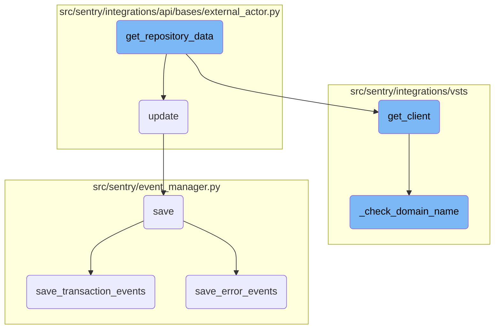

In this document, we will explain the process of retrieving and updating repository data. The process involves the following steps: getting the repository data, updating the external actor data, getting the client, checking the domain name, saving event data, saving transaction events, and saving error events.

The flow starts with getting the repository data using a client. This data is then used to update the external actor data. The client is initialized and its domain name is checked. Event data is then saved, followed by saving transaction events and error events. Each step ensures that the data is correctly processed and stored.

# Flow drill down



<SwmSnippet path="/src/sentry/integrations/vsts/repository.py" line="22">

---

## Retrieving and updating repository data

The <SwmToken path="src/sentry/integrations/vsts/repository.py" pos="22:3:3" line-data="    def get_repository_data(">`get_repository_data`</SwmToken> function retrieves repository data from an external source using a client. It updates the configuration with the retrieved repository details such as instance, project name, repository name, external ID, and URL.

```python
    def get_repository_data(
        self, organization: Organization, config: MutableMapping[str, Any]
    ) -> Mapping[str, str]:
        installation = self.get_installation(config.get("installation"), organization.id)
        client = installation.get_client()

        repo_id = config["identifier"]

        try:
            repo = client.get_repo(repo_id)
        except Exception as e:
            raise installation.raise_error(e)
        config.update(
            {
                "instance": installation.instance,
                "project": repo["project"]["name"],
                "name": repo["name"],
                "external_id": str(repo["id"]),
                "url": repo["_links"]["web"]["href"],
            }
        )
```

---

</SwmSnippet>

<SwmSnippet path="/src/sentry/integrations/api/bases/external_actor.py" line="102">

---

## Updating external actor data

The <SwmToken path="src/sentry/integrations/api/bases/external_actor.py" pos="102:3:3" line-data="    def update(">`update`</SwmToken> function updates the data of an <SwmToken path="src/sentry/integrations/api/bases/external_actor.py" pos="103:7:7" line-data="        self, instance: ExternalActor, validated_data: MutableMapping[str, Any]">`ExternalActor`</SwmToken> instance with validated data. It ensures the instance type is correct and saves the updated instance, handling any integrity errors that may arise.

```python
    def update(
        self, instance: ExternalActor, validated_data: MutableMapping[str, Any]
    ) -> ExternalActor:
        # Discard the object ID passed by the API.
        if "id" in validated_data:
            validated_data.pop("id")

        if self._actor_key in validated_data:
            validated_data.update(self.get_actor_params({**validated_data}))

        for key, value in validated_data.items():
            setattr(self.instance, key, value)
        try:
            assert type(self.instance) is ExternalActor, "Instance type must be ExternalActor"
            self.instance.save()
            return self.instance
        except IntegrityError:
            raise serializers.ValidationError(
                "There already exists an external association with this external_name and provider."
            )
```

---

</SwmSnippet>

<SwmSnippet path="/src/sentry/integrations/vsts/integration.py" line="134">

---

## Getting the client

The <SwmToken path="src/sentry/integrations/vsts/integration.py" pos="134:3:3" line-data="    def get_client(self) -&gt; VstsApiClient:">`get_client`</SwmToken> function initializes and returns a <SwmToken path="src/sentry/integrations/vsts/integration.py" pos="134:10:10" line-data="    def get_client(self) -&gt; VstsApiClient:">`VstsApiClient`</SwmToken> using the base URL and authentication details. It checks the domain name and ensures the necessary integration details are available.

```python
    def get_client(self) -> VstsApiClient:
        base_url = self.instance
        if SiloMode.get_current_mode() != SiloMode.REGION:
            if self.default_identity is None:
                self.default_identity = self.get_default_identity()
            self._check_domain_name(self.default_identity)

        if self.org_integration is None:
            raise Exception("self.org_integration is not defined")
        if self.org_integration.default_auth_id is None:
            raise Exception("self.org_integration.default_auth_id is not defined")
        return VstsApiClient(
            base_url=base_url,
            oauth_redirect_url=VstsIntegrationProvider.oauth_redirect_url,
            org_integration_id=self.org_integration.id,
            identity_id=self.org_integration.default_auth_id,
        )
```

---

</SwmSnippet>

<SwmSnippet path="/src/sentry/integrations/vsts/integration.py" line="358">

---

### Checking domain name

The <SwmToken path="src/sentry/integrations/vsts/integration.py" pos="358:3:3" line-data="    def _check_domain_name(self, default_identity: RpcIdentity) -&gt; None:">`_check_domain_name`</SwmToken> function verifies the domain name format and updates it if necessary using the base URL retrieved from the <SwmToken path="src/sentry/integrations/vsts/integration.py" pos="362:5:5" line-data="        base_url = VstsIntegrationProvider.get_base_url(">`VstsIntegrationProvider`</SwmToken>.

```python
    def _check_domain_name(self, default_identity: RpcIdentity) -> None:
        if re.match("^https://.+/$", self.model.metadata["domain_name"]):
            return

        base_url = VstsIntegrationProvider.get_base_url(
            default_identity.data["access_token"], self.model.external_id
        )
        self.model.metadata["domain_name"] = base_url
        self.model.save()
```

---

</SwmSnippet>

<SwmSnippet path="/src/sentry/event_manager.py" line="448">

---

## Saving event data

The <SwmToken path="src/sentry/event_manager.py" pos="448:3:3" line-data="    def save(">`save`</SwmToken> function processes and saves event data, normalizing it if needed, and handles different event types such as transactions and generic events. It ensures the event data is correctly stored and associated with the relevant models.

```python
    def save(
        self,
        project_id: int | None,
        raw: bool = False,
        assume_normalized: bool = False,
        start_time: float | None = None,
        cache_key: str | None = None,
        skip_send_first_transaction: bool = False,
        has_attachments: bool = False,
    ) -> Event:
        """
        After normalizing and processing an event, save adjacent models such as
        releases and environments to postgres and write the event into
        eventstream. From there it will be picked up by Snuba and
        post-processing.

        We re-insert events with duplicate IDs into Snuba, which is responsible
        for deduplicating events. Since deduplication in Snuba is on the primary
        key (based on event ID, project ID and day), events with same IDs are only
        deduplicated if their timestamps fall on the same day. The latest event
        always wins and overwrites the value of events received earlier in that day.
```

---

</SwmSnippet>

<SwmSnippet path="/src/sentry/event_manager.py" line="3040">

---

### Saving transaction events

The <SwmToken path="src/sentry/event_manager.py" pos="3040:2:2" line-data="def save_transaction_events(jobs: Sequence[Job], projects: ProjectsMapping) -&gt; Sequence[Job]:">`save_transaction_events`</SwmToken> function processes and saves multiple transaction events, ensuring all related models and metrics are updated accordingly.

```python
def save_transaction_events(jobs: Sequence[Job], projects: ProjectsMapping) -> Sequence[Job]:
    organization_ids = {project.organization_id for project in projects.values()}
    organizations = {o.id: o for o in Organization.objects.get_many_from_cache(organization_ids)}

    for project in projects.values():
        try:
            project.set_cached_field_value("organization", organizations[project.organization_id])
        except KeyError:
            continue

    set_measurement(measurement_name="jobs", value=len(jobs))
    set_measurement(measurement_name="projects", value=len(projects))

    _get_or_create_release_many(jobs, projects)
    _get_event_user_many(jobs, projects)
    _derive_plugin_tags_many(jobs, projects)
    _derive_interface_tags_many(jobs)
    _calculate_span_grouping(jobs, projects)
    _materialize_metadata_many(jobs)
    _get_or_create_environment_many(jobs, projects)
    _get_or_create_release_associated_models(jobs, projects)
```

---

</SwmSnippet>

<SwmSnippet path="/src/sentry/event_manager.py" line="544">

---

### Saving error events

The <SwmToken path="src/sentry/event_manager.py" pos="544:3:3" line-data="    def save_error_events(">`save_error_events`</SwmToken> function processes and saves error events, handling attachments and ensuring all related models and metrics are updated. It also manages reprocessed events and tracks outcomes.

```python
    def save_error_events(
        self,
        project: Project,
        job: Job,
        projects: ProjectsMapping,
        metric_tags: MutableTags,
        raw: bool = False,
        cache_key: str | None = None,
        has_attachments: bool = False,
    ) -> Event:
        jobs = [job]

        if is_sample_event(job):
            logger.info(
                "save_error_events: processing sample event",
                extra={
                    "event.id": job["event"].event_id,
                    "project_id": project.id,
                    "sample_event": True,
                },
            )
```

---

</SwmSnippet>

&nbsp;

*This is an auto-generated document by Swimm AI 🌊 and has not yet been verified by a human*

<SwmMeta version="3.0.0" repo-id="Z2l0aHViJTNBJTNBc2VudHJ5LWRlbW8tMSUzQSUzQVN3aW1tLURlbW8=" repo-name="sentry-demo-1" doc-type="flows"><sup>Powered by [Swimm](/)</sup></SwmMeta>
