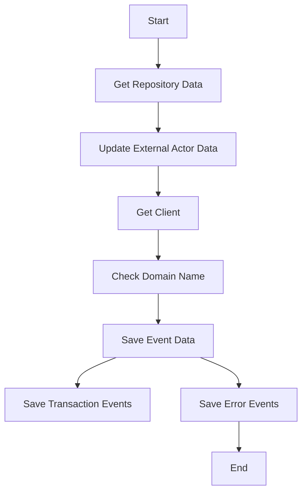

This document will cover the process of retrieving and updating repository data. We'll cover:

1. Getting repository data
2. Updating external actor data
3. Getting the client
4. Checking the domain name
5. Saving event data
6. Saving transaction events
7. Saving error events.

Technical document: <SwmLink doc-title="Retrieving and Updating Repository Data">[Retrieving and Updating Repository Data](/.swm/retrieving-and-updating-repository-data.6s0bp1wo.sw.md)</SwmLink>

# [Getting Repository Data](https://app.swimm.io/repos/Z2l0aHViJTNBJTNBc2VudHJ5LWRlbW8tMSUzQSUzQVN3aW1tLURlbW8=/docs/6s0bp1wo#retrieving-and-updating-repository-data)

The process begins by retrieving repository data from an external source. This involves using a client to fetch details such as the instance, project name, repository name, external ID, and URL. This data is essential for ensuring that the repository configuration is up-to-date and accurate.

# [Updating External Actor Data](https://app.swimm.io/repos/Z2l0aHViJTNBJTNBc2VudHJ5LWRlbW8tMSUzQSUzQVN3aW1tLURlbW8=/docs/6s0bp1wo#updating-external-actor-data)

Once the repository data is retrieved, the next step is to update the external actor data. This involves validating the data and ensuring that the instance type is correct. The updated data is then saved, and any integrity errors are handled to prevent conflicts.

# [Getting the Client](https://app.swimm.io/repos/Z2l0aHViJTNBJTNBc2VudHJ5LWRlbW8tMSUzQSUzQVN3aW1tLURlbW8=/docs/6s0bp1wo#getting-the-client)

The client is initialized using the base URL and authentication details. This step ensures that the necessary integration details are available and that the client is correctly set up to interact with the external source.

# [Checking the Domain Name](https://app.swimm.io/repos/Z2l0aHViJTNBJTNBc2VudHJ5LWRlbW8tMSUzQSUzQVN3aW1tLURlbW8=/docs/6s0bp1wo#checking-domain-name)

The domain name is verified to ensure it follows the correct format. If necessary, the domain name is updated using the base URL retrieved from the integration provider. This step is crucial for maintaining the integrity of the integration.

# [Saving Event Data](https://app.swimm.io/repos/Z2l0aHViJTNBJTNBc2VudHJ5LWRlbW8tMSUzQSUzQVN3aW1tLURlbW8=/docs/6s0bp1wo#saving-event-data)

Event data is processed and saved, with normalization applied if needed. This step ensures that the event data is correctly stored and associated with the relevant models. It also handles different event types, such as transactions and generic events.

# [Saving Transaction Events](https://app.swimm.io/repos/Z2l0aHViJTNBJTNBc2VudHJ5LWRlbW8tMSUzQSUzQVN3aW1tLURlbW8=/docs/6s0bp1wo#saving-transaction-events)

Multiple transaction events are processed and saved, ensuring that all related models and metrics are updated accordingly. This step is important for maintaining accurate and up-to-date transaction data.

# [Saving Error Events](https://app.swimm.io/repos/Z2l0aHViJTNBJTNBc2VudHJ5LWRlbW8tMSUzQSUzQVN3aW1tLURlbW8=/docs/6s0bp1wo#saving-error-events)

Error events are processed and saved, with attachments handled as needed. This step ensures that all related models and metrics are updated and that reprocessed events are managed correctly. It also tracks outcomes to provide insights into the error events.

&nbsp;

*This is an auto-generated document by Swimm AI 🌊 and has not yet been verified by a human*

<SwmMeta version="3.0.0" repo-id="Z2l0aHViJTNBJTNBc2VudHJ5LWRlbW8tMSUzQSUzQVN3aW1tLURlbW8=" repo-name="sentry-demo-1" doc-type="product-flows">Powered by [Swimm](/)</SwmMeta>
