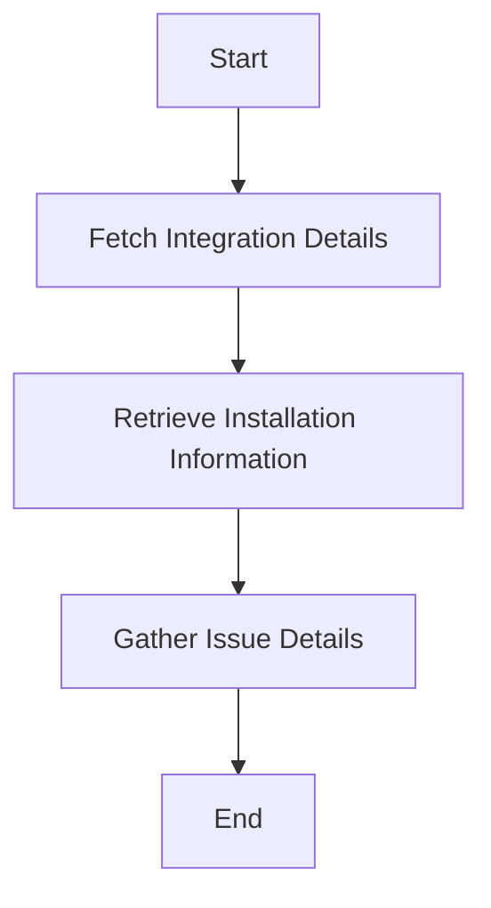

This document will cover the process of retrieving issue attributes, which includes:

1. Fetching integration details
2. Retrieving installation information
3. Gathering issue details such as ID, key, title, description, and display name.

Technical document: <SwmLink doc-title="Retrieving Issue Attributes">[Retrieving Issue Attributes](/.swm/retrieving-issue-attributes.5y24yb61.sw.md)</SwmLink>

# [Fetching Integration Details](https://app.swimm.io/repos/Z2l0aHViJTNBJTNBc2VudHJ5LWRlbW8tMSUzQSUzQVN3aW1tLURlbW8=/docs/5y24yb61#fetching-integration-details)

The process begins by fetching the integration details associated with each issue. This step ensures that the system knows which external service (e.g., Jira, GitHub) the issue is linked to. By identifying the correct integration, the system can proceed to gather the necessary information specific to that service.

# [Retrieving Installation Information](https://app.swimm.io/repos/Z2l0aHViJTNBJTNBc2VudHJ5LWRlbW8tMSUzQSUzQVN3aW1tLURlbW8=/docs/5y24yb61#retrieving-installation-information)

Once the integration details are fetched, the next step is to retrieve the installation information. This involves getting the specific instance of the integration that is installed for the organization. This step is crucial because it provides the context needed to access the issue details from the external service.

# [Gathering Issue Details](https://app.swimm.io/repos/Z2l0aHViJTNBJTNBc2VudHJ5LWRlbW8tMSUzQSUzQVN3aW1tLURlbW8=/docs/5y24yb61#gathering-issue-details)

The final step is to gather various details about the issue. This includes the issue's ID, key, title, description, and display name. These attributes provide a comprehensive view of the issue, making it easier for users to manage and track. The display name, in particular, offers a human-readable identifier that simplifies issue identification.

&nbsp;

*This is an auto-generated document by Swimm AI 🌊 and has not yet been verified by a human*

<SwmMeta version="3.0.0" repo-id="Z2l0aHViJTNBJTNBc2VudHJ5LWRlbW8tMSUzQSUzQVN3aW1tLURlbW8=" repo-name="sentry-demo-1" doc-type="product-flows">Powered by [Swimm](/)</SwmMeta>
