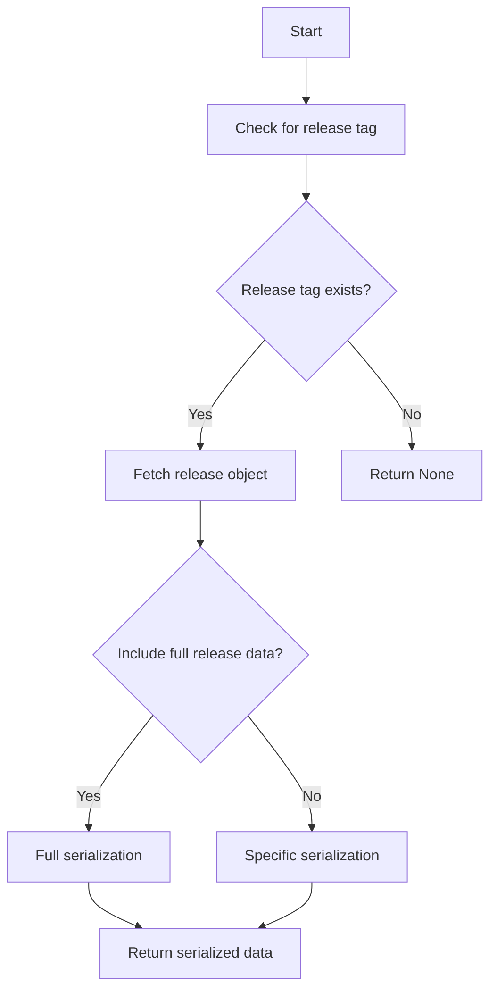

This document will cover the process of retrieving release information for a given event. We'll cover:

1. Checking for a release tag
2. Fetching the release object
3. Serializing the release data.

Technical document: <SwmLink doc-title="Retrieving Release Information">[Retrieving Release Information](/.swm/retrieving-release-information.yq9rw89n.sw.md)</SwmLink>

# [Checking for a release tag](https://app.swimm.io/repos/Z2l0aHViJTNBJTNBc2VudHJ5LWRlbW8tMSUzQSUzQVN3aW1tLURlbW8=/docs/yq9rw89n#_get_release_info)

The process begins by checking if the event has a release tag. A release tag is a specific identifier that marks a particular version of the software. If the event does not have a release tag, the process stops here and returns 'None'. This step ensures that only events associated with a specific release are processed further.

# [Fetching the release object](https://app.swimm.io/repos/Z2l0aHViJTNBJTNBc2VudHJ5LWRlbW8tMSUzQSUzQVN3aW1tLURlbW8=/docs/yq9rw89n#_get_release_info)

If the event has a release tag, the next step is to fetch the release object from the database. The release object contains detailed information about the specific version of the software. This step involves querying the database using the release tag, the project associated with the event, and the organization ID. If the release object is not found in the database, the process returns a dictionary containing the release version.

# [Serializing the release data](https://app.swimm.io/repos/Z2l0aHViJTNBJTNBc2VudHJ5LWRlbW8tMSUzQSUzQVN3aW1tLURlbW8=/docs/yq9rw89n#_get_release_info)

Once the release object is fetched, the next step is to serialize the release data. Serialization is the process of converting the release object into a format that can be easily transmitted and understood by other systems. Depending on the 'include_full_release_data' flag, the release data is either fully serialized or a specific serializer is used. Full serialization includes all details of the release, while specific serialization includes only essential information. This step ensures that the release data is prepared in a format suitable for API responses.

&nbsp;

*This is an auto-generated document by Swimm AI 🌊 and has not yet been verified by a human*

<SwmMeta version="3.0.0" repo-id="Z2l0aHViJTNBJTNBc2VudHJ5LWRlbW8tMSUzQSUzQVN3aW1tLURlbW8=" repo-name="sentry-demo-1" doc-type="product-flows">Powered by [Swimm](/)</SwmMeta>
