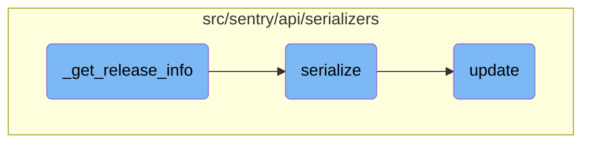

This document explains the process of retrieving release information for a given event. The process involves checking for a release tag, fetching the release object, and serializing the release data.

The flow starts by checking if the event has a release tag. If it does, the release object is fetched from the database. Depending on a flag, the release data is either fully serialized or a specific serializer is used.

# Flow drill down



<SwmSnippet path="/src/sentry/api/serializers/models/event.py" line="390">

---

## <SwmToken path="src/sentry/api/serializers/models/event.py" pos="389:3:3" line-data="    def _get_release_info(self, user, event, include_full_release_data: bool):">`_get_release_info`</SwmToken>

The <SwmToken path="src/sentry/api/serializers/models/event.py" pos="389:3:3" line-data="    def _get_release_info(self, user, event, include_full_release_data: bool):">`_get_release_info`</SwmToken> function retrieves release information for a given event. It first checks if the event has a release tag. If the release exists, it fetches the release object from the database. Depending on the <SwmToken path="src/sentry/api/serializers/models/event.py" pos="401:3:3" line-data="        if include_full_release_data:">`include_full_release_data`</SwmToken> flag, it either serializes the full release data or uses a specific serializer for the release.

```python
        version = event.get_tag("sentry:release")
        if not version:
            return None
        try:
            release = Release.objects.get(
                projects=event.project,
                organization_id=event.project.organization_id,
                version=version,
            )
        except Release.DoesNotExist:
            return {"version": version}
        if include_full_release_data:
            return serialize(release, user)
        else:
            return serialize(release, user, GroupEventReleaseSerializer())
```

---

</SwmSnippet>

<SwmSnippet path="/src/sentry/api/serializers/models/event.py" line="220">

---

## serialize

The <SwmToken path="src/sentry/api/serializers/models/event.py" pos="220:3:3" line-data="    def serialize(self, obj, attrs, user, **kwargs):">`serialize`</SwmToken> function converts an event object into a dictionary format suitable for API responses. It gathers various attributes from the event, such as errors, messages, tags, and metadata, and structures them into a dictionary. This serialized data is then used to provide a comprehensive view of the event in the API response.

```python
    def serialize(self, obj, attrs, user, **kwargs):
        from sentry.api.serializers.rest_framework import convert_dict_key_case, snake_to_camel_case

        errors = [
            EventError(error).get_api_context()
            for error in get_path(obj.data, "errors", filter=True, default=())
            # TODO(ja): Temporary workaround to hide certain normalization errors.
            # Remove this and the test in tests/sentry/api/serializers/test_event.py
            if self.should_display_error(error)
        ]

        (message, message_meta) = self._get_legacy_message_with_meta(obj)
        (tags, tags_meta) = get_tags_with_meta(obj)
        (context, context_meta) = self._get_attr_with_meta(obj, "extra", {})
        (packages, packages_meta) = self._get_attr_with_meta(obj, "modules", {})

        received = obj.data.get("received")
        if received:
            # Sentry at one point attempted to record invalid types here.
            # Remove after June 2 2016
            try:
```

---

</SwmSnippet>

<SwmSnippet path="/src/sentry/api/serializers/rest_framework/dashboard.py" line="565">

---

## update

The <SwmToken path="src/sentry/api/serializers/rest_framework/dashboard.py" pos="565:3:3" line-data="    def update(self, instance, validated_data):">`update`</SwmToken> function updates a dashboard instance with validated data. It modifies the dashboard's title, updates or removes widgets based on the provided data, and schedules updates for project configurations. This ensures that the dashboard reflects the latest changes and maintains consistency with the provided data.

```python
    def update(self, instance, validated_data):
        """
        Update a dashboard, the connected widgets and queries

        - Widgets in the dashboard currently, but not in validated_data will be removed.
        - Widgets without ids will be created.
        - Widgets with matching IDs will be updated.
        - The order of the widgets will be updated based on the order in the request data.

        Only call save() on this serializer from within a transaction or
        bad things will happen
        """
        instance.title = validated_data.get("title", instance.title)
        instance.save()

        if "widgets" in validated_data:
            self.update_widgets(instance, validated_data["widgets"])

        self.update_dashboard_filters(instance, validated_data)

        schedule_update_project_configs(instance)
```

---

</SwmSnippet>

&nbsp;

*This is an auto-generated document by Swimm AI 🌊 and has not yet been verified by a human*

<SwmMeta version="3.0.0" repo-id="Z2l0aHViJTNBJTNBc2VudHJ5LWRlbW8tMSUzQSUzQVN3aW1tLURlbW8=" repo-name="sentry-demo-1" doc-type="flows"><sup>Powered by [Swimm](/)</sup></SwmMeta>
