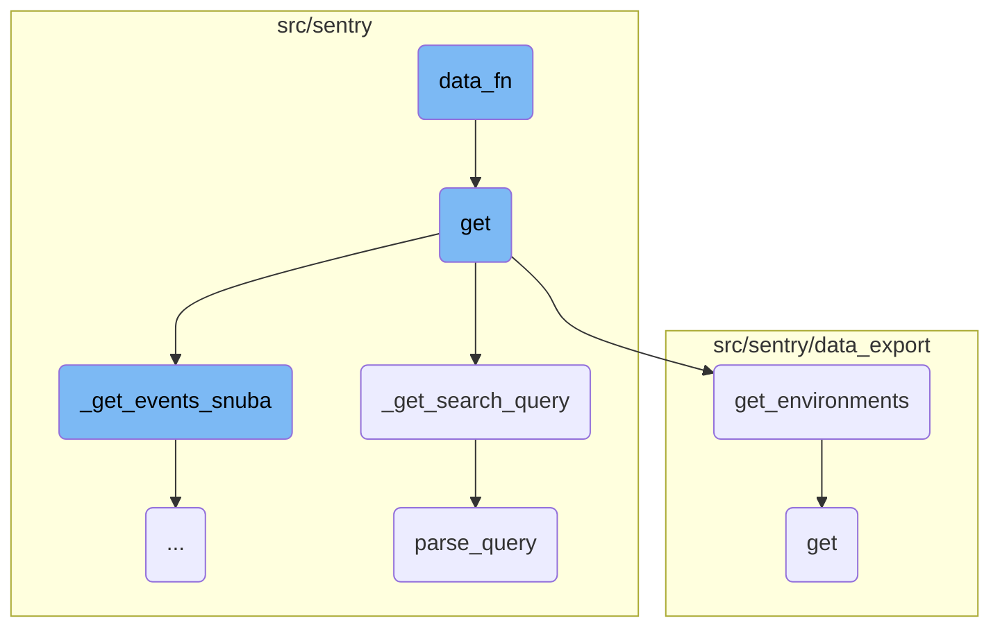

This document explains the role and functionality of the <SwmToken path="src/sentry/issues/endpoints/group_events.py" pos="120:3:3" line-data="        def data_fn(offset: int, limit: int) -&gt; Any:">`data_fn`</SwmToken> function. The function is responsible for constructing and executing event queries, handling errors, and transforming raw query results into structured event objects.

The <SwmToken path="src/sentry/issues/endpoints/group_events.py" pos="120:3:3" line-data="        def data_fn(offset: int, limit: int) -&gt; Any:">`data_fn`</SwmToken> function starts by building a query to fetch event data. If the query is invalid, it raises an error. Once the query is successfully executed, the raw results are transformed into a list of event objects. If a specific parameter is set, additional data binding is performed on these event objects.

Here is a high level diagram of the flow, showing only the most important functions:

```mermaid
graph TD;
      subgraph src/sentry
9c5882e204e492719c85370472f3937681a3be51700c020953593f31c48cc7f7(data_fn):::mainFlowStyle --> 292a332eb222967972f08dfbdc3e9f40aad6ab200339e3fd1f8bc3f8b1ff4e09(get):::mainFlowStyle
end

subgraph src/sentry
292a332eb222967972f08dfbdc3e9f40aad6ab200339e3fd1f8bc3f8b1ff4e09(get):::mainFlowStyle --> a4e4c902d67631506f9043fa4f820199ec2654aeb79317ab1250a1de13595c00(_get_search_query)
end

subgraph src/sentry
292a332eb222967972f08dfbdc3e9f40aad6ab200339e3fd1f8bc3f8b1ff4e09(get):::mainFlowStyle --> 976936c38d3336251a86b62bb58ec702485f15eb5ca211477d8c83d9f96dda9e(get_environments)
end

subgraph src/sentry
292a332eb222967972f08dfbdc3e9f40aad6ab200339e3fd1f8bc3f8b1ff4e09(get):::mainFlowStyle --> c8b7ab89ccac1ee7a3e306bee776d3ae9f5a4f620e16d9d00aca4bb982d8e637(_get_events_snuba):::mainFlowStyle
end

subgraph src/sentry
c8b7ab89ccac1ee7a3e306bee776d3ae9f5a4f620e16d9d00aca4bb982d8e637(_get_events_snuba):::mainFlowStyle --> 7f8fbb00023b74afb56bc858f625be54eaeeba58b9685573af3b430641334b4b(get_direct_hit_response):::mainFlowStyle
end

subgraph src/sentry
7f8fbb00023b74afb56bc858f625be54eaeeba58b9685573af3b430641334b4b(get_direct_hit_response):::mainFlowStyle --> 0855223e36ac882841bbf2e0ef2fb632f98281c9458dac000c15db12ffb5feef(run_query):::mainFlowStyle
end

subgraph src/sentry
0855223e36ac882841bbf2e0ef2fb632f98281c9458dac000c15db12ffb5feef(run_query):::mainFlowStyle --> bf51ad13267b0a966b2f78892bc9022bf6d0ea51971125b7eca85fe6a433e525(bulk_run_query):::mainFlowStyle
end

subgraph src/sentry
bf51ad13267b0a966b2f78892bc9022bf6d0ea51971125b7eca85fe6a433e525(bulk_run_query):::mainFlowStyle --> afa26eb3bcd732ed408aeef284bae8b24d15a01fc92344a09b40589f8d4801c0(_resolve_metrics_query):::mainFlowStyle
end

subgraph src/sentry
afa26eb3bcd732ed408aeef284bae8b24d15a01fc92344a09b40589f8d4801c0(_resolve_metrics_query):::mainFlowStyle --> 1d3614071269a61836ba62a83fa4234bce0f250a3733a501066af92cf030bc5a(_lookup_indexer_resolve)
end

subgraph src/sentry
afa26eb3bcd732ed408aeef284bae8b24d15a01fc92344a09b40589f8d4801c0(_resolve_metrics_query):::mainFlowStyle --> 6a277fe7c0cc01093d1b577ff3ab42c24481442497f437a04de3caa10040371d(_resolve_query_metadata):::mainFlowStyle
end


      classDef mainFlowStyle color:#000000,fill:#7CB9F4
classDef rootsStyle color:#000000,fill:#00FFF4
classDef Style1 color:#000000,fill:#00FFAA
classDef Style2 color:#000000,fill:#FFFF00
classDef Style3 color:#000000,fill:#AA7CB9

%% Swimm:
%% graph TD;
%%       subgraph <SwmPath>[src/sentry/](src/sentry/)</SwmPath>
%% 9c5882e204e492719c85370472f3937681a3be51700c020953593f31c48cc7f7(data_fn):::mainFlowStyle --> 292a332eb222967972f08dfbdc3e9f40aad6ab200339e3fd1f8bc3f8b1ff4e09(get):::mainFlowStyle
%% end
%% 
%% subgraph <SwmPath>[src/sentry/](src/sentry/)</SwmPath>
%% 292a332eb222967972f08dfbdc3e9f40aad6ab200339e3fd1f8bc3f8b1ff4e09(get):::mainFlowStyle --> a4e4c902d67631506f9043fa4f820199ec2654aeb79317ab1250a1de13595c00(_get_search_query)
%% end
%% 
%% subgraph <SwmPath>[src/sentry/](src/sentry/)</SwmPath>
%% 292a332eb222967972f08dfbdc3e9f40aad6ab200339e3fd1f8bc3f8b1ff4e09(get):::mainFlowStyle --> 976936c38d3336251a86b62bb58ec702485f15eb5ca211477d8c83d9f96dda9e(get_environments)
%% end
%% 
%% subgraph <SwmPath>[src/sentry/](src/sentry/)</SwmPath>
%% 292a332eb222967972f08dfbdc3e9f40aad6ab200339e3fd1f8bc3f8b1ff4e09(get):::mainFlowStyle --> c8b7ab89ccac1ee7a3e306bee776d3ae9f5a4f620e16d9d00aca4bb982d8e637(_get_events_snuba):::mainFlowStyle
%% end
%% 
%% subgraph <SwmPath>[src/sentry/](src/sentry/)</SwmPath>
%% c8b7ab89ccac1ee7a3e306bee776d3ae9f5a4f620e16d9d00aca4bb982d8e637(_get_events_snuba):::mainFlowStyle --> 7f8fbb00023b74afb56bc858f625be54eaeeba58b9685573af3b430641334b4b(get_direct_hit_response):::mainFlowStyle
%% end
%% 
%% subgraph <SwmPath>[src/sentry/](src/sentry/)</SwmPath>
%% 7f8fbb00023b74afb56bc858f625be54eaeeba58b9685573af3b430641334b4b(get_direct_hit_response):::mainFlowStyle --> 0855223e36ac882841bbf2e0ef2fb632f98281c9458dac000c15db12ffb5feef(run_query):::mainFlowStyle
%% end
%% 
%% subgraph <SwmPath>[src/sentry/](src/sentry/)</SwmPath>
%% 0855223e36ac882841bbf2e0ef2fb632f98281c9458dac000c15db12ffb5feef(run_query):::mainFlowStyle --> bf51ad13267b0a966b2f78892bc9022bf6d0ea51971125b7eca85fe6a433e525(bulk_run_query):::mainFlowStyle
%% end
%% 
%% subgraph <SwmPath>[src/sentry/](src/sentry/)</SwmPath>
%% bf51ad13267b0a966b2f78892bc9022bf6d0ea51971125b7eca85fe6a433e525(bulk_run_query):::mainFlowStyle --> afa26eb3bcd732ed408aeef284bae8b24d15a01fc92344a09b40589f8d4801c0(_resolve_metrics_query):::mainFlowStyle
%% end
%% 
%% subgraph <SwmPath>[src/sentry/](src/sentry/)</SwmPath>
%% afa26eb3bcd732ed408aeef284bae8b24d15a01fc92344a09b40589f8d4801c0(_resolve_metrics_query):::mainFlowStyle --> 1d3614071269a61836ba62a83fa4234bce0f250a3733a501066af92cf030bc5a(_lookup_indexer_resolve)
%% end
%% 
%% subgraph <SwmPath>[src/sentry/](src/sentry/)</SwmPath>
%% afa26eb3bcd732ed408aeef284bae8b24d15a01fc92344a09b40589f8d4801c0(_resolve_metrics_query):::mainFlowStyle --> 6a277fe7c0cc01093d1b577ff3ab42c24481442497f437a04de3caa10040371d(_resolve_query_metadata):::mainFlowStyle
%% end
%% 
%% 
%%       classDef mainFlowStyle color:#000000,fill:#7CB9F4
%% classDef rootsStyle color:#000000,fill:#00FFF4
%% classDef Style1 color:#000000,fill:#00FFAA
%% classDef Style2 color:#000000,fill:#FFFF00
%% classDef Style3 color:#000000,fill:#AA7CB9
```



# Flow drill down

First, we'll zoom into this section of the flow:



<SwmSnippet path="/src/sentry/issues/endpoints/group_events.py" line="122">

---

## Constructing and Executing Event Query

The <SwmToken path="src/sentry/issues/endpoints/group_events.py" pos="120:3:3" line-data="        def data_fn(offset: int, limit: int) -&gt; Any:">`data_fn`</SwmToken> function constructs a query using <SwmToken path="src/sentry/issues/endpoints/group_events.py" pos="122:5:5" line-data="                snuba_query = get_query_builder_for_group(">`get_query_builder_for_group`</SwmToken> and executes it to retrieve event data. If the query is invalid, it raises a <SwmToken path="src/sentry/issues/endpoints/group_events.py" pos="131:3:3" line-data="                raise ParseError(detail=str(e))">`ParseError`</SwmToken>.

```python
                snuba_query = get_query_builder_for_group(
                    request.GET.get("query", ""),
                    params,
                    group,
                    limit=limit,
                    offset=offset,
                    orderby=orderby,
                )
            except InvalidSearchQuery as e:
                raise ParseError(detail=str(e))
            results = snuba_query.run_query(referrer=referrer)
```

---

</SwmSnippet>

<SwmSnippet path="/src/sentry/issues/endpoints/group_events.py" line="133">

---

## Transforming Query Results

The <SwmToken path="src/sentry/issues/endpoints/group_events.py" pos="120:3:3" line-data="        def data_fn(offset: int, limit: int) -&gt; Any:">`data_fn`</SwmToken> function transforms the raw query results into a list of <SwmToken path="src/sentry/issues/endpoints/group_events.py" pos="134:1:1" line-data="                Event(">`Event`</SwmToken> objects, binding nodes if the <SwmToken path="src/sentry/issues/endpoints/group_events.py" pos="146:3:3" line-data="            if full:">`full`</SwmToken> parameter is set.

```python
            results = [
                Event(
                    event_id=evt["id"],
                    project_id=evt["project.id"],
                    snuba_data={
                        "event_id": evt["id"],
                        "group_id": evt["issue.id"],
                        "project_id": evt["project.id"],
                        "timestamp": evt["timestamp"],
                    },
                )
                for evt in results["data"]
            ]
            if full:
                eventstore.backend.bind_nodes(results)
```

---

</SwmSnippet>

<SwmSnippet path="/src/sentry/issues/endpoints/group_events.py" line="48">

---

## Handling Event Listing Request

The <SwmToken path="src/sentry/issues/endpoints/group_events.py" pos="48:3:3" line-data="    def get(self, request: Request, group: Group) -&gt; Response:">`get`</SwmToken> function handles the request to list an issue's events, including authentication and parameter parsing.

```````````````````````python
    def get(self, request: Request, group: Group) -> Response:
        """
        List an Issue's Events
        ``````````````````````

        This endpoint lists an issue's events.
        :qparam bool full: if this is set to true then the event payload will
                           include the full event body, including the stacktrace.
                           Set to 1 to enable.

        :qparam bool sample: return events in pseudo-random order. This is deterministic,
                             same query will return the same events in the same order.

        :pparam string issue_id: the ID of the issue to retrieve.

        :auth: required
        """
```````````````````````

---

</SwmSnippet>

<SwmSnippet path="/src/sentry/issues/endpoints/group_events.py" line="66">

---

### Retrieving Environments

The <SwmToken path="src/sentry/issues/endpoints/group_events.py" pos="48:3:3" line-data="    def get(self, request: Request, group: Group) -&gt; Response:">`get`</SwmToken> function retrieves the environments associated with the request using the <SwmToken path="src/sentry/issues/endpoints/group_events.py" pos="67:5:5" line-data="            environments = get_environments(request, group.project.organization)">`get_environments`</SwmToken> function.

```python
        try:
            environments = get_environments(request, group.project.organization)
```

---

</SwmSnippet>

<SwmSnippet path="/src/sentry/issues/endpoints/group_events.py" line="68">

---

### Parsing Search Query

The <SwmToken path="src/sentry/issues/endpoints/group_events.py" pos="48:3:3" line-data="    def get(self, request: Request, group: Group) -&gt; Response:">`get`</SwmToken> function parses the search query using the <SwmToken path="src/sentry/issues/endpoints/group_events.py" pos="68:7:7" line-data="            query = self._get_search_query(request, group, environments)">`_get_search_query`</SwmToken> function.

```python
            query = self._get_search_query(request, group, environments)
        except InvalidQuery as exc:
```

---

</SwmSnippet>

<SwmSnippet path="/src/sentry/issues/endpoints/group_events.py" line="75">

---

### Handling Date Range and Event Retrieval

The <SwmToken path="src/sentry/issues/endpoints/group_events.py" pos="75:12:12" line-data="            start, end = get_date_range_from_params(request.GET, optional=True)">`GET`</SwmToken> function retrieves the date range from the request parameters and calls <SwmToken path="src/sentry/issues/endpoints/group_events.py" pos="80:5:5" line-data="            return self._get_events_snuba(request, group, environments, query, start, end)">`_get_events_snuba`</SwmToken> to fetch the events.

```python
            start, end = get_date_range_from_params(request.GET, optional=True)
        except InvalidParams as e:
            raise ParseError(detail=str(e))

        try:
            return self._get_events_snuba(request, group, environments, query, start, end)
```

---

</SwmSnippet>

<SwmSnippet path="/src/sentry/issues/endpoints/group_events.py" line="158">

---

## Parsing Search Query

The <SwmToken path="src/sentry/issues/endpoints/group_events.py" pos="158:3:3" line-data="    def _get_search_query(">`_get_search_query`</SwmToken> function parses the raw query from the request and constructs a structured query.

```python
    def _get_search_query(
        self, request: Request, group: Group, environments: Sequence[Environment]
    ) -> str | None:
        raw_query = request.GET.get("query")

        if raw_query:
            query_kwargs = parse_query([group.project], raw_query, request.user, environments)
            query = query_kwargs.pop("query", None)
        else:
            query = None

        return query
```

---

</SwmSnippet>

<SwmSnippet path="/src/sentry/data_export/processors/discover.py" line="61">

---

## Retrieving Environments

The <SwmToken path="src/sentry/data_export/processors/discover.py" pos="61:3:3" line-data="    def get_environments(organization_id, query):">`get_environments`</SwmToken> function retrieves the list of environments based on the organization ID and query parameters.

```python
    def get_environments(organization_id, query):
        requested_environments = query.get("environment", [])
        if not isinstance(requested_environments, list):
            requested_environments = [requested_environments]

        if not requested_environments:
            return []

        environments = list(
            Environment.objects.filter(
                organization_id=organization_id, name__in=requested_environments
            )
        )
        environment_names = [e.name for e in environments]

        if set(requested_environments) != set(environment_names):
            raise ExportError("Requested environment does not exist")

        return environments
```

---

</SwmSnippet>

<SwmSnippet path="/src/sentry/search/utils.py" line="706">

---

## Parsing Query String

The <SwmToken path="src/sentry/search/utils.py" pos="706:2:2" line-data="def parse_query(">`parse_query`</SwmToken> function parses the query string and returns a dictionary of structured query term values.

```python
def parse_query(
    projects: Sequence[Project],
    query: str,
    user: User | AnonymousUser,
    environments: Sequence[Environment],
) -> dict[str, Any]:
    """| Parses the query string and returns a dict of structured query term values:
    | Required:
    | - tags: dict[str, Union[str, list[str], Any]]: dictionary of tag key-values 'user.id:123'
    | - query: str: the general query portion of the query string
    | Optional:
    | - unassigned: bool: 'is:unassigned'
    | - for_review: bool: 'is:for_review'
    | - linked: bool: 'is:linked'
    | - status: int: 'is:<resolved,unresolved,ignored,muted,reprocessing>'
    | - assigned_to: Optional[Union[User, Team]]: 'assigned:<user or team>'
    | - assigned_or_suggested: Optional[Union[User, Team]]: 'assigned_or_suggested:<user or team>'
    | - bookmarked_by: User: 'bookmarks:<user>'
    | - subscribed_by: User: 'subscribed:<user>'
    | - first_release: Sequence[str]: '<first-release/firstRelease>:1.2.3'
    | - age_from: Union[datetime, bool]: '<age/firstSeen>:-1h'
```

---

</SwmSnippet>

Now, lets zoom into this section of the flow:

```mermaid
graph TD;
      subgraph src/sentry
c8b7ab89ccac1ee7a3e306bee776d3ae9f5a4f620e16d9d00aca4bb982d8e637(_get_events_snuba):::mainFlowStyle --> 7f8fbb00023b74afb56bc858f625be54eaeeba58b9685573af3b430641334b4b(get_direct_hit_response):::mainFlowStyle
end

subgraph src/sentry
7f8fbb00023b74afb56bc858f625be54eaeeba58b9685573af3b430641334b4b(get_direct_hit_response):::mainFlowStyle --> 0855223e36ac882841bbf2e0ef2fb632f98281c9458dac000c15db12ffb5feef(run_query):::mainFlowStyle
end

subgraph src/sentry
0855223e36ac882841bbf2e0ef2fb632f98281c9458dac000c15db12ffb5feef(run_query):::mainFlowStyle --> bf51ad13267b0a966b2f78892bc9022bf6d0ea51971125b7eca85fe6a433e525(bulk_run_query):::mainFlowStyle
end

subgraph src/sentry
bf51ad13267b0a966b2f78892bc9022bf6d0ea51971125b7eca85fe6a433e525(bulk_run_query):::mainFlowStyle --> afa26eb3bcd732ed408aeef284bae8b24d15a01fc92344a09b40589f8d4801c0(_resolve_metrics_query):::mainFlowStyle
end

subgraph src/sentry
afa26eb3bcd732ed408aeef284bae8b24d15a01fc92344a09b40589f8d4801c0(_resolve_metrics_query):::mainFlowStyle --> 1d3614071269a61836ba62a83fa4234bce0f250a3733a501066af92cf030bc5a(_lookup_indexer_resolve)
end

subgraph src/sentry
afa26eb3bcd732ed408aeef284bae8b24d15a01fc92344a09b40589f8d4801c0(_resolve_metrics_query):::mainFlowStyle --> 6a277fe7c0cc01093d1b577ff3ab42c24481442497f437a04de3caa10040371d(_resolve_query_metadata):::mainFlowStyle
end

subgraph src/sentry
1d3614071269a61836ba62a83fa4234bce0f250a3733a501066af92cf030bc5a(_lookup_indexer_resolve) --> 9feba02f7a756e7911be847fa1baa7a3e1cd8bde3767144ba9c172f60dd737d0(_lookup_indexer_resolve_exp)
end


      classDef mainFlowStyle color:#000000,fill:#7CB9F4
classDef rootsStyle color:#000000,fill:#00FFF4
classDef Style1 color:#000000,fill:#00FFAA
classDef Style2 color:#000000,fill:#FFFF00
classDef Style3 color:#000000,fill:#AA7CB9

%% Swimm:
%% graph TD;
%%       subgraph <SwmPath>[src/sentry/](src/sentry/)</SwmPath>
%% c8b7ab89ccac1ee7a3e306bee776d3ae9f5a4f620e16d9d00aca4bb982d8e637(_get_events_snuba):::mainFlowStyle --> 7f8fbb00023b74afb56bc858f625be54eaeeba58b9685573af3b430641334b4b(get_direct_hit_response):::mainFlowStyle
%% end
%% 
%% subgraph <SwmPath>[src/sentry/](src/sentry/)</SwmPath>
%% 7f8fbb00023b74afb56bc858f625be54eaeeba58b9685573af3b430641334b4b(get_direct_hit_response):::mainFlowStyle --> 0855223e36ac882841bbf2e0ef2fb632f98281c9458dac000c15db12ffb5feef(run_query):::mainFlowStyle
%% end
%% 
%% subgraph <SwmPath>[src/sentry/](src/sentry/)</SwmPath>
%% 0855223e36ac882841bbf2e0ef2fb632f98281c9458dac000c15db12ffb5feef(run_query):::mainFlowStyle --> bf51ad13267b0a966b2f78892bc9022bf6d0ea51971125b7eca85fe6a433e525(bulk_run_query):::mainFlowStyle
%% end
%% 
%% subgraph <SwmPath>[src/sentry/](src/sentry/)</SwmPath>
%% bf51ad13267b0a966b2f78892bc9022bf6d0ea51971125b7eca85fe6a433e525(bulk_run_query):::mainFlowStyle --> afa26eb3bcd732ed408aeef284bae8b24d15a01fc92344a09b40589f8d4801c0(_resolve_metrics_query):::mainFlowStyle
%% end
%% 
%% subgraph <SwmPath>[src/sentry/](src/sentry/)</SwmPath>
%% afa26eb3bcd732ed408aeef284bae8b24d15a01fc92344a09b40589f8d4801c0(_resolve_metrics_query):::mainFlowStyle --> 1d3614071269a61836ba62a83fa4234bce0f250a3733a501066af92cf030bc5a(_lookup_indexer_resolve)
%% end
%% 
%% subgraph <SwmPath>[src/sentry/](src/sentry/)</SwmPath>
%% afa26eb3bcd732ed408aeef284bae8b24d15a01fc92344a09b40589f8d4801c0(_resolve_metrics_query):::mainFlowStyle --> 6a277fe7c0cc01093d1b577ff3ab42c24481442497f437a04de3caa10040371d(_resolve_query_metadata):::mainFlowStyle
%% end
%% 
%% subgraph <SwmPath>[src/sentry/](src/sentry/)</SwmPath>
%% 1d3614071269a61836ba62a83fa4234bce0f250a3733a501066af92cf030bc5a(_lookup_indexer_resolve) --> 9feba02f7a756e7911be847fa1baa7a3e1cd8bde3767144ba9c172f60dd737d0(_lookup_indexer_resolve_exp)
%% end
%% 
%% 
%%       classDef mainFlowStyle color:#000000,fill:#7CB9F4
%% classDef rootsStyle color:#000000,fill:#00FFF4
%% classDef Style1 color:#000000,fill:#00FFAA
%% classDef Style2 color:#000000,fill:#FFFF00
%% classDef Style3 color:#000000,fill:#AA7CB9
```



<SwmSnippet path="/src/sentry/issues/endpoints/group_events.py" line="103">

---

## Handling Direct Hit Responses

The function <SwmToken path="src/sentry/issues/endpoints/group_events.py" pos="80:5:5" line-data="            return self._get_events_snuba(request, group, environments, query, start, end)">`_get_events_snuba`</SwmToken> first attempts to get a direct hit response by calling <SwmToken path="src/sentry/issues/endpoints/group_events.py" pos="103:5:5" line-data="        direct_hit_resp = get_direct_hit_response(">`get_direct_hit_response`</SwmToken>. If a direct hit is found, it returns the response immediately.

```python
        direct_hit_resp = get_direct_hit_response(
            request, query, params, f"{referrer}.direct-hit", group
        )
        if direct_hit_resp:
            return direct_hit_resp
```

---

</SwmSnippet>

<SwmSnippet path="/src/sentry/issues/endpoints/group_events.py" line="120">

---

## Executing Snuba Queries

If no direct hit response is found, <SwmToken path="src/sentry/issues/endpoints/group_events.py" pos="80:5:5" line-data="            return self._get_events_snuba(request, group, environments, query, start, end)">`_get_events_snuba`</SwmToken> constructs a Snuba query using <SwmToken path="src/sentry/issues/endpoints/group_events.py" pos="122:5:5" line-data="                snuba_query = get_query_builder_for_group(">`get_query_builder_for_group`</SwmToken> and executes it with <SwmToken path="src/sentry/issues/endpoints/group_events.py" pos="132:7:7" line-data="            results = snuba_query.run_query(referrer=referrer)">`run_query`</SwmToken>. The results are then processed into <SwmToken path="src/sentry/issues/endpoints/group_events.py" pos="134:1:1" line-data="                Event(">`Event`</SwmToken> objects and paginated for the response.

```python
        def data_fn(offset: int, limit: int) -> Any:
            try:
                snuba_query = get_query_builder_for_group(
                    request.GET.get("query", ""),
                    params,
                    group,
                    limit=limit,
                    offset=offset,
                    orderby=orderby,
                )
            except InvalidSearchQuery as e:
                raise ParseError(detail=str(e))
            results = snuba_query.run_query(referrer=referrer)
            results = [
                Event(
                    event_id=evt["id"],
                    project_id=evt["project.id"],
                    snuba_data={
                        "event_id": evt["id"],
                        "group_id": evt["issue.id"],
                        "project_id": evt["project.id"],
```

---

</SwmSnippet>

<SwmSnippet path="/src/sentry/snuba/metrics_layer/query.py" line="143">

---

### Running the Query

The <SwmToken path="src/sentry/snuba/metrics_layer/query.py" pos="143:2:2" line-data="def run_query(request: Request) -&gt; Mapping[str, Any]:">`run_query`</SwmToken> function serves as the entry point for executing a metrics query in Snuba. It calls <SwmToken path="src/sentry/snuba/metrics_layer/query.py" pos="147:3:3" line-data="    return bulk_run_query([request])[0]">`bulk_run_query`</SwmToken> to handle the actual execution.

```python
def run_query(request: Request) -> Mapping[str, Any]:
    """
    Entrypoint for executing a metrics query in Snuba.
    """
    return bulk_run_query([request])[0]
```

---

</SwmSnippet>

<SwmSnippet path="/src/sentry/snuba/metrics_layer/query.py" line="81">

---

### Bulk Running Queries

The <SwmToken path="src/sentry/snuba/metrics_layer/query.py" pos="81:2:2" line-data="def bulk_run_query(requests: list[Request]) -&gt; list[Mapping[str, Any]]:">`bulk_run_query`</SwmToken> function executes multiple metrics queries in a single request. It sets up the queries, resolves metrics, and processes the results from Snuba.

```python
def bulk_run_query(requests: list[Request]) -> list[Mapping[str, Any]]:
    """
    Entrypoint for executing a list of metrics queries in Snuba.

    This function is used to execute multiple metrics queries in a single request.
    """
    if not requests:
        return []

    queries = []
    for request in requests:
        request, start, end = _setup_metrics_query(request)
        queries.append([request, start, end])

    logging_tags = {"referrer": request.tenant_ids["referrer"] or "unknown", "lang": "mql"}

    for q in queries:
        q[0], reverse_mappings, mappings = _resolve_metrics_query(q[0], logging_tags)
        q.extend([reverse_mappings, mappings])

    try:
```

---

</SwmSnippet>

<SwmSnippet path="/src/sentry/snuba/metrics_layer/query.py" line="242">

---

### Resolving Metrics Queries

The <SwmToken path="src/sentry/snuba/metrics_layer/query.py" pos="242:2:2" line-data="def _resolve_metrics_query(">`_resolve_metrics_query`</SwmToken> function resolves various components of a metrics query, including indexer resolutions and metadata.

```python
def _resolve_metrics_query(
    request: Request, logging_tags: dict[str, str]
) -> tuple[Request, ReverseMappings, dict[str, str | int]]:
    metrics_query = request.query

    try:
        # There are two kinds of resolving: lookup up in the indexer, and resolving things like
        # aggregate_alias, entities and use_case_id.
        metrics_query, mappings = _resolve_query_metadata(metrics_query)
        # Release health AKA sessions uses a separate Dataset. Change the dataset based on the use case id.
        # This is necessary here because the product code that uses this isn't aware of which feature is
        # using it.
        if metrics_query.scope.use_case_id == UseCaseID.SESSIONS.value:
            request.dataset = Dataset.Metrics.value
        else:
            request.dataset = Dataset.PerformanceMetrics.value
        indexer_mappings, reverse_mappings = _lookup_indexer_resolve(metrics_query, request.dataset)
        mappings.update(indexer_mappings)
        request.query = metrics_query.set_indexer_mappings(mappings)
        request.tenant_ids["use_case_id"] = metrics_query.scope.use_case_id
    except Exception:
```

---

</SwmSnippet>

<SwmSnippet path="/src/sentry/snuba/metrics_layer/query.py" line="272">

---

### Resolving Query Metadata

The <SwmToken path="src/sentry/snuba/metrics_layer/query.py" pos="272:2:2" line-data="def _resolve_query_metadata(">`_resolve_query_metadata`</SwmToken> function resolves all fields of the metric in the query, converting public names to internal <SwmToken path="src/sentry/search/utils.py" pos="371:9:9" line-data="    # Convert projects to ids so that we can work with them more easily">`ids`</SwmToken> and entities.

```python
def _resolve_query_metadata(
    metrics_query: MetricsQuery,
) -> tuple[MetricsQuery, dict[str, str | int]]:
    """
    Resolves all the fields of the Metric in the query. Public name -> MRI -> ID -> Entity.
    Returns a mapping dictionary that shows any resolving that the function did.

    Right now (2023-12-18) this function returns a modified query, since Timeseries objects have a Metric, and
    it's required for that Metric to have an ID in the SDK. Ideally, this function would only return a mapping
    and not modify the query at all. That simplifies the logic quite a bit.
    """
    assert metrics_query.query is not None

    org_id = metrics_query.scope.org_ids[0]
    use_case_ids = _resolve_use_case_ids(metrics_query.query)

    if not use_case_ids:
        raise InvalidParams("No use case found in formula parameters")
    if len(use_case_ids) > 1:
        raise InvalidParams("Formula parameters must all be from the same use case")
    use_case_id_str = use_case_ids.pop()
```

---

</SwmSnippet>

<SwmSnippet path="/src/sentry/snuba/metrics_layer/query.py" line="383">

---

### Looking Up Indexer Resolutions

The <SwmToken path="src/sentry/snuba/metrics_layer/query.py" pos="383:2:2" line-data="def _lookup_indexer_resolve(">`_lookup_indexer_resolve`</SwmToken> function updates the metrics query with all indexer resolutions and returns a mapping of resolved strings.

```python
def _lookup_indexer_resolve(
    metrics_query: MetricsQuery, dataset: str
) -> tuple[Mapping[str, str | int], ReverseMappings]:
    """
    Returns an updated metrics query with all the indexer resolves complete. Also returns a mapping
    that shows all the strings that were resolved and what they were resolved too.
    """
    reverse_mappings = ReverseMappings()
    org_id = metrics_query.scope.org_ids[0]
    use_case_id = string_to_use_case_id(metrics_query.scope.use_case_id)
    indexer_mappings = _lookup_indexer_resolve_exp(
        metrics_query.query, org_id, use_case_id, dataset, reverse_mappings
    )
    return indexer_mappings, reverse_mappings
```

---

</SwmSnippet>

<SwmSnippet path="/src/sentry/snuba/metrics_layer/query.py" line="399">

---

### Expanding Indexer Resolutions

The <SwmToken path="src/sentry/snuba/metrics_layer/query.py" pos="399:2:2" line-data="def _lookup_indexer_resolve_exp(">`_lookup_indexer_resolve_exp`</SwmToken> function recursively resolves indexer mappings for complex query components like formulas and timeseries.

```python
def _lookup_indexer_resolve_exp(
    exp: Formula | Timeseries,
    org_id: int,
    use_case_id: UseCaseID,
    dataset: str,
    reverse_mappings: ReverseMappings,
) -> Mapping[str, str | int]:
    indexer_mappings: dict[str, str | int] = {}
    new_mappings = _lookup_resolve_groupby(exp.groupby, use_case_id, org_id, reverse_mappings)
    indexer_mappings.update(new_mappings)
    new_mappings = _lookup_resolve_filters(
        exp.filters, use_case_id, org_id, dataset, reverse_mappings
    )
    indexer_mappings.update(new_mappings)

    if isinstance(exp, Formula):
        parameters = exp.parameters
        for i, p in enumerate(parameters):
            if isinstance(p, (Formula, Timeseries)):
                new_mappings = _lookup_indexer_resolve_exp(
                    p, org_id, use_case_id, dataset, reverse_mappings
```

---

</SwmSnippet>

&nbsp;

*This is an auto-generated document by Swimm AI 🌊 and has not yet been verified by a human*

<SwmMeta version="3.0.0" repo-id="Z2l0aHViJTNBJTNBc2VudHJ5LWRlbW8tMSUzQSUzQVN3aW1tLURlbW8=" repo-name="sentry-demo-1" doc-type="flows"><sup>Powered by [Swimm](/)</sup></SwmMeta>
