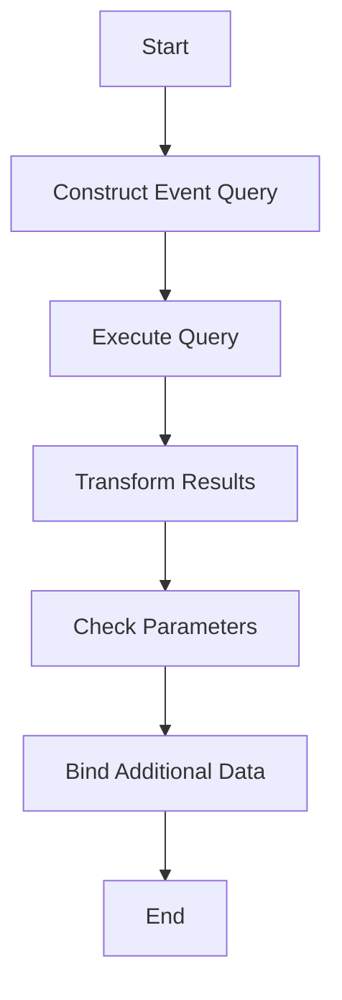

This document will cover the role of the data_fn function in the Sentry application. We'll cover:

1. Constructing and executing event queries
2. Transforming query results into structured event objects
3. Handling additional data binding based on parameters.

Technical document: <SwmLink doc-title="Role of data_fn">[Role of data_fn](/.swm/role-of-data_fn.10oj30x0.sw.md)</SwmLink>

# [Constructing and Executing Event Queries](https://app.swimm.io/repos/Z2l0aHViJTNBJTNBc2VudHJ5LWRlbW8tMSUzQSUzQVN3aW1tLURlbW8=/docs/10oj30x0#constructing-and-executing-event-query)

The data_fn function begins by constructing a query to fetch event data. This query is built using specific parameters such as the query string, limit, offset, and orderby. If the query is invalid, an error is raised. This ensures that only valid queries are processed, which helps in maintaining the integrity of the data being fetched.

# [Transforming Query Results into Structured Event Objects](https://app.swimm.io/repos/Z2l0aHViJTNBJTNBc2VudHJ5LWRlbW8tMSUzQSUzQVN3aW1tLURlbW8=/docs/10oj30x0#transforming-query-results)

Once the query is successfully executed, the raw results are transformed into a list of structured event objects. Each event object contains essential information such as event ID, project ID, and timestamp. This transformation is crucial for converting raw data into a format that can be easily used and understood by other parts of the application.

# [Handling Additional Data Binding Based on Parameters](https://app.swimm.io/repos/Z2l0aHViJTNBJTNBc2VudHJ5LWRlbW8tMSUzQSUzQVN3aW1tLURlbW8=/docs/10oj30x0#handling-event-listing-request)

If a specific parameter, such as 'full', is set, additional data binding is performed on these event objects. This means that more detailed information is attached to each event object, providing a more comprehensive view of the event. This step is important for users who need in-depth information about specific events.

&nbsp;

*This is an auto-generated document by Swimm AI 🌊 and has not yet been verified by a human*

<SwmMeta version="3.0.0" repo-id="Z2l0aHViJTNBJTNBc2VudHJ5LWRlbW8tMSUzQSUzQVN3aW1tLURlbW8=" repo-name="sentry-demo-1" doc-type="product-flows">Powered by [Swimm](/)</SwmMeta>
