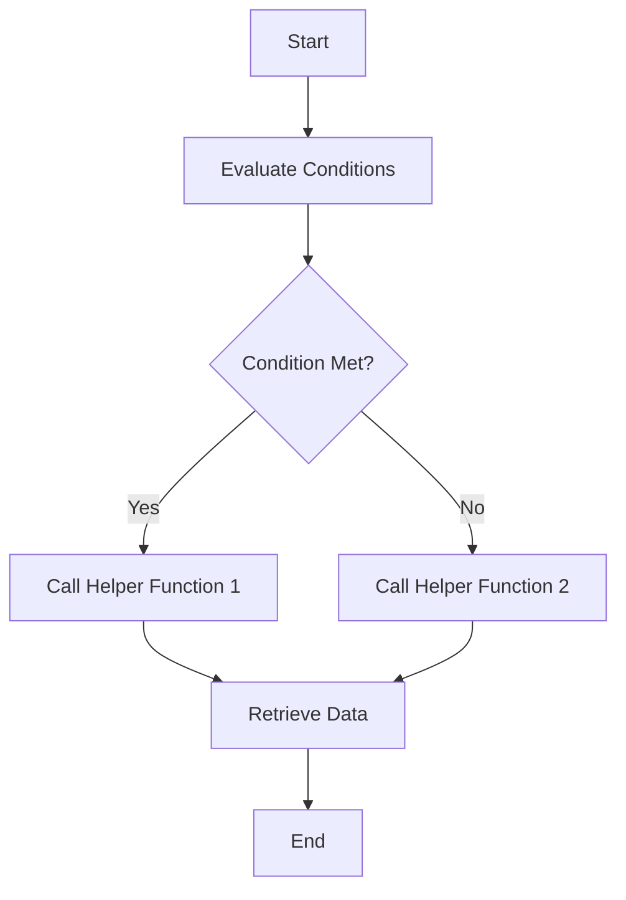

This document will cover the role of the Decision-Maker function in the data retrieval process. We'll cover:

1. Overview of the Decision-Maker function
2. Conditions and parameters it evaluates
3. How it affects data retrieval
4. Impact on the end user.

Technical document: <SwmLink doc-title="Role of the Decision-Maker Function">[Role of the Decision-Maker Function](/.swm/role-of-the-decision-maker-function.v1gach8w.sw.md)</SwmLink>

# [Overview of the Decision-Maker function](https://app.swimm.io/repos/Z2l0aHViJTNBJTNBc2VudHJ5LWRlbW8tMSUzQSUzQVN3aW1tLURlbW8=/docs/v1gach8w#title-role-of-the-decision-maker-function)

The Decision-Maker function is responsible for determining which specific data retrieval function to call based on various conditions and parameters. It acts as a central point that evaluates the context of the request and decides the most appropriate method to fetch the required data.

# [Conditions and parameters it evaluates](https://app.swimm.io/repos/Z2l0aHViJTNBJTNBc2VudHJ5LWRlbW8tMSUzQSUzQVN3aW1tLURlbW8=/docs/v1gach8w#function-fn)

The Decision-Maker function evaluates several conditions to decide which data function to call. These conditions include:

- `save_discover_dataset_decision` and `discover_saved_query_id`: If both are present, it calls `_discover_data_fn`.
- `metrics_enhanced` and `dashboard_widget_id`: If these are not present, it calls `_data_fn`.
- If none of the above conditions are met, it calls `_dashboards_data_fn`.

# [How it affects data retrieval](https://app.swimm.io/repos/Z2l0aHViJTNBJTNBc2VudHJ5LWRlbW8tMSUzQSUzQVN3aW1tLURlbW8=/docs/v1gach8w#function-_data_fn)

The Decision-Maker function ensures that the correct data retrieval function is called based on the context. For example, `_data_fn` is responsible for querying the dataset with specific parameters. It constructs the query using various parameters such as `selected_columns`, `query`, and `snuba_params`, and then executes the query on the `scoped_dataset`.

# [Impact on the end user](https://app.swimm.io/repos/Z2l0aHViJTNBJTNBc2VudHJ5LWRlbW8tMSUzQSUzQVN3aW1tLURlbW8=/docs/v1gach8w#function-_dashboards_data_fn)

For the end user, the Decision-Maker function ensures that the data they receive is accurate and relevant to their request. By evaluating the context and calling the appropriate data function, it optimizes the data retrieval process, leading to faster and more reliable results. For instance, `_dashboards_data_fn` fetches and processes data for dashboard widgets, ensuring that the user sees the most relevant data based on their dashboard configuration.

&nbsp;

*This is an auto-generated document by Swimm AI 🌊 and has not yet been verified by a human*

<SwmMeta version="3.0.0" repo-id="Z2l0aHViJTNBJTNBc2VudHJ5LWRlbW8tMSUzQSUzQVN3aW1tLURlbW8=" repo-name="sentry-demo-1" doc-type="product-flows">Powered by [Swimm](/)</SwmMeta>
