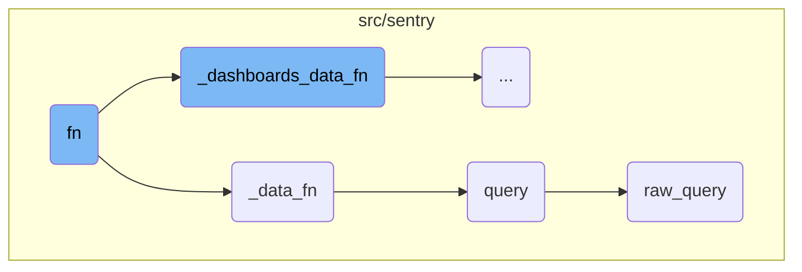
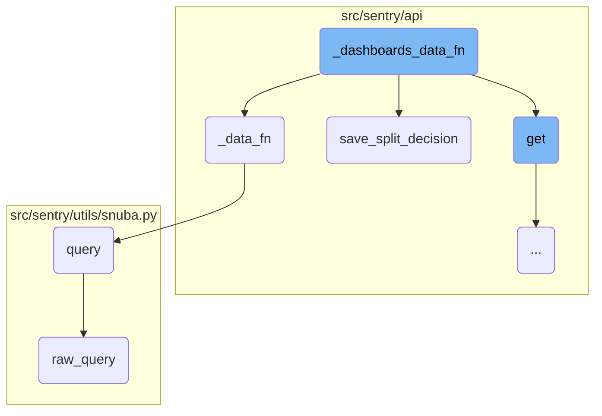
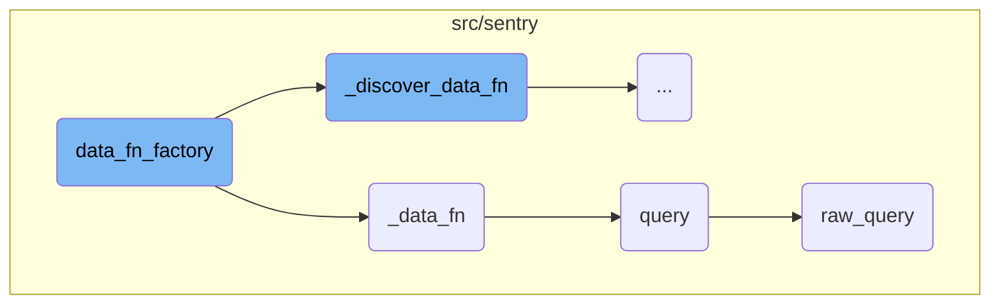
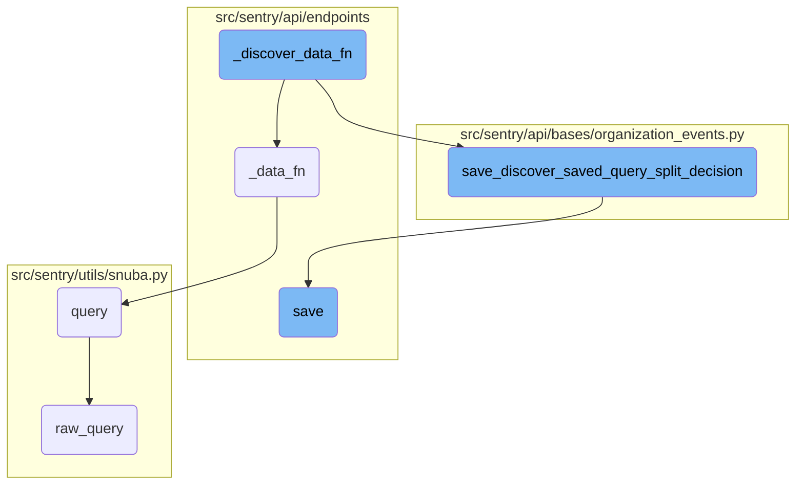

```mermaid
graph TD;
      subgraph src/sentry/api
3b03c8d24a957d56c78a43405468e4f045ce82bae47291aa645702a685a3fd96(get):::mainFlowStyle --> dd31e28d6b994b9793c5513018c9dbaf046e78befdd97be27cbdeb40094d3998(_data_fn)
end

subgraph src/sentry/utils/snuba.py
3b03c8d24a957d56c78a43405468e4f045ce82bae47291aa645702a685a3fd96(get):::mainFlowStyle --> 217c286b55931189987f173388d83db5200b62a8b3969018948674c19e4cb939(query)
end

subgraph src/sentry/api
3b03c8d24a957d56c78a43405468e4f045ce82bae47291aa645702a685a3fd96(get):::mainFlowStyle --> cf0ccc51c26d17746074d3627c37088d0b96a0ef125321d8d7439567e0bd5a7e(save_split_decision)
end

subgraph src/sentry/api
3b03c8d24a957d56c78a43405468e4f045ce82bae47291aa645702a685a3fd96(get):::mainFlowStyle --> 76555db3c36df80d8ce698d10ee1f95e79e25496e48ce2c0e3a19dce410f1dcd(handle_results_with_meta)
end

subgraph src/sentry/api
3b03c8d24a957d56c78a43405468e4f045ce82bae47291aa645702a685a3fd96(get):::mainFlowStyle --> f540f15f97ffda616abd0e1ed4b727359eb142ff389618257e8d9bd42effdf2d(data_fn_factory):::mainFlowStyle
end

subgraph src/sentry/api
f540f15f97ffda616abd0e1ed4b727359eb142ff389618257e8d9bd42effdf2d(data_fn_factory):::mainFlowStyle --> qgh5q(...)
end

subgraph src/sentry/api
76555db3c36df80d8ce698d10ee1f95e79e25496e48ce2c0e3a19dce410f1dcd(handle_results_with_meta) --> 9335165d6fb85d88094c6bb73f9e154b223f793b29b1af6be9aa07d145132b65(handle_data)
end

subgraph src/sentry/utils/snuba.py
217c286b55931189987f173388d83db5200b62a8b3969018948674c19e4cb939(query) --> 9e7271ad0c817bc7beb2e7483b4bfd667fbb5ef81afffec4ead5ea943e43fb58(raw_query)
end

subgraph src/sentry/utils/snuba.py
dd31e28d6b994b9793c5513018c9dbaf046e78befdd97be27cbdeb40094d3998(_data_fn) --> 217c286b55931189987f173388d83db5200b62a8b3969018948674c19e4cb939(query)
end


      classDef mainFlowStyle color:#000000,fill:#7CB9F4
classDef rootsStyle color:#000000,fill:#00FFF4
classDef Style1 color:#000000,fill:#00FFAA
classDef Style2 color:#000000,fill:#FFFF00
classDef Style3 color:#000000,fill:#AA7CB9

%% Swimm:
%% graph TD;
%%       subgraph <SwmPath>[src/sentry/api/](src/sentry/api/)</SwmPath>
%% 3b03c8d24a957d56c78a43405468e4f045ce82bae47291aa645702a685a3fd96(get):::mainFlowStyle --> dd31e28d6b994b9793c5513018c9dbaf046e78befdd97be27cbdeb40094d3998(_data_fn)
%% end
%% 
%% subgraph <SwmPath>[src/sentry/utils/snuba.py](src/sentry/utils/snuba.py)</SwmPath>
%% 3b03c8d24a957d56c78a43405468e4f045ce82bae47291aa645702a685a3fd96(get):::mainFlowStyle --> 217c286b55931189987f173388d83db5200b62a8b3969018948674c19e4cb939(query)
%% end
%% 
%% subgraph <SwmPath>[src/sentry/api/](src/sentry/api/)</SwmPath>
%% 3b03c8d24a957d56c78a43405468e4f045ce82bae47291aa645702a685a3fd96(get):::mainFlowStyle --> cf0ccc51c26d17746074d3627c37088d0b96a0ef125321d8d7439567e0bd5a7e(save_split_decision)
%% end
%% 
%% subgraph <SwmPath>[src/sentry/api/](src/sentry/api/)</SwmPath>
%% 3b03c8d24a957d56c78a43405468e4f045ce82bae47291aa645702a685a3fd96(get):::mainFlowStyle --> 76555db3c36df80d8ce698d10ee1f95e79e25496e48ce2c0e3a19dce410f1dcd(handle_results_with_meta)
%% end
%% 
%% subgraph <SwmPath>[src/sentry/api/](src/sentry/api/)</SwmPath>
%% 3b03c8d24a957d56c78a43405468e4f045ce82bae47291aa645702a685a3fd96(get):::mainFlowStyle --> f540f15f97ffda616abd0e1ed4b727359eb142ff389618257e8d9bd42effdf2d(data_fn_factory):::mainFlowStyle
%% end
%% 
%% subgraph <SwmPath>[src/sentry/api/](src/sentry/api/)</SwmPath>
%% f540f15f97ffda616abd0e1ed4b727359eb142ff389618257e8d9bd42effdf2d(data_fn_factory):::mainFlowStyle --> qgh5q(...)
%% end
%% 
%% subgraph <SwmPath>[src/sentry/api/](src/sentry/api/)</SwmPath>
%% 76555db3c36df80d8ce698d10ee1f95e79e25496e48ce2c0e3a19dce410f1dcd(handle_results_with_meta) --> 9335165d6fb85d88094c6bb73f9e154b223f793b29b1af6be9aa07d145132b65(handle_data)
%% end
%% 
%% subgraph <SwmPath>[src/sentry/utils/snuba.py](src/sentry/utils/snuba.py)</SwmPath>
%% 217c286b55931189987f173388d83db5200b62a8b3969018948674c19e4cb939(query) --> 9e7271ad0c817bc7beb2e7483b4bfd667fbb5ef81afffec4ead5ea943e43fb58(raw_query)
%% end
%% 
%% subgraph <SwmPath>[src/sentry/utils/snuba.py](src/sentry/utils/snuba.py)</SwmPath>
%% dd31e28d6b994b9793c5513018c9dbaf046e78befdd97be27cbdeb40094d3998(_data_fn) --> 217c286b55931189987f173388d83db5200b62a8b3969018948674c19e4cb939(query)
%% end
%% 
%% 
%%       classDef mainFlowStyle color:#000000,fill:#7CB9F4
%% classDef rootsStyle color:#000000,fill:#00FFF4
%% classDef Style1 color:#000000,fill:#00FFAA
%% classDef Style2 color:#000000,fill:#FFFF00
%% classDef Style3 color:#000000,fill:#AA7CB9
```

This document explains the role of the function <SwmToken path="src/sentry/api/endpoints/organization_events.py" pos="607:3:3" line-data="            def fn(offset, limit) -&gt; dict[str, Any]:">`fn`</SwmToken> in the data retrieval process. It highlights how <SwmToken path="src/sentry/api/endpoints/organization_events.py" pos="607:3:3" line-data="            def fn(offset, limit) -&gt; dict[str, Any]:">`fn`</SwmToken> decides which specific data function to call based on various conditions and parameters.

The function <SwmToken path="src/sentry/api/endpoints/organization_events.py" pos="607:3:3" line-data="            def fn(offset, limit) -&gt; dict[str, Any]:">`fn`</SwmToken> is like a decision-maker. It looks at the information it has and decides which helper to call for getting the data. If certain conditions are met, it calls one helper; if not, it calls another. This way, it ensures that the right data is fetched based on the situation.

Here is a high level diagram of the flow, showing only the most important functions:

```mermaid
graph TD;
      subgraph src/sentry/api/endpoints
3b9fcd50f024587c1d8d4bfeef492669e36cb70e4cb06e4201402decd420f892(fn):::mainFlowStyle --> dd31e28d6b994b9793c5513018c9dbaf046e78befdd97be27cbdeb40094d3998(_data_fn)
end

subgraph src/sentry/api/endpoints
3b9fcd50f024587c1d8d4bfeef492669e36cb70e4cb06e4201402decd420f892(fn):::mainFlowStyle --> 685bc1fbc479c5a90f8e8be6e768763f51565292d145e717448c0667d94ddc8c(_dashboards_data_fn):::mainFlowStyle
end

subgraph src/sentry/api/endpoints
685bc1fbc479c5a90f8e8be6e768763f51565292d145e717448c0667d94ddc8c(_dashboards_data_fn):::mainFlowStyle --> dd31e28d6b994b9793c5513018c9dbaf046e78befdd97be27cbdeb40094d3998(_data_fn)
end

subgraph src/sentry/api/bases/organization_events.py
685bc1fbc479c5a90f8e8be6e768763f51565292d145e717448c0667d94ddc8c(_dashboards_data_fn):::mainFlowStyle --> cf0ccc51c26d17746074d3627c37088d0b96a0ef125321d8d7439567e0bd5a7e(save_split_decision)
end

subgraph src/sentry/api/endpoints
685bc1fbc479c5a90f8e8be6e768763f51565292d145e717448c0667d94ddc8c(_dashboards_data_fn):::mainFlowStyle --> 3b03c8d24a957d56c78a43405468e4f045ce82bae47291aa645702a685a3fd96(get):::mainFlowStyle
end

subgraph src/sentry/api/endpoints
3b03c8d24a957d56c78a43405468e4f045ce82bae47291aa645702a685a3fd96(get):::mainFlowStyle --> dd31e28d6b994b9793c5513018c9dbaf046e78befdd97be27cbdeb40094d3998(_data_fn)
end

subgraph src/sentry/utils/snuba.py
3b03c8d24a957d56c78a43405468e4f045ce82bae47291aa645702a685a3fd96(get):::mainFlowStyle --> 217c286b55931189987f173388d83db5200b62a8b3969018948674c19e4cb939(query)
end

subgraph src/sentry/api/bases/organization_events.py
3b03c8d24a957d56c78a43405468e4f045ce82bae47291aa645702a685a3fd96(get):::mainFlowStyle --> cf0ccc51c26d17746074d3627c37088d0b96a0ef125321d8d7439567e0bd5a7e(save_split_decision)
end

subgraph src/sentry/api/bases/organization_events.py
3b03c8d24a957d56c78a43405468e4f045ce82bae47291aa645702a685a3fd96(get):::mainFlowStyle --> 76555db3c36df80d8ce698d10ee1f95e79e25496e48ce2c0e3a19dce410f1dcd(handle_results_with_meta)
end

subgraph src/sentry/api/endpoints
3b03c8d24a957d56c78a43405468e4f045ce82bae47291aa645702a685a3fd96(get):::mainFlowStyle --> f540f15f97ffda616abd0e1ed4b727359eb142ff389618257e8d9bd42effdf2d(data_fn_factory):::mainFlowStyle
end

subgraph src/sentry/api/endpoints
f540f15f97ffda616abd0e1ed4b727359eb142ff389618257e8d9bd42effdf2d(data_fn_factory):::mainFlowStyle --> dd31e28d6b994b9793c5513018c9dbaf046e78befdd97be27cbdeb40094d3998(_data_fn)
end

subgraph src/sentry/api/endpoints
f540f15f97ffda616abd0e1ed4b727359eb142ff389618257e8d9bd42effdf2d(data_fn_factory):::mainFlowStyle --> 2143f18fec886744c662636f05c1d74bcd7870af91656702b2bba1ffdd09c68e(_discover_data_fn):::mainFlowStyle
end

subgraph src/sentry/api/endpoints
2143f18fec886744c662636f05c1d74bcd7870af91656702b2bba1ffdd09c68e(_discover_data_fn):::mainFlowStyle --> dd31e28d6b994b9793c5513018c9dbaf046e78befdd97be27cbdeb40094d3998(_data_fn)
end

subgraph src/sentry/api/bases/organization_events.py
2143f18fec886744c662636f05c1d74bcd7870af91656702b2bba1ffdd09c68e(_discover_data_fn):::mainFlowStyle --> bcf1fda1de87381c467926cda50106c5b7d8cd612e2b07e5b46975582cc3d125(save_discover_saved_query_split_decision):::mainFlowStyle
end

subgraph src/sentry/api/endpoints
bcf1fda1de87381c467926cda50106c5b7d8cd612e2b07e5b46975582cc3d125(save_discover_saved_query_split_decision):::mainFlowStyle --> e7e0a0243c1e8121e4e6b9f766a2b7592ddac04041819dc275371e02322ce783(save):::mainFlowStyle
end


      classDef mainFlowStyle color:#000000,fill:#7CB9F4
classDef rootsStyle color:#000000,fill:#00FFF4
classDef Style1 color:#000000,fill:#00FFAA
classDef Style2 color:#000000,fill:#FFFF00
classDef Style3 color:#000000,fill:#AA7CB9

%% Swimm:
%% graph TD;
%%       subgraph <SwmPath>[src/sentry/api/endpoints/](src/sentry/api/endpoints/)</SwmPath>
%% 3b9fcd50f024587c1d8d4bfeef492669e36cb70e4cb06e4201402decd420f892(fn):::mainFlowStyle --> dd31e28d6b994b9793c5513018c9dbaf046e78befdd97be27cbdeb40094d3998(_data_fn)
%% end
%% 
%% subgraph <SwmPath>[src/sentry/api/endpoints/](src/sentry/api/endpoints/)</SwmPath>
%% 3b9fcd50f024587c1d8d4bfeef492669e36cb70e4cb06e4201402decd420f892(fn):::mainFlowStyle --> 685bc1fbc479c5a90f8e8be6e768763f51565292d145e717448c0667d94ddc8c(_dashboards_data_fn):::mainFlowStyle
%% end
%% 
%% subgraph <SwmPath>[src/sentry/api/endpoints/](src/sentry/api/endpoints/)</SwmPath>
%% 685bc1fbc479c5a90f8e8be6e768763f51565292d145e717448c0667d94ddc8c(_dashboards_data_fn):::mainFlowStyle --> dd31e28d6b994b9793c5513018c9dbaf046e78befdd97be27cbdeb40094d3998(_data_fn)
%% end
%% 
%% subgraph <SwmPath>[src/sentry/api/bases/organization_events.py](src/sentry/api/bases/organization_events.py)</SwmPath>
%% 685bc1fbc479c5a90f8e8be6e768763f51565292d145e717448c0667d94ddc8c(_dashboards_data_fn):::mainFlowStyle --> cf0ccc51c26d17746074d3627c37088d0b96a0ef125321d8d7439567e0bd5a7e(save_split_decision)
%% end
%% 
%% subgraph <SwmPath>[src/sentry/api/endpoints/](src/sentry/api/endpoints/)</SwmPath>
%% 685bc1fbc479c5a90f8e8be6e768763f51565292d145e717448c0667d94ddc8c(_dashboards_data_fn):::mainFlowStyle --> 3b03c8d24a957d56c78a43405468e4f045ce82bae47291aa645702a685a3fd96(get):::mainFlowStyle
%% end
%% 
%% subgraph <SwmPath>[src/sentry/api/endpoints/](src/sentry/api/endpoints/)</SwmPath>
%% 3b03c8d24a957d56c78a43405468e4f045ce82bae47291aa645702a685a3fd96(get):::mainFlowStyle --> dd31e28d6b994b9793c5513018c9dbaf046e78befdd97be27cbdeb40094d3998(_data_fn)
%% end
%% 
%% subgraph <SwmPath>[src/sentry/utils/snuba.py](src/sentry/utils/snuba.py)</SwmPath>
%% 3b03c8d24a957d56c78a43405468e4f045ce82bae47291aa645702a685a3fd96(get):::mainFlowStyle --> 217c286b55931189987f173388d83db5200b62a8b3969018948674c19e4cb939(query)
%% end
%% 
%% subgraph <SwmPath>[src/sentry/api/bases/organization_events.py](src/sentry/api/bases/organization_events.py)</SwmPath>
%% 3b03c8d24a957d56c78a43405468e4f045ce82bae47291aa645702a685a3fd96(get):::mainFlowStyle --> cf0ccc51c26d17746074d3627c37088d0b96a0ef125321d8d7439567e0bd5a7e(save_split_decision)
%% end
%% 
%% subgraph <SwmPath>[src/sentry/api/bases/organization_events.py](src/sentry/api/bases/organization_events.py)</SwmPath>
%% 3b03c8d24a957d56c78a43405468e4f045ce82bae47291aa645702a685a3fd96(get):::mainFlowStyle --> 76555db3c36df80d8ce698d10ee1f95e79e25496e48ce2c0e3a19dce410f1dcd(handle_results_with_meta)
%% end
%% 
%% subgraph <SwmPath>[src/sentry/api/endpoints/](src/sentry/api/endpoints/)</SwmPath>
%% 3b03c8d24a957d56c78a43405468e4f045ce82bae47291aa645702a685a3fd96(get):::mainFlowStyle --> f540f15f97ffda616abd0e1ed4b727359eb142ff389618257e8d9bd42effdf2d(data_fn_factory):::mainFlowStyle
%% end
%% 
%% subgraph <SwmPath>[src/sentry/api/endpoints/](src/sentry/api/endpoints/)</SwmPath>
%% f540f15f97ffda616abd0e1ed4b727359eb142ff389618257e8d9bd42effdf2d(data_fn_factory):::mainFlowStyle --> dd31e28d6b994b9793c5513018c9dbaf046e78befdd97be27cbdeb40094d3998(_data_fn)
%% end
%% 
%% subgraph <SwmPath>[src/sentry/api/endpoints/](src/sentry/api/endpoints/)</SwmPath>
%% f540f15f97ffda616abd0e1ed4b727359eb142ff389618257e8d9bd42effdf2d(data_fn_factory):::mainFlowStyle --> 2143f18fec886744c662636f05c1d74bcd7870af91656702b2bba1ffdd09c68e(_discover_data_fn):::mainFlowStyle
%% end
%% 
%% subgraph <SwmPath>[src/sentry/api/endpoints/](src/sentry/api/endpoints/)</SwmPath>
%% 2143f18fec886744c662636f05c1d74bcd7870af91656702b2bba1ffdd09c68e(_discover_data_fn):::mainFlowStyle --> dd31e28d6b994b9793c5513018c9dbaf046e78befdd97be27cbdeb40094d3998(_data_fn)
%% end
%% 
%% subgraph <SwmPath>[src/sentry/api/bases/organization_events.py](src/sentry/api/bases/organization_events.py)</SwmPath>
%% 2143f18fec886744c662636f05c1d74bcd7870af91656702b2bba1ffdd09c68e(_discover_data_fn):::mainFlowStyle --> bcf1fda1de87381c467926cda50106c5b7d8cd612e2b07e5b46975582cc3d125(save_discover_saved_query_split_decision):::mainFlowStyle
%% end
%% 
%% subgraph <SwmPath>[src/sentry/api/endpoints/](src/sentry/api/endpoints/)</SwmPath>
%% bcf1fda1de87381c467926cda50106c5b7d8cd612e2b07e5b46975582cc3d125(save_discover_saved_query_split_decision):::mainFlowStyle --> e7e0a0243c1e8121e4e6b9f766a2b7592ddac04041819dc275371e02322ce783(save):::mainFlowStyle
%% end
%% 
%% 
%%       classDef mainFlowStyle color:#000000,fill:#7CB9F4
%% classDef rootsStyle color:#000000,fill:#00FFF4
%% classDef Style1 color:#000000,fill:#00FFAA
%% classDef Style2 color:#000000,fill:#FFFF00
%% classDef Style3 color:#000000,fill:#AA7CB9
```



# Flow drill down

First, we'll zoom into this section of the flow:



<SwmSnippet path="/src/sentry/api/endpoints/organization_events.py" line="608">

---

## Function <SwmToken path="src/sentry/api/endpoints/organization_events.py" pos="607:3:3" line-data="            def fn(offset, limit) -&gt; dict[str, Any]:">`fn`</SwmToken>

The function <SwmToken path="src/sentry/api/endpoints/organization_events.py" pos="607:3:3" line-data="            def fn(offset, limit) -&gt; dict[str, Any]:">`fn`</SwmToken> orchestrates the data retrieval process by deciding which specific data function to call based on the provided parameters. It checks conditions such as <SwmToken path="src/sentry/api/endpoints/organization_events.py" pos="608:3:3" line-data="                if save_discover_dataset_decision and discover_saved_query_id:">`save_discover_dataset_decision`</SwmToken> and <SwmToken path="src/sentry/api/endpoints/organization_events.py" pos="608:7:7" line-data="                if save_discover_dataset_decision and discover_saved_query_id:">`discover_saved_query_id`</SwmToken> to determine if <SwmToken path="src/sentry/api/endpoints/organization_events.py" pos="609:3:3" line-data="                    return _discover_data_fn(">`_discover_data_fn`</SwmToken> should be called. If not, it checks for <SwmToken path="src/sentry/api/endpoints/organization_events.py" pos="613:6:6" line-data="                if not (metrics_enhanced and dashboard_widget_id):">`metrics_enhanced`</SwmToken> and <SwmToken path="src/sentry/api/endpoints/organization_events.py" pos="613:10:10" line-data="                if not (metrics_enhanced and dashboard_widget_id):">`dashboard_widget_id`</SwmToken> to decide between <SwmToken path="src/sentry/api/endpoints/organization_events.py" pos="614:3:3" line-data="                    return _data_fn(scoped_dataset, offset, limit, scoped_query)">`_data_fn`</SwmToken> and <SwmToken path="src/sentry/api/endpoints/organization_events.py" pos="616:3:3" line-data="                return _dashboards_data_fn(">`_dashboards_data_fn`</SwmToken>.

```python
                if save_discover_dataset_decision and discover_saved_query_id:
                    return _discover_data_fn(
                        scoped_dataset, offset, limit, scoped_query, discover_saved_query_id
                    )

                if not (metrics_enhanced and dashboard_widget_id):
                    return _data_fn(scoped_dataset, offset, limit, scoped_query)

                return _dashboards_data_fn(
                    scoped_dataset, offset, limit, scoped_query, dashboard_widget_id
                )
```

---

</SwmSnippet>

<SwmSnippet path="/src/sentry/api/endpoints/organization_events.py" line="398">

---

## Function <SwmToken path="src/sentry/api/endpoints/organization_events.py" pos="442:3:3" line-data="                    return _data_fn(split_dataset, offset, limit, scoped_query)">`_data_fn`</SwmToken>

The function <SwmToken path="src/sentry/api/endpoints/organization_events.py" pos="442:3:3" line-data="                    return _data_fn(split_dataset, offset, limit, scoped_query)">`_data_fn`</SwmToken> is responsible for querying the dataset with specific parameters. It constructs the query using various parameters such as <SwmToken path="src/sentry/api/endpoints/organization_events.py" pos="400:1:1" line-data="                selected_columns=self.get_field_list(organization, request),">`selected_columns`</SwmToken>, <SwmToken path="src/sentry/api/endpoints/organization_events.py" pos="399:5:5" line-data="            return scoped_dataset.query(">`query`</SwmToken>, <SwmToken path="src/sentry/api/endpoints/organization_events.py" pos="402:1:1" line-data="                snuba_params=snuba_params,">`snuba_params`</SwmToken>, and others, and then executes the query on the <SwmToken path="src/sentry/api/endpoints/organization_events.py" pos="399:3:3" line-data="            return scoped_dataset.query(">`scoped_dataset`</SwmToken>.

```python
            query_source = self.get_request_source(request)
            return scoped_dataset.query(
                selected_columns=self.get_field_list(organization, request),
                query=query,
                snuba_params=snuba_params,
                equations=self.get_equation_list(organization, request),
                orderby=self.get_orderby(request),
                offset=offset,
                limit=limit,
                referrer=referrer,
                auto_fields=True,
                auto_aggregations=True,
                use_aggregate_conditions=True,
                allow_metric_aggregates=allow_metric_aggregates,
                transform_alias_to_input_format=True,
                # Whether the flag is enabled or not, regardless of the referrer
                has_metrics=use_metrics,
                use_metrics_layer=batch_features.get("organizations:use-metrics-layer", False),
                on_demand_metrics_enabled=on_demand_metrics_enabled,
                on_demand_metrics_type=on_demand_metrics_type,
                query_source=query_source,
```

---

</SwmSnippet>

<SwmSnippet path="/src/sentry/utils/snuba.py" line="1319">

---

## Function <SwmToken path="src/sentry/api/endpoints/organization_events.py" pos="399:5:5" line-data="            return scoped_dataset.query(">`query`</SwmToken>

The function <SwmToken path="src/sentry/api/endpoints/organization_events.py" pos="399:5:5" line-data="            return scoped_dataset.query(">`query`</SwmToken> prepares and executes a query to Snuba. It constructs the query body and calls <SwmToken path="src/sentry/utils/snuba.py" pos="1337:5:5" line-data="        body = raw_query(">`raw_query`</SwmToken> to get the data. It also handles exceptions and validates the response to ensure the expected columns are returned.

```python
    dataset=None,
    start=None,
    end=None,
    groupby=None,
    conditions=None,
    filter_keys=None,
    aggregations=None,
    selected_columns=None,
    totals=None,
    use_cache=False,
    **kwargs,
):
    aggregations = aggregations or [["count()", "", "aggregate"]]
    filter_keys = filter_keys or {}
    selected_columns = selected_columns or []
    groupby = groupby or []

    try:
        body = raw_query(
            dataset=dataset,
            start=start,
```

---

</SwmSnippet>

<SwmSnippet path="/src/sentry/utils/snuba.py" line="847">

---

## Function <SwmToken path="src/sentry/utils/snuba.py" pos="1337:5:5" line-data="        body = raw_query(">`raw_query`</SwmToken>

The function <SwmToken path="src/sentry/utils/snuba.py" pos="1337:5:5" line-data="        body = raw_query(">`raw_query`</SwmToken> sends a query to Snuba. It constructs the <SwmToken path="src/sentry/utils/snuba.py" pos="861:15:15" line-data="    Sends a query to snuba.  See `SnubaQueryParams` docstring for param">`SnubaQueryParams`</SwmToken> and calls <SwmToken path="src/sentry/utils/snuba.py" pos="882:3:3" line-data="    return bulk_raw_query([snuba_params], referrer=referrer, use_cache=use_cache)[0]">`bulk_raw_query`</SwmToken> to execute the query. This function handles the low-level details of communicating with Snuba.

```python
    dataset=None,
    start=None,
    end=None,
    groupby=None,
    conditions=None,
    filter_keys=None,
    aggregations=None,
    rollup=None,
    referrer=None,
    is_grouprelease=False,
    use_cache=False,
    **kwargs,
) -> Mapping[str, Any]:
    """
    Sends a query to snuba.  See `SnubaQueryParams` docstring for param
    descriptions.
    """

    if referrer:
        kwargs["tenant_ids"] = kwargs.get("tenant_ids") or dict()
        kwargs["tenant_ids"]["referrer"] = referrer
```

---

</SwmSnippet>

Now, lets zoom into this section of the flow:



<SwmSnippet path="/src/sentry/api/endpoints/organization_events.py" line="422">

---

## <SwmToken path="src/sentry/api/endpoints/organization_events.py" pos="422:3:3" line-data="        def _dashboards_data_fn(scoped_dataset, offset, limit, scoped_query, dashboard_widget_id):">`_dashboards_data_fn`</SwmToken>

The <SwmToken path="src/sentry/api/endpoints/organization_events.py" pos="422:3:3" line-data="        def _dashboards_data_fn(scoped_dataset, offset, limit, scoped_query, dashboard_widget_id):">`_dashboards_data_fn`</SwmToken> function is responsible for fetching and processing data for dashboard widgets. It first checks if the widget has a split configuration and whether the user has the necessary feature flag. Depending on these conditions, it decides which dataset to use for querying data. It handles errors and transactions separately, making multiple data function calls (<SwmToken path="src/sentry/api/endpoints/organization_events.py" pos="442:3:3" line-data="                    return _data_fn(split_dataset, offset, limit, scoped_query)">`_data_fn`</SwmToken>) to gather the required data. Finally, it uses the <SwmToken path="src/sentry/api/bases/organization_events.py" pos="199:3:3" line-data="    def save_split_decision(self, widget, has_errors, has_transactions_data, organization, user):">`save_split_decision`</SwmToken> function to determine the type of data to return and updates the widget's split decision accordingly.

```python
        def _dashboards_data_fn(scoped_dataset, offset, limit, scoped_query, dashboard_widget_id):
            try:
                widget = DashboardWidget.objects.get(id=dashboard_widget_id)
                does_widget_have_split = widget.discover_widget_split is not None
                has_override_feature = features.has(
                    "organizations:performance-discover-widget-split-override-save",
                    organization,
                    actor=request.user,
                )

                if does_widget_have_split and not has_override_feature:
                    # This is essentially cached behaviour and we skip the check
                    if widget.discover_widget_split == DashboardWidgetTypes.ERROR_EVENTS:
                        split_dataset = errors
                    elif widget.discover_widget_split == DashboardWidgetTypes.TRANSACTION_LIKE:
                        # We can't add event.type:transaction for now because of on-demand.
                        split_dataset = scoped_dataset
                    else:
                        split_dataset = discover

                    return _data_fn(split_dataset, offset, limit, scoped_query)
```

---

</SwmSnippet>

<SwmSnippet path="/src/sentry/api/bases/organization_events.py" line="199">

---

## <SwmToken path="src/sentry/api/bases/organization_events.py" pos="199:3:3" line-data="    def save_split_decision(self, widget, has_errors, has_transactions_data, organization, user):">`save_split_decision`</SwmToken>

The <SwmToken path="src/sentry/api/bases/organization_events.py" pos="199:3:3" line-data="    def save_split_decision(self, widget, has_errors, has_transactions_data, organization, user):">`save_split_decision`</SwmToken> function determines the type of data (errors, transactions, or discover) that should be associated with a dashboard widget based on the presence of errors and transaction data. It sets appropriate tags for monitoring and updates the widget's split decision and dataset source if necessary. This function ensures that the widget's data type is correctly classified and saved for future queries.

```python
    def save_split_decision(self, widget, has_errors, has_transactions_data, organization, user):
        """This can be removed once the discover dataset has been fully split"""
        source = DashboardDatasetSourcesTypes.INFERRED.value
        if has_errors and not has_transactions_data:
            decision = DashboardWidgetTypes.ERROR_EVENTS
            sentry_sdk.set_tag("discover.split_reason", "query_result")
        elif not has_errors and has_transactions_data:
            decision = DashboardWidgetTypes.TRANSACTION_LIKE
            sentry_sdk.set_tag("discover.split_reason", "query_result")
        else:
            if features.has(
                "organizations:performance-discover-dataset-selector", organization, actor=user
            ):
                # In the case that neither side has data, or both sides have data, default to errors.
                decision = DashboardWidgetTypes.ERROR_EVENTS
                source = DashboardDatasetSourcesTypes.FORCED.value
                sentry_sdk.set_tag("discover.split_reason", "default")
            else:
                # This branch can be deleted once the feature flag for the discover split is removed
                if has_errors and has_transactions_data:
                    decision = DashboardWidgetTypes.DISCOVER
```

---

</SwmSnippet>

Now, lets zoom into this section of the flow:



<SwmSnippet path="/src/sentry/api/endpoints/organization_events.py" line="302">

---

## The <SwmToken path="src/sentry/api/endpoints/organization_events.py" pos="302:3:3" line-data="    def get(self, request: Request, organization) -&gt; Response:">`get`</SwmToken> Function

The <SwmToken path="src/sentry/api/endpoints/organization_events.py" pos="302:3:3" line-data="    def get(self, request: Request, organization) -&gt; Response:">`get`</SwmToken> function is responsible for handling the main request to retrieve event data for an organization. It orchestrates the flow by calling various helper functions to process and format the data.

```python
    def get(self, request: Request, organization) -> Response:
```

---

</SwmSnippet>

<SwmSnippet path="/src/sentry/api/bases/organization_events.py" line="290">

---

### Handling Results with Metadata

The <SwmToken path="src/sentry/api/bases/organization_events.py" pos="290:3:3" line-data="    def handle_results_with_meta(">`handle_results_with_meta`</SwmToken> function processes the results obtained from the query, adding metadata and formatting the data as needed. It ensures that the response includes all necessary information, such as field metadata and dataset labels.

```python
    def handle_results_with_meta(
        self,
        request: Request,
        organization: Organization,
        project_ids: Sequence[int],
        results: dict[str, Any],
        standard_meta: bool | None = False,
        dataset: Any | None = None,
    ) -> dict[str, Any]:
        with sentry_sdk.start_span(op="discover.endpoint", description="base.handle_results"):
            data = self.handle_data(request, organization, project_ids, results.get("data"))
            meta = results.get("meta", {})
            fields_meta = meta.get("fields", {})

            if standard_meta:
                isMetricsData = meta.pop("isMetricsData", False)
                isMetricsExtractedData = meta.pop("isMetricsExtractedData", False)
                discoverSplitDecision = meta.pop("discoverSplitDecision", None)
                fields, units = self.handle_unit_meta(fields_meta)
                meta = {
                    "fields": fields,
```

---

</SwmSnippet>

<SwmSnippet path="/src/sentry/api/bases/organization_events.py" line="332">

---

### Handling Data

The <SwmToken path="src/sentry/api/bases/organization_events.py" pos="332:3:3" line-data="    def handle_data(">`handle_data`</SwmToken> function formats the raw query results. It processes specific fields like <SwmToken path="src/sentry/api/bases/organization_events.py" pos="346:4:6" line-data="        if &quot;transaction.status&quot; in first_row:">`transaction.status`</SwmToken> and <SwmToken path="src/sentry/api/endpoints/organization_events.py" pos="155:20:20" line-data="# When calling make build-spectacular-docs we hit this issue">`issue`</SwmToken>, and removes unnecessary fields like <SwmToken path="src/sentry/api/bases/organization_events.py" pos="360:19:19" line-data="        if not (&quot;project.id&quot; in first_row or &quot;projectid&quot; in first_row):">`projectid`</SwmToken> from the results. This function ensures that the data returned is clean and well-structured.

```python
    def handle_data(
        self,
        request: Request,
        organization: Organization,
        project_ids: Sequence[int],
        results: Sequence[Any] | None,
    ) -> Sequence[Any] | None:
        if not results:
            return results

        first_row = results[0]

        # TODO(mark) move all of this result formatting into discover.query()
        # once those APIs are used across the application.
        if "transaction.status" in first_row:
            for row in results:
                if "transaction.status" in row and type(row["transaction.status"]) is int:
                    row["transaction.status"] = SPAN_STATUS_CODE_TO_NAME.get(
                        row["transaction.status"]
                    )

```

---

</SwmSnippet>

Now, lets zoom into this section of the flow:



<SwmSnippet path="/src/sentry/api/endpoints/organization_events.py" line="608">

---

## Handling different data function scenarios

The <SwmToken path="src/sentry/api/endpoints/organization_events.py" pos="595:3:3" line-data="        def data_fn_factory(scoped_dataset):">`data_fn_factory`</SwmToken> function is responsible for determining which data function to call based on the context of the request. It checks for the presence of <SwmToken path="src/sentry/api/endpoints/organization_events.py" pos="608:7:7" line-data="                if save_discover_dataset_decision and discover_saved_query_id:">`discover_saved_query_id`</SwmToken> and <SwmToken path="src/sentry/api/endpoints/organization_events.py" pos="613:10:10" line-data="                if not (metrics_enhanced and dashboard_widget_id):">`dashboard_widget_id`</SwmToken> to decide whether to call <SwmToken path="src/sentry/api/endpoints/organization_events.py" pos="609:3:3" line-data="                    return _discover_data_fn(">`_discover_data_fn`</SwmToken>, <SwmToken path="src/sentry/api/endpoints/organization_events.py" pos="614:3:3" line-data="                    return _data_fn(scoped_dataset, offset, limit, scoped_query)">`_data_fn`</SwmToken>, or <SwmToken path="src/sentry/api/endpoints/organization_events.py" pos="616:3:3" line-data="                return _dashboards_data_fn(">`_dashboards_data_fn`</SwmToken>. This allows the system to handle different scenarios such as dashboard widgets and discover queries efficiently.

```python
                if save_discover_dataset_decision and discover_saved_query_id:
                    return _discover_data_fn(
                        scoped_dataset, offset, limit, scoped_query, discover_saved_query_id
                    )

                if not (metrics_enhanced and dashboard_widget_id):
                    return _data_fn(scoped_dataset, offset, limit, scoped_query)

                return _dashboards_data_fn(
                    scoped_dataset, offset, limit, scoped_query, dashboard_widget_id
                )
```

---

</SwmSnippet>

Now, lets zoom into this section of the flow:



<SwmSnippet path="/src/sentry/api/endpoints/organization_events.py" line="494">

---

## <SwmToken path="src/sentry/api/endpoints/organization_events.py" pos="494:3:3" line-data="        def _discover_data_fn(scoped_dataset, offset, limit, scoped_query, discover_saved_query_id):">`_discover_data_fn`</SwmToken>

The function <SwmToken path="src/sentry/api/endpoints/organization_events.py" pos="494:3:3" line-data="        def _discover_data_fn(scoped_dataset, offset, limit, scoped_query, discover_saved_query_id):">`_discover_data_fn`</SwmToken> is responsible for determining the appropriate dataset for a given query. It first attempts to retrieve the saved query using the provided <SwmToken path="src/sentry/api/endpoints/organization_events.py" pos="494:17:17" line-data="        def _discover_data_fn(scoped_dataset, offset, limit, scoped_query, discover_saved_query_id):">`discover_saved_query_id`</SwmToken>. If the dataset is not of type <SwmToken path="src/sentry/api/endpoints/organization_events.py" pos="500:11:11" line-data="                    discover_query.dataset is not DiscoverSavedQueryTypes.DISCOVER">`DISCOVER`</SwmToken>, it directly calls <SwmToken path="src/sentry/api/endpoints/organization_events.py" pos="503:3:3" line-data="                    return _data_fn(scoped_dataset, offset, limit, scoped_query)">`_data_fn`</SwmToken>. Otherwise, it tries to infer the dataset based on the selected columns and query string. If inference is successful, it calls <SwmToken path="src/sentry/api/endpoints/organization_events.py" pos="503:3:3" line-data="                    return _data_fn(scoped_dataset, offset, limit, scoped_query)">`_data_fn`</SwmToken> with the inferred dataset and saves the split decision. If inference fails, it runs both error and transaction queries in parallel and decides the dataset based on the results.

```python
        def _discover_data_fn(scoped_dataset, offset, limit, scoped_query, discover_saved_query_id):
            try:
                discover_query = DiscoverSavedQuery.objects.get(
                    id=discover_saved_query_id, organization=organization
                )
                does_widget_have_split = (
                    discover_query.dataset is not DiscoverSavedQueryTypes.DISCOVER
                )
                if does_widget_have_split:
                    return _data_fn(scoped_dataset, offset, limit, scoped_query)

                dataset_inferred_from_query = dataset_split_decision_inferred_from_query(
                    self.get_field_list(organization, request),
                    scoped_query,
                )
                has_errors = False
                has_transactions = False

                # See if we can infer which dataset based on selected columns and query string.
                if dataset_inferred_from_query is not None:
                    result = _data_fn(
```

---

</SwmSnippet>

<SwmSnippet path="/src/sentry/api/bases/organization_events.py" line="233">

---

### <SwmToken path="src/sentry/api/bases/organization_events.py" pos="233:3:3" line-data="    def save_discover_saved_query_split_decision(">`save_discover_saved_query_split_decision`</SwmToken>

The function <SwmToken path="src/sentry/api/bases/organization_events.py" pos="233:3:3" line-data="    def save_discover_saved_query_split_decision(">`save_discover_saved_query_split_decision`</SwmToken> saves the decision on which dataset to use for a query. It determines the dataset based on the inferred dataset, presence of errors, and transaction data. If the dataset is ambiguous, it defaults to errors. The decision is then saved to the query object.

```python
    def save_discover_saved_query_split_decision(
        self, query, dataset_inferred_from_query, has_errors, has_transactions_data
    ):
        """
        This can be removed once the discover dataset has been fully split.
        If dataset is ambiguous (i.e., could be either transactions or errors),
        default to errors.
        """
        dataset_source = DatasetSourcesTypes.INFERRED.value
        if dataset_inferred_from_query:
            decision = dataset_inferred_from_query
            sentry_sdk.set_tag("discover.split_reason", "inferred_from_query")
        elif has_errors and not has_transactions_data:
            decision = DiscoverSavedQueryTypes.ERROR_EVENTS
            sentry_sdk.set_tag("discover.split_reason", "query_result")
        elif not has_errors and has_transactions_data:
            decision = DiscoverSavedQueryTypes.TRANSACTION_LIKE
            sentry_sdk.set_tag("discover.split_reason", "query_result")
        else:
            # In the case that neither or both datasets return data,
            # default to Errors.
```

---

</SwmSnippet>

<SwmSnippet path="/src/sentry/api/endpoints/organization_details.py" line="462">

---

### save

The function <SwmToken path="src/sentry/api/endpoints/organization_details.py" pos="462:3:3" line-data="    def save(self):">`save`</SwmToken> is used to save changes to an organization's settings. It updates various organization options and flags based on the provided data. If certain fields like <SwmToken path="src/sentry/api/endpoints/organization_details.py" pos="239:1:1" line-data="    avatar = AvatarField(required=False, allow_null=True)">`avatar`</SwmToken> or <SwmToken path="src/sentry/api/endpoints/organization_details.py" pos="277:1:1" line-data="    require2FA = serializers.BooleanField(required=False)">`require2FA`</SwmToken> are present in the data, it handles those updates as well. Finally, it saves the organization object and returns it along with the changed data.

```python
    def save(self):
        from sentry import features

        org = self.context["organization"]
        changed_data = {}
        if not hasattr(org, "__data"):
            update_tracked_data(org)

        data = self.validated_data

        for key, option, type_, default_value in ORG_OPTIONS:
            if key not in data:
                continue
            try:
                option_inst = OrganizationOption.objects.get(organization=org, key=option)
                update_tracked_data(option_inst)
            except OrganizationOption.DoesNotExist:
                OrganizationOption.objects.set_value(
                    organization=org, key=option, value=type_(data[key])
                )

```

---

</SwmSnippet>

&nbsp;

*This is an auto-generated document by Swimm AI 🌊 and has not yet been verified by a human*

<SwmMeta version="3.0.0" repo-id="Z2l0aHViJTNBJTNBc2VudHJ5LWRlbW8tMSUzQSUzQVN3aW1tLURlbW8=" repo-name="sentry-demo-1" doc-type="flows"><sup>Powered by [Swimm](/)</sup></SwmMeta>
