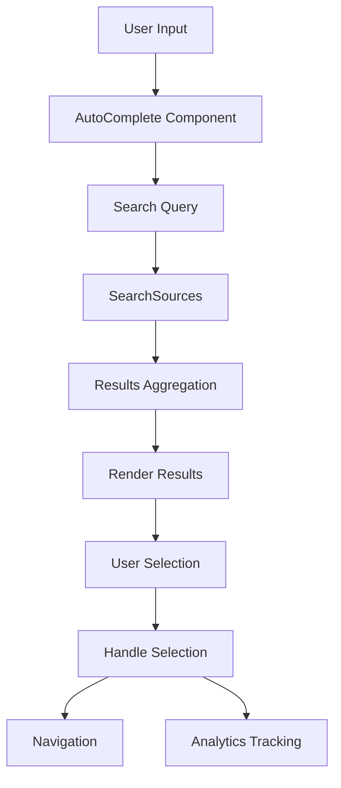

# Overview

The Search component provides comprehensive search functionality within the application. It allows users to input search queries and retrieve relevant results from various sources. The component is highly customizable, supporting different entry points, minimum search character requirements, and maximum results display. It integrates with an <SwmToken path="static/app/components/search/index.tsx" pos="95:16:16" line-data="    (item: Result[&#39;item&#39;], state?: AutoComplete&lt;Result[&#39;item&#39;]&gt;[&#39;state&#39;]) =&gt; {">`AutoComplete`</SwmToken> component to provide suggestions and handle user selections. Additionally, Search includes analytics tracking to monitor user interactions and search performance. The results can be rendered with custom item renderers and can include additional elements like footers.

<SwmSnippet path="/static/app/components/search/index.tsx" line="73">

---

# Initialization

The <SwmToken path="static/app/components/search/index.tsx" pos="73:2:2" line-data="function Search({">`Search`</SwmToken> function initializes the search component, setting up necessary hooks and analytics tracking. It takes various props such as <SwmToken path="static/app/components/search/index.tsx" pos="74:1:1" line-data="  entryPoint,">`entryPoint`</SwmToken>, <SwmToken path="static/app/components/search/index.tsx" pos="75:1:1" line-data="  maxResults,">`maxResults`</SwmToken>, <SwmToken path="static/app/components/search/index.tsx" pos="76:1:1" line-data="  minSearch,">`minSearch`</SwmToken>, <SwmToken path="static/app/components/search/index.tsx" pos="77:1:1" line-data="  renderInput,">`renderInput`</SwmToken>, <SwmToken path="static/app/components/search/index.tsx" pos="78:1:1" line-data="  renderItem,">`renderItem`</SwmToken>, <SwmToken path="static/app/components/search/index.tsx" pos="79:1:1" line-data="  closeOnSelect,">`closeOnSelect`</SwmToken>, <SwmToken path="static/app/components/search/index.tsx" pos="80:1:1" line-data="  dropdownClassName,">`dropdownClassName`</SwmToken>, <SwmToken path="static/app/components/search/index.tsx" pos="81:1:1" line-data="  resultFooter,">`resultFooter`</SwmToken>, <SwmToken path="static/app/components/search/index.tsx" pos="82:1:1" line-data="  searchOptions,">`searchOptions`</SwmToken>, and <SwmToken path="static/app/components/search/index.tsx" pos="83:1:1" line-data="  sources,">`sources`</SwmToken>.

```tsx
function Search({
  entryPoint,
  maxResults,
  minSearch,
  renderInput,
  renderItem,
  closeOnSelect,
  dropdownClassName,
  resultFooter,
  searchOptions,
  sources,
}: SearchProps): React.ReactElement {
  const router = useRouter();

  const params = useParams<{orgId: string}>();
  useEffect(() => {
    trackAnalytics(`${entryPoint}.open`, {
      organization: null,
    });
  }, [entryPoint]);
```

---

</SwmSnippet>

<SwmSnippet path="/static/app/components/search/index.tsx" line="94">

---

# Handling Selection

The <SwmToken path="static/app/components/search/index.tsx" pos="94:3:3" line-data="  const handleSelectItem = useCallback(">`handleSelectItem`</SwmToken> function handles the selection of search results, including navigation and analytics tracking. It tracks the selected item and performs actions based on the item's properties.

```tsx
  const handleSelectItem = useCallback(
    (item: Result['item'], state?: AutoComplete<Result['item']>['state']) => {
      if (!item) {
        return;
      }

      trackAnalytics(`${entryPoint}.select`, {
        query: state?.inputValue,
        result_type: item.resultType,
        source_type: item.sourceType,
        organization: null,
      });

      // `action` refers to a callback function while
      // `to` is a react-router route
      if (typeof item.action === 'function') {
        item.action(item, state);
        return;
      }

      if (!item.to) {
```

---

</SwmSnippet>

<SwmSnippet path="/static/app/components/search/index.tsx" line="140">

---

# Tracking Query Metrics

The <SwmToken path="static/app/components/search/index.tsx" pos="140:3:3" line-data="  const saveQueryMetrics = useCallback(">`saveQueryMetrics`</SwmToken> and <SwmToken path="static/app/components/search/index.tsx" pos="154:3:3" line-data="  const debouncedSaveQueryMetrics = useMemo(">`debouncedSaveQueryMetrics`</SwmToken> functions track and debounce search query metrics for analytics. These functions ensure that search queries are tracked efficiently without overwhelming the analytics system.

```tsx
  const saveQueryMetrics = useCallback(
    (query: string) => {
      if (!query) {
        return;
      }

      trackAnalytics(`${entryPoint}.query`, {
        query,
        organization: null,
      });
    },
    [entryPoint]
  );

  const debouncedSaveQueryMetrics = useMemo(
    () => debounce(saveQueryMetrics, 200),
    [saveQueryMetrics]
  );
```

---

</SwmSnippet>

<SwmSnippet path="/static/app/components/search/index.tsx" line="159">

---

# <SwmToken path="static/app/components/search/index.tsx" pos="160:2:2" line-data="    &lt;AutoComplete">`AutoComplete`</SwmToken> Integration

The <SwmToken path="static/app/components/search/index.tsx" pos="160:2:2" line-data="    &lt;AutoComplete">`AutoComplete`</SwmToken> component is used to provide search suggestions and handle user input. It integrates with the <SwmToken path="static/app/components/search/index.tsx" pos="173:7:7" line-data="          &lt;SearchWrapper role=&quot;search&quot;&gt;">`search`</SwmToken> component to offer real-time suggestions and manage user selections.

```tsx
  return (
    <AutoComplete
      defaultHighlightedIndex={0}
      onSelect={handleSelectItem}
      closeOnSelect={closeOnSelect ?? true}
      isOpen
    >
      {({getInputProps, isOpen, inputValue, ...autocompleteProps}) => {
        const searchQuery = inputValue.toLowerCase().trim();
        const isValidSearch = inputValue.length >= minSearch;

        debouncedSaveQueryMetrics(searchQuery);

        return (
          <SearchWrapper role="search">
            {renderInput({getInputProps})}

            {isValidSearch && isOpen ? (
              <SearchSources
                searchOptions={searchOptions}
                query={searchQuery}
```

---

</SwmSnippet>

<SwmSnippet path="/static/app/components/search/sources/helpSource.tsx" line="65">

---

# Fetching and Processing Results

The <SwmToken path="static/app/components/search/sources/helpSource.tsx" pos="68:3:3" line-data="    const searchResults = await this.search.query(">`searchResults`</SwmToken> constant in <SwmToken path="static/app/components/search/sources/helpSource.tsx" pos="44:2:2" line-data="class HelpSource extends Component&lt;Props, State&gt; {">`HelpSource`</SwmToken> demonstrates how search results are fetched and processed. It shows the process of querying search results, mapping them, and updating the component state.

```tsx
    this.setState({loading: true});
    const {platforms = []} = this.props;

    const searchResults = await this.search.query(
      query,
      {
        searchAllIndexes: true,
        platforms: platforms.map(platform => standardSDKSlug(platform)?.slug!),
      },
      {
        analyticsTags: ['source:dashboard'],
      }
    );
    const results = mapSearchResults(searchResults);

    this.setState({loading: false, results});
  }

  doSearch = debounce(this.unbouncedSearch, 300);

  render() {
```

---

</SwmSnippet>

# Main Functions

There are several main functions in this folder. Some of them are <SwmToken path="static/app/components/search/searchResult.tsx" pos="44:2:2" line-data="function SearchResult({item, matches, highlighted}: Props) {">`SearchResult`</SwmToken>, <SwmToken path="static/app/components/search/searchResult.tsx" pos="49:3:3" line-data="  function renderContent() {">`renderContent`</SwmToken>, <SwmToken path="static/app/components/search/searchResult.tsx" pos="21:2:2" line-data="function renderResultType({resultType, model}: Result[&#39;item&#39;]) {">`renderResultType`</SwmToken>, <SwmToken path="static/app/components/search/searchResult.tsx" pos="57:8:8" line-data="        ? highlightFuseMatches(matchedTitle, HighlightedMarker)">`HighlightedMarker`</SwmToken>, <SwmToken path="static/app/components/search/index.tsx" pos="87:7:7" line-data="  const params = useParams&lt;{orgId: string}&gt;();">`useParams`</SwmToken>, <SwmToken path="static/app/components/search/searchResult.tsx" pos="57:3:3" line-data="        ? highlightFuseMatches(matchedTitle, HighlightedMarker)">`highlightFuseMatches`</SwmToken>, and <SwmToken path="static/app/components/search/sources/helpSource.tsx" pos="78:7:7" line-data="    const results = mapSearchResults(searchResults);">`mapSearchResults`</SwmToken>. We will dive a little into <SwmToken path="static/app/components/search/searchResult.tsx" pos="44:2:2" line-data="function SearchResult({item, matches, highlighted}: Props) {">`SearchResult`</SwmToken> and <SwmToken path="static/app/components/search/searchResult.tsx" pos="49:3:3" line-data="  function renderContent() {">`renderContent`</SwmToken>.

<SwmSnippet path="/static/app/components/search/searchResult.tsx" line="44">

---

## <SwmToken path="static/app/components/search/searchResult.tsx" pos="44:2:2" line-data="function SearchResult({item, matches, highlighted}: Props) {">`SearchResult`</SwmToken>

The <SwmToken path="static/app/components/search/searchResult.tsx" pos="44:2:2" line-data="function SearchResult({item, matches, highlighted}: Props) {">`SearchResult`</SwmToken> function is responsible for rendering the search result item. It uses the <SwmToken path="static/app/components/search/searchResult.tsx" pos="45:7:7" line-data="  const params = useParams&lt;{orgId: string}&gt;();">`useParams`</SwmToken> hook to get the organization ID and then calls the <SwmToken path="static/app/components/search/searchResult.tsx" pos="49:3:3" line-data="  function renderContent() {">`renderContent`</SwmToken> and <SwmToken path="static/app/components/search/searchResult.tsx" pos="21:2:2" line-data="function renderResultType({resultType, model}: Result[&#39;item&#39;]) {">`renderResultType`</SwmToken> functions to display the search result details.

```tsx
function SearchResult({item, matches, highlighted}: Props) {
  const params = useParams<{orgId: string}>();

  const {sourceType, model, extra} = item;

  function renderContent() {
    let {title, description} = item;

    if (matches) {
      const matchedTitle = matches?.find(({key}) => key === 'title');
      const matchedDescription = matches?.find(({key}) => key === 'description');

      title = matchedTitle
        ? highlightFuseMatches(matchedTitle, HighlightedMarker)
        : title;
      description = matchedDescription
        ? highlightFuseMatches(matchedDescription, HighlightedMarker)
        : description;
    }

    if (['organization', 'member', 'project', 'team'].includes(sourceType)) {
```

---

</SwmSnippet>

# Search Endpoints

Search Endpoints are used to fetch and process search results from various sources. Two key functions are <SwmToken path="static/app/components/search/sources/apiSource.tsx" pos="39:4:4" line-data="async function createOrganizationResults(">`createOrganizationResults`</SwmToken> and <SwmToken path="static/app/components/search/sources/apiSource.tsx" pos="62:4:4" line-data="async function createProjectResults(">`createProjectResults`</SwmToken>.

<SwmSnippet path="/static/app/components/search/sources/apiSource.tsx" line="39">

---

## <SwmToken path="static/app/components/search/sources/apiSource.tsx" pos="39:4:4" line-data="async function createOrganizationResults(">`createOrganizationResults`</SwmToken>

The <SwmToken path="static/app/components/search/sources/apiSource.tsx" pos="39:4:4" line-data="async function createOrganizationResults(">`createOrganizationResults`</SwmToken> function processes a promise that resolves to an array of organizations and maps them into <SwmToken path="static/app/components/search/sources/apiSource.tsx" pos="41:5:5" line-data="): Promise&lt;ResultItem[]&gt; {">`ResultItem`</SwmToken> objects. These objects include details such as the title, description, and path to visit when the result is clicked.

```tsx
async function createOrganizationResults(
  organizationsPromise: Promise<Organization[]>
): Promise<ResultItem[]> {
  const organizations = (await organizationsPromise) || [];
  return organizations.flatMap(org => [
    {
      title: t('%s Dashboard', org.slug),
      description: t('Organization Dashboard'),
      model: org,
      sourceType: 'organization',
      resultType: 'route',
      to: `/${org.slug}/`,
    },
    {
      title: t('%s Settings', org.slug),
      description: t('Organization Settings'),
      model: org,
      sourceType: 'organization',
      resultType: 'settings',
      to: `/settings/${org.slug}/`,
    },
```

---

</SwmSnippet>

<SwmSnippet path="/static/app/components/search/sources/apiSource.tsx" line="62">

---

## <SwmToken path="static/app/components/search/sources/apiSource.tsx" pos="62:4:4" line-data="async function createProjectResults(">`createProjectResults`</SwmToken>

The <SwmToken path="static/app/components/search/sources/apiSource.tsx" pos="62:4:4" line-data="async function createProjectResults(">`createProjectResults`</SwmToken> function processes a promise that resolves to an array of projects and maps them into <SwmToken path="static/app/components/search/sources/apiSource.tsx" pos="65:5:5" line-data="): Promise&lt;ResultItem[]&gt; {">`ResultItem`</SwmToken> objects. These objects include details such as the title, description, and path to visit when the result is clicked.

```tsx
async function createProjectResults(
  projectsPromise: Promise<Project[]>,
  orgId?: string
): Promise<ResultItem[]> {
  const projects = (await projectsPromise) || [];
  return projects.flatMap(project => {
    const projectResults: ResultItem[] = [
      {
        title: t('%s Settings', project.slug),
        description: t('Project Settings'),
        model: project,
        sourceType: 'project',
        resultType: 'settings',
        to: `/settings/${orgId}/projects/${project.slug}/`,
      },
      {
        title: t('%s Alerts', project.slug),
        description: t('List of project alert rules'),
        model: project,
        sourceType: 'project',
        resultType: 'route',
```

---

</SwmSnippet>

&nbsp;

*This is an auto-generated document by Swimm AI 🌊 and has not yet been verified by a human*

<SwmMeta version="3.0.0" repo-id="Z2l0aHViJTNBJTNBc2VudHJ5LWRlbW8tMSUzQSUzQVN3aW1tLURlbW8=" repo-name="sentry-demo-1" doc-type="overview"><sup>Powered by [Swimm](/)</sup></SwmMeta>
