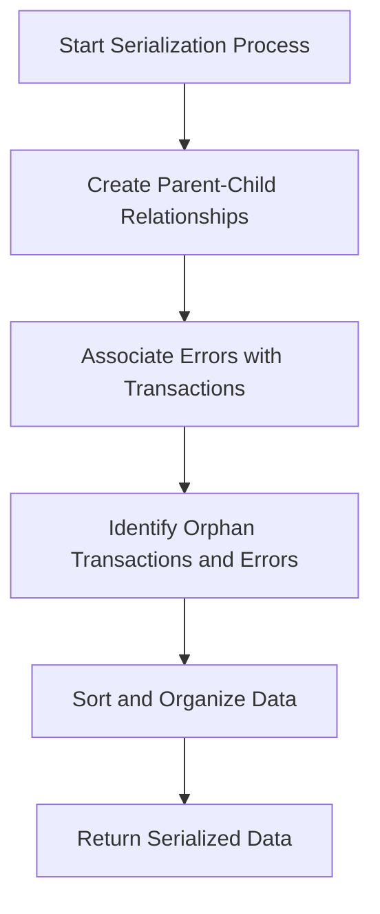

This document will cover the Serialization Process Overview, which includes:

1. Creating Parent-Child Relationships for Transactions
2. Associating Errors with Transactions
3. Identifying Orphan Transactions and Errors
4. Sorting and Organizing Data

Technical document: <SwmLink doc-title="Serialization Process Overview">[Serialization Process Overview](/.swm/serialization-process-overview.owsjb5k4.sw.md)</SwmLink>

# [Creating Parent-Child Relationships for Transactions](https://app.swimm.io/repos/Z2l0aHViJTNBJTNBc2VudHJ5LWRlbW8tMSUzQSUzQVN3aW1tLURlbW8=/docs/owsjb5k4#creating-parent-child-relationships)

The first step in the serialization process involves creating a map that links parent transactions to their child transactions. This is essential for understanding the hierarchy and flow of transactions within the system. By establishing these relationships, we can better track the sequence of events and identify any dependencies between transactions. This step ensures that all transactions are properly grouped and organized, which is crucial for accurate error tracking and performance monitoring.

# [Associating Errors with Transactions](https://app.swimm.io/repos/Z2l0aHViJTNBJTNBc2VudHJ5LWRlbW8tMSUzQSUzQVN3aW1tLURlbW8=/docs/owsjb5k4#associating-errors-with-transactions)

In this step, each error is associated with its respective transaction. This association is important because it helps in pinpointing the exact transaction where an error occurred. By linking errors to transactions, we can provide more detailed and actionable insights to the end user. This step ensures that errors are not just logged but are contextualized within the transaction flow, making it easier to diagnose and resolve issues.

# [Identifying Orphan Transactions and Errors](https://app.swimm.io/repos/Z2l0aHViJTNBJTNBc2VudHJ5LWRlbW8tMSUzQSUzQVN3aW1tLURlbW8=/docs/owsjb5k4#identifying-orphan-transactions-and-errors)

After establishing parent-child relationships and associating errors with transactions, the next step is to identify any orphan transactions and errors. Orphan transactions are those that do not have a parent transaction, and orphan errors are errors that are not associated with any transaction. Identifying these orphans is crucial because they may indicate incomplete or isolated events that need special attention. This step helps in ensuring that no transaction or error is left unaccounted for, providing a comprehensive view of the system's performance and issues.

# [Sorting and Organizing Data](https://app.swimm.io/repos/Z2l0aHViJTNBJTNBc2VudHJ5LWRlbW8tMSUzQSUzQVN3aW1tLURlbW8=/docs/owsjb5k4#sorting-and-organizing-data)

The final step in the serialization process involves sorting and organizing all the collected data into a consistent format. This step ensures that the data is easy to read and analyze. By organizing the data, we can provide a structured overview of transactions and errors, making it easier for end users to understand the system's performance and identify any issues. The organized data is then returned as a dictionary, which can be used for further analysis and reporting.

&nbsp;

*This is an auto-generated document by Swimm AI 🌊 and has not yet been verified by a human*

<SwmMeta version="3.0.0" repo-id="Z2l0aHViJTNBJTNBc2VudHJ5LWRlbW8tMSUzQSUzQVN3aW1tLURlbW8=" repo-name="sentry-demo-1" doc-type="product-flows">Powered by [Swimm](/)</SwmMeta>
