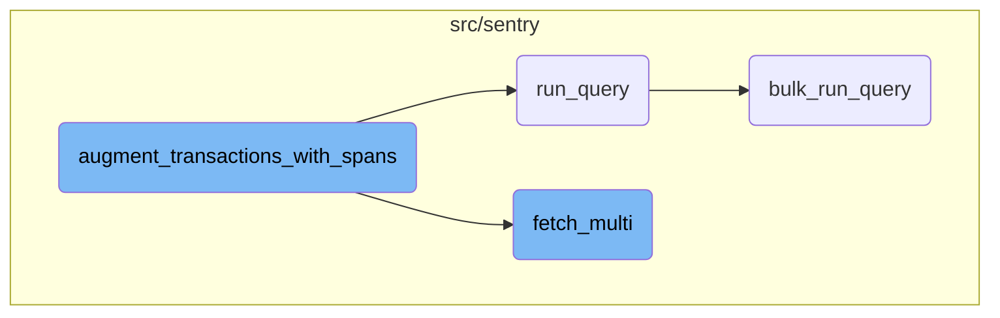

This document explains the process of serializing transactions and errors into a structured format. It covers the creation of parent-child relationships for transactions, associating errors with transactions, and identifying orphan transactions and errors.

The process starts by creating a map that links parent transactions to their child transactions. Then, it associates each error with its respective transaction. After that, it identifies any transactions or errors that don't have a parent. Finally, it sorts and organizes all this data into a consistent format and returns it as a dictionary.

Here is a high level diagram of the flow, showing only the most important functions:

```mermaid
graph TD;
      subgraph src/sentry
48aba4c04db2aef66e0b6103675bbe4ea421aac5da4655b46cad1db78beb2dc8(serialize_with_spans):::mainFlowStyle --> 1bf886269020d30f1bc7faf916b6ac987a5fcd21a0401b1f600dfce03c0bddf5(full_dict):::mainFlowStyle
end

subgraph src/sentry
1bf886269020d30f1bc7faf916b6ac987a5fcd21a0401b1f600dfce03c0bddf5(full_dict):::mainFlowStyle --> 3da7767b5222652e93f261724fdf130b96c0b8288cb4e36bbf4a3c9e5437aa42(get):::mainFlowStyle
end

subgraph src/sentry
3da7767b5222652e93f261724fdf130b96c0b8288cb4e36bbf4a3c9e5437aa42(get):::mainFlowStyle --> 4c7692519df09d4c46be59f648713ad5a41348c97bd3917a4c1e5f5b0ef9f13c(create_transaction_params)
end

subgraph src/sentry
3da7767b5222652e93f261724fdf130b96c0b8288cb4e36bbf4a3c9e5437aa42(get):::mainFlowStyle --> a6eada0bdf28a3123cbd3ae32fc333c6da9d7cbe7dd4799e0de128983768aca5(augment_transactions_with_spans):::mainFlowStyle
end

subgraph src/sentry
a6eada0bdf28a3123cbd3ae32fc333c6da9d7cbe7dd4799e0de128983768aca5(augment_transactions_with_spans):::mainFlowStyle --> 0855223e36ac882841bbf2e0ef2fb632f98281c9458dac000c15db12ffb5feef(run_query)
end

subgraph src/sentry
a6eada0bdf28a3123cbd3ae32fc333c6da9d7cbe7dd4799e0de128983768aca5(augment_transactions_with_spans):::mainFlowStyle --> 5463d9c7f22de30a02d48b89affe8e15db78e49c3e6f1f4071aaaf84e7553f50(fetch_multi):::mainFlowStyle
end


      classDef mainFlowStyle color:#000000,fill:#7CB9F4
classDef rootsStyle color:#000000,fill:#00FFF4
classDef Style1 color:#000000,fill:#00FFAA
classDef Style2 color:#000000,fill:#FFFF00
classDef Style3 color:#000000,fill:#AA7CB9

%% Swimm:
%% graph TD;
%%       subgraph <SwmPath>[src/sentry/](src/sentry/)</SwmPath>
%% 48aba4c04db2aef66e0b6103675bbe4ea421aac5da4655b46cad1db78beb2dc8(serialize_with_spans):::mainFlowStyle --> 1bf886269020d30f1bc7faf916b6ac987a5fcd21a0401b1f600dfce03c0bddf5(full_dict):::mainFlowStyle
%% end
%% 
%% subgraph <SwmPath>[src/sentry/](src/sentry/)</SwmPath>
%% 1bf886269020d30f1bc7faf916b6ac987a5fcd21a0401b1f600dfce03c0bddf5(full_dict):::mainFlowStyle --> 3da7767b5222652e93f261724fdf130b96c0b8288cb4e36bbf4a3c9e5437aa42(get):::mainFlowStyle
%% end
%% 
%% subgraph <SwmPath>[src/sentry/](src/sentry/)</SwmPath>
%% 3da7767b5222652e93f261724fdf130b96c0b8288cb4e36bbf4a3c9e5437aa42(get):::mainFlowStyle --> 4c7692519df09d4c46be59f648713ad5a41348c97bd3917a4c1e5f5b0ef9f13c(create_transaction_params)
%% end
%% 
%% subgraph <SwmPath>[src/sentry/](src/sentry/)</SwmPath>
%% 3da7767b5222652e93f261724fdf130b96c0b8288cb4e36bbf4a3c9e5437aa42(get):::mainFlowStyle --> a6eada0bdf28a3123cbd3ae32fc333c6da9d7cbe7dd4799e0de128983768aca5(augment_transactions_with_spans):::mainFlowStyle
%% end
%% 
%% subgraph <SwmPath>[src/sentry/](src/sentry/)</SwmPath>
%% a6eada0bdf28a3123cbd3ae32fc333c6da9d7cbe7dd4799e0de128983768aca5(augment_transactions_with_spans):::mainFlowStyle --> 0855223e36ac882841bbf2e0ef2fb632f98281c9458dac000c15db12ffb5feef(run_query)
%% end
%% 
%% subgraph <SwmPath>[src/sentry/](src/sentry/)</SwmPath>
%% a6eada0bdf28a3123cbd3ae32fc333c6da9d7cbe7dd4799e0de128983768aca5(augment_transactions_with_spans):::mainFlowStyle --> 5463d9c7f22de30a02d48b89affe8e15db78e49c3e6f1f4071aaaf84e7553f50(fetch_multi):::mainFlowStyle
%% end
%% 
%% 
%%       classDef mainFlowStyle color:#000000,fill:#7CB9F4
%% classDef rootsStyle color:#000000,fill:#00FFF4
%% classDef Style1 color:#000000,fill:#00FFAA
%% classDef Style2 color:#000000,fill:#FFFF00
%% classDef Style3 color:#000000,fill:#AA7CB9
```



# Flow drill down

First, we'll zoom into this section of the flow:

```mermaid
graph TD;
      subgraph src/sentry
48aba4c04db2aef66e0b6103675bbe4ea421aac5da4655b46cad1db78beb2dc8(serialize_with_spans):::mainFlowStyle --> 1bf886269020d30f1bc7faf916b6ac987a5fcd21a0401b1f600dfce03c0bddf5(full_dict):::mainFlowStyle
end

subgraph src/sentry
1bf886269020d30f1bc7faf916b6ac987a5fcd21a0401b1f600dfce03c0bddf5(full_dict):::mainFlowStyle --> 3da7767b5222652e93f261724fdf130b96c0b8288cb4e36bbf4a3c9e5437aa42(get):::mainFlowStyle
end

subgraph src/sentry
3da7767b5222652e93f261724fdf130b96c0b8288cb4e36bbf4a3c9e5437aa42(get):::mainFlowStyle --> 4c7692519df09d4c46be59f648713ad5a41348c97bd3917a4c1e5f5b0ef9f13c(create_transaction_params)
end

subgraph src/sentry
3da7767b5222652e93f261724fdf130b96c0b8288cb4e36bbf4a3c9e5437aa42(get):::mainFlowStyle --> a6eada0bdf28a3123cbd3ae32fc333c6da9d7cbe7dd4799e0de128983768aca5(augment_transactions_with_spans):::mainFlowStyle
end

subgraph src/sentry
a6eada0bdf28a3123cbd3ae32fc333c6da9d7cbe7dd4799e0de128983768aca5(augment_transactions_with_spans):::mainFlowStyle --> ozf8j(...)
end

subgraph src/sentry
4c7692519df09d4c46be59f648713ad5a41348c97bd3917a4c1e5f5b0ef9f13c(create_transaction_params) --> 0855223e36ac882841bbf2e0ef2fb632f98281c9458dac000c15db12ffb5feef(run_query)
end

subgraph src/sentry
0855223e36ac882841bbf2e0ef2fb632f98281c9458dac000c15db12ffb5feef(run_query) --> bf51ad13267b0a966b2f78892bc9022bf6d0ea51971125b7eca85fe6a433e525(bulk_run_query)
end


      classDef mainFlowStyle color:#000000,fill:#7CB9F4
classDef rootsStyle color:#000000,fill:#00FFF4
classDef Style1 color:#000000,fill:#00FFAA
classDef Style2 color:#000000,fill:#FFFF00
classDef Style3 color:#000000,fill:#AA7CB9

%% Swimm:
%% graph TD;
%%       subgraph <SwmPath>[src/sentry/](src/sentry/)</SwmPath>
%% 48aba4c04db2aef66e0b6103675bbe4ea421aac5da4655b46cad1db78beb2dc8(serialize_with_spans):::mainFlowStyle --> 1bf886269020d30f1bc7faf916b6ac987a5fcd21a0401b1f600dfce03c0bddf5(full_dict):::mainFlowStyle
%% end
%% 
%% subgraph <SwmPath>[src/sentry/](src/sentry/)</SwmPath>
%% 1bf886269020d30f1bc7faf916b6ac987a5fcd21a0401b1f600dfce03c0bddf5(full_dict):::mainFlowStyle --> 3da7767b5222652e93f261724fdf130b96c0b8288cb4e36bbf4a3c9e5437aa42(get):::mainFlowStyle
%% end
%% 
%% subgraph <SwmPath>[src/sentry/](src/sentry/)</SwmPath>
%% 3da7767b5222652e93f261724fdf130b96c0b8288cb4e36bbf4a3c9e5437aa42(get):::mainFlowStyle --> 4c7692519df09d4c46be59f648713ad5a41348c97bd3917a4c1e5f5b0ef9f13c(create_transaction_params)
%% end
%% 
%% subgraph <SwmPath>[src/sentry/](src/sentry/)</SwmPath>
%% 3da7767b5222652e93f261724fdf130b96c0b8288cb4e36bbf4a3c9e5437aa42(get):::mainFlowStyle --> a6eada0bdf28a3123cbd3ae32fc333c6da9d7cbe7dd4799e0de128983768aca5(augment_transactions_with_spans):::mainFlowStyle
%% end
%% 
%% subgraph <SwmPath>[src/sentry/](src/sentry/)</SwmPath>
%% a6eada0bdf28a3123cbd3ae32fc333c6da9d7cbe7dd4799e0de128983768aca5(augment_transactions_with_spans):::mainFlowStyle --> ozf8j(...)
%% end
%% 
%% subgraph <SwmPath>[src/sentry/](src/sentry/)</SwmPath>
%% 4c7692519df09d4c46be59f648713ad5a41348c97bd3917a4c1e5f5b0ef9f13c(create_transaction_params) --> 0855223e36ac882841bbf2e0ef2fb632f98281c9458dac000c15db12ffb5feef(run_query)
%% end
%% 
%% subgraph <SwmPath>[src/sentry/](src/sentry/)</SwmPath>
%% 0855223e36ac882841bbf2e0ef2fb632f98281c9458dac000c15db12ffb5feef(run_query) --> bf51ad13267b0a966b2f78892bc9022bf6d0ea51971125b7eca85fe6a433e525(bulk_run_query)
%% end
%% 
%% 
%%       classDef mainFlowStyle color:#000000,fill:#7CB9F4
%% classDef rootsStyle color:#000000,fill:#00FFF4
%% classDef Style1 color:#000000,fill:#00FFAA
%% classDef Style2 color:#000000,fill:#FFFF00
%% classDef Style3 color:#000000,fill:#AA7CB9
```



<SwmSnippet path="/src/sentry/api/endpoints/organization_events_trace.py" line="1598">

---

## <SwmToken path="src/sentry/api/endpoints/organization_events_trace.py" pos="1598:3:3" line-data="    def serialize_with_spans(">`serialize_with_spans`</SwmToken>

The function <SwmToken path="src/sentry/api/endpoints/organization_events_trace.py" pos="1598:3:3" line-data="    def serialize_with_spans(">`serialize_with_spans`</SwmToken> is responsible for serializing transactions and errors into a structured format. It creates a parent-child relationship map for transactions, associates errors with their respective transactions, and identifies orphan transactions and errors. The function ensures that the serialized data is sorted and consistent, and it returns a dictionary containing the serialized transactions and orphan errors.

```python
    def serialize_with_spans(
        self,
        limit: int,
        transactions: Sequence[SnubaTransaction],
        errors: Sequence[SnubaError],
        roots: Sequence[SnubaTransaction],
        warning_extra: dict[str, str],
        event_id: str | None,
        detailed: bool = False,
        query_source: QuerySource | None = None,
    ) -> SerializedTrace:
        root_traces: list[TraceEvent] = []
        orphans: list[TraceEvent] = []
        orphan_event_ids: set[str] = set()
        orphan_errors: list[SnubaError] = []
        if detailed:
            raise ParseError("Cannot return a detailed response using Spans")

        with sentry_sdk.start_span(op="serialize", description="create parent map"):
            parent_to_children_event_map = defaultdict(list)
            serialized_transactions: list[TraceEvent] = []
```

---

</SwmSnippet>

<SwmSnippet path="/src/sentry/api/endpoints/organization_events_trace.py" line="398">

---

## <SwmToken path="src/sentry/api/endpoints/organization_events_trace.py" pos="398:3:3" line-data="    def full_dict(">`full_dict`</SwmToken>

The function <SwmToken path="src/sentry/api/endpoints/organization_events_trace.py" pos="398:3:3" line-data="    def full_dict(">`full_dict`</SwmToken> converts a transaction event into a dictionary format, including detailed information if required. It handles various attributes like timestamps, status, and measurements, and recursively includes child transactions. This function is crucial for generating a comprehensive view of a transaction and its related data.

```python
    def full_dict(
        self, detailed: bool = False, visited: set[str] | None = None
    ) -> FullResponse | None:
        if visited is None:
            visited = set()
        event_id = self.event["id"]
        # We're in a loop!
        if event_id in visited:
            return None
        else:
            visited.add(self.event["id"])
        result = cast(FullResponse, self.to_dict())
        if detailed and "transaction.status" in self.event:
            result.update(
                {
                    "transaction.status": SPAN_STATUS_CODE_TO_NAME.get(
                        self.event["transaction.status"], "unknown"
                    ),
                }
            )
        if self.span_serialized:
```

---

</SwmSnippet>

<SwmSnippet path="/src/sentry/api/endpoints/organization_events_trace.py" line="1045">

---

## get

The function <SwmToken path="src/sentry/api/endpoints/organization_events_trace.py" pos="1045:3:3" line-data="    def get(self, request: Request, organization: Organization, trace_id: str) -&gt; HttpResponse:">`get`</SwmToken> handles HTTP GET requests to retrieve trace data for a specific trace ID. It validates the request, sets query parameters, and fetches transaction and error data. Depending on the request parameters, it may augment transactions with span data. The function then serializes the data and returns it as an HTTP response.

```python
    def get(self, request: Request, organization: Organization, trace_id: str) -> HttpResponse:
        if not self.has_feature(organization, request):
            return Response(status=404)

        try:
            # The trace view isn't useful without global views, so skipping the check here
            snuba_params = self.get_snuba_params(request, organization, check_global_views=False)
        except NoProjects:
            return Response(status=404)

        # Detailed is deprecated now that we want to use spans instead
        detailed = request.GET.get("detailed", "0") == "1"
        # Temporary url params until we finish migrating the frontend
        use_spans = request.GET.get("useSpans", "0") == "1"
        update_snuba_params_with_timestamp(request, snuba_params)

        sentry_sdk.set_tag("trace_view.using_spans", str(use_spans))
        if detailed and use_spans:
            raise ParseError("Cannot return a detailed response while using spans")
        limit = min(int(request.GET.get("limit", MAX_TRACE_SIZE)), 10_000)
        event_id = request.GET.get("event_id") or request.GET.get("eventId")
```

---

</SwmSnippet>

<SwmSnippet path="/src/sentry/api/endpoints/organization_events_trace.py" line="528">

---

### Creating Transaction Parameters

The function <SwmToken path="src/sentry/api/endpoints/organization_events_trace.py" pos="528:2:2" line-data="def create_transaction_params(">`create_transaction_params`</SwmToken> generates parameters for querying transaction data based on the trace ID and other Snuba parameters. It adjusts the query time range and projects based on metadata, ensuring that the query captures the relevant data for the trace.

```python
def create_transaction_params(
    trace_id: str,
    snuba_params: SnubaParams,
    query_source: QuerySource | None = QuerySource.SENTRY_BACKEND,
) -> SnubaParams:
    """Can't use the transaction params for errors since traces can be errors only"""
    query_metadata = options.get("performance.traces.query_timestamp_projects")
    sentry_sdk.set_tag("trace_view.queried_timestamp_projects", query_metadata)
    if not query_metadata:
        return snuba_params

    metadata_query = DiscoverQueryBuilder(
        Dataset.Discover,
        params={},
        snuba_params=snuba_params,
        query=f"trace:{trace_id}",
        selected_columns=[
            "min(timestamp)",
            "max(timestamp)",
            "project.id",
        ],
```

---

</SwmSnippet>

<SwmSnippet path="/src/sentry/snuba/metrics_layer/query.py" line="143">

---

### Running a Query

The function <SwmToken path="src/sentry/snuba/metrics_layer/query.py" pos="143:2:2" line-data="def run_query(request: Request) -&gt; Mapping[str, Any]:">`run_query`</SwmToken> serves as the entry point for executing a single metrics query in Snuba. It delegates the actual query execution to the <SwmToken path="src/sentry/snuba/metrics_layer/query.py" pos="147:3:3" line-data="    return bulk_run_query([request])[0]">`bulk_run_query`</SwmToken> function.

```python
def run_query(request: Request) -> Mapping[str, Any]:
    """
    Entrypoint for executing a metrics query in Snuba.
    """
    return bulk_run_query([request])[0]
```

---

</SwmSnippet>

<SwmSnippet path="/src/sentry/snuba/metrics_layer/query.py" line="81">

---

### Bulk Running Queries

The function <SwmToken path="src/sentry/snuba/metrics_layer/query.py" pos="81:2:2" line-data="def bulk_run_query(requests: list[Request]) -&gt; list[Mapping[str, Any]]:">`bulk_run_query`</SwmToken> executes multiple metrics queries in a single request to Snuba. It prepares the queries, resolves metrics, and processes the results. This function is essential for efficiently handling multiple queries and returning the aggregated results.

```python
def bulk_run_query(requests: list[Request]) -> list[Mapping[str, Any]]:
    """
    Entrypoint for executing a list of metrics queries in Snuba.

    This function is used to execute multiple metrics queries in a single request.
    """
    if not requests:
        return []

    queries = []
    for request in requests:
        request, start, end = _setup_metrics_query(request)
        queries.append([request, start, end])

    logging_tags = {"referrer": request.tenant_ids["referrer"] or "unknown", "lang": "mql"}

    for q in queries:
        q[0], reverse_mappings, mappings = _resolve_metrics_query(q[0], logging_tags)
        q.extend([reverse_mappings, mappings])

    try:
```

---

</SwmSnippet>

Now, lets zoom into this section of the flow:



<SwmSnippet path="/src/sentry/api/endpoints/organization_events_trace.py" line="793">

---

## Augmenting Transactions with Spans

The function <SwmToken path="src/sentry/api/endpoints/organization_events_trace.py" pos="785:2:2" line-data="def augment_transactions_with_spans(">`augment_transactions_with_spans`</SwmToken> augments a list of transactions with parent, error, and problem data. It starts by initializing various sets and maps to store span <SwmToken path="src/sentry/api/endpoints/organization_events_trace.py" pos="794:15:15" line-data="        trace_parent_spans = set()  # parent span ids of segment spans">`ids`</SwmToken>, transaction problems, and projects. It then iterates over the provided errors to pad span <SwmToken path="src/sentry/api/endpoints/organization_events_trace.py" pos="794:15:15" line-data="        trace_parent_spans = set()  # parent span ids of segment spans">`ids`</SwmToken> and add them to the error spans set. Timestamp parameters are adjusted based on the transactions, and spans are fetched in chunks to avoid exceeding query size limits. The function then links transactions with their parent spans, performance issues, and errors, enriching the transaction data with additional context.

```python
    with sentry_sdk.start_span(op="augment.transactions", description="setup"):
        trace_parent_spans = set()  # parent span ids of segment spans
        transaction_problem_map: dict[str, SnubaTransaction] = {}
        problem_project_map: dict[int, list[str]] = {}
        issue_occurrences = []
        occurrence_spans: set[str] = set()
        error_spans = set()
        projects = set()
        for error in errors:
            if "trace.span" in error:
                error["trace.span"] = pad_span_id(error["trace.span"])
                error_spans.add(error["trace.span"])
            projects.add(error["project.id"])
        ts_params = find_timestamp_params(transactions)
        time_buffer = options.get("performance.traces.span_query_timebuffer_hours")
        sentry_sdk.set_measurement("trace_view.spans.time_buffer", time_buffer)
        if ts_params["min"]:
            params.start = ts_params["min"] - timedelta(hours=time_buffer)
        if ts_params["max"]:
            params.end = ts_params["max"] + timedelta(hours=time_buffer)

```

---

</SwmSnippet>

<SwmSnippet path="/src/sentry/issues/issue_occurrence.py" line="207">

---

### Fetching Multiple Issue Occurrences

The function <SwmToken path="src/sentry/issues/issue_occurrence.py" pos="207:3:3" line-data="    def fetch_multi(cls, ids: Sequence[str], project_id: int) -&gt; list[IssueOccurrence | None]:">`fetch_multi`</SwmToken> retrieves multiple issue occurrences based on their <SwmToken path="src/sentry/issues/issue_occurrence.py" pos="207:8:8" line-data="    def fetch_multi(cls, ids: Sequence[str], project_id: int) -&gt; list[IssueOccurrence | None]:">`ids`</SwmToken> and project ID. It builds storage identifiers for each ID and fetches the corresponding data from the nodestore backend. The results are then converted into <SwmToken path="src/sentry/issues/issue_occurrence.py" pos="207:27:27" line-data="    def fetch_multi(cls, ids: Sequence[str], project_id: int) -&gt; list[IssueOccurrence | None]:">`IssueOccurrence`</SwmToken> objects and returned as a list. This function is used within <SwmToken path="src/sentry/api/endpoints/organization_events_trace.py" pos="785:2:2" line-data="def augment_transactions_with_spans(">`augment_transactions_with_spans`</SwmToken> to fetch occurrence data for transactions.

```python
    def fetch_multi(cls, ids: Sequence[str], project_id: int) -> list[IssueOccurrence | None]:
        ids = [cls.build_storage_identifier(id, project_id) for id in ids]
        results = nodestore.backend.get_multi(ids)
        ret: list[IssueOccurrence | None] = []
        for _id in ids:
            result = results.get(_id)
            if result:
                ret.append(IssueOccurrence.from_dict(result))
            else:
                ret.append(None)
        return ret
```

---

</SwmSnippet>

&nbsp;

*This is an auto-generated document by Swimm AI 🌊 and has not yet been verified by a human*

<SwmMeta version="3.0.0" repo-id="Z2l0aHViJTNBJTNBc2VudHJ5LWRlbW8tMSUzQSUzQVN3aW1tLURlbW8=" repo-name="sentry-demo-1" doc-type="flows"><sup>Powered by [Swimm](/)</sup></SwmMeta>
