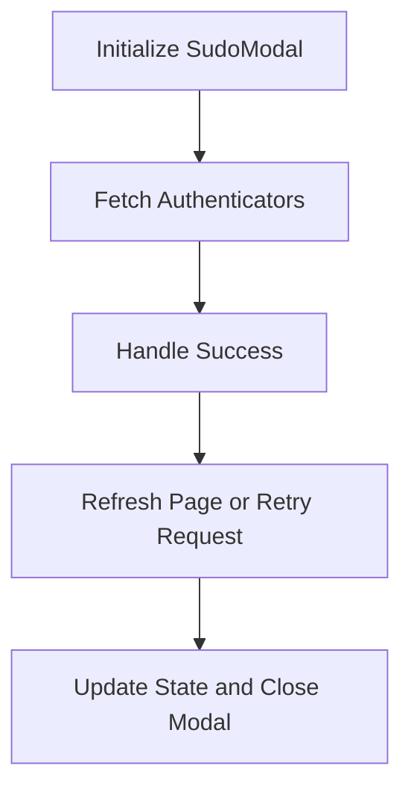

This document will cover the SudoModal Component Overview, which includes:

1. Initializing the SudoModal Component
2. Fetching Authenticators
3. Handling Success Scenarios

Technical document: <SwmLink doc-title="SudoModal Component Overview">[SudoModal Component Overview](/.swm/sudomodal-component-overview.5p4rwl88.sw.md)</SwmLink>

# [Initializing the SudoModal Component](https://app.swimm.io/repos/Z2l0aHViJTNBJTNBc2VudHJ5LWRlbW8tMSUzQSUzQVN3aW1tLURlbW8=/docs/5p4rwl88#sudomodal)

The SudoModal component is responsible for handling user authentication and authorization within the application. It initializes with necessary hooks and state variables. This setup includes configuring the router, API, and various state variables such as authenticators, error flags, and loading states. This initialization ensures that the component is ready to manage user authentication processes effectively.

# [Fetching Authenticators](https://app.swimm.io/repos/Z2l0aHViJTNBJTNBc2VudHJ5LWRlbW8tMSUzQSUzQVN3aW1tLURlbW8=/docs/5p4rwl88#getauthenticators)

Fetching authenticators is a critical step in the SudoModal component. This process involves waiting for all preload requests to settle, ensuring that all necessary data is loaded before fetching the authenticators. The authenticators are then fetched from the API endpoint <SwmPath>[src/sentry/auth/authenticators/](src/sentry/auth/authenticators/)</SwmPath>. Once fetched, the authenticators are stored in the state, and the loading state is updated. This step ensures that the user is properly authenticated before proceeding with any actions.

# [Handling Success Scenarios](https://app.swimm.io/repos/Z2l0aHViJTNBJTNBc2VudHJ5LWRlbW8tMSUzQSUzQVN3aW1tLURlbW8=/docs/5p4rwl88#handlesuccess)

The handleSuccess function manages the success flow after a user action. If the user is a superuser, the current page is refreshed. If a retry request is needed, the retryRequest function is called, and the state is updated to show access forms before closing the modal. This ensures that the user experience is seamless and that any necessary actions are retried or the page is refreshed to reflect the latest state.

&nbsp;

*This is an auto-generated document by Swimm AI 🌊 and has not yet been verified by a human*

<SwmMeta version="3.0.0" repo-id="Z2l0aHViJTNBJTNBc2VudHJ5LWRlbW8tMSUzQSUzQVN3aW1tLURlbW8=" repo-name="sentry-demo-1" doc-type="product-flows">Powered by [Swimm](/)</SwmMeta>
