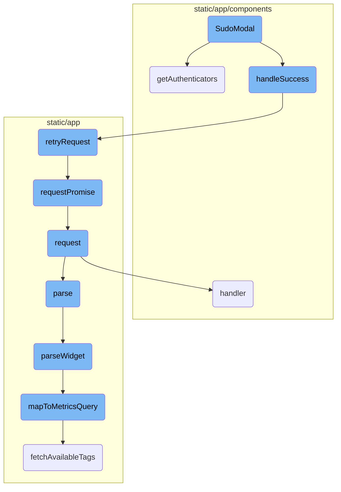
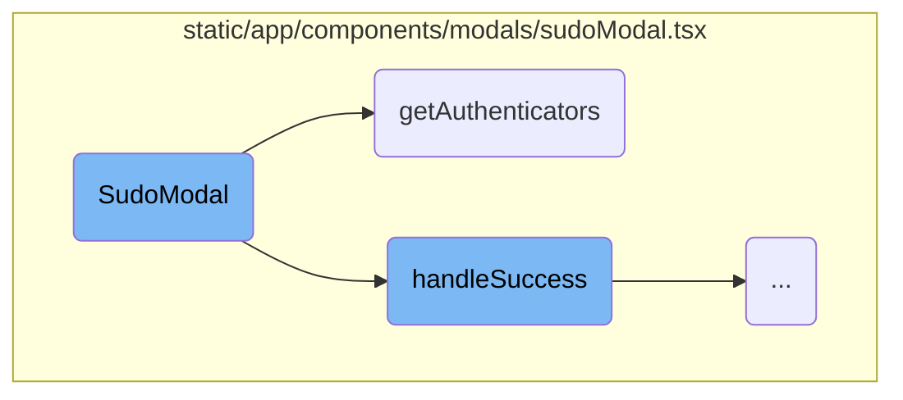
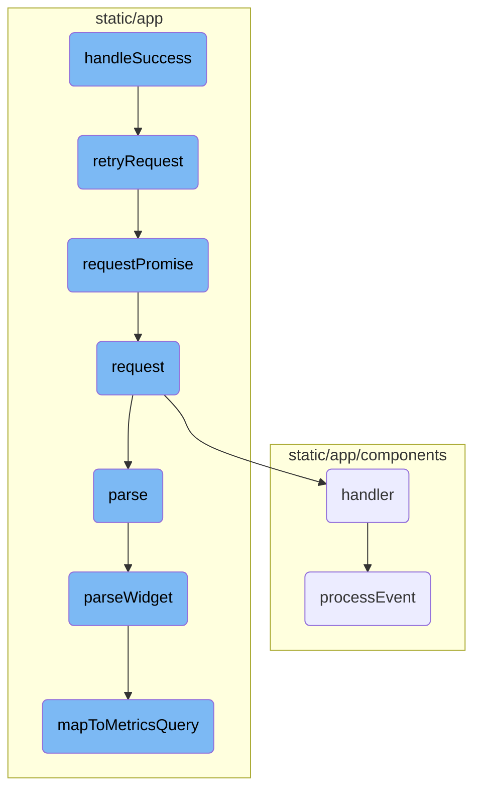

In this document, we will explain the purpose and functionality of the <SwmToken path="static/app/components/modals/sudoModal.tsx" pos="55:2:2" line-data="function SudoModal({">`SudoModal`</SwmToken> component. This component is responsible for handling user authentication and authorization within the application. It initializes with necessary hooks and state variables, fetches authenticators, and manages the success flow after user actions.

The <SwmToken path="static/app/components/modals/sudoModal.tsx" pos="55:2:2" line-data="function SudoModal({">`SudoModal`</SwmToken> component is a part of the user authentication process. It starts by setting up necessary hooks and state variables. Then, it fetches authenticators from the API to ensure the user is properly authenticated. If the user action is successful, it either refreshes the page or retries the request, updating the state and closing the modal accordingly.

Here is a high level diagram of the flow, showing only the most important functions:



# Flow drill down

First, we'll zoom into this section of the flow:



<SwmSnippet path="/static/app/components/modals/sudoModal.tsx" line="55">

---

## <SwmToken path="static/app/components/modals/sudoModal.tsx" pos="55:2:2" line-data="function SudoModal({">`SudoModal`</SwmToken>

The <SwmToken path="static/app/components/modals/sudoModal.tsx" pos="55:2:2" line-data="function SudoModal({">`SudoModal`</SwmToken> function initializes the modal with necessary hooks and state. It sets up the router, API, and state variables, including <SwmToken path="static/app/components/modals/sudoModal.tsx" pos="67:1:1" line-data="    authenticators: [] as Authenticator[],">`authenticators`</SwmToken>, <SwmToken path="static/app/components/modals/sudoModal.tsx" pos="68:1:1" line-data="    error: false,">`error`</SwmToken>, <SwmToken path="static/app/components/modals/sudoModal.tsx" pos="69:1:1" line-data="    errorType: &#39;&#39;,">`errorType`</SwmToken>, <SwmToken path="static/app/components/modals/sudoModal.tsx" pos="70:1:1" line-data="    showAccessForms: true,">`showAccessForms`</SwmToken>, <SwmToken path="static/app/components/modals/sudoModal.tsx" pos="71:1:1" line-data="    superuserAccessCategory: &#39;&#39;,">`superuserAccessCategory`</SwmToken>, and <SwmToken path="static/app/components/modals/sudoModal.tsx" pos="72:1:1" line-data="    superuserReason: &#39;&#39;,">`superuserReason`</SwmToken>.

```tsx
function SudoModal({
  closeModal,
  isSuperuser,
  needsReload,
  retryRequest,
  Header,
  Body,
  closeButton,
}: Props) {
  const router = useRouter();
  const api = useApi();
  const [state, setState] = useState<State>({
    authenticators: [] as Authenticator[],
    error: false,
    errorType: '',
    showAccessForms: true,
    superuserAccessCategory: '',
    superuserReason: '',
    isLoading: true,
  });

```

---

</SwmSnippet>

<SwmSnippet path="/static/app/components/modals/sudoModal.tsx" line="89">

---

## <SwmToken path="static/app/components/modals/sudoModal.tsx" pos="89:3:3" line-data="    const getAuthenticators = async () =&gt; {">`getAuthenticators`</SwmToken>

The <SwmToken path="static/app/components/modals/sudoModal.tsx" pos="89:3:3" line-data="    const getAuthenticators = async () =&gt; {">`getAuthenticators`</SwmToken> function is responsible for fetching the authenticators. It first waits for all preload requests to settle, then fetches the authenticators from the API. The fetched authenticators are then stored in the state.

```tsx
    const getAuthenticators = async () => {
      try {
        // Await all preload requests
        await Promise.allSettled([
          organizationPromise,
          ...Object.values(window.__sentry_preload),
        ]);
      } catch {
        // ignore errors
      }

      // Fetch authenticators after preload requests to avoid overwriting session cookie
      try {
        const fetchedAuthenticators = await api.requestPromise('/authenticators/');
        setState(prevState => ({
          ...prevState,
          authenticators: fetchedAuthenticators ?? [],
          isLoading: false,
        }));
      } catch {
        setState(prevState => ({
```

---

</SwmSnippet>

<SwmSnippet path="/static/app/components/modals/sudoModal.tsx" line="91">

---

### Handling preload requests

The function waits for all preload requests to settle using <SwmToken path="static/app/components/modals/sudoModal.tsx" pos="92:3:5" line-data="        await Promise.allSettled([">`Promise.allSettled`</SwmToken>. This ensures that all necessary data is loaded before fetching the authenticators.

```tsx
        // Await all preload requests
        await Promise.allSettled([
          organizationPromise,
          ...Object.values(window.__sentry_preload),
        ]);
```

---

</SwmSnippet>

<SwmSnippet path="/static/app/components/modals/sudoModal.tsx" line="102">

---

### Fetching authenticators

After the preload requests, the function fetches the authenticators from the API endpoint <SwmPath>[src/sentry/auth/authenticators/](src/sentry/auth/authenticators/)</SwmPath>. The fetched data is then stored in the state, and the loading state is updated.

```tsx
        const fetchedAuthenticators = await api.requestPromise('/authenticators/');
        setState(prevState => ({
          ...prevState,
          authenticators: fetchedAuthenticators ?? [],
          isLoading: false,
        }));
```

---

</SwmSnippet>

Now, lets zoom into this section of the flow:



<SwmSnippet path="/static/app/components/modals/sudoModal.tsx" line="157">

---

## <SwmToken path="static/app/components/modals/sudoModal.tsx" pos="149:1:1" line-data="        handleSuccess();">`handleSuccess`</SwmToken>

The <SwmToken path="static/app/components/modals/sudoModal.tsx" pos="149:1:1" line-data="        handleSuccess();">`handleSuccess`</SwmToken> function is responsible for handling the success scenario after a user action. If the user is a superuser, it refreshes the current page. If a retry request is needed, it calls the <SwmToken path="static/app/components/modals/sudoModal.tsx" pos="165:5:5" line-data="    if (!retryRequest) {">`retryRequest`</SwmToken> function and updates the state to show access forms before closing the modal.

```tsx
    if (isSuperuser) {
      router.replace({pathname: location.pathname, state: {forceUpdate: new Date()}});
      if (needsReload) {
        window.location.reload();
      }
      return;
    }

    if (!retryRequest) {
      closeModal();
      return;
    }

    retryRequest().then(() => {
      setState(prevState => ({...prevState, showAccessForms: true}));
      closeModal();
    });
  };
```

---

</SwmSnippet>

<SwmSnippet path="/static/app/api.tsx" line="391">

---

### <SwmToken path="static/app/api.tsx" pos="391:1:1" line-data="        retryRequest: async () =&gt; {">`retryRequest`</SwmToken>

The <SwmToken path="static/app/api.tsx" pos="391:1:1" line-data="        retryRequest: async () =&gt; {">`retryRequest`</SwmToken> function attempts to retry a failed request. It uses the <SwmToken path="static/app/api.tsx" pos="393:11:11" line-data="            const data = await this.requestPromise(path, requestOptions);">`requestPromise`</SwmToken> function to make the request and handles the success or error callbacks accordingly.

```tsx
        retryRequest: async () => {
          try {
            const data = await this.requestPromise(path, requestOptions);
            requestOptions.success?.(data);
            didSuccessfullyRetry = true;
          } catch (err) {
            requestOptions.error?.(err);
          }
        },
```

---

</SwmSnippet>

<SwmSnippet path="/static/app/api.tsx" line="656">

---

### <SwmToken path="static/app/api.tsx" pos="656:1:1" line-data="  requestPromise&lt;IncludeAllArgsType extends boolean&gt;(">`requestPromise`</SwmToken>

The <SwmToken path="static/app/api.tsx" pos="656:1:1" line-data="  requestPromise&lt;IncludeAllArgsType extends boolean&gt;(">`requestPromise`</SwmToken> function creates a promise for an API request. It handles the success and error scenarios by resolving or rejecting the promise based on the response.

```tsx
  requestPromise<IncludeAllArgsType extends boolean>(
    path: string,
    {
      includeAllArgs,
      ...options
    }: {includeAllArgs?: IncludeAllArgsType} & Readonly<RequestOptions> = {}
  ): Promise<IncludeAllArgsType extends true ? ApiResult : any> {
    // Create an error object here before we make any async calls so that we
    // have a helpful stack trace if it errors
    //
    // This *should* get logged to Sentry only if the promise rejection is not handled
    // (since SDK captures unhandled rejections). Ideally we explicitly ignore rejection
    // or handle with a user friendly error message
    const preservedError = new Error('API Request Error');

    return new Promise((resolve, reject) =>
      this.request(path, {
        ...options,
        preservedError,
        success: (data, textStatus, resp) => {
          if (includeAllArgs) {
```

---

</SwmSnippet>

<SwmSnippet path="/static/app/api.tsx" line="420">

---

### request

The <SwmToken path="static/app/api.tsx" pos="420:1:1" line-data="  request(path: string, options: Readonly&lt;RequestOptions&gt; = {}): Request {">`request`</SwmToken> function is a low-level function that constructs and sends an API request. It handles various aspects like building the URL, setting headers, and processing the response.

```tsx
  request(path: string, options: Readonly<RequestOptions> = {}): Request {
    const method = options.method || (options.data ? 'POST' : 'GET');

    let fullUrl = buildRequestUrl(this.baseUrl, path, options);

    let data = options.data;

    if (data !== undefined && method !== 'GET' && !(data instanceof FormData)) {
      data = JSON.stringify(data);
    }

    // TODO(epurkhiser): Mimicking the old jQuery API, data could be a string /
    // object for GET requests. jQuery just sticks it onto the URL as query
    // parameters
    if (method === 'GET' && data) {
      const queryString = typeof data === 'string' ? data : qs.stringify(data);

      if (queryString.length > 0) {
        fullUrl = fullUrl + (fullUrl.includes('?') ? '&' : '?') + queryString;
      }
    }
```

---

</SwmSnippet>

<SwmSnippet path="/static/app/components/replays/canvasReplayerPlugin.tsx" line="304">

---

### handler

The <SwmToken path="static/app/components/replays/canvasReplayerPlugin.tsx" pos="304:1:1" line-data="    handler: (e: eventWithTime, isSync: boolean, {replayer}: {replayer: Replayer}) =&gt; {">`handler`</SwmToken> function processes canvas mutation events. It differentiates between synchronous and asynchronous events and handles them accordingly.

```tsx
    handler: (e: eventWithTime, isSync: boolean, {replayer}: {replayer: Replayer}) => {
      const isCanvas = isCanvasMutationEvent(e);

      // isSync = true means it is fast forwarding vs playing
      // nothing to do when fast forwarding since canvas mutations for us are
      // image snapshots and do not depend on past events
      if (isSync) {
        // Set this to -1 to indicate that we will need to search
        // `canvasMutationEvents` for starting point of preloading
        //
        // Only do this when isSync is true, meaning there was a seek, since we
        // don't know where next index is
        nextPreloadIndex = -1;

        if (isCanvas) {
          processEventSync(e, {replayer});
        }

        prune(e);
        return;
      }
```

---

</SwmSnippet>

<SwmSnippet path="/static/app/utils/metrics/dashboardImport.tsx" line="139">

---

### parse

The <SwmToken path="static/app/utils/metrics/dashboardImport.tsx" pos="139:5:5" line-data="  public async parse() {">`parse`</SwmToken> function parses the imported widget and validates its type. It then calls <SwmToken path="static/app/utils/metrics/dashboardImport.tsx" pos="149:11:11" line-data="      const widget = await this.parseWidget();">`parseWidget`</SwmToken> to further process the widget.

```tsx
  public async parse() {
    const {
      id,
      definition: {title, type: widgetType},
    } = this.importedWidget;

    try {
      if (!SUPPORTED_WIDGET_TYPES.has(widgetType)) {
        throw new Error(`widget - unsupported type ${widgetType}`);
      }
      const widget = await this.parseWidget();

      if (!widget || !widget.queries.length) {
        throw new Error('widget - no parseable queries found');
      }

      const outcome: ImportOutcome = this.errors.length ? 'warning' : 'success';

      return {
        report: {
          id,
```

---

</SwmSnippet>

<SwmSnippet path="/static/app/utils/metrics/dashboardImport.tsx" line="179">

---

### <SwmToken path="static/app/utils/metrics/dashboardImport.tsx" pos="179:5:5" line-data="  private async parseWidget() {">`parseWidget`</SwmToken>

The <SwmToken path="static/app/utils/metrics/dashboardImport.tsx" pos="179:5:5" line-data="  private async parseWidget() {">`parseWidget`</SwmToken> function parses the widget's definition and maps its queries to metrics queries. It ensures that the queries are valid and constructs the final dashboard widget.

```tsx
  private async parseWidget() {
    this.parseLegendColumns();

    const {title, requests = []} = this.importedWidget.definition as WidgetDefinition;

    const parsedRequests = requests.map(r => this.parseRequest(r));
    const parsedQueries = parsedRequests.flatMap(request => request.queries);

    const metricsQueries = await Promise.all(
      parsedQueries.map(async query => {
        const mapped = await this.mapToMetricsQuery(query);
        return {
          ...mapped,
        };
      })
    );

    const nonEmptyQueries = metricsQueries.filter(query => query.mri) as MetricsQuery[];

    if (!nonEmptyQueries.length) {
      return null;
```

---

</SwmSnippet>

<SwmSnippet path="/static/app/components/replays/canvasReplayerPlugin.tsx" line="233">

---

### <SwmToken path="static/app/components/replays/canvasReplayerPlugin.tsx" pos="233:5:5" line-data="  async function processEvent(e: CanvasEventWithTime, {replayer}: {replayer: Replayer}) {">`processEvent`</SwmToken>

The <SwmToken path="static/app/components/replays/canvasReplayerPlugin.tsx" pos="233:5:5" line-data="  async function processEvent(e: CanvasEventWithTime, {replayer}: {replayer: Replayer}) {">`processEvent`</SwmToken> function processes canvas mutation events asynchronously. It preloads the event, handles the mutation, and updates the canvas accordingly.

```tsx
  async function processEvent(e: CanvasEventWithTime, {replayer}: {replayer: Replayer}) {
    preload(e);

    const source = replayer.getMirror().getNode(e.data.id);
    const target =
      canvases.get(e.data.id) ||
      (source && cloneCanvas(e.data.id, source as HTMLCanvasElement));

    if (!target) {
      throw new InvalidCanvasNodeError('No canvas found for id');
    }

    await canvasMutation({
      event: e,
      mutation: e.data,
      target,
      imageMap,
      canvasEventMap,
      errorHandler: (err: unknown) => {
        if (err instanceof Error) {
          Sentry.captureException(err);
```

---

</SwmSnippet>

<SwmSnippet path="/static/app/utils/metrics/dashboardImport.tsx" line="398">

---

### <SwmToken path="static/app/utils/metrics/dashboardImport.tsx" pos="398:5:5" line-data="  private async mapToMetricsQuery(widget): Promise&lt;MetricsQuery | null&gt; {">`mapToMetricsQuery`</SwmToken>

The <SwmToken path="static/app/utils/metrics/dashboardImport.tsx" pos="398:5:5" line-data="  private async mapToMetricsQuery(widget): Promise&lt;MetricsQuery | null&gt; {">`mapToMetricsQuery`</SwmToken> function maps a widget's query to a metrics query. It fetches the available tags and constructs the query and <SwmToken path="static/app/utils/metrics/dashboardImport.tsx" pos="412:3:3" line-data="    const groupBy = this.constructMetricGroupBy(widget.groupBy, availableTags);">`groupBy`</SwmToken> parameters.

```tsx
  private async mapToMetricsQuery(widget): Promise<MetricsQuery | null> {
    const {metric, aggregation, filters} = widget;

    // @ts-expect-error name is actually defined on MetricMeta
    const metricMeta = this.availableMetrics.find(m => m.name === metric);

    if (!metricMeta) {
      this.errors.push(`widget.request.query - metric not found: ${metric}`);
      return null;
    }

    const availableTags = await this.fetchAvailableTags(metricMeta.mri);

    const query = this.constructMetricQueryFilter(filters, availableTags);
    const groupBy = this.constructMetricGroupBy(widget.groupBy, availableTags);

    return {
      mri: metricMeta.mri,
      aggregation,
      query,
      groupBy,
```

---

</SwmSnippet>

&nbsp;

*This is an auto-generated document by Swimm AI 🌊 and has not yet been verified by a human*

<SwmMeta version="3.0.0" repo-id="Z2l0aHViJTNBJTNBc2VudHJ5LWRlbW8tMSUzQSUzQVN3aW1tLURlbW8=" repo-name="sentry-demo-1" doc-type="flows"><sup>Powered by [Swimm](/)</sup></SwmMeta>
