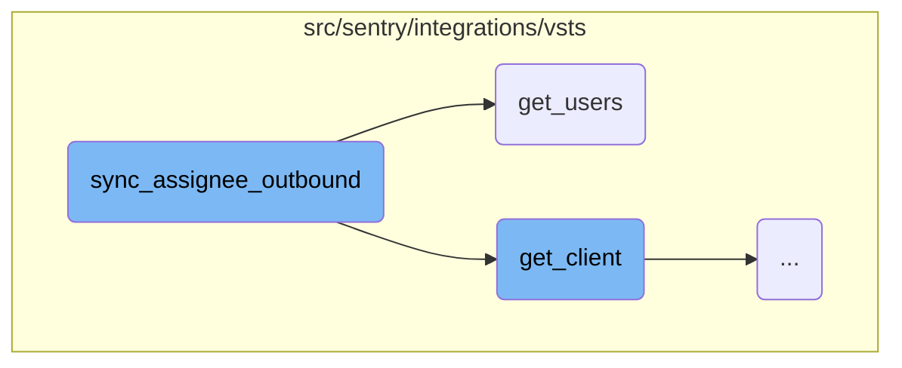
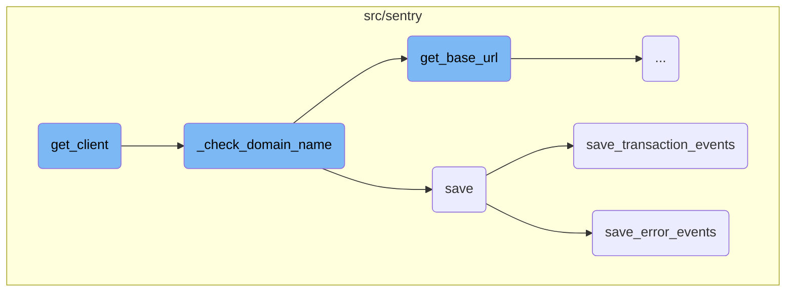
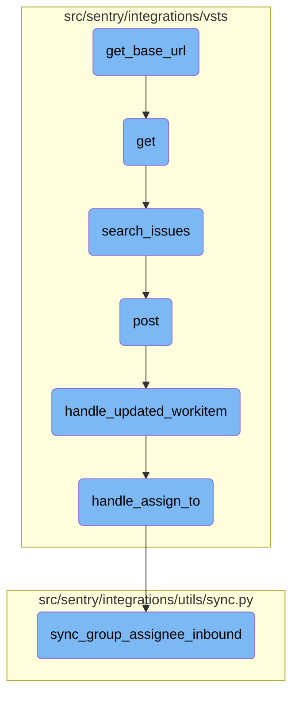

This document explains the process of synchronizing an assignee from an external issue tracking system with a corresponding user in Sentry. The process involves retrieving users from the external system, matching them with Sentry users, and updating the issue's assignee if a match is found.

The flow starts by getting the client and setting the assignee to `None`. If a user is provided and the <SwmToken path="src/sentry/integrations/vsts/issues.py" pos="221:1:1" line-data="        assign: bool = True,">`assign`</SwmToken> flag is `True`, it fetches the list of users from the external system and checks if any of their email addresses match the Sentry user's email addresses. If a match is found, the issue is assigned to that user. If no match is found, it logs an info message. If a match is found, it attempts to update the work item with the new assignee and logs any errors if the update fails.

Here is a high level diagram of the flow, showing only the most important functions:

```mermaid
graph TD;
      subgraph src/sentry/integrations/vsts
61387000ca065f40b0f52e9fa892495fd431367240cdf488c8f3a5ad087f9d24(sync_assignee_outbound):::mainFlowStyle --> 5e2014aa9d74016a9791a54bbf9ee79034449307297f01aa7e3d22f4f40c7e89(get_users)
end

subgraph src/sentry/integrations/vsts
61387000ca065f40b0f52e9fa892495fd431367240cdf488c8f3a5ad087f9d24(sync_assignee_outbound):::mainFlowStyle --> 0929df67669e089b92a784392a4caa0c21baeadfd85263fa34c49a09c193b3d1(get_client):::mainFlowStyle
end

subgraph src/sentry/integrations/vsts
0929df67669e089b92a784392a4caa0c21baeadfd85263fa34c49a09c193b3d1(get_client):::mainFlowStyle --> 7f10adeb955518d0b9ce9a18ae73cf60c8e87d6b2b7bc87f5b2addc217981d21(_check_domain_name):::mainFlowStyle
end

subgraph src/sentry/event_manager.py
7f10adeb955518d0b9ce9a18ae73cf60c8e87d6b2b7bc87f5b2addc217981d21(_check_domain_name):::mainFlowStyle --> 5086692df24257d76a0adf892eba843feac14033d92b4a32022b125d5a725f9b(save)
end

subgraph src/sentry/integrations/vsts
7f10adeb955518d0b9ce9a18ae73cf60c8e87d6b2b7bc87f5b2addc217981d21(_check_domain_name):::mainFlowStyle --> 3a40802301e1642b0a2d0ce06ddee674da6a7fd8353ad71b1c436be19e6563d6(get_base_url):::mainFlowStyle
end

subgraph src/sentry/integrations/vsts
3a40802301e1642b0a2d0ce06ddee674da6a7fd8353ad71b1c436be19e6563d6(get_base_url):::mainFlowStyle --> c9f1b6abd5b86b248deafac3aa63eb8d055350bf49cbe100c54a0d94ee13361a(get):::mainFlowStyle
end

subgraph src/sentry/integrations/vsts
c9f1b6abd5b86b248deafac3aa63eb8d055350bf49cbe100c54a0d94ee13361a(get):::mainFlowStyle --> fc4a2a7e5f1b5a9d6230778920f9b62f4b7f3caa80ebd97c89444e007895b382(search_issues):::mainFlowStyle
end

subgraph src/sentry/integrations/vsts
fc4a2a7e5f1b5a9d6230778920f9b62f4b7f3caa80ebd97c89444e007895b382(search_issues):::mainFlowStyle --> a0445eff32744589c21cfe40b46d7b4346893653994134be4a340aaaf32b3f6d(post):::mainFlowStyle
end

subgraph src/sentry/integrations/vsts
a0445eff32744589c21cfe40b46d7b4346893653994134be4a340aaaf32b3f6d(post):::mainFlowStyle --> 66e049c83c1ca3a7a23933e320651f77196243d817b62c1a401dfd7205f9a929(handle_updated_workitem):::mainFlowStyle
end

subgraph src/sentry/integrations/vsts
66e049c83c1ca3a7a23933e320651f77196243d817b62c1a401dfd7205f9a929(handle_updated_workitem):::mainFlowStyle --> 66c307c65db74ab637ed0ed1623cc34d22110f0911938f86a52ccb8f5e8009dd(handle_assign_to):::mainFlowStyle
end

subgraph src/sentry/integrations/utils/sync.py
66c307c65db74ab637ed0ed1623cc34d22110f0911938f86a52ccb8f5e8009dd(handle_assign_to):::mainFlowStyle --> dd6f2c6555a3ad00a0aed3ab34055c7026063e3a2a74b2537fcf2a1223ffa577(sync_group_assignee_inbound):::mainFlowStyle
end


      classDef mainFlowStyle color:#000000,fill:#7CB9F4
classDef rootsStyle color:#000000,fill:#00FFF4
classDef Style1 color:#000000,fill:#00FFAA
classDef Style2 color:#000000,fill:#FFFF00
classDef Style3 color:#000000,fill:#AA7CB9

%% Swimm:
%% graph TD;
%%       subgraph <SwmPath>[src/sentry/integrations/vsts/](src/sentry/integrations/vsts/)</SwmPath>
%% 61387000ca065f40b0f52e9fa892495fd431367240cdf488c8f3a5ad087f9d24(sync_assignee_outbound):::mainFlowStyle --> 5e2014aa9d74016a9791a54bbf9ee79034449307297f01aa7e3d22f4f40c7e89(get_users)
%% end
%% 
%% subgraph <SwmPath>[src/sentry/integrations/vsts/](src/sentry/integrations/vsts/)</SwmPath>
%% 61387000ca065f40b0f52e9fa892495fd431367240cdf488c8f3a5ad087f9d24(sync_assignee_outbound):::mainFlowStyle --> 0929df67669e089b92a784392a4caa0c21baeadfd85263fa34c49a09c193b3d1(get_client):::mainFlowStyle
%% end
%% 
%% subgraph <SwmPath>[src/sentry/integrations/vsts/](src/sentry/integrations/vsts/)</SwmPath>
%% 0929df67669e089b92a784392a4caa0c21baeadfd85263fa34c49a09c193b3d1(get_client):::mainFlowStyle --> 7f10adeb955518d0b9ce9a18ae73cf60c8e87d6b2b7bc87f5b2addc217981d21(_check_domain_name):::mainFlowStyle
%% end
%% 
%% subgraph <SwmPath>[src/sentry/event_manager.py](src/sentry/event_manager.py)</SwmPath>
%% 7f10adeb955518d0b9ce9a18ae73cf60c8e87d6b2b7bc87f5b2addc217981d21(_check_domain_name):::mainFlowStyle --> 5086692df24257d76a0adf892eba843feac14033d92b4a32022b125d5a725f9b(save)
%% end
%% 
%% subgraph <SwmPath>[src/sentry/integrations/vsts/](src/sentry/integrations/vsts/)</SwmPath>
%% 7f10adeb955518d0b9ce9a18ae73cf60c8e87d6b2b7bc87f5b2addc217981d21(_check_domain_name):::mainFlowStyle --> 3a40802301e1642b0a2d0ce06ddee674da6a7fd8353ad71b1c436be19e6563d6(get_base_url):::mainFlowStyle
%% end
%% 
%% subgraph <SwmPath>[src/sentry/integrations/vsts/](src/sentry/integrations/vsts/)</SwmPath>
%% 3a40802301e1642b0a2d0ce06ddee674da6a7fd8353ad71b1c436be19e6563d6(get_base_url):::mainFlowStyle --> c9f1b6abd5b86b248deafac3aa63eb8d055350bf49cbe100c54a0d94ee13361a(get):::mainFlowStyle
%% end
%% 
%% subgraph <SwmPath>[src/sentry/integrations/vsts/](src/sentry/integrations/vsts/)</SwmPath>
%% c9f1b6abd5b86b248deafac3aa63eb8d055350bf49cbe100c54a0d94ee13361a(get):::mainFlowStyle --> fc4a2a7e5f1b5a9d6230778920f9b62f4b7f3caa80ebd97c89444e007895b382(search_issues):::mainFlowStyle
%% end
%% 
%% subgraph <SwmPath>[src/sentry/integrations/vsts/](src/sentry/integrations/vsts/)</SwmPath>
%% fc4a2a7e5f1b5a9d6230778920f9b62f4b7f3caa80ebd97c89444e007895b382(search_issues):::mainFlowStyle --> a0445eff32744589c21cfe40b46d7b4346893653994134be4a340aaaf32b3f6d(post):::mainFlowStyle
%% end
%% 
%% subgraph <SwmPath>[src/sentry/integrations/vsts/](src/sentry/integrations/vsts/)</SwmPath>
%% a0445eff32744589c21cfe40b46d7b4346893653994134be4a340aaaf32b3f6d(post):::mainFlowStyle --> 66e049c83c1ca3a7a23933e320651f77196243d817b62c1a401dfd7205f9a929(handle_updated_workitem):::mainFlowStyle
%% end
%% 
%% subgraph <SwmPath>[src/sentry/integrations/vsts/](src/sentry/integrations/vsts/)</SwmPath>
%% 66e049c83c1ca3a7a23933e320651f77196243d817b62c1a401dfd7205f9a929(handle_updated_workitem):::mainFlowStyle --> 66c307c65db74ab637ed0ed1623cc34d22110f0911938f86a52ccb8f5e8009dd(handle_assign_to):::mainFlowStyle
%% end
%% 
%% subgraph <SwmPath>[src/sentry/integrations/utils/sync.py](src/sentry/integrations/utils/sync.py)</SwmPath>
%% 66c307c65db74ab637ed0ed1623cc34d22110f0911938f86a52ccb8f5e8009dd(handle_assign_to):::mainFlowStyle --> dd6f2c6555a3ad00a0aed3ab34055c7026063e3a2a74b2537fcf2a1223ffa577(sync_group_assignee_inbound):::mainFlowStyle
%% end
%% 
%% 
%%       classDef mainFlowStyle color:#000000,fill:#7CB9F4
%% classDef rootsStyle color:#000000,fill:#00FFF4
%% classDef Style1 color:#000000,fill:#00FFAA
%% classDef Style2 color:#000000,fill:#FFFF00
%% classDef Style3 color:#000000,fill:#AA7CB9
```



# Flow drill down

First, we'll zoom into this section of the flow:



<SwmSnippet path="/src/sentry/integrations/vsts/issues.py" line="217">

---

## <SwmToken path="src/sentry/integrations/vsts/issues.py" pos="217:3:3" line-data="    def sync_assignee_outbound(">`sync_assignee_outbound`</SwmToken>

The <SwmToken path="src/sentry/integrations/vsts/issues.py" pos="217:3:3" line-data="    def sync_assignee_outbound(">`sync_assignee_outbound`</SwmToken> function is responsible for synchronizing the assignee of an external issue with the corresponding user in the Sentry system. It first retrieves the client and initializes the assignee to `None`. If a user is provided and the <SwmToken path="src/sentry/integrations/vsts/issues.py" pos="221:1:1" line-data="        assign: bool = True,">`assign`</SwmToken> flag is `True`, it fetches the list of VSTS users and checks if any of their email addresses match the Sentry user's email addresses. If a match is found, it assigns the issue to that user. If no match is found, it logs an info message. If a match is found, it attempts to update the work item with the new assignee and logs any errors if the update fails.

```python
    def sync_assignee_outbound(
        self,
        external_issue: "ExternalIssue",
        user: RpcUser | None,
        assign: bool = True,
        **kwargs: Any,
    ) -> None:
        client = self.get_client()
        assignee = None

        if user and assign is True:
            sentry_emails = [email.lower() for email in user.emails]
            continuation_token = None
            while True:
                vsts_users = client.get_users(self.model.name, continuation_token)
                continuation_token = vsts_users.headers.get("X-MS-ContinuationToken")
                for vsts_user in vsts_users["value"]:
                    vsts_email = vsts_user.get("mailAddress")
                    if vsts_email and vsts_email.lower() in sentry_emails:
                        assignee = vsts_user["mailAddress"]
                        break
```

---

</SwmSnippet>

<SwmSnippet path="/src/sentry/integrations/vsts/client.py" line="391">

---

## <SwmToken path="src/sentry/integrations/vsts/client.py" pos="391:3:3" line-data="    def get_users(self, account_name: str, continuation_token: str | None = None) -&gt; Response:">`get_users`</SwmToken>

The <SwmToken path="src/sentry/integrations/vsts/client.py" pos="391:3:3" line-data="    def get_users(self, account_name: str, continuation_token: str | None = None) -&gt; Response:">`get_users`</SwmToken> function retrieves users with access to a given account or organization in VSTS. It makes a GET request to the VSTS API endpoint for listing users, optionally using a continuation token to handle pagination. This function is used within <SwmToken path="src/sentry/integrations/vsts/issues.py" pos="217:3:3" line-data="    def sync_assignee_outbound(">`sync_assignee_outbound`</SwmToken> to fetch the list of potential assignees from VSTS.

```python
    def get_users(self, account_name: str, continuation_token: str | None = None) -> Response:
        """
        Gets Users with access to a given account/organization
        https://docs.microsoft.com/en-us/rest/api/azure/devops/graph/users/list?view=azure-devops-rest-4.1
        """
        return self.get(
            VstsApiPath.users.format(account_name=account_name),
            api_preview=True,
            params={"continuationToken": continuation_token},
        )
```

---

</SwmSnippet>

Now, lets zoom into this section of the flow:



<SwmSnippet path="/src/sentry/integrations/vsts/integration.py" line="135">

---

## Initializing <SwmToken path="src/sentry/integrations/vsts/integration.py" pos="145:3:3" line-data="        return VstsApiClient(">`VstsApiClient`</SwmToken>

The <SwmToken path="src/sentry/integrations/vsts/issues.py" pos="224:7:7" line-data="        client = self.get_client()">`get_client`</SwmToken> function initializes and returns a <SwmToken path="src/sentry/integrations/vsts/integration.py" pos="145:3:3" line-data="        return VstsApiClient(">`VstsApiClient`</SwmToken> instance. It first sets the <SwmToken path="src/sentry/integrations/vsts/integration.py" pos="135:1:1" line-data="        base_url = self.instance">`base_url`</SwmToken> and checks the current <SwmToken path="src/sentry/integrations/vsts/integration.py" pos="136:3:3" line-data="        if SiloMode.get_current_mode() != SiloMode.REGION:">`SiloMode`</SwmToken>. If the mode is not <SwmToken path="src/sentry/integrations/vsts/integration.py" pos="136:13:13" line-data="        if SiloMode.get_current_mode() != SiloMode.REGION:">`REGION`</SwmToken>, it ensures that <SwmToken path="src/sentry/integrations/vsts/integration.py" pos="137:5:5" line-data="            if self.default_identity is None:">`default_identity`</SwmToken> is set and calls <SwmToken path="src/sentry/integrations/vsts/integration.py" pos="139:3:3" line-data="            self._check_domain_name(self.default_identity)">`_check_domain_name`</SwmToken> to validate the domain. It also verifies that <SwmToken path="src/sentry/integrations/vsts/integration.py" pos="141:5:5" line-data="        if self.org_integration is None:">`org_integration`</SwmToken> and <SwmToken path="src/sentry/integrations/vsts/integration.py" pos="143:5:7" line-data="        if self.org_integration.default_auth_id is None:">`org_integration.default_auth_id`</SwmToken> are defined before creating the <SwmToken path="src/sentry/integrations/vsts/integration.py" pos="145:3:3" line-data="        return VstsApiClient(">`VstsApiClient`</SwmToken> instance with the necessary parameters.

```python
        base_url = self.instance
        if SiloMode.get_current_mode() != SiloMode.REGION:
            if self.default_identity is None:
                self.default_identity = self.get_default_identity()
            self._check_domain_name(self.default_identity)

        if self.org_integration is None:
            raise Exception("self.org_integration is not defined")
        if self.org_integration.default_auth_id is None:
            raise Exception("self.org_integration.default_auth_id is not defined")
        return VstsApiClient(
            base_url=base_url,
            oauth_redirect_url=VstsIntegrationProvider.oauth_redirect_url,
            org_integration_id=self.org_integration.id,
            identity_id=self.org_integration.default_auth_id,
        )
```

---

</SwmSnippet>

<SwmSnippet path="/src/sentry/integrations/vsts/integration.py" line="358">

---

## Validating Domain Name

The <SwmToken path="src/sentry/integrations/vsts/integration.py" pos="358:3:3" line-data="    def _check_domain_name(self, default_identity: RpcIdentity) -&gt; None:">`_check_domain_name`</SwmToken> function validates the domain name format using a regular expression. If the domain name is not in the correct format, it retrieves the base URL using the <SwmToken path="src/sentry/integrations/vsts/integration.py" pos="362:5:7" line-data="        base_url = VstsIntegrationProvider.get_base_url(">`VstsIntegrationProvider.get_base_url`</SwmToken> method and updates the <SwmToken path="src/sentry/integrations/vsts/integration.py" pos="359:21:21" line-data="        if re.match(&quot;^https://.+/$&quot;, self.model.metadata[&quot;domain_name&quot;]):">`domain_name`</SwmToken> in the model's metadata before saving the model.

```python
    def _check_domain_name(self, default_identity: RpcIdentity) -> None:
        if re.match("^https://.+/$", self.model.metadata["domain_name"]):
            return

        base_url = VstsIntegrationProvider.get_base_url(
            default_identity.data["access_token"], self.model.external_id
        )
        self.model.metadata["domain_name"] = base_url
        self.model.save()
```

---

</SwmSnippet>

<SwmSnippet path="/src/sentry/event_manager.py" line="448">

---

## Saving Event Data

The <SwmToken path="src/sentry/event_manager.py" pos="448:3:3" line-data="    def save(">`save`</SwmToken> function processes and saves event data. It normalizes the event if needed, retrieves the project and organization details, and prepares a job dictionary with the event data and project ID. This function ensures that events with duplicate <SwmToken path="src/sentry/event_manager.py" pos="464:13:13" line-data="        We re-insert events with duplicate IDs into Snuba, which is responsible">`IDs`</SwmToken> are handled correctly and increments counters and frequencies before the event is inserted into the event stream.

```python
    def save(
        self,
        project_id: int | None,
        raw: bool = False,
        assume_normalized: bool = False,
        start_time: float | None = None,
        cache_key: str | None = None,
        skip_send_first_transaction: bool = False,
        has_attachments: bool = False,
    ) -> Event:
        """
        After normalizing and processing an event, save adjacent models such as
        releases and environments to postgres and write the event into
        eventstream. From there it will be picked up by Snuba and
        post-processing.

        We re-insert events with duplicate IDs into Snuba, which is responsible
        for deduplicating events. Since deduplication in Snuba is on the primary
        key (based on event ID, project ID and day), events with same IDs are only
        deduplicated if their timestamps fall on the same day. The latest event
        always wins and overwrites the value of events received earlier in that day.
```

---

</SwmSnippet>

<SwmSnippet path="/src/sentry/event_manager.py" line="3040">

---

## Saving Transaction Events

The <SwmToken path="src/sentry/event_manager.py" pos="3040:2:2" line-data="def save_transaction_events(jobs: Sequence[Job], projects: ProjectsMapping) -&gt; Sequence[Job]:">`save_transaction_events`</SwmToken> function handles the saving of transaction events. It retrieves and sets organization details for each project, measures the number of jobs and projects, and performs various operations such as creating releases, deriving tags, calculating span grouping, and saving events to the nodestore. It also detects performance problems and sends occurrences to the platform.

```python
def save_transaction_events(jobs: Sequence[Job], projects: ProjectsMapping) -> Sequence[Job]:
    organization_ids = {project.organization_id for project in projects.values()}
    organizations = {o.id: o for o in Organization.objects.get_many_from_cache(organization_ids)}

    for project in projects.values():
        try:
            project.set_cached_field_value("organization", organizations[project.organization_id])
        except KeyError:
            continue

    set_measurement(measurement_name="jobs", value=len(jobs))
    set_measurement(measurement_name="projects", value=len(projects))

    _get_or_create_release_many(jobs, projects)
    _get_event_user_many(jobs, projects)
    _derive_plugin_tags_many(jobs, projects)
    _derive_interface_tags_many(jobs)
    _calculate_span_grouping(jobs, projects)
    _materialize_metadata_many(jobs)
    _get_or_create_environment_many(jobs, projects)
    _get_or_create_release_associated_models(jobs, projects)
```

---

</SwmSnippet>

<SwmSnippet path="/src/sentry/event_manager.py" line="544">

---

## Saving Error Events

The <SwmToken path="src/sentry/event_manager.py" pos="544:3:3" line-data="    def save_error_events(">`save_error_events`</SwmToken> function processes and saves error events. It handles sample events, retrieves and sets project keys, derives tags, loads and filters attachments, assigns events to groups, and performs various operations such as creating environments, releases, and recording metrics. It ensures that events are saved to the nodestore and inserted into the event stream, and handles reprocessed events and attachments.

```python
    def save_error_events(
        self,
        project: Project,
        job: Job,
        projects: ProjectsMapping,
        metric_tags: MutableTags,
        raw: bool = False,
        cache_key: str | None = None,
        has_attachments: bool = False,
    ) -> Event:
        jobs = [job]

        if is_sample_event(job):
            logger.info(
                "save_error_events: processing sample event",
                extra={
                    "event.id": job["event"].event_id,
                    "project_id": project.id,
                    "sample_event": True,
                },
            )
```

---

</SwmSnippet>

Now, lets zoom into this section of the flow:



<SwmSnippet path="/src/sentry/integrations/vsts/integration.py" line="540">

---

## Retrieving the base URL for VSTS integration

The function <SwmToken path="src/sentry/integrations/vsts/integration.py" pos="540:3:3" line-data="    def get_base_url(cls, access_token: str, account_id: int) -&gt; str | None:">`get_base_url`</SwmToken> is responsible for constructing and retrieving the base URL for the VSTS integration. It uses the <SwmToken path="src/sentry/integrations/vsts/integration.py" pos="540:14:14" line-data="    def get_base_url(cls, access_token: str, account_id: int) -&gt; str | None:">`account_id`</SwmToken> to format the URL and makes an HTTP GET request with the provided <SwmToken path="src/sentry/integrations/vsts/integration.py" pos="540:8:8" line-data="    def get_base_url(cls, access_token: str, account_id: int) -&gt; str | None:">`access_token`</SwmToken> to authenticate. If the request is successful, it extracts and returns the <SwmToken path="src/sentry/integrations/vsts/integration.py" pos="552:10:10" line-data="            return response.json()[&quot;locationUrl&quot;]">`locationUrl`</SwmToken> from the response.

```python
    def get_base_url(cls, access_token: str, account_id: int) -> str | None:
        """TODO(mgaeta): This should not be allowed to return None."""
        url = VstsIntegrationProvider.VSTS_ACCOUNT_LOOKUP_URL % account_id
        with http.build_session() as session:
            response = session.get(
                url,
                headers={
                    "Content-Type": "application/json",
                    "Authorization": f"Bearer {access_token}",
                },
            )
        if response.status_code == 200:
            return response.json()["locationUrl"]

        logger.info("vsts.get_base_url", extra={"responseCode": response.status_code})
        return None
```

---

</SwmSnippet>

&nbsp;

*This is an auto-generated document by Swimm AI 🌊 and has not yet been verified by a human*

<SwmMeta version="3.0.0" repo-id="Z2l0aHViJTNBJTNBc2VudHJ5LWRlbW8tMSUzQSUzQVN3aW1tLURlbW8=" repo-name="sentry-demo-1" doc-type="flows"><sup>Powered by [Swimm](/)</sup></SwmMeta>
