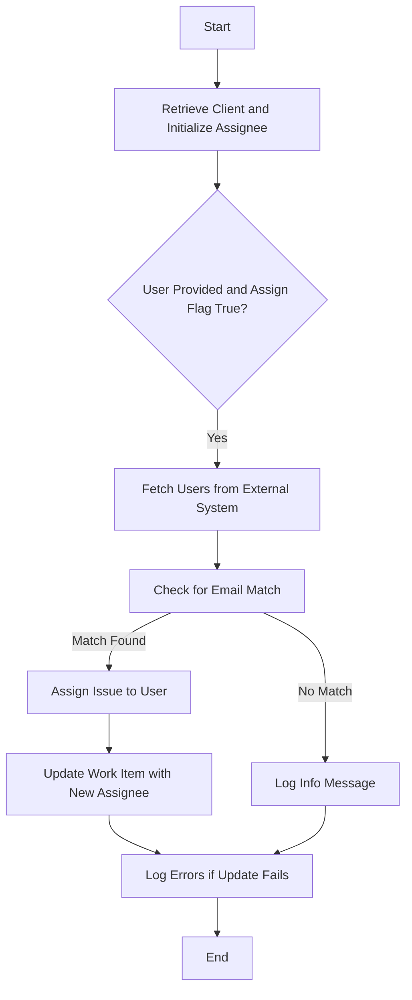

This document will cover the process of synchronizing assignees from an external issue tracking system with Sentry. We'll cover:

1. Overview of the Synchronizing Assignees feature
2. Retrieving the client and initializing the assignee
3. Fetching users from the external system
4. Matching users and updating the assignee

Technical document: <SwmLink doc-title="Synchronizing Assignees">[Synchronizing Assignees](/.swm/synchronizing-assignees.8gdxh8z4.sw.md)</SwmLink>

# Overview of the Synchronizing Assignees feature

The Synchronizing Assignees feature allows Sentry to automatically assign issues to users based on their email addresses. This synchronization ensures that the right person is notified and responsible for resolving the issue, improving workflow efficiency and accountability.

# [Retrieving the client and initializing the assignee](https://app.swimm.io/repos/Z2l0aHViJTNBJTNBc2VudHJ5LWRlbW8tMSUzQSUzQVN3aW1tLURlbW8=/docs/8gdxh8z4#sync_assignee_outbound)

The process begins by retrieving the client from the external issue tracking system and setting the initial assignee to `None`. This step ensures that we have the necessary connection to the external system and a clean slate for assigning the issue.

# [Fetching users from the external system](https://app.swimm.io/repos/Z2l0aHViJTNBJTNBc2VudHJ5LWRlbW8tMSUzQSUzQVN3aW1tLURlbW8=/docs/8gdxh8z4#get_users)

If a user is provided and the `assign` flag is set to `True`, the system fetches a list of users from the external issue tracking system. This involves making a request to the external system's API to retrieve all users who have access to the relevant account or organization. This list of users will be used to find a match based on email addresses.

# [Matching users and updating the assignee](https://app.swimm.io/repos/Z2l0aHViJTNBJTNBc2VudHJ5LWRlbW8tMSUzQSUzQVN3aW1tLURlbW8=/docs/8gdxh8z4#sync_assignee_outbound)

The system then checks if any of the email addresses from the external system's users match the email addresses of users in Sentry. If a match is found, the issue is assigned to that user. If no match is found, an informational message is logged. If a match is found and the issue is assigned, the system attempts to update the work item in the external system with the new assignee. Any errors encountered during this update are logged for further investigation.

&nbsp;

*This is an auto-generated document by Swimm AI 🌊 and has not yet been verified by a human*

<SwmMeta version="3.0.0" repo-id="Z2l0aHViJTNBJTNBc2VudHJ5LWRlbW8tMSUzQSUzQVN3aW1tLURlbW8=" repo-name="sentry-demo-1" doc-type="product-flows">Powered by [Swimm](/)</SwmMeta>
