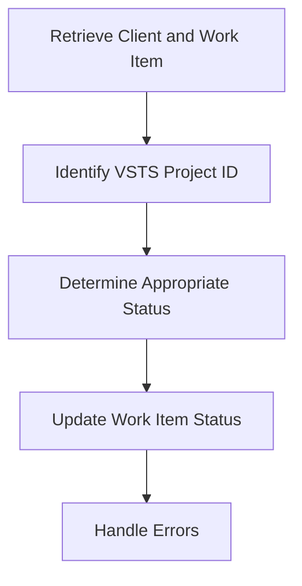

This document will cover the process of synchronizing the status of an external issue with a VSTS (Azure DevOps) work item. We'll cover:

1. Retrieving the client and work item
2. Identifying the VSTS project ID
3. Determining the appropriate status
4. Updating the work item status
5. Handling errors during the update.

Technical document: <SwmLink doc-title="Synchronizing External Issue Status">[Synchronizing External Issue Status](/.swm/synchronizing-external-issue-status.slvvyvh5.sw.md)</SwmLink>

# [Retrieving the Client and Work Item](https://app.swimm.io/repos/Z2l0aHViJTNBJTNBc2VudHJ5LWRlbW8tMSUzQSUzQVN3aW1tLURlbW8=/docs/slvvyvh5#sync_status_outbound)

The process begins by retrieving the client and the work item associated with the external issue. This step ensures that we have the necessary data to proceed with the synchronization. The client is the interface through which we interact with VSTS, and the work item is the specific task or bug that we need to update.

# [Identifying the VSTS Project ID](https://app.swimm.io/repos/Z2l0aHViJTNBJTNBc2VudHJ5LWRlbW8tMSUzQSUzQVN3aW1tLURlbW8=/docs/slvvyvh5#sync_status_outbound)

Next, we identify the VSTS project ID by matching the project name from the work item fields with the list of projects retrieved from the client. This step is crucial because the project ID is not included in the work item response from VSTS. By matching the project name, we ensure that we are updating the correct project.

# [Determining the Appropriate Status](https://app.swimm.io/repos/Z2l0aHViJTNBJTNBc2VudHJ5LWRlbW8tMSUzQSUzQVN3aW1tLURlbW8=/docs/slvvyvh5#sync_status_outbound)

Once the project ID is identified, we determine the appropriate status for the work item based on the `is_resolved` flag. If the flag is set to true, the status is marked as resolved; otherwise, it remains unresolved. This step ensures that the status of the work item in VSTS accurately reflects its current state in our system.

# [Updating the Work Item Status](https://app.swimm.io/repos/Z2l0aHViJTNBJTNBc2VudHJ5LWRlbW8tMSUzQSUzQVN3aW1tLURlbW8=/docs/slvvyvh5#sync_status_outbound)

After determining the appropriate status, we update the work item status using the `update_work_item` method. This step involves sending the updated status to VSTS, ensuring that the work item is correctly updated in the external system. This synchronization helps maintain consistency between our system and VSTS.

# [Handling Errors During the Update](https://app.swimm.io/repos/Z2l0aHViJTNBJTNBc2VudHJ5LWRlbW8tMSUzQSUzQVN3aW1tLURlbW8=/docs/slvvyvh5#sync_status_outbound)

If any errors occur during the update process, they are logged for further investigation. This step is important for troubleshooting and ensuring that any issues with the synchronization process are identified and resolved promptly. Logging errors helps maintain the reliability and accuracy of the synchronization process.

&nbsp;

*This is an auto-generated document by Swimm AI 🌊 and has not yet been verified by a human*

<SwmMeta version="3.0.0" repo-id="Z2l0aHViJTNBJTNBc2VudHJ5LWRlbW8tMSUzQSUzQVN3aW1tLURlbW8=" repo-name="sentry-demo-1" doc-type="product-flows">Powered by [Swimm](/)</SwmMeta>
