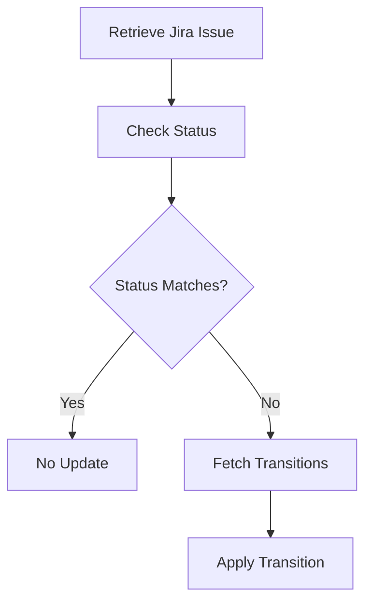

This document will cover the process of synchronizing the status of a Sentry issue with a linked Jira issue. We'll cover:

1. Retrieving the Jira issue and project details
2. Determining the appropriate Jira status
3. Applying the necessary transitions to update the status.

Technical document: <SwmLink doc-title="Synchronizing Issue Status with Jira">[Synchronizing Issue Status with Jira](/.swm/synchronizing-issue-status-with-jira.7eq84djp.sw.md)</SwmLink>

# [Retrieving the Jira issue and project details](https://app.swimm.io/repos/Z2l0aHViJTNBJTNBc2VudHJ5LWRlbW8tMSUzQSUzQVN3aW1tLURlbW8=/docs/7eq84djp#sync_status_outbound)

The process begins by retrieving the Jira issue and its associated project details. This step ensures that we have the necessary context and information about the Jira issue that is linked to the Sentry issue. The Jira issue is identified using its unique key, and the project details are fetched to understand the broader context of the issue within Jira.

# [Determining the appropriate Jira status](https://app.swimm.io/repos/Z2l0aHViJTNBJTNBc2VudHJ5LWRlbW8tMSUzQSUzQVN3aW1tLURlbW8=/docs/7eq84djp#sync_status_outbound)

Next, we determine the appropriate status for the Jira issue based on the resolution state of the Sentry issue. If the Sentry issue is resolved, the Jira issue should reflect this by transitioning to a 'resolved' status. Conversely, if the Sentry issue is unresolved, the Jira issue should be in an 'open' or 'in-progress' status. This step ensures that the status of the Jira issue accurately mirrors the state of the Sentry issue.

# [Applying the necessary transitions to update the status](https://app.swimm.io/repos/Z2l0aHViJTNBJTNBc2VudHJ5LWRlbW8tMSUzQSUzQVN3aW1tLURlbW8=/docs/7eq84djp#transition_issue)

If the current status of the Jira issue does not match the desired status, we proceed to update it. This involves fetching the available transitions for the Jira issue, which are the possible status changes that can be applied. Once the appropriate transition is identified, it is applied to the Jira issue to update its status. This step ensures that the Jira issue's status is synchronized with the Sentry issue's resolution state, providing a consistent view across both platforms.

&nbsp;

*This is an auto-generated document by Swimm AI 🌊 and has not yet been verified by a human*

<SwmMeta version="3.0.0" repo-id="Z2l0aHViJTNBJTNBc2VudHJ5LWRlbW8tMSUzQSUzQVN3aW1tLURlbW8=" repo-name="sentry-demo-1" doc-type="product-flows">Powered by [Swimm](/)</SwmMeta>
